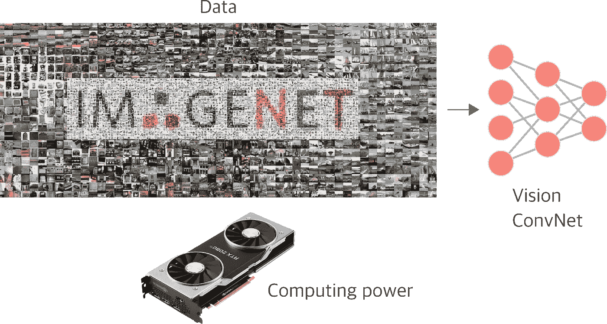
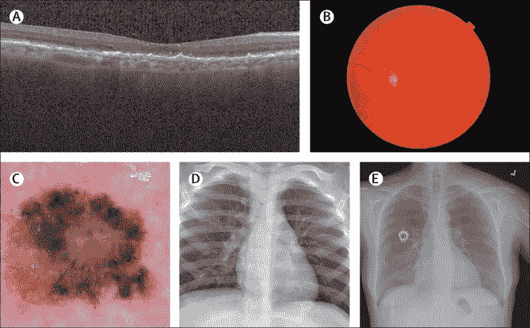

# 关于表征学习的几点看法

> 原文：<https://towardsdatascience.com/a-few-words-on-representation-learning-151d37cf292c?source=collection_archive---------25----------------------->

## 我们如何在不依赖人类注释数据的情况下学习好的表示？

图片由[皮克斯拜](https://pixabay.com/?utm_source=link-attribution&utm_medium=referral&utm_campaign=image&utm_content=3501528)的[艾哈迈德·加德](https://pixabay.com/users/ahmedgad-9403351/?utm_source=link-attribution&utm_medium=referral&utm_campaign=image&utm_content=3501528)拍摄

在过去的二十年里，人工智能(AI)领域在研究和工业应用方面取得了长足的发展。逻辑回归和朴素贝叶斯等机器学习算法可以从一组特征中识别模式，并解决那些通过将知识硬编码到专家系统中似乎不可能解决的问题。这些浅层学习算法可以执行相对复杂的任务，如产品推荐或学习区分垃圾邮件和非垃圾邮件。更有趣的是，

> 这些浅层机器学习算法的性能很大程度上取决于它们作为输入接收的表示。

例如，如果我们决定使用朴素贝叶斯构建一个垃圾邮件检测器，将大量原始的非结构化电子邮件数据传递给分类器将不会有所帮助。

相反，在将文本输入分类器之前，我们需要找到一种不同的方法来表示文本。值得注意的是，这种应用程序的一种常用文本表示是[单词袋](https://en.wikipedia.org/wiki/Bag-of-words_model)模型。这个想法是为了表现文本，以便每个单词的重要性很容易被抓住。也就是说，每个单词的词频(图 1)代表一个单词在文本中出现的次数，是一种流行的文本表示，可用于训练垃圾邮件过滤模型。

*图 1:从一组文档中，构建一个包含唯一单词集的字典，然后将每个文档表示为一个包含该文档中每个单词的计数(次数)的特征向量——作者图片*

通过查看图 2，我们可以看到良好表示对于训练机器学习模型的力量。在本例中，我们可能希望使用逻辑回归等机器学习模型来寻找蓝色和绿色圆圈之间的线性分离，即 2D 线。然而，显而易见的是，学习线性边界的模型在这样的示例中不会成功，因为在数据的当前状态下，无法使用线来区分这两个类。幸运的是，如果我们改变输入表示，而不是传递原始数据，我们传递值的平方，我们将看到数据情况将完全改变，两组之间的线性分离在特征空间中变得明显。的确，陈述很重要。

*图 2:表示对于逻辑回归等浅层机器学习模型很重要。一个简单的变换，例如对原始特征的值求平方，可能就足以解决这个问题——图片作者。*

然而，预先知道如何改变数据表示以使特征空间中的线性分离变得明显并不简单。不同的功能通常具有不同的属性，这些属性可能适合也可能不适合解决给定的任务。以词袋术语频率特征为例。这些特征集中于一个单词在文本中出现的次数，但是丢弃了诸如语法和词序之类的信息。对于其他自然语言问题，单词之间的语义关系是必要的，语法和单词在文本中出现的顺序对于解决特定任务可能是至关重要的。

这就是为什么手工设计特征的过程被认为是如此具有挑战性的问题。例如，想象我们想要建造一个汽车探测器。我们知道汽车有一些主要特征，使它们不同于其他物体。有人可能会说，这些组成部分就是轮子的存在。在这种情况下，要构建汽车分类器，我们需要有一种方法来表示各种类型汽车的车轮。这就是问题变得复杂的地方。

> ***毕竟，我们如何才能创造出一种车轮检测器，它能通用于所有类型的现有车轮，并对光线、形状和尺寸扭曲的多种组合具有鲁棒性？***

这就是深度神经网络发挥作用的地方。通过深度学习，我们不需要关心如何手动指定车轮检测器，以便它可以对所有类型的现有车轮都是鲁棒的。相反，通过以分层模式组成一系列线性和非线性变换，深度神经网络具有通过组合简单概念来学习合适表示的能力，从而导出复杂结构。简而言之，经典的监督计算机视觉分类器将原始数据作为输入，每一层都迭代地从前面的层中提炼特征。因此，第一层的神经元可以学习能够从高频输入中检测边缘和轮廓的程序，并且随着特征穿过层的层级，后续的神经元结合预先存在的知识来学习能够检测对象部分的更复杂的程序。最后，我们可以使用这些细化的表示，并学习一个线性分类器来将输入映射到一组有限的类。

*图 3:深度神经网络通过组合简单的概念来学习表示，从而在分层管道中导出复杂的结构。每一层迭代地提炼来自前几层的信息。最后，分类器采用转换后的表示，并在类别之间绘制线性边界。*图片来源:[深度学习](https://www.deeplearningbook.org/)

> 从这个角度来看，深度神经网络是表征学习模型。

在高层次上，典型的监督神经网络具有两个组件，(1)编码器和(2)线性分类器。编码器转换输入数据并将其投影到不同的子空间。然后，低级表示(来自编码器)被传递到线性分类器，该线性分类器绘制分隔类的线性边界。

然而，**表征学习的目的是将表征映射到其他表征**，而不是通过将表征映射到目标来解决任务(经典分类器会这样做)。**这些学习到的表示通常是密集、紧凑的，并且可以推广到类似的数据形态**。换句话说，这些表示可以很好地移植到其他任务中，并且已经成为解决那些很难甚至不可能获得数据注释的问题的主要方法。

# 故事到此为止

近年来，**监督学习**已经成为训练深度神经网络的领先和成功的方法。大型(最重要的是，带注释的数据集，如 ImageNet)的可用性允许研究人员训练深度神经网络模型，并学习概念层次方面的表示。这些表示不仅解决了手头的任务，在这种情况下的图像分类，而且由于它们的**一般化属性**，它们还可以用作学习不同的**下游任务**的良好起点，例如对象检测、分割、姿态估计等等。

诀窍很简单，采用大型带注释的视觉语料库，训练卷积神经网络，然后转移其知识来解决第二个任务，该任务通常没有足够的标签来从头训练深度网络。这个被称为**迁移学习**的概念已经被成功地用于许多不同的领域来解决众多的任务，并且在商业应用中得到了广泛的应用。

*图 4:到目前为止，这个故事涉及到注释数据、计算能力和非常深度的神经网络。有了这种组合，几乎任何模式匹配问题都可以解决。换句话说，我们不受算法的限制。我们受限于我们能收集多少精选数据——作者图片*

扩展这个配方的主要限制因素在于获取带注释的数据。作为一个概念，ImageNet 数据集是计算机视觉研究人员的标准数据集，包含 1400 万张图像和大约 2200 万个概念。然而，如果我们将 ImageNet 与所有可用的互联网图像集进行比较，ImageNet 下降了大约五个数量级。

*图 5:经典视力问题。从左上到右下，随着预测级别从分类到实例分割(按作者分类的图像)的增加，注释级别变得更精细。*

此外，如果我们看看计算机视觉数据集的前景，可用的带注释样本的数量会根据手头的任务急剧减少。假设我们只考虑最流行的计算机视觉任务，如对象分类、检测和分割(图 5)。在这种情况下，随着预测级别变得更加复杂(从整个图像标签到像素级注释)，带标签的示例数量会大幅减少(图 6)。这就是为什么大多数对象检测和分割解决方案总是将 ImageNet 预训练网络作为优化的起点。

*图 6:收集和注释数据的代价反映在可用数据集的大小上。随着注释级别的增加，从图像级别的标签到像素级别的注释，可用的精选数据集的大小急剧减小。*图片来源:[弱监督下的视觉学习。](http://mpawankumar.info/tutorials/cvpr2013/index.html)

**然而，对于领域发生重大变化的问题，ImageNet 预训练模型可能不是理想的解决方案。**这可能是医疗保健中许多应用的情况，例如全切片图像中乳腺癌转移的分类和检测。在这样的应用中，如果与原始的未注释数据组相比，精选的注释样本组是最小的。注释此类记录的过程通常需要专业的病理学家花费数小时，他们需要数年的培训才能完成此类工作——在这种情况下，注释大型数据集变得极其昂贵和耗时。

*图 7:对于许多医疗保健应用来说，使用基于 ImageNet 的预训练模型可能不是答案——作者图片*

此外，人类注释数据的速度无法与我们生成的数据量成比例。换句话说，如果我们事先不知道要优化的任务，那么准备深度学习训练所需的大规模监督数据集可能会非常复杂和昂贵。

所有这些例子都强调了从无注释数据中学习概括表示的重要性。许多研究领域，包括**半监督**、**弱监督**以及最近的**自监督**学习，试图学习可以转移到新任务的表示，只使用少量或根本不使用带注释的例子。

半监督学习的目的是将一些带注释的观察结果与一个更大的无注释样本数据集结合起来。另一方面，弱监督学习探索了大量有噪声的，并且大多数时候是不精确的标签作为监督信号。**最后，自我监督学习就是在没有明确监督信号的情况下学习世界的良好模型*。*通过优化这些借口任务，网络学习有用的表示，可以容易地转移到以数据有效的方式学习下游任务。**

# 深度无监督表示学习

到目前为止，我们一直在讨论深度神经网络如何通过解决监督任务来学习可概括的表示。**一般来说，我们可以利用神经网络从任务 A(用大量带注释的数据训练)获得的知识，并应用该知识来学习单独的任务 B(通常缺少注释)*。*** 这里的问题是，我们仍然依赖于拥有大量带注释的数据来首先学习表示法。此外，根据任务的性质，注释数据可能会非常困难，甚至是不可能的。

> 但是，如果我们可以通过无监督(无标签)的方式学习任务来学习同样好(甚至更好)的表征，会怎么样呢？

**深度无监督表示学习**寻求从无标签数据中学习一组丰富的有用特征。我们的希望是，这些表示将提高许多下游任务的性能，并减少每次我们试图学习新任务时人工注释的必要性。具体而言，在计算机视觉(CV)中，无监督表示学习是最重要的、长期存在的一类问题之一，对世界各地的许多研究人员构成了重大挑战。随着计算能力越来越强，数据继续通过多个传感器无处不在地被捕获，创建能够以无标签方式从原始数据中提取更丰富模式的算法的需求从未如此迫切。

近年来，由于自然语言处理领域的最新突破，深度无监督表示学习受到了广泛关注。伯特和 GPT 都是基于深度学习的模型，在训练管道中不需要手动注释，他们的成功激发了新一代算法在计算机视觉应用中的发展。更具体地说，最近开发的自我监督学习领域，利用了数据中编码的监督，是 CV 和 NLP 应用的无监督表示学习最新成功背后的主要驱动力。

让我们以变压器或 BERT 的[双向编码器表示为例。 **BERT 是一种深度无监督语言表示模型，它从非结构化文本中学习上下文表示。**上下文无关模型，如](https://sthalles.github.io/a-few-words-on-representation-learning/#1) [word2vec](https://sthalles.github.io/a-few-words-on-representation-learning/#2) 和 [GloVe](https://sthalles.github.io/a-few-words-on-representation-learning/#3) 学习单词嵌入，而不考虑单词出现的上下文。这是一个限制，因为许多单词根据它们使用的上下文表达不同的意思。例如，像“银行”这样的词可能出现在与金融相关的上下文中，如“银行帐户”，或者它可能用于描述河流的边缘。不同的是，伯特基于单词出现的上下文来学习表征。因此，BERT 能够学习更丰富的语义表示，根据上下文捕捉单词的不同含义。

此外，BERT 还通过解决一种特殊的**自我监督**任务进行了优化，这种任务不需要人工注释数据。也就是说，在训练期间，在通过变换器编码器之前，从输入句子中屏蔽掉一定百分比的随机选择的标记。编码器将输入句子映射到一系列嵌入向量(句子中的每个单词一个向量)。这些向量随后通过一个 **softmax** 层，该层计算整个词汇的概率，以便最有可能的单词有更高的机会被选中。换句话说，**这是一个填补空白的任务，其中 BERT 旨在从部分可用的上下文中重建被破坏的输入信号。**

*图 8:对于语言模型，解决方案空间是离散的，屏蔽输入并从上下文中重建输入的任务是 BERT 成功的关键原因之一。图片由作者受* [*基于能源的模型讲座启发。*](https://drive.google.com/file/d/1z8Dz1YtkOEJpU-gh5RIjORs3GGqkYJQa/view)

这个特殊的任务被称为屏蔽自动编码器， ***，它已经被证明在我们有离散概率空间的情况下工作良好。***

然而，诸如 BERT 之类的系统的最重要的特征是，在训练之后，我们可以在没有太多可用训练数据的不同下游任务上微调 BERT 参数，并且与从头开始训练系统相比，我们将实现显著的精度改进。这尤其重要，因为数据注释是深度神经网络训练中的一个重要瓶颈。

# 聚类和自我监督学习

多年来，聚类技术一直是从无注释数据中学习结构的主要方法。经典方法，例如 **K-Means** ，优化距离度量作为代理，以围绕公共质心对类似概念(例如图像)进行分组。最近的方法，例如由 Caron 等人提出的用于视觉特征的无监督学习的深度聚类(Deep Clustering)和由 Li 等人提出的无监督表示的原型对比学习(Prototypical Contrastive Learning)已经尝试将聚类与深度神经网络相结合，作为以无监督方式从非结构化数据中学习良好表示的方式。这些结果表明，结合聚类方法与自我监督的借口任务是一个突出的技术。

另一方面，自监督学习是一种无监督学习的方法，它涉及从未标记数据中学习语义上有意义的特征。自我监督学习的第一种方法是设计一个预测任务，只需探索数据中存在的特征就可以解决这个问题。这个子任务或借口任务充当代理，使网络学习有用的表示，这些表示可用于简化学习不同下游任务的过程。

虽然经典的无监督方法在训练期间不使用任何标签，但大多数提出的借口任务使用与经典的有监督学习算法相同的框架和损失函数。因此，自我监督的借口任务也需要标签进行优化。然而，用于优化这些托词任务的标签(或伪标签)仅来自数据或其属性。

*图 9:旋转预测是预测任务的一个例子，它探索数据的特征以设计监控信号。*作者图片，灵感来自[通过预测图像旋转的无监督表示学习](https://arxiv.org/abs/1803.07728)。

一般来说，自我监督的借口任务包括取出数据的一些部分，并挑战网络来预测丢失的部分。它可以根据前面的上下文预测句子中的下一个单词，或者根据前面的上下文预测视频的下一帧。事实上，这种托词任务在 NLP 应用程序中取得了巨大的成功，主要是因为文本数据是离散的。因此，天真地将这些相同的概念应用于 CV 应用是困难的，因为图像是连续的，使得可能的解决方案的空间更加复杂。

*图 10:虽然图像修复方法产生了相当一致的结果，但这些模型学习的表示仍然不足以与以监督方式学习的表示(作者的图像)相媲美。*

**此外，创建自我监督的借口任务可能类似于为分类器手工设计特征的过程。不清楚哪个借口任务有效，为什么有效。然而，最近的自我监督学习方法偏离了一种通用方法，该方法涉及一种与基于对比的损失函数相结合的实例辨别借口任务。**

总的想法是通过逼近相似的概念同时推开不同的概念来学习表征。在撰写本文时，对比学习方法在无监督表示学习中保持着最先进的性能。事实上，监督和非监督预训练之间的差距从来没有那么小，对于一些下游任务，使用自我监督技术预训练编码器已经比监督训练好。

在下一篇文章中，我们将探索自我监督学习方法的前景。我们将深入探讨一些最成功的实现，并讨论该领域的现状。

**感谢阅读！**

[1] Devlin，Jacob 等，“Bert:用于语言理解的深度双向转换器的预训练” *arXiv 预印本 arXiv:1810.04805* (2018)。

[2]潘宁顿、杰弗里、理查德·索赫尔和克里斯托弗·曼宁。"手套:单词表示的全局向量."*2014 年自然语言处理经验方法会议论文集*。2014.

[3] Mikolov，Tomas 等，〈单词和短语的分布式表示及其组合性〉。 *arXiv 预印本 arXiv:1310.4546* (2013)。

[4]卡隆，玛蒂尔德等，“用于视觉特征的无监督学习的深度聚类。”*欧洲计算机视觉会议(ECCV)会议录*。2018.

[5]李，，等.“无监督表征的原型对比学习”arXiv 预印本:2005.04966 (2020)。

*原载于 2021 年 4 月 15 日*[*https://sthalles . github . io*](https://sthalles.github.io/a-few-words-on-representation-learning/)*。*