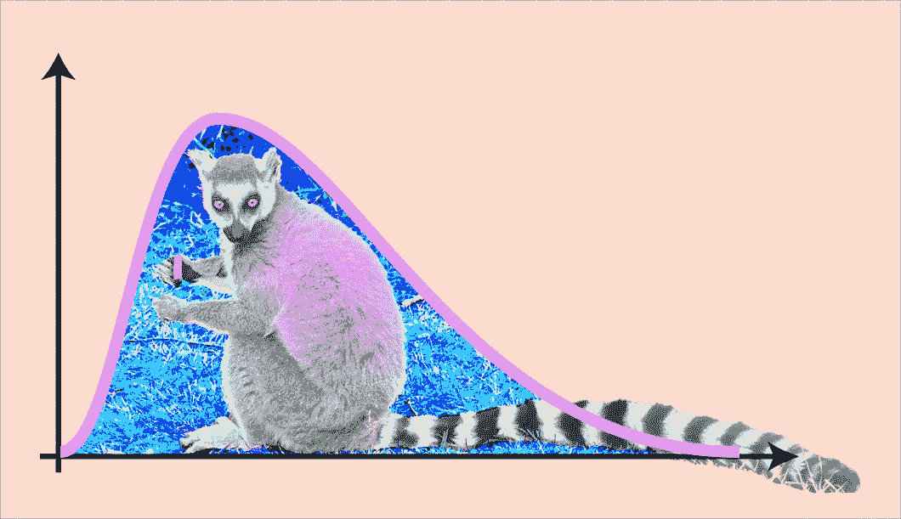
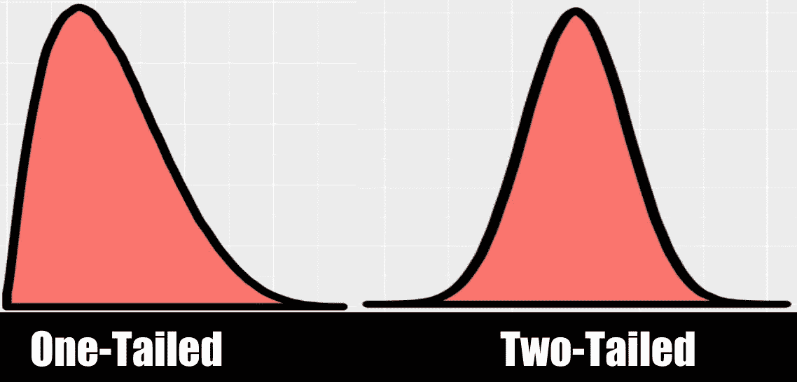
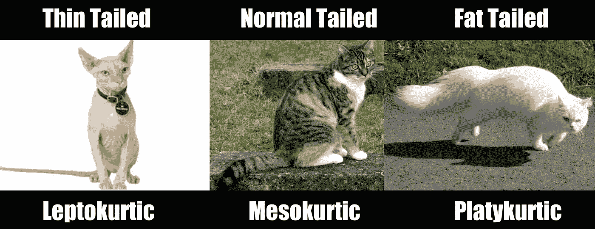

# 最流行参数的现场指南

> 原文：<https://towardsdatascience.com/a-field-guide-to-the-most-popular-parameters-d734596c3f26?source=collection_archive---------4----------------------->

## 花点时间探索一些基本原理

本文将带您浏览一下[统计数据](http://bit.ly/quaesita_vocab)中最受欢迎的参数！如果你不确定什么是统计的*参数*或者你对*概率分布*的工作原理不清楚，我建议在继续之前，先浏览一下我在[第一部分](http://bit.ly/quaesita_distributions)的初学者友好介绍。

如果您是这个领域的新手，请在[第 1 部分](http://bit.ly/quaesita_distributions)中了解您的分销基础知识。图片由作者提供。

***注:*** *如果一个概念对你来说是新的，就按照我的解释链接。如果早期的东西感觉太技术化，请随意跳到更低级的可爱的小动物迷因。*

准备好最喜欢的列表了吗？让我们开始吧！

# 平均

这个词读作*平均。*

# 预期值

一个期望值，记为 *E(X)* 或 *E(X=x)* ，是[随机变量 *X*](http://bit.ly/quaesita_distributions) *的理论概率加权均值**。***

通过加权(乘以)每个潜在值 [*x* 可以发现 *X* 可以以其相应的概率](http://bit.ly/quaesita_distributions)[*P(X = X)*](http://bit.ly/quaesita_distributions)*然后将它们组合起来(对于像身高这样的[连续](http://bit.ly/quaesita_datatypes)变量使用积分，或者对于像身高四舍五入这样的[离散](http://bit.ly/quaesita_datatypes)变量使用求和): ***E(X****

**

*图片:[来源](https://www.linkedin.com/in/paularosine/)。*

*如果我们正在处理一个公平的六面骰子， *X* 可以以 1/6 的相等概率取{1，2，3，4，5，6}中的每个值，所以:*

*e(*X*)=(1)(1/6)+(2)(1/6)+(3)(1/6)+(4)(1/6)+(5)(1/6)+(6)(1/6)= 3.5*

*换句话说，3.5 是 *X* 的概率加权平均值，没人关心 3.5 甚至不是掷骰子的允许结果。*

# *差异*

*出于我将在*时刻*解释的原因，在上面的 E( *X* )公式中，用*(X-E(X))*替换 *X* 会给你一些非常有用的东西。但首先，让我授权你在冲动袭来时计算它:*

*v(*X*)= E[*(X—E(X))*=**∑【*X—*E(X)】*P(X = X)***= E[(X)]—【E(X)】*

*最后一点是一个方便的重新表述，我将把它的证明留给感兴趣的读者作为家庭作业。(如果看起来遗漏了一些步骤，不要感到惊讶。他们是。)嗯，不喜欢那个链接里的证明？试试这个。*

*让我们用一个旋转的公式来得到一个公平骰子的方差:V(X)=**∑[*X-*E(X)]*P(X = X)***=**∑(*X-3.5)**P(X = X)=***(1–3.5)(1/6)+(2–3.5)(1/6)+*

# *瞬间*

*哈，“在一个*时刻*”——这是上一节中的一个小小的双关语(几乎肯定除了我自己没人觉得好笑)。咳咳。*

*矩是一种特殊的期望值。他们有一个模式:*

*第一原始力矩:E[(X)] ……第一中心力矩:E[(X — 𝜇)]
第二原始力矩:E[(X)] …。第二中心矩:E[(X — 𝜇) ]
第三原始矩:E[(X) ] …..……第三中心矩:E[(X — 𝜇) ]
………………..诸如此类……*

*矩是值得知道的，因为它们告诉你分布的形状。在某种程度上。缩放第三中心矩给你分布的*偏斜度*，而缩放第四中心矩给你分布的*峰度*(“尾部”)。*

# *高阶矩*

*至于更高的时刻…嗯，我提出第五时刻的唯一原因是它是我的朋友们在研究生院组建的[统计翻唱乐队](https://www.youtube.com/watch?v=QfioISOWbI4)的名字。(是的，我们是书呆子。我知道。)*

*第五时刻表演一首关于线性回归的歌。*

# *尾部*

*等等，“尾随”？！是的，这是一个在[统计](http://bit.ly/quaesita_statistics)中频繁出现的词。我记得一个朋友在打开他的第一本统计学教科书后给我发了一封电子邮件:“反面？WTF，这些是数字还是这些是狐猴？”*

**

*图片:[来源](https://twitter.com/quaesita)。*

*我代表统计部门，深表歉意。给它们命名为“尾巴”的人可能当时正在吸食某种，呃，药用的东西，并且认为这种分布形状像一个有尾巴的动物。或者两条尾巴。不，这里没有任何动物可疑之处…*

**

# *峭度*

*峰度是描述尾部丰满度的一种方式。你可能不会经常提到峰度，所以要克制住记忆任何相关信息的冲动。相反，当你需要的时候就去查(就像我刚刚做的那样)。*

**

*在这里，我给你做了一个峰度(尾数)指南。好吧，[这个](https://www.statisticshowto.com/probability-and-statistics/statistics-definitions/kurtosis-leptokurtic-platykurtic/)可能是个更好的向导。*

# *歪斜*

*当谈到左偏、右偏、正偏、负偏的分布时，很难记住哪个是哪个…直到你意识到答案在尾巴指向的方向。所以，让我们用下面的恐龙来试试:*

**

*无论“尾巴”指向哪里，那就是你的答案。图片:[来源](https://pixabay.com/photos/dimetrodon-dinosaur-skeleton-bones-347308/)。*

*这将是一个左偏(或负偏)分布，因为这是尾巴指向的地方。如果你足够努力地斜视你的大脑，每当你看分布的时候，你也会开始看到尾部。*

**

*这到底是什么？！一个[高斯混合](https://en.wikipedia.org/wiki/Mixture_model#Gaussian_mixture_model)？当很难决定尾巴指向哪一边时，就没有太多偏斜。图片:[来源](https://pixabay.com/photos/animal-hairy-hair-nature-lemur-1827940/)。*

# *矩母函数*

*如果你没有足够的时间呢？那么力矩生成函数( [MGFs](https://en.wikipedia.org/wiki/Moment-generating_function) )就是为你准备的。mgf 很酷的一点是它们唯一地决定了分布(所以你可以用它们来代替[CDF 和 pdf](http://bit.ly/quaesita_distribution))*和*它们给你一个快速的方法来计算所有你想要的时刻。*

*或者你可能不需要它们，因为你主要是在处理最受欢迎的时刻:*

*第一原始矩= 𝜇 = E[(X)]
第二中心矩= 𝜎 = E[(X — 𝜇) ]*

*眼熟吗？没错。又见面了，均值和方差！*

# *方差，再次*

*方差告诉你一个随机变量*与其平均值*相差多少。有多“全面”呢？*

*想想一个平均数本身能告诉你多少。例如，如果你看了我的平均睡眠时间，你会猜我是一个睡眠冠军…直到你看到差异(哦，天哪)。一个晚上的 4 小时和另一个晚上的 12 小时并不等同于 8 和 8，尽管它们的意思是一样的。*

> *方差越低，越容易做出预测。*

*谈到概率，方差是一个非常重要的概念，因为方差越低，就越容易做出预测。当没有方差时，你就有了确定的答案。*

*唉，方差不是传达这种信息的最合适的方式。这就是为什么在礼貌的公司里传播你的结果之前先求平方根是礼貌的。那个平方根有一个特别的名字…*

# *标准偏差*

*标准差是方差的平方根:它是𝜎而不是𝜎，所以它测量的是同样的东西。用标准差而不是方差来报告结果更友好，因为我们的伙伴的标准差是一个有意义的距离度量尺度。*

**

*把那些自称为“偏差”的东西想象成测量就餐者和长长的霍格沃茨风格宴会桌中心线之间的距离。图片:[来源](https://pixabay.com/photos/dining-room-banquet-oxford-5114247/)。*

> *总的来说，你可以把那些自称为“偏差”的东西，看作是对食客和长长的霍格沃茨风格宴会桌中心线之间距离的概括。*

*在学校里，你会学到标准差告诉你平均值的平均分布……某种程度上。*

*实际上，*最真实的衡量标准是所谓的平均绝对偏差。**

# *疯的*

*平均绝对偏差是当我说*“你的值围绕平均值的平均分布”时，你直觉上想象的偏差**

*不幸的是，它的公式可能是一个绝对的害虫——绝对值函数(消除负号的函数)有一个尖角，使得一些优化技术变得疯狂，所以我们通常更喜欢用标准差来代替。够近了。*

*这一节有*展开*绰绰有余，所以让*自己居中*。*

# *中位数*

*Median 读作*“中间的东西。”*中值通常是你在说*“平均收入”时想要考虑的数量*如果一群人有以下以千美元计的工资:{1，1，1，1，1，1，1，1，1，1，1，1，10000000000 }，那么平均工资(1，000 美元)本身比平均工资(7，692，307，693，000 美元)更能概括这个群体的情况(一半在 1，000 美元以上，一半在 1，000 美元以下)。对于那些过分关注的人，你会注意到这种形状的分布被描述为单尾和右偏。*

**

*这是给你们三个分享我对电影的品味的人。*

# *方式*

*模式读作*“最常见的值。”*对应的模式是分布/直方图出现峰值的地方。当你听到一个分布是 ***多峰*** 时，这意味着有不止一个峰值。当一个分布是 ***对称单峰*** 时，就像漂亮的小钟形曲线一样，众数也恰好是均值。如果你想在技术上正确，你就不要再说*“普通人”*了，实际上你指的是*“模态人”**

# *为什么是均值和方差？*

*如果人们更直观地思考中位数和 mad，为什么学生要学习均值和方差呢？简而言之，均值和方差函数更便于执行各种数学技巧。*

**

*中心极限定理(CLT)说，如果你正在处理大量数据，你可以安全地假设样本平均值的分布是正态的(钟形)，就像这个 plushy。在以后的文章中，我会告诉你所有关于 CLT 和便捷计算的可怕代价，但我现在就停在这里，让你消化你如此耐心吸收的大量信息。图片:[来源](https://beautyofmathematics.com/nausicaa-distribution/)。*

*你会惊奇地发现,“标准”的做事方式往往是回答简单的问题，而不是正确的 T21 问题。不要认为你在课堂上学到的技术是你应该用于重要工作的。你能培养的最好的统计技能是独立思考的能力。*

> *你会惊奇地发现，做事情的“标准”方式常常是回答“简单”的问题，而不是“正确”的问题。*

# *感谢阅读！人工智能课程怎么样？*

*如果你在这里玩得开心，并且你正在寻找一个为初学者和专家设计的有趣的应用人工智能课程，这里有一个我为你制作的娱乐课程:*

*在这里欣赏整个课程播放列表:[bit.ly/machinefriend](http://bit.ly/machinefriend)*

# *与凯西·科兹尔科夫联系*

*让我们做朋友吧！你可以在 [Twitter](https://twitter.com/quaesita) 、 [YouTube](https://www.youtube.com/channel/UCbOX--VOebPe-MMRkatFRxw) 、 [Substack](http://decision.substack.com) 和 [LinkedIn](https://www.linkedin.com/in/kozyrkov/) 上找到我。有兴趣让我在你的活动上发言吗？使用[表格](http://bit.ly/makecassietalk)联系。*