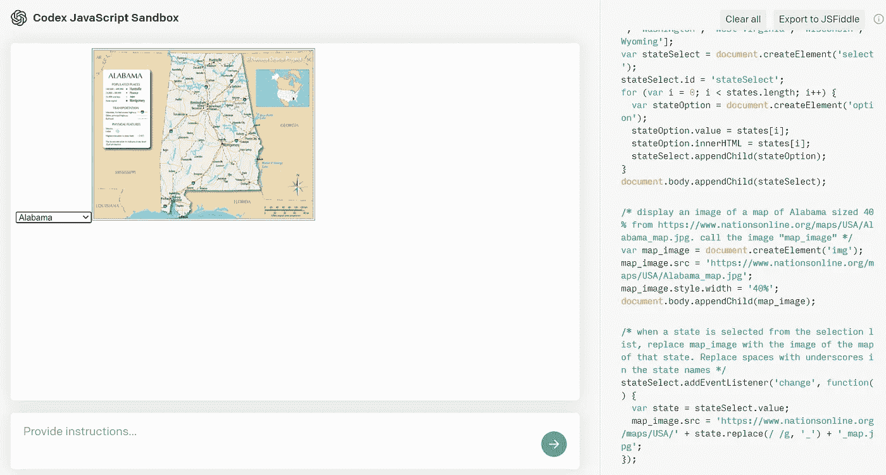
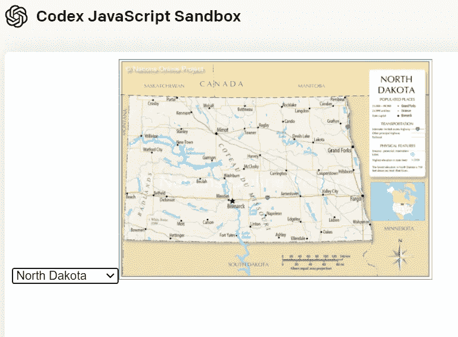
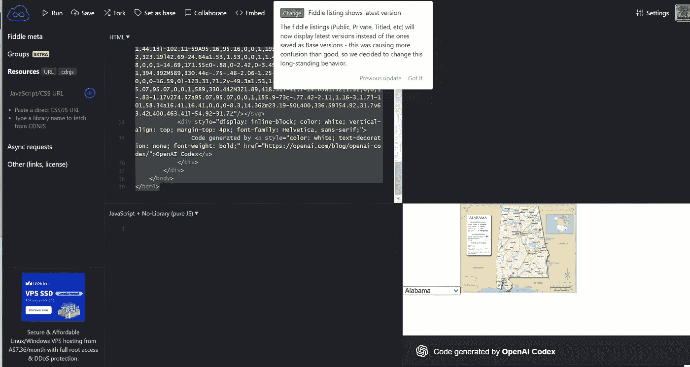

# 第一次品尝法典

> 原文：<https://towardsdatascience.com/a-first-taste-of-codex-71385ee8aaa4?source=collection_archive---------22----------------------->



作者图片

## 试用 OpenAI 的自动代码生成系统

2020 年，我技术生涯中的一个亮点是进入 GPT 3 号。多亏了这个视频中[提供的建议，我得以访问 GPT 3 号，并发布了一系列视频，描述了我用 GPT 3 号进行的实验，以生成来自英国的](https://youtu.be/7_c3zjpDvqg) h 的 [git 命令，创建一个](https://youtu.be/MoLfVG-8Z5A)[电影琐事聊天机器人](https://youtu.be/ECeRjLkT01U)，并导航[伦敦地铁](https://youtu.be/790PiTSqi4Y)和[纽约地铁](https://youtu.be/Xzb1Vc8dYAY)。

我对 GPT-3 可以解决的各种问题印象深刻，所以当我听说 Codex 时，我急于尝试一下。Codex 专注于 GPT-3 的功能之一，从英语语言描述中生成代码。Codex 生成各种语言的代码，包括 Python 和 JavaScript。我很少使用 JavaScript，所以一旦我接触到 Codex，我认为用一些简单的 JavaScript 用例来练习它会很好。我对 JavaScript 非常熟悉，可以用 Codex 生成的代码解决简单的问题，但同时我也对 JavaScript 非常熟悉，如果 Codex 能为我生成一些代码，我会从中受益。

在这篇文章中，我将描述我从最初的 Codex 实验中学到的东西。

## 目标

对于这个最初的实验，我希望 Codex 生成一个简单的网页，允许我选择美国的州，当一个州被选中时，显示该州的地图。

我应该注意到，我最初试图为加拿大各省而不是美国各州做这个实验。我遇到了一些问题，我怀疑是因为加拿大各省的培训材料没有美国各州的丰富。一旦我将主题领域从加拿大各省转移到美国各州，我就能够为我的用例获得不错的结果。

## 实验

开始使用 Codex 真的很容易。我从 OpenAI 得到的访问邮件把我带到了测试环境，并把我指向了我想要的东西，即 [JavaScript 沙箱](https://www.youtube.com/watch?v=Zm9B-DvwOgw)。在沙盒中，我输入以下提示来生成代码:

*   美国的一项控制规定:

```
create a selection list of the states of the united states
```

*   该提示生成了以下 JavaScript 代码:

*   选择列表中第一个州的初始地图图像。我了解到，我需要用一个图像的 URL 作为 Codex 的种子，该图像具有规则的结构，当初始的州名被其他州名替换时，该结构将产生有效的图像 URL。我还了解到，通过显式命名控件(例如“map_image”)，我可以在以后的步骤中具体引用它:

```
display an image of a map of Alabama sized 40% from https://www.nationsonline.org/maps/USA/Alabama_map.jpg. call the image "map_image"
```

*   该提示生成了以下 JavaScript:

*   用当前所选州的地图图像替换初始地图图像。我了解到，为了为具有多单词名称的州(例如新泽西州、南达科他州)的图像生成有效的 URL，我需要明确要求 Codex 用下划线替换州名中的空格:

```
when a state is selected from the selection list, replace map_image with the image of the map of that state. Replace spaces with underscores in the state names
```

*   该提示生成了以下 JavaScript:

这些是我的简单应用程序和它们生成的代码所需的提示。

## 实验结果

经过一段时间的反复试验，上面的提示生成了代码，这些代码生成了我在 Codex JavaScript 沙箱中想要的内容:



在 Codex JavaScript 沙箱中运行的应用程序

一旦我在 JavaScript 沙箱中测试了应用程序，我就点击 **Export to JSFiddle** 按钮进入 [Fiddle](https://jsfiddle.net/) :



Codex 在 Fiddle 中生成的代码

在 Fiddle 中，Codex 在 JavaScript Playground 中生成的 JavaScript 被包装在 HTML 中。我可以保存这个 HTML 来获得应用程序的自包含版本。

## 结论

通过三个提示和一点点尝试和错误，我能够从 Codex 获得一个简单的、自包含的应用程序。作为一个偶尔使用 JavaScript 的用户，我非常欣赏 Codex 对语法细节的关注。当我得到意想不到的结果时(例如，显示了多个地图，而不仅仅是当前所选状态的地图)，很容易调试问题，更新生成的代码，并修复问题。

*   你可以在这里看到实验结果。
*   你可以在这里看到一个相关的法典实验的视频:[https://youtu.be/d9sbsSA8xS4](https://youtu.be/d9sbsSA8xS4)