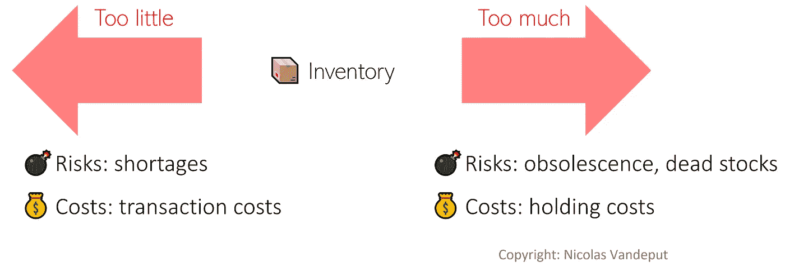
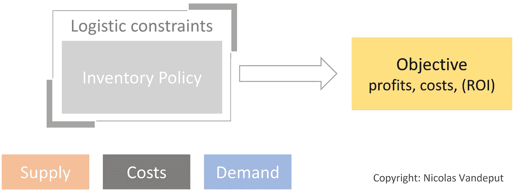
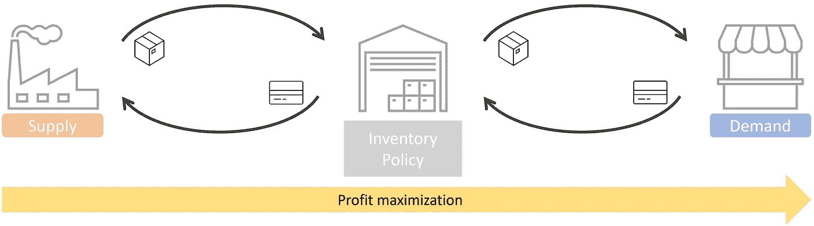
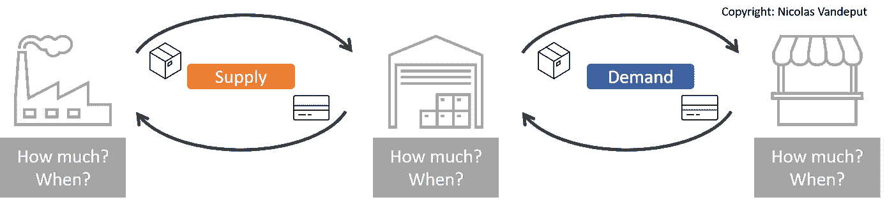
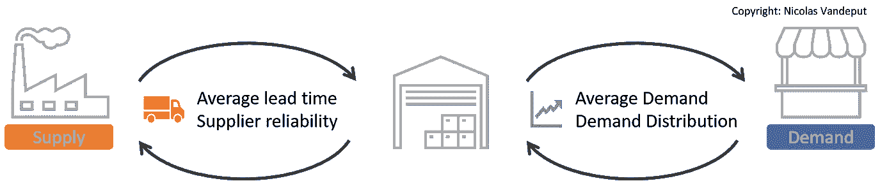
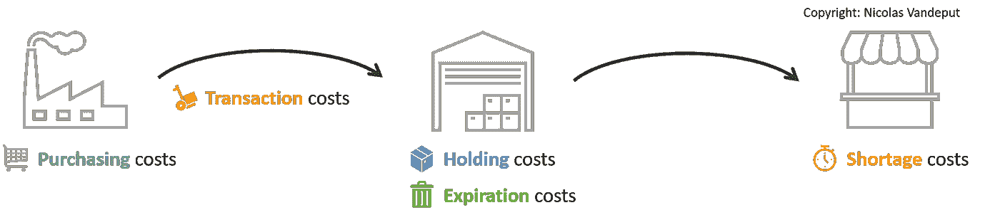
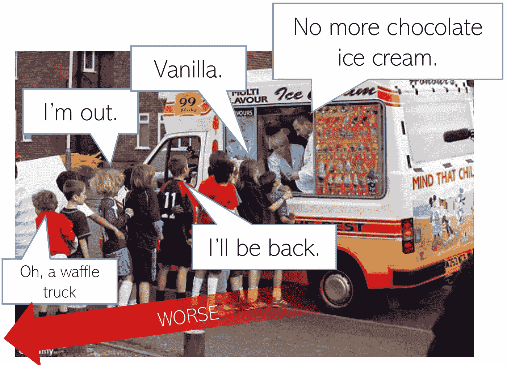
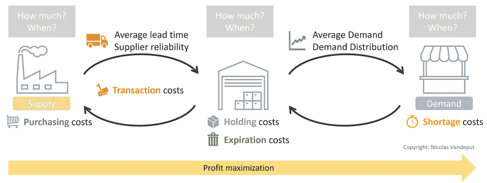

# 库存优化

> 原文：<https://towardsdatascience.com/a-framework-for-inventory-optimization-71d4496aec75?source=collection_archive---------8----------------------->

## 你需要多少库存？一切都与供给、成本和需求有关。

正如我的书*库存优化:模型&模拟*中所解释的那样，不管是好是坏，库存在供应链中无处不在。关于**需要多少**库存以及**哪里需要**库存的核心问题经常是同事之间无休止的争论，尤其是当政治游戏(而不是定量/定性分析)驱动决策的时候。

## **盘点做对了**

储备产品有助于全球各地的公司按时向客户供货，并为任何不可预见的事件提供缓冲。此外，由于持有库存使生产过程与销售过程分离，它允许计划者生产更长的生产批次，降低生产成本。

换句话说，正确的库存优化可以保护您免受供需变化的影响，降低总体成本，并优化服务水平。

## 库存做错了

然而，持有存货有两个主要缺点。第一个当然是它的成本:库存只不过是随着时间推移而贬值的沉睡的现金。储存产品是要花钱的。此外，库存过多会带来风险。你真的能卖出所有这些产品吗？他们不会让久而久之过时吗？

简而言之，你持有的越多，成本就越高，风险就越大。

保持更少的库存可能会部分防止呆滞/过时库存的风险。尽管如此，它也无助于为您的客户提供足够的服务水平。实际上，在某些情况下，库存管理是如此的有缺陷，以至于供应链面临着低服务水平和呆滞/过时的库存。

如图“库存权衡”所示，我们看到保持适当数量的库存就是在各种风险和成本之间进行适当的权衡。

库存权衡

# 库存优化框架

库存优化是优化库存策略以实现目标的科学。

如下图*库存优化框架*所示，库存策略只是实现特定目标的工具。我们还需要考虑供应链环境(供应、成本和需求)，同时受到物流限制(仓库大小、卡车数量等)的约束。

设定正确的目标将允许我们在过多和过少的库存之间做出正确的权衡。

库存优化框架

让我们逐一讨论这些要素(目标、库存政策、供应链环境)。

# ️🎯目标

在进入库存策略之前，我们应该首先定义我们追求的业务目标。换句话说，首先，我们需要看到我们希望供应链实现的目标。然后**、**进入库存优化的细节。

## 对服务水平的(无用)追求

大多数从业者都在寻找特定的、任意的服务水平目标。

> “我们需要达到 95%的服务水平”

他们希望有足够的库存来实现特定的服务级别目标。我想到了两个问题:

*   ❔ **你怎么知道 95%是不是最佳值？**为什么不是 98%或者 92%？*的每一件产品*都应该达到 95%的服务水平吗？还是只是一个平均值？
*   ❔ **你如何定义服务水平？**量化服务水平的方法有很多。在实践中，一些服务级别定义会导致高分(填充率)或低分(周期服务级别)。[1]

更好——更清晰！—库存政策的目标应该是最小化成本或最大化利润。

服务水平应该只是库存优化的副产品，而不是其主要目标。

## 成本最小=利润最大化

大多数模型——像著名的 EOQ 库存模型——讨论*成本最小化** ，一些讨论*利润最大化*。

两者本质上是一样的，条件是所有相关成本都包含在模型中。您需要在成本模型中包含由延期交货/销售损失引起的*机会成本*；因此，最小化成本将导致与利润最大化练习相同的优化。

只有当所有相关成本(包括机会成本)都包含在我们的模型中时，为成本最小化(而不是为目标服务水平)优化库存策略才会起作用。

> *注意，大多数库存模型都假设销售永远不会损失，但总是延期交货。在实践中，这意味着如果你有一些超额需求(需求>供应)，你将面临一些延期交货成本，而不是未实现利润的机会成本(可能远大于延期交货成本)。

## 💰利润、损失和投资回报率

实际上，一个企业应该追求*投资回报(ROI)最大化*:你想最大化你的利润，同时*减少你的投资。*

*换句话说，企业希望提高资本效率。*

*然而，优化单一产品的投资回报率不会在公司层面产生最佳的投资回报率。这是因为投资回报应该在全球范围内进行衡量和优化(由于所有的全球资本投资)，而不能按产品进行局部优化。*

*总之，每个企业都希望优化其投资回报率。然而，创建一个包括所有资本投资的全球模型是试图煮沸海洋。相反，我们希望优化每个产品的利润，这与最小化每个产品的成本是一样的——条件是我们包括所有的机会成本。*

**

*库存优化的目标:利润最大化！*

# *⚙️️库存政策*

*库存政策将通过回答三个简单明了的问题来控制您的库存水平:*

*   *📦**订购多少***
*   *📆**什么时候**来点菜*
*   *🏭**在哪里**点菜*

*第三个问题(*在哪里订购*)通常是隐含的——但不是无关紧要的！如果每个仓库/梯队都知道何时订购以及订购多少，库存本地化问题就隐式解决了。多级供应链中的库存定位问题称为*多级库存优化* (MEIO)。如果你对 MEIO 感兴趣，我在我的书中描述了一个框架，可以轻松地解决分销供应链的 MEIO。[1]*

**

*库存策略:**多少**、**何时**、**何处**订购*

*这里有一些库存政策的例子(你应该很容易确定**订购多少**和**何时订购**):*

*   *我们每周五晚上向供应商下订单，这样他们可以在周一早上准备好订单，并在周二发货。我们总是订购足够的数量，有 3 周的库存。*
*   *我们每个月的第三个工作日向中国的供应商下订单。我们补充库存，有 1000 件存货。*
*   *我每周六早上去超市。我买了足够多的牛奶，总共有 6 升。*
*   *当库存水平达到 3 件时，我订购 10 件。*
*   *一旦我的冰箱里剩下两瓶牛奶，我会去超市买六瓶。*
*   *当我的打印机显示我只剩下 10%的墨水时，我会订购一套新的墨盒。*

# *供应链环境*

*我们现在有了目标(利润最大化)和实现目标的工具(库存策略)。我们需要讨论*供应链环境*，这将决定什么是最佳库存政策。三个要素主要决定了这种环境:*

*   *🏭供应*
*   *🛍️需求*
*   *💰费用*

# *供求*

*对于每种产品，我们应该分析:*

*   *🏭**供给。**预期供应提前期及其可变性(你的供应商/生产可靠吗？).*
*   *🛍️ **需求。**我们需要了解两个方面:
    📊期望的需求分布:你期望有多少需求(平均而言)，以及有多少可变性。
    📅你的客户愿意等你的产品多久。这是库存政策的一个驱动力:要求现成产品的客户将不会得到与接受等待数周的客户同样的服务。*

**

*供应链环境:供给和需求*

*如果你只是想达到特定的服务水平目标，评估需求和供应的可变性就足够了。但是我们追求利润最大化。这将要求我们审视供应链产生的成本。*

# *费用*

*如图“库存成本”所示，我们看到 5 种主要的成本类型:💳采购，🚚交易，📦持有，🗑️到期，和💶短缺成本。*

**

*库存成本*

*让我们逐一分析这些成本。*

## *1.采购成本💳*

*这基本上是销售的 (COGS)商品的*成本:采购价格或生产成本。**

*一些因素会影响采购成本:*

*   *如果产品是从供应商那里购买的，购买成本有时会因为批量折扣而降低。*
*   *一些产品的采购成本会随着时间的推移而降低。高科技元件往往就是这样。*

## *2.交易成本🚚*

*交易成本是向供应商(内部或外部)下订单(或交易)引发的所有成本。*

*让我们将这些成本分为供应商和客户两方面。*

*   ***供应商**:运输、包装、提货、转换时间……*
*   ***客户**:订单检验&接待，仓库催货&员工，下单所需时间(库存分析、购买流程、谈判……)，…*

*提示:仓库里的大部分员工工作都是因为交易(成本)。*

## *3.持有成本📦*

*与储存(或拥有)产品相关的成本。*

***可变**部分(与产品更相关)*

*   *产品资本成本*
*   *过时(想想高科技产品)*
*   *产品保险*
*   *损坏、丢失、盗窃*
*   *库存控制(检验)*

***固定**部分(更多与仓库相关)*

*   *仓库的资本成本*
*   *仓库保险*
*   *存储设备/基础设施*
*   *软件/信息技术(WMS)*
*   *安全性*
*   *照明、供暖*

*提示:你可以很容易地把(大部分)持有成本想象成晚上仓库睡觉时发生的所有成本。*所有这些产品放在仓库里一晚上要多少钱？*(请记住，仓库中的大多数员工工作是因为交易(流入/流出)，而不是因为库存。)*

## *4.到期成本🗑️*

*由于保质期/失效日期而丢弃产品的所有相关成本。*

***到期还是持有成本？**过期成本在某种程度上类似于持有成本，因为它们随着现有库存量的增加而增加。尽管如此，由于他们的行为是不同的——持有成本比到期成本更具线性——我喜欢将这些成本分开。*

## *5.短缺成本💶*

**短缺成本*是指需求超过供给(出现库存短缺)时发生的所有成本。不知何故，短缺成本是收入损失和客户惩罚的混合。*

## *了解你的客户*

*在查看短缺成本估算之前，我们必须分析在短缺情况下客户的典型行为。*

*他们会…(从最好到最差)*

*   *…等着补货？*
*   *…转而购买另一个类似的产品？*
*   *…放弃购买？*
*   *…去比赛？*

*理解他们的行为将有助于我们估计错过销售的(机会)成本。*

**

*当你缺货时(版权所有:尼古拉斯·万德普特)*

> **参见我的上一篇文章，*“捕捉供应链中不受约束的需求”，*了解更多关于捕捉实际需求而不仅仅是销售的信息。**

* [## 捕捉供应链中不受约束的需求

### 下面这篇文章是我在 LinkedIn 上的一篇帖子的摘要。如果你对这样的辩论感兴趣，那就来连线吧！我…

towardsdatascience.com](/capturing-unconstrained-demand-in-supply-chains-78b46bae1b28) 

根据客户的行为，缺货可能会导致延期交货或销售损失。但情况可能更糟:品牌声誉受损、更大订单的损失(如果订单需要某个特定的零件)，信息丢失，甚至停产。让我们逐一回顾所有这些短缺效应。

*   **利润率/利润。**如果你失去了一笔销售，你就错过了实现一些利润的机会。产品利润应该是任何短缺成本估算的基线吗？如前所述，这完全取决于你的客户的购买习惯。当面临短缺时，如果他们喜欢购买你的另一种产品，你仍然能够实现利润。所以你没有损失任何实际的钱(但仍然让你的客户感到沮丧)。
*   商誉/声誉。遭遇库存短缺将导致销售损失或延期交货。两者都会让你的客户失望。这表现为声誉(或商誉)的损失——即使你的客户决定购买你的其他产品。
    **我们如何估算这种名誉损失的价值？**但这是你战略的核心。如果你的供应链战略是为你的客户提供高质量的服务，你可能想要给这种声誉损失一个慷慨的价值(换句话说，你重视你的客户的时间和偏好)。另一方面，如果你遵循低成本战略，你可能希望绕过品牌声誉的损失(换句话说，你将优化供应链的成本，并假设你的客户会喜欢低价、精益的供应链并有耐心)。
*   **比赛**。如果你正在为一种特定的产品进行直接竞争，你可能想要增加你的短缺成本，以反映这样一个事实，即每当你的一个客户面临你的产品短缺时，你的竞争对手就会赚钱。
*   **合同罚款。**一些 B2B 合同包括服务水平协议(SLA)。在这种情况下，任何糟糕的服务都会导致供应商受到处罚。这些应包括在短缺成本中。
*   **信息/数据丢失**。大多数公司没有捕捉到*真正的*需求，而只是跟踪实现的销售(记住，我们预测的是需求，而不是销售)。每当你面临库存短缺时，你的销售额就会持平于 0。如果你用实际销售额作为需求的代表，那么你的需求估计也是如此。这种糟糕的需求估计反过来会影响你的下一次预测，导致更大的预测误差，导致更糟糕的库存分配，导致更多的短缺…如果你正在努力正确捕捉需求，你可以在短缺成本中包括“数据惩罚”。
*   **生产停止**。在制造环境中，缺少一个子组件将会中断整个生产过程。因此，丢失一个组件的成本与不运行整个生产流程的机会成本成正比。
*   **紧急/探险**。面临延期交货可能会(从合同上)迫使你加快向客户发货。进行这种紧急考察的成本(使用更快的运输路线，特殊的特别过程)应该加入到短缺成本中。

# 结论

让我们回顾一下我们的库存优化框架。我们有，

*   1 个目标:📈收益
*   2 个问题:📦订购多少钱📆何时订购
*   3 个库存驱动因素:🏭供应，💰成本和🛍️需求
*   5 成本:💳采购，🚚交易，📦持有，🗑️到期，和💶不足

库存优化框架* 

## *👉[我们在 LinkedIn 上连线吧！](https://www.linkedin.com/in/vandeputnicolas/)*

# *感谢*

*我要感谢 Stefan de Kok 的评论、见解和支持。*

# *来源*

*[1]范德普特，尼古拉(2020)。*库存优化:模型和模拟*，柏林，波士顿:德格鲁埃特出版社，2020 年。[https://doi.org/10.1515/9783110673944](https://doi.org/10.1515/9783110673944)*

*[2]范德普特，尼古拉(2021)。四维预测框架。走向数据科学。[https://towards data science . com/the-4-dimensions-forecasting-framework-f 7884 EC 1472](/the-4-dimensions-forecasting-framework-f7884ec1472)*

* [## 四维预测框架

### 如何设置预测流程

towardsdatascience.com](/the-4-dimensions-forecasting-framework-f7884ec1472) 

> ***如何引用这篇文章***vande put，Nicolas (2021)。库存优化框架。走向数据科学。

# 关于作者

icolas Vandeput 是一名供应链数据科学家，擅长需求预测和库存优化。他在 2016 年创立了自己的咨询公司 [SupChains](http://www.supchains.com/) ，并在 2018 年共同创立了 [SKU 科学](https://bit.ly/3ozydFN)——一个快速、简单、实惠的需求预测平台。尼古拉斯对教育充满热情，他既是一个狂热的学习者，也喜欢在大学教学:自 2014 年以来，他一直在比利时布鲁塞尔为硕士学生教授预测和库存优化。自 2020 年以来，他还在法国巴黎的 CentraleSupelec 教授这两个科目。他于 2018 年出版了 [*供应链预测的数据科学*](https://www.amazon.com/Data-Science-Supply-Chain-Forecasting/dp/3110671107)(2021 年第 2 版)和 2020 年出版了 [*库存优化:模型与模拟*](https://www.amazon.com/Inventory-Optimization-Simulations-Nicolas-Vandeput/dp/3110673916) 。

*