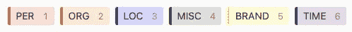

# 每个数据科学家都应该知道的免费且强大的标签工具

> 原文：<https://towardsdatascience.com/a-free-and-powerful-labelling-tool-every-data-scientist-should-know-ce66473c7557?source=collection_archive---------7----------------------->

## 我用过的最好的标签工具之一


照片由来自 [Pexels](https://www.pexels.com/photo/green-and-yellow-printed-textile-330771/) 的 [Markus Spiske](https://www.pexels.com/@markusspiske) 拍摄

# 通知:您有新的工作请求！

作为一名数据科学家，您肯定需要训练模型来满足您组织的需求。大多数情况下，您需要来自公司内部的标记数据，以便构建定制的解决方案。

一天，一位产品经理找到您，希望您构建一个命名实体识别模型，以提高下游数据科学产品的质量。由于这个产品需要推出的时间很短，他雇佣了一群人类贴标机来协助你。你下一步应该做什么？

> 给我们工具，我们将完成这项工作
> 
> **作者温斯顿·丘吉尔**

# 你需要一个标签工具

任务目标明确，人力充足，有期限。下一步是什么？一个有用的标签工具。请注意强调“有用”。但是我说的“有用”是什么意思呢？该工具至少应该让您能够:

1.  随时在内部或云中跟踪标签质量。在整个贴标项目完成之前，如果注释人员没有按照说明进行操作，可以通知他们。
2.  跟踪每个注释者的进度。截止日期已经给了你，所以必须给每个注释者一个完成标注的具体截止日期。作为项目负责人，你应该能够跟踪进度，以确保每个人都在正轨上。
3.  允许多个注释一起工作。偏见是机器学习中最有问题的话题之一。作为一名数据科学家，您不希望在花了几天或几周时间训练您的模型后，却发现它有偏差，注释偏差会影响您的模型。作为一种可能的解决方案，多个作者可以在同一任务/文章上合作，并且只批准被一致接受的标签。
4.  用最少的努力后处理您的标签结果。你将会欣赏的一个特别的方面是你能容易地处理被标记的数据。根据我的经验，当我为客户标记项目时，JSON 格式是最容易使用的。如果该工具可以支持多种类型的格式来导入和导出数据，那就太好了。
5.  为人工注释者提供一个用户友好的界面。为我开发一个好的数据标注工具主要是基于这个因素。我不仅负责准备客户文档，还必须训练人工注释如何使用标签工具，尽可能减少人为错误。因此，如果你使用易于使用的标签工具，你可以省去很多麻烦。
6.  编码你的标签界面来满足你的需求。我确信，作为一名程序员，你希望你的工具由代码控制。通过编码来定制界面可以将时间用于其他重要的任务。

这些是我希望我的标签工具至少具备的特性。像这样的工具可能会花费你数千美元和无数小时的劳动来开发。免费找到这种现成工具的最好方法是什么？

# 标签工作室

在我开始之前，让我声明如下:我不为 Label Studio 工作，也不隶属于 Label Studio。这只是我为客户项目工作的个人经历。

<https://github.com/heartexlabs/label-studio>  

当我在开发一个代表客户标记数据的系统时，我遇到了这个工具。鉴于它是一个开源和免费的数据标记工具，我对它的灵活性和功能性感到非常惊讶。通过几个简单的步骤，我将向你展示如何构建一个简单的 NER 标签接口。

# 案例研究:NER 标签制度


文章摘自[https://www . Reuters . com/life style/science/sko rea-prepares-launch-first-国产-space-rocket-2021-10-20/](https://www.reuters.com/lifestyle/science/skorea-prepares-launch-first-domestically-produced-space-rocket-2021-10-20/) 。图片作者。

您可以按照 Github 资源库中的说明轻松设置 Label Studio。它支持本地机器上的安装和云中的部署。作为我为客户工作的一部分，我使用 Docker 构建并部署了这个工具。它允许他在本地存储数据，因为凭据是他的业务的主要要求。为了演示这个工具，我将使用 Heroku 按钮。您可以按照您认为适合您业务的任何方式部署它。

## 设置您的第一个项目


建立新项目。图片作者。

登录后，您将能够看到项目页面。创建项目的过程如上面的 gif 图所示。对于这个项目，我称之为 NER。

我们的下一步是上传我们自己的数据，为贴标签做准备。为了方便起见，我创建了一个脚本来帮助您开始。作为起点，我引用了 Reuters.com 的两篇文章。在 Colab 中运行上面的脚本，您应该能够查看 JSON 格式的任务列表，如下所示:

```
[
 {
    “data”: { 
        “text”: “TOKYO, Oct 20 (Reuters) - A volcano ...”
    }
 },
 {
    “data”: { 
        “text”: “HONG KONG, Oct 20 (Reuters) - Bitcoin ...”
    }
 }
]
```

可以通过上传 label_studio_input.json 文件导入数据。之后，您可以在最后一个选项卡中从大量模板中进行选择，以定制您的标签界面。默认的 NER 模板可以用来启动我们的第一个 NER 项目。以下是向您展示第一个项目页面的步骤。


上传数据并使用默认的 NER 模板创建您的第一个项目。图片作者。

## 开始贴标签

标签数据。作者视频。

Label Studio 是迄今为止我用过的最简单的工具。这个工具的用户界面让我很容易使用。正如你在上面的视频中看到的，你只需选择标签按钮，并突出显示与之相关的单词。如果你想做得更快，可以用热键激活标签按钮。通过按“3”键，可以激活“LOC”标签的标签按钮。完成后，您可以点击右侧面板上的“提交”来确认您的标签。只需编辑文本，然后根据需要进行更新。

你可以看到整个贴标过程是多么直观。如何将您的结果导出以供将来处理？

## 导出您的结果


导出数据超级简单。图片作者。

完成标注后，将其导出为不同的格式，以便对结果进行后期处理。在这个演示中，我将把它导出为 JSON 格式，并进一步把结果整理成 Panda 数据帧。

以下脚本向您展示了清理 label studio 结果的一个非常简单的步骤:

# 它只提供这些吗？

肯定不是！在本文的前面，我们讨论了好的数据标签工具的定义特征。让我们来看一下您可以为不同的业务场景定制的一些很酷的功能。

## 标签的附加任务和每件商品的更多标签


为您自己的数据集自定义标签配置。图片作者。

```
# Code for the default NER template<View>
    <Labels name=”label” toName=”text”>
        <Label value=”PER” background=”red”/>
        <Label value=”ORG” background=”darkorange”/>
        <Label value=”LOC” background=”orange”/>
        <Label value=”MISC” background=”green”/>
    </Labels>
    <Text name=”text” value=”$text”/>
</View>
```

在上面的案例研究中，我只向您展示了如何使用免费提供的模板启动 NER 项目。此外，Label Studio 为您提供了一个代码编辑器，您可以使用它来定制您的标签模板。代码采用 XML 格式，因此您可以使用标记向数据集添加自定义标签配置。以下是两个允许您进一步自定义数据集的示例。

## #1 修改标签颜色并添加更多标签


标签的原始颜色。图片作者。

NER 的默认模板为 ORG 和 LOC 标签分配了非常相似的颜色。在标记后检查注释时，可能会造成混乱。通过将 LOC 标签的颜色改为蓝色，我们可以避免这种人为错误。为了使任务更完整，我们还将添加更多的标签。

```
# Modify the LOC background color to blue<View>
    <Labels name=”label” toName=”text”>
        <Label value=”PER” background=”red”/>
        <Label value=”ORG” background=”darkorange”/>
        <Label value=”LOC” background=”blue”/>
        <Label value=”MISC” background=”green”/>
        <Label value=”BRAND” background=”yellow”/>
        <Label value=”TIME” background=”purple”/>
    </Labels>
    <Text name=”text” value=”$text”/>
</View>
```



修改过的标签。图片作者。

## #2 新标签任务

在建立项目时，我们只有选择一个模板的选项。即使在单个项目的情况下，也可能需要进行多任务推理。在我客户的一个项目中，我被要求设计一个多标签分类模型，该模型也执行 NER。向我们现有的任务中添加一个新的标签工作只是简单地在脚本中添加几行。

```
<View>
    <Labels name=”label” toName=”text”>
        <Label value=”PER” background=”red”/>
        <Label value=”ORG” background=”darkorange”/>
        <Label value=”LOC” background=”blue”/>
        <Label value=”MISC” background=”green”/>
        <Label value=”BRAND” background=”yellow”/>
        <Label value=”TIME” background=”purple”/>
    </Labels>
    <Text name=”text” value=”$text”/>
    <Taxonomy name=”article_class” toName=”text”>
        <Choice value=”world”>
            <Choice value=”africa”/>
            <Choice value=”america”/>
        </Choice>
        <Choice value=”business”>
            <Choice value=”environment”/>
            <Choice value=”finance”/>
        </Choice>
    </Taxonomy>
</View>
```


新增多标签分类任务。图片作者。

我们可以看到，添加一个名为 Taxonomy 的新标签会立即为现有任务生成一个多标签分类作业。

现在你知道 Label Studio 是多么容易使用，你现在可以在你的下一个标签项目中使用它。最后，我想指出一个更重要的特点。

## 协作是不可或缺的

毫无疑问，标记工作是劳动密集型的，这意味着我们需要将任务分散到多个标注者中，以便尽快完成。为了减少人为偏见，我们应该为每个标记任务分配多个人。好消息是 Label Studio 允许注释者注册，如果需要，他们可以处理相同的任务。

要像现有的注释者一样开始注释相同的文章，他们需要做的就是在他们的帐户下创建一个新的选项卡:


注释者可以处理相同的任务。图片作者。

# 外卖食品

本文的目标是向您展示如何构建一个标签工具来支持您的下一个标签项目。除了它的一系列免费特性，Label Studio 还允许你用几行代码定制你的标签界面。该平台不仅支持自然语言处理任务，还支持计算机视觉和语音识别任务。如果你打算长时间使用这个工具，那么团队版将是理想的选择。

Label Studio 确实做得很好，让这个标签工具尽可能地易于使用。无论你是一家初创公司还是一家小企业，当你开发一个新的机器学习项目时，标签有时会成为一个问题。设计新的贴标工具时，成本和时间会增加。在这方面，Label Studio 是一个可行的选择。

# 参考

1.  https://labelstud.io/

## 关于作者

Woen Yon 是新加坡的一名数据科学家。他的经验包括为几家跨国企业开发先进的人工智能产品。

Woen Yon 与少数聪明人合作，为当地和国际初创企业主提供网络解决方案，包括网络爬行服务和网站开发。他们非常清楚构建高质量软件的挑战。如果你需要帮助，请不要犹豫，给他发一封电子邮件到 wushulai@live.com。

他喜欢交朋友！在 [LinkedIn](https://www.linkedin.com/in/woenyon/) 和 [Medium](https://laiwoenyon.medium.com/) 上随时与他联系

<https://medium.com/@laiwoenyon> 