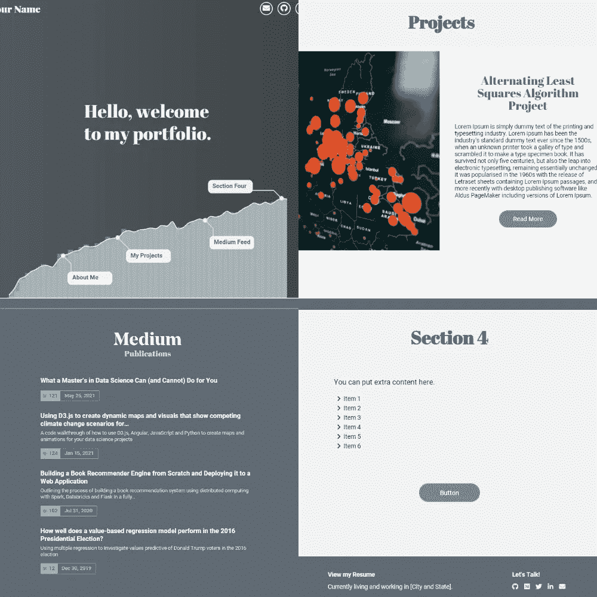
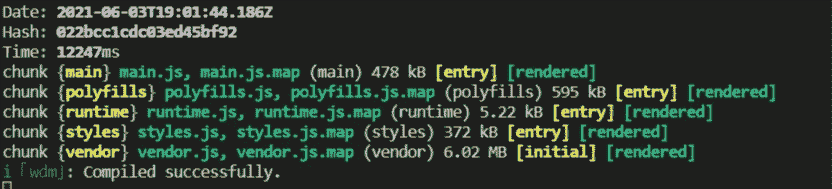
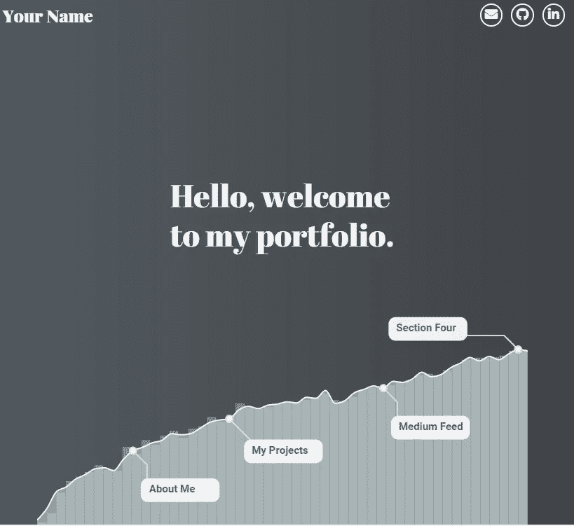
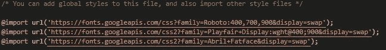
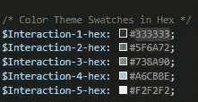
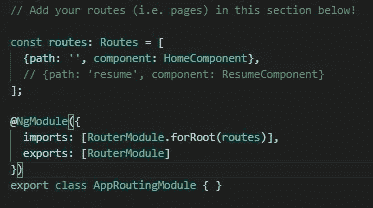

# 展示您的项目的免费数据科学组合模板:使用它来创建您自己的项目

> 原文：<https://towardsdatascience.com/a-free-data-science-portfolio-template-to-showcase-your-projects-create-your-own-in-under-two-ce8560099400?source=collection_archive---------16----------------------->

## 本文将使用 Angular、D3.js 和 Google Firebase，带您一步步地创建自己的数据科学产品组合，并将其部署到互联网上



模板部分|作者图片

建立一个作品集来展示你的数据科学工作似乎是一项艰巨的任务。而且，在花了无数个小时微调你的模型之后，你如何最好地与世界分享你的结果呢？那么，在你跑去找网站建设者之前，为什么不试着自己建一个呢！它实际上不会花费你太多时间，这样做的一些主要优点是:

*   在向世界展示你的项目时，你会有更多的自由。网站构建器很方便，但通常你会受到提供给你的布局类型的限制，你可能不得不重新构建你的代码来让事情正常运行。
*   你会学到一项新技能！数据科学家需要很好地理解 web 框架是如何工作的。为什么不花几分钟浏览一些 HTML、CSS 和 JavaScript 代码呢——这将大有帮助！
*   建立一个定制网站可以向未来的雇主展示你是这份工作的全面候选人。不可避免地，他们会对你花时间和精力部署你的项目和内容印象深刻。
*   如果你的项目托管在互联网上，将会有更多的人可以访问。
*   很好玩！建立和展示你的技能才是最重要的。

如果我已经说服了你，那么请继续阅读这个分步指南(和视频)，从从 GitHub 下载初始模板一直到将其部署到互联网。

**本演练附有一个全面的 YouTube 视频，你可以在这里找到:**

从 GitHub 下载模板到使用 Google Firebase 将其部署到互联网的分步演练|作者视频

## **第一步:创建 GitHub 账户并安装 Git**

为了下载资源库，您首先需要一个 GitHub 帐户和 Git。如果您已经具备了这两个条件，请随意跳到第 2 步。

*   如果你没有 GitHub 账户，你可以在这里免费创建一个:[https://github.com/](https://github.com/)
*   接下来，你需要在你的机器上安装 Git:[https://git-scm.com/downloads](https://git-scm.com/downloads)

## **步骤 2:克隆 GitHub 存储库并将文件下载到您的本地机器上**

成功安装 Git 后，您现在可以访问包含 Angular 模板的存储库:[https://github . com/zachalexander/data-science-portfolio-template](https://github.com/zachalexander/data-science-portfolio-template)

*   要将它下载到您的本地机器上，您需要打开一个终端窗口(强烈推荐 [**VSCode**](https://code.visualstudio.com/) )并运行:

```
git clone [https://github.com/zachalexander/data-science-portfolio-template.git](https://github.com/zachalexander/data-science-portfolio-template.git%60)
```

## **第三步:下载 npm(软件包管理器)**

Angular 应用程序使用某些模块和包，与其他 web 框架类似，组织和安装这些包的最佳方式之一是通过名为 *npm* 的包管理器。如果您已经安装了 npm，请随意跳到步骤 4。

*   如果你还没有安装 npm，你需要在这里安装:[https://www.npmjs.com/get-npm](https://www.npmjs.com/get-npm)

## **步骤 4:安装 Angular 命令行界面(CLI)**

为了在本地运行我们的 Angular 应用程序，并最终编译我们的部署文件，我们需要安装 Angular CLI。您可以通过在终端中运行以下命令，使用 npm 下载该文件:

```
npm i @angular/cli
```

## **步骤 5:在本地机器上运行数据科学组合**

现在到了激动人心的部分，让我们来看看模板！为此，您需要使用命令行 *cd* 命令导航到我们项目目录的根文件夹:

```
cd data-science-portfolio-template
```

进入模板目录的根文件夹后，您将需要运行以下命令:

```
npm install
```

这将需要几分钟的时间，但会安装我们的应用程序所需的所有软件包。完成后，您可以运行以下命令:

```
npm start
```

如果一切顺利，您应该看到您的终端输出如下所示:



Angular 代码的成功编译，可在本地查看，网址为[http://localhost:4200](http://localhost:4200)|图片由作者提供

然后你可以打开一个网络浏览器(最好是谷歌 Chrome 或 Safari)，导航到 [http://localhost:4200](http://localhost:4200) 。在那里，您应该能够看到数据科学产品组合模板！这是主页的顶部:



模板主页顶部|作者图片

## **第六步:编辑模板以展示你的技能**

在浏览器中打开模板后，您会注意到有很多地方需要您进行编辑。例如，您想要添加自己的头像(目前是库存照片)，用自己的内容更新项目页面，并链接到您想要展示的任何特定内容。

在视频演练中，我将更详细地介绍一些您可以真正将它变成自己的地方！但是，这里有一个需要立即编辑的文件的快速列表:

**首页组件 html**

```
-data-science-portfolio-template
--src
---app
----components
-----home
**------home.component.html**
```

这将是您编辑大量主页 html 的地方。有些代码注释看起来像这样:

```
<!-- EDIT CONTENT BELOW -->
```

这些表示需要您进行编辑以使其更加个性化的地方。

**家居组件风格**

```
-data-science-portfolio-template
--src
---app
----components
-----home
**------home.component.scss**
```

这将包含对您想要添加/更改的任何照片的调整。有些代码注释看起来像这样:

```
// project photo 1 -- feel free to change
```

这将突出显示您可以更改照片映射的位置。作为参考，我用于造型的所有照片都可以在这里的*资产*文件夹中找到:

```
-data-science-portfolio-template
--src
**---assets**
```

所以，你可以把你想用的任何照片添加到*资产*文件夹中，然后把文件名改成你的照片，而不是 scss 文件中的*sample.jpg*。

**导航条组件 html**

```
-data-science-portfolio-template
--src
---app
----components
-----navbar
**------navbar.component.html**
```

您需要在此处更改“您的姓名”文本以进行个性化设置，并更新按钮以链接到您的社交媒体页面。

**页脚组件 html**

```
-data-science-portfolio-template
--src
---app
----components
-----footer
**------footer.component.html**
```

您可能想要更改页脚中的任何内容，包括指向您的社交媒体页面的链接，以便为您自己的网站定制这些内容。

**更改配色方案或字体**

```
-data-science-portfolio-template
--src
**---styles.scss**
```

要更改字体，您可以使用 [Google Fonts](https://fonts.google.com/) 并导入您的首选项，类似于此文件中的当前设置:



当前谷歌字体加载到模板|作者图片

您还必须浏览 home.component.scss 文件，以更新转换到特定元素上的任何字体样式。

通过用您喜欢使用的十六进制值调整代码，可以很容易地更改配色方案:



应用程序的当前调色板|作者图片

**更新或删除简历页面**

你可能想或不想利用简历页。要将其从应用程序中移除，您可以执行以下操作:

1.  导航至 app-routing.module.ts:

```
-data-science-portfolio-template
--src
---app
**----app-routing.module.ts**
```

2.注释或删除简历页面的路径(以下注释为例):



按作者注释简历路径|图片

3.要么把这个按钮从 home.component.html 页面上去掉，要么把它链接到你简历的其他地方。

要更新简历页面，您需要导航至该页面:

```
-data-science-portfolio-template
--src
---app
----components
-----resume
**------resume.component.html**
```

并根据你的工作经验、教育程度、兴趣等编辑其中的任何部分。

**更新 D3.js 图形上的注释**

例如，初始模板有一个*第 4 节*注释，可能需要更改。为此，您需要导航至:

```
-data-science-portfolio-template
--src
---app
----components
-----simplelinechart
**------simplelinechart.component.ts**
```

并编辑第 106、123、139 和 155 行，其中包含以下代码:

```
note: {title: 'Section Four' <- change this to your preferred title}
```

**向您的文件夹添加额外的页面**

我不会在这里赘述太多细节，但我会参考这篇优秀的中型文章，它将带您了解如何在 Angular 中向您的应用程序添加额外的页面:[https://zerosandones . medium . com/how-to-create-navigation-in-Angular-9-application-using-Angular-router-6ee 3 ff 182 EB 6](https://zeroesandones.medium.com/how-to-create-navigation-in-angular-9-application-using-angular-router-6ee3ff182eb6)

当您编辑时，请确保保存您的每个文件，以便您可以在本地开发时看到它们！当您准备好将其部署到互联网时，请继续下一步。

## **第 7 步:为生产构建项目**

当您对所有本地编辑和更改感到满意时，您将需要打开一个单独的终端窗口(或者在当前终端窗口上关闭开发服务器)并运行:

```
ng build
```

这个命令将编译您的代码，压缩它，并使它准备好部署！**如果你遇到困难，可以观看视频寻求帮助。**

## 第八步:让我们在网上举办吧！

哇，恭喜你走到了最后一步！现在我们需要将它部署到互联网上，这样每个人都可以见证你的伟大。

**此时，我强烈建议跟随视频(从 18:45 开始)。**

为此，我们将使用 [Google Firebase](https://firebase.google.com/) 。这是免费托管，所以你不必担心积累任何费用。为了开始，你需要再次使用 *npm* 来下载 firebase 工具。

在终端中，运行:

```
npm install -g firebase-tools
```

然后，你需要导航到:[https://firebase.google.com/](https://firebase.google.com/)，并登录你的谷歌账户。如果您还没有创建，您必须创建一个。然后，您可以单击“转到控制台”开始。

然后，您将需要创建一个新项目，我将在视频中详细介绍这个项目。完成此操作后，您可以导航回您的终端窗口，确保您位于项目文件夹的根目录下(即 data-science-portfolio-template ),然后运行:

```
firebase login
```

您应该能够使用 firebase 帐户进行身份验证。之后，您可以将新项目链接到 firebase-tools CLI，**并完成视频** **(从 20:20 开始)**中概述的步骤。

一旦您正确地链接了文件并为部署做好了一切准备，您只需运行:

```
firebase deploy
```

当这个命令完成时，您应该在输出中看到一个**托管 URL，它包含到您完全部署的投资组合的链接！**

正如视频中提到的，这个网址可以分享给朋友，未来的雇主等。你也可以通过几个简单的步骤通过 Firebase 为你的网站建立一个自定义域名，但是，你必须购买域名(这部分不是免费的！)。

如果你已经完成了这些步骤，现在你已经在互联网上拥有了自己的作品集，那么恭喜你！我希望这个模板能很好地为你服务，并能帮助展示你做的很酷的工作。

正如在视频演练的最后提到的，我不是 web 开发人员，并且已经通过自学了解了大部分内容。因此，对于那些更精通网络开发的人来说，我很乐意与他们合作，让这个项目变得更容易访问，更高效！

如果你喜欢这个内容，或者想看看我做的其他工作，请随时到我的网站 zach-alexander.com[](https://www.zach-alexander.com)**(你会注意到模板看起来非常类似于我自己的网站:)，我还有几个页面作为例子。**