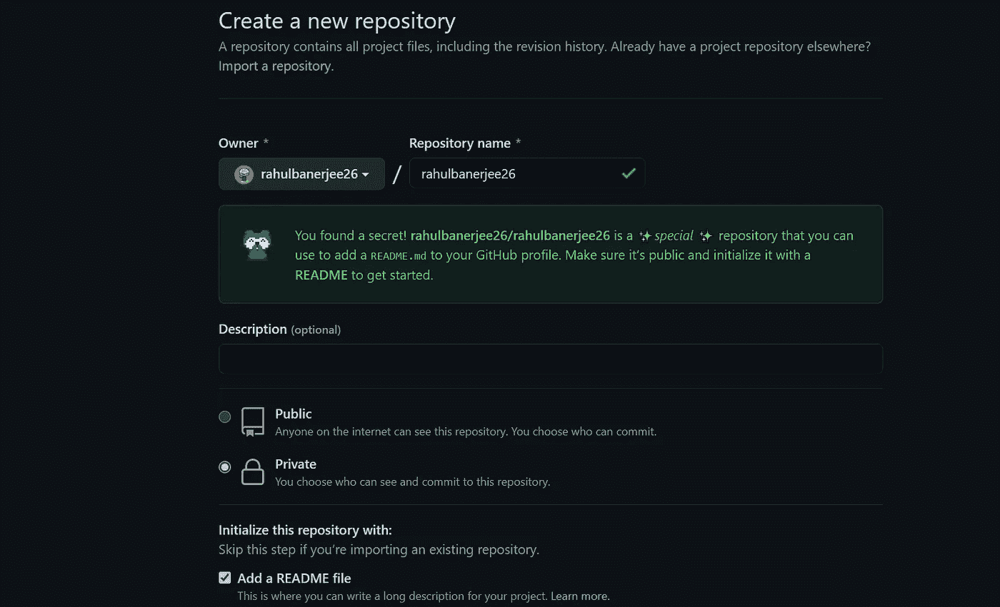

# 如何使用此 web 应用程序创建 GitHub 个人资料自述文件

> 原文：<https://towardsdatascience.com/a-free-tool-to-take-your-github-profile-to-the-next-level-dd877a304d74?source=collection_archive---------14----------------------->

## 一个简单的 web 应用程序和大约 15 分钟的时间可以让你的 GitHub 个人资料脱颖而出。本文还包含一系列资源和教程，可以让你的 GitHub About Me/Read Me 看起来更漂亮😍


克拉克·蒂布斯在 [Unsplash](https://unsplash.com/s/photos/portfolio?utm_source=unsplash&utm_medium=referral&utm_content=creditCopyText) 上拍摄的照片

你可能已经在 GitHub 上看到了用一个很酷的 ReadMe 特性解释“秘密”回购的文章，但是推迟了实际创建它。我制作了[一个应用程序来帮你完成大部分工作](https://share.streamlit.io/rahulbanerjee26/githubaboutmegenerator/main/__init__.py)😃

# 目录

1.  创建关于我的“秘密”回购
2.  GitHub 关于我/个人资料自述文件生成器
3.  表情符号和 GIFS
4.  访客徽章
5.  Github 统计
6.  最新的博客帖子
7.  瓦卡提时间统计
8.  社交图标
9.  自述文件的灵感来源
10.  资源
11.  结论

# 创建“秘密”回购🔓

*   转到[https://github.com/new](https://github.com/new)创建一个新的 GitHub 库
*   将您的 GitHub 用户名设置为存储库名称。我的 GitHub 用户名是 rahulbanerjee26，因此我的 repo 名也应该是 rahulbanerjee26



新回购截图

> 我想这已经不是秘密了

*   选中该框以添加自述文件
*   在你做改变的时候，暂时保密。一旦完成，我们将把它公开


初始自述文件的屏幕截图

# Github 关于我/个人资料自述文件生成器

## 回购:[https://github.com/rahulbanerjee26/githubAboutMeGenerator](https://github.com/rahulbanerjee26/githubAboutMeGenerator)


作者制作的工具截屏

我使用 streamlit 创建了一个简单的 web 应用程序，它可以接受输入并为您生成一个非常酷的自述文件。

[https://share . streamlit . io/rahulbanerjee 26/githubaboutmegenerator/main/_ _ init _ _。py](https://share.streamlit.io/rahulbanerjee26/githubaboutmegenerator/main/__init__.py)

你所需要做的就是输入你的名字，社交账号，技能，并回答关于你正在学习和工作的问题，它会为你生成自述文件。

## 特征

*   gif
*   社交图标
*   技能图标
*   访客徽章
*   Github 统计
*   瓦卡提时间统计
*   。yml 文件来显示订阅源中的博客文章
*   能够在自述文件的开头添加图像横幅
*   用实时更新编辑降价的编辑器
*   随机笑话卡

除了创建秘密回购和设置工作流之外，该工具基本上完成了本文中提到的所有工作。在不久的将来，我还计划在 READMEs 中加入更多的设计。

> 如果您喜欢该工具，请考虑“主演”回购:)

# 表情符号和 gif💯

下面是 Markdown 中表情符号的一般语法

```
:emojiName:
```

这类似于你在 Medium 的文本编辑器中使用表情符号。你可以在这里找到大量的表情符号。若要使用表情符号，请点按表情符号并使用它的一个短代码。

要使用 gif，请执行以下操作

*   下载 gif
*   上传到你的秘密回购
*   点击上传的文件，并将 URL 复制到其中
*   使用图像标签

```

```

你可以在这里找到一些[很酷的 gifs】](https://gifer.com/en/)

```
# Hello World 
Hi! My name is Rahul. Thank You for taking the time to view my GitHub Profile :smile:
```

# 访客徽章📛

## 网址:【https://visitor-badge.glitch.me/ 

## 回购:[https://github.com/jwenjian/visitor-badge](https://github.com/jwenjian/visitor-badge)

只需复制并粘贴以下命令

```

```

将末尾的 page.id 替换为唯一的名称，如 your_user_id.your_repo_name。在我的例子中，它看起来像这样

```
)
```

每当您查看/编辑您的自述文件时，徽章计数都会增加查看次数，因此我建议您在公开您的报告之前添加一个数字或一些独特的东西，以将查看次数初始化为 0

# GitHub 统计📊

## 回购:[https://github.com/anuraghazra/github-readme-stats](https://github.com/anuraghazra/github-readme-stats)


作者截图

```
## My GitHub Stats 📊<a href="[https://github.com/anuraghazra/github-readme-stats](https://github.com/anuraghazra/github-readme-stats)">
  </a>
<a href="[https://github.com/anuraghazra/convoychat](https://github.com/anuraghazra/convoychat)">
  
</a>
```

替换' **api 后的文本？usermame '** 与您的 GitHub 用户名。

# 最新的博客帖子📮

## 回购:[https://github.com/gautamkrishnar/blog-post-workflow](https://github.com/gautamkrishnar/blog-post-workflow)

*   将以下内容添加到您的自述文件中

```
**# Blog posts**
<!-- BLOG-POST-LIST:START -->
<!-- BLOG-POST-LIST:END -->
```

*   创建一个文件夹。 **github** ，在里面创建另一个名为 **workflows** 的文件夹，在里面创建一个名为**blog-post-workflow . yml .**实质上创建**。github/workflows/blog-post-workflow . yml .**如果您在 Github 中创建新文件时将其粘贴为文件，它会为您创建文件夹。
*   在里面。yml 文件，粘贴以下内容

```
name: Latest blog post workflow
on:
  schedule: # Run workflow automatically
    - cron: '0 * * * *' # Runs every hour, on the hour
  workflow_dispatch: # Run workflow manually (without waiting for the cron to be called), through the Github Actions Workflow page directly
jobs:
  update-readme-with-blog:
    name: Update this repo's README with latest blog posts
    runs-on: ubuntu-latest
    steps:
      - uses: actions/checkout@v2
      - uses: gautamkrishnar/blog-post-workflow@master
        with:
          feed_list: "[https://www.realpythonproject.com/feed/](https://www.realpythonproject.com)"
```

*   将**‘feed _ list’**的值替换为博客 feed 的 URL。您可以输入多个 URL，用逗号分隔。你的媒体提要是[https://medium.com/feed/@](https://medium.com/feed/@rahul1999)用户名
*   保存文件并单击操作


作者截图

*   您应该会在左侧栏中看到您的新工作流。点击它，然后点击运行工作流。给它几秒钟
*   一旦您看到工作流已成功执行的消息，请转到您的自述文件，您应该会看到您的博客帖子。如果你看不到它，就等一分钟。

# 瓦卡时间统计💻

## 回购:【https://github.com/anuraghazra/github-readme-stats】T2


作者截图

首先，你需要确保你的 Wakatime 数据是公开的

*   在右上角点击您的个人资料图标，然后点击设置
*   确保用户名旁边的文本框中有一个值
*   选中以下复选框:'**公开显示照片'，'公开显示代码时间'，'公开显示语言，编辑器，操作系统，类别'**
*   在**‘公开显示代码时间’旁边的下拉列表中，**选择**‘过去 7 天’**如果您有免费版本，下拉列表中的其他选项将不起作用
*   点击保存

键入以下代码

```
## My Wakatime Stats ⌚
<a href="[https://github.com/anuraghazra/github-readme-stats](https://github.com/anuraghazra/github-readme-stats)">
  https://github-readme-stats.vercel.app/api/wakatime?username=[**@rahulbanerjee26**](http://twitter.com/rahulbanerjee26)&compact=True"/>
</a>
```

用您的 Wakatime 用户名替换 **src** 后的粗体文本。您可能需要在您的用户名前加一个“@”来使卡片正确显示。

# 社交图标📲

包含社交图标类似于处理图像或 gif。您可以下载图标并将其保存在 repo 中，或者提供图标的外部 URL。

```
[
```

您可以访问[免版税图标，无需在此注明](https://uxwing.com/)

# 自述文件的灵感来源👏

查看我的自述

<https://github.com/rahulbanerjee26>  

一些很酷的读物的合集

<https://github.com/abhisheknaiidu/awesome-github-profile-readme>  

# 资源

*   [不需要任何属性的免版税图标](https://uxwing.com/)
*   [免费图标，必填属性](https://icons8.com/)
*   [GitHub 回购图标](https://github.com/rahulbanerjee26/githubAboutMeGenerator/tree/main/icons)
*   [Gifs](https://gifer.com/en)
*   [表情符号](https://emojipedia.org/emoji/)

# 结论

我希望这篇文章对你有所帮助。一个好的关于我的页面绝对可以让你脱颖而出。在评论中分享您的个人资料:)

我最近用 WordPress 创建了一个博客，如果你能看看的话，我会很高兴的😃

  

在 LinkedIn 上与我联系

<https://www.linkedin.com/in/rahulbanerjee2699/>  

*原载于 2021 年 2 月 27 日*[*【http://www.realpythonproject.com】*](https://www.realpythonproject.com/a-free-tool-to-take-your-github-profile-to-the-next-level/)*。*