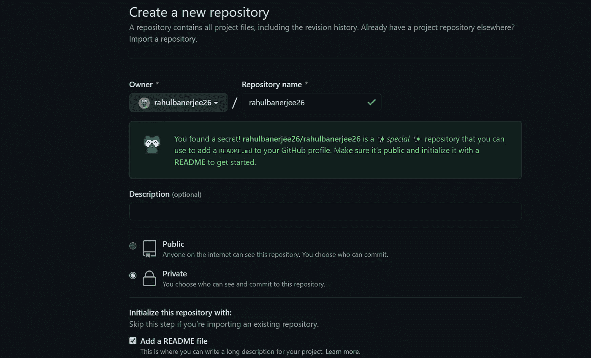
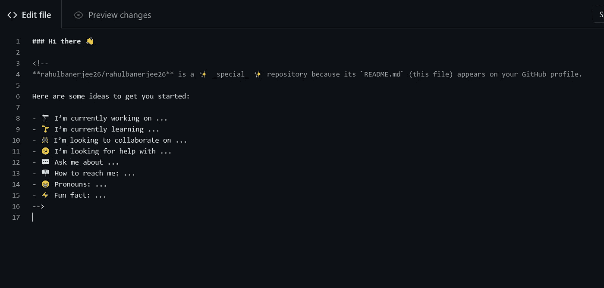
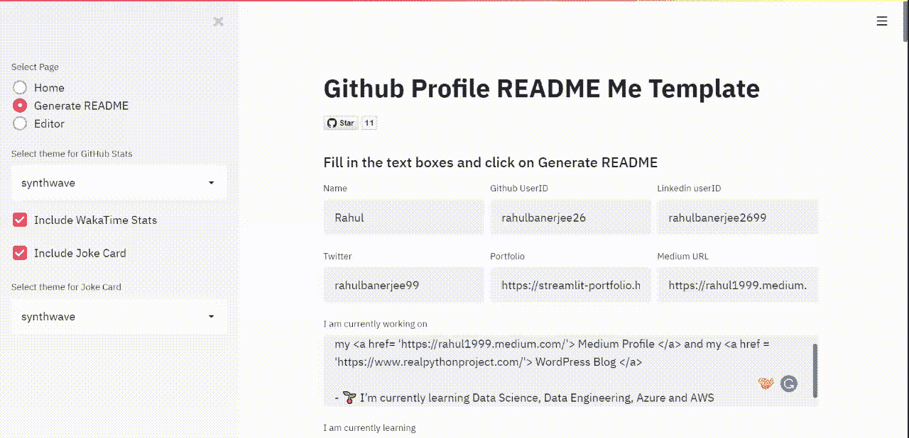
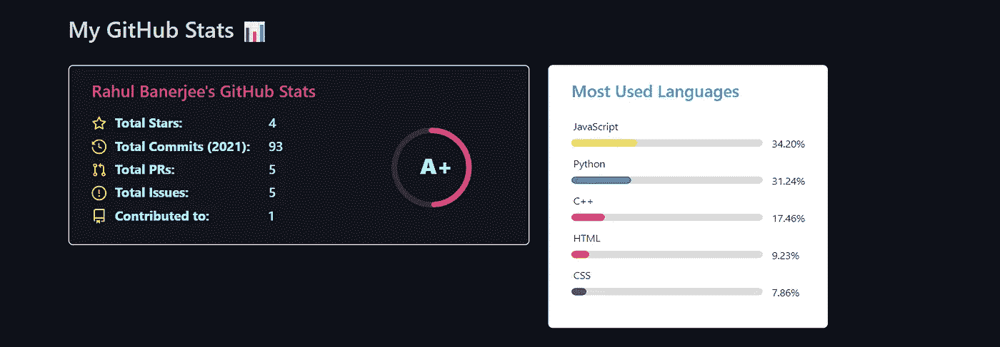
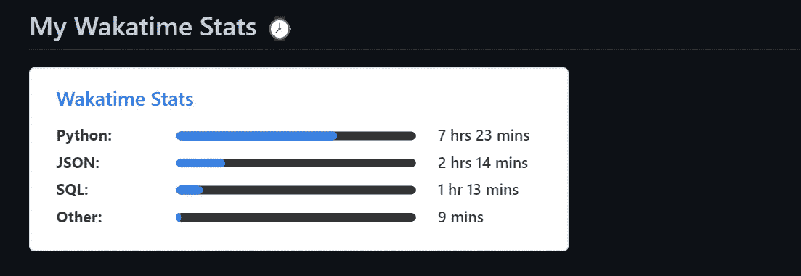

# 如何使用此 web 应用程序创建 GitHub 个人资料自述文件

> 原文：<https://towardsdatascience.com/a-free-tool-to-take-your-github-profile-to-the-next-level-dd877a304d74?source=collection_archive---------14----------------------->

## 一个简单的 web 应用程序和大约 15 分钟的时间可以让你的 GitHub 个人资料脱颖而出。本文还包含一系列资源和教程，可以让你的 GitHub About Me/Read Me 看起来更漂亮😍


克拉克·蒂布斯在 [Unsplash](https://unsplash.com/s/photos/portfolio?utm_source=unsplash&utm_medium=referral&utm_content=creditCopyText) 上拍摄的照片

你可能已经在 GitHub 上看到了用一个很酷的 ReadMe 特性解释“秘密”回购的文章，但是推迟了实际创建它。我制作了[一个应用程序来帮你完成大部分工作](https://share.streamlit.io/rahulbanerjee26/githubaboutmegenerator/main/__init__.py)😃

# 目录

1.  创建关于我的“秘密”回购
2.  GitHub 关于我/个人资料自述文件生成器
3.  表情符号和 GIFS
4.  访客徽章
5.  Github 统计
6.  最新的博客帖子
7.  瓦卡提时间统计
8.  社交图标
9.  自述文件的灵感来源
10.  资源
11.  结论

# 创建“秘密”回购🔓

*   转到[https://github.com/new](https://github.com/new)创建一个新的 GitHub 库
*   将您的 GitHub 用户名设置为存储库名称。我的 GitHub 用户名是 rahulbanerjee26，因此我的 repo 名也应该是 rahulbanerjee26



新回购截图

> 我想这已经不是秘密了

*   选中该框以添加自述文件
*   在你做改变的时候，暂时保密。一旦完成，我们将把它公开



初始自述文件的屏幕截图

# Github 关于我/个人资料自述文件生成器

## 回购:[https://github.com/rahulbanerjee26/githubAboutMeGenerator](https://github.com/rahulbanerjee26/githubAboutMeGenerator)



作者制作的工具截屏

我使用 streamlit 创建了一个简单的 web 应用程序，它可以接受输入并为您生成一个非常酷的自述文件。

[https://share . streamlit . io/rahulbanerjee 26/githubaboutmegenerator/main/_ _ init _ _。py](https://share.streamlit.io/rahulbanerjee26/githubaboutmegenerator/main/__init__.py)

你所需要做的就是输入你的名字，社交账号，技能，并回答关于你正在学习和工作的问题，它会为你生成自述文件。

## 特征

*   gif
*   社交图标
*   技能图标
*   访客徽章
*   Github 统计
*   瓦卡提时间统计
*   。yml 文件来显示订阅源中的博客文章
*   能够在自述文件的开头添加图像横幅
*   用实时更新编辑降价的编辑器
*   随机笑话卡

除了创建秘密回购和设置工作流之外，该工具基本上完成了本文中提到的所有工作。在不久的将来，我还计划在 READMEs 中加入更多的设计。

> 如果您喜欢该工具，请考虑“主演”回购:)

# 表情符号和 gif💯

下面是 Markdown 中表情符号的一般语法

```
:emojiName:
```

这类似于你在 Medium 的文本编辑器中使用表情符号。你可以在这里找到大量的表情符号。若要使用表情符号，请点按表情符号并使用它的一个短代码。

要使用 gif，请执行以下操作

*   下载 gif
*   上传到你的秘密回购
*   点击上传的文件，并将 URL 复制到其中
*   使用图像标签

```

```

你可以在这里找到一些[很酷的 gifs】](https://gifer.com/en/)

```
# Hello World 
Hi! My name is Rahul. Thank You for taking the time to view my GitHub Profile :smile:
```

# 访客徽章📛

## 网址:【https://visitor-badge.glitch.me/ 

## 回购:[https://github.com/jwenjian/visitor-badge](https://github.com/jwenjian/visitor-badge)

只需复制并粘贴以下命令

```

```

将末尾的 page.id 替换为唯一的名称，如 your_user_id.your_repo_name。在我的例子中，它看起来像这样

```
)
```

每当您查看/编辑您的自述文件时，徽章计数都会增加查看次数，因此我建议您在公开您的报告之前添加一个数字或一些独特的东西，以将查看次数初始化为 0

# GitHub 统计📊

## 回购:[https://github.com/anuraghazra/github-readme-stats](https://github.com/anuraghazra/github-readme-stats)



作者截图

```
## My GitHub Stats 📊<a href="[https://github.com/anuraghazra/github-readme-stats](https://github.com/anuraghazra/github-readme-stats)">
  </a>
<a href="[https://github.com/anuraghazra/convoychat](https://github.com/anuraghazra/convoychat)">
  
</a>
```

替换' **api 后的文本？usermame '** 与您的 GitHub 用户名。

# 最新的博客帖子📮

## 回购:[https://github.com/gautamkrishnar/blog-post-workflow](https://github.com/gautamkrishnar/blog-post-workflow)

*   将以下内容添加到您的自述文件中

```
**# Blog posts**
<!-- BLOG-POST-LIST:START -->
<!-- BLOG-POST-LIST:END -->
```

*   创建一个文件夹。 **github** ，在里面创建另一个名为 **workflows** 的文件夹，在里面创建一个名为**blog-post-workflow . yml .**实质上创建**。github/workflows/blog-post-workflow . yml .**如果您在 Github 中创建新文件时将其粘贴为文件，它会为您创建文件夹。
*   在里面。yml 文件，粘贴以下内容

```
name: Latest blog post workflow
on:
  schedule: # Run workflow automatically
    - cron: '0 * * * *' # Runs every hour, on the hour
  workflow_dispatch: # Run workflow manually (without waiting for the cron to be called), through the Github Actions Workflow page directly
jobs:
  update-readme-with-blog:
    name: Update this repo's README with latest blog posts
    runs-on: ubuntu-latest
    steps:
      - uses: actions/checkout@v2
      - uses: gautamkrishnar/blog-post-workflow@master
        with:
          feed_list: "[https://www.realpythonproject.com/feed/](https://www.realpythonproject.com)"
```

*   将**‘feed _ list’**的值替换为博客 feed 的 URL。您可以输入多个 URL，用逗号分隔。你的媒体提要是[https://medium.com/feed/@](https://medium.com/feed/@rahul1999)用户名
*   保存文件并单击操作


作者截图

*   您应该会在左侧栏中看到您的新工作流。点击它，然后点击运行工作流。给它几秒钟
*   一旦您看到工作流已成功执行的消息，请转到您的自述文件，您应该会看到您的博客帖子。如果你看不到它，就等一分钟。

# 瓦卡时间统计💻

## 回购:【https://github.com/anuraghazra/github-readme-stats】T2



作者截图

首先，你需要确保你的 Wakatime 数据是公开的

*   在右上角点击您的个人资料图标，然后点击设置
*   确保用户名旁边的文本框中有一个值
*   选中以下复选框:'**公开显示照片'，'公开显示代码时间'，'公开显示语言，编辑器，操作系统，类别'**
*   在**‘公开显示代码时间’旁边的下拉列表中，**选择**‘过去 7 天’**如果您有免费版本，下拉列表中的其他选项将不起作用
*   点击保存

键入以下代码

```
## My Wakatime Stats ⌚
<a href="[https://github.com/anuraghazra/github-readme-stats](https://github.com/anuraghazra/github-readme-stats)">
  https://github-readme-stats.vercel.app/api/wakatime?username=[**@rahulbanerjee26**](http://twitter.com/rahulbanerjee26)&compact=True"/>
</a>
```

用您的 Wakatime 用户名替换 **src** 后的粗体文本。您可能需要在您的用户名前加一个“@”来使卡片正确显示。

# 社交图标📲

包含社交图标类似于处理图像或 gif。您可以下载图标并将其保存在 repo 中，或者提供图标的外部 URL。

```
[
```

您可以访问[免版税图标，无需在此注明](https://uxwing.com/)

# 自述文件的灵感来源👏

查看我的自述

[](https://github.com/rahulbanerjee26) [## rahulbanerjee26 —概述

### 计算机工程学生@UofT 三月四月五月六月七月八月九月十月十一月十二月一月二月一月三日 Fri 创建了 3 个提交在 1…

github.com](https://github.com/rahulbanerjee26) 

一些很酷的读物的合集

[](https://github.com/abhisheknaiidu/awesome-github-profile-readme) [## abhisheknaiidu/awesome-github-个人资料-自述文件

### 代码模式👨🏽‍💻随时欢迎投稿！请先阅读投稿指南。在某种程度上…

github.com](https://github.com/abhisheknaiidu/awesome-github-profile-readme) 

# 资源

*   [不需要任何属性的免版税图标](https://uxwing.com/)
*   [免费图标，必填属性](https://icons8.com/)
*   [GitHub 回购图标](https://github.com/rahulbanerjee26/githubAboutMeGenerator/tree/main/icons)
*   [Gifs](https://gifer.com/en)
*   [表情符号](https://emojipedia.org/emoji/)

# 结论

我希望这篇文章对你有所帮助。一个好的关于我的页面绝对可以让你脱颖而出。在评论中分享您的个人资料:)

我最近用 WordPress 创建了一个博客，如果你能看看的话，我会很高兴的😃

 [## Python 项目教程-使用这些 Python 项目教程改进您的简历/作品集。

### 使用 Streamlit 共享部署您的机器学习 Web 应用程序在我以前的文章中，我谈到过构建一个…

realpythonproject.com](https://realpythonproject.com/) 

在 LinkedIn 上与我联系

[](https://www.linkedin.com/in/rahulbanerjee2699/) [## Rahul baner JEE——产品工程实习生——EY | LinkedIn

### 查看 Rahul Banerjee 在世界上最大的职业社区 LinkedIn 上的个人资料。拉胡尔有 4 个工作列在他们的…

www.linkedin.com](https://www.linkedin.com/in/rahulbanerjee2699/) 

*原载于 2021 年 2 月 27 日*[*【http://www.realpythonproject.com】*](https://www.realpythonproject.com/a-free-tool-to-take-your-github-profile-to-the-next-level/)*。*