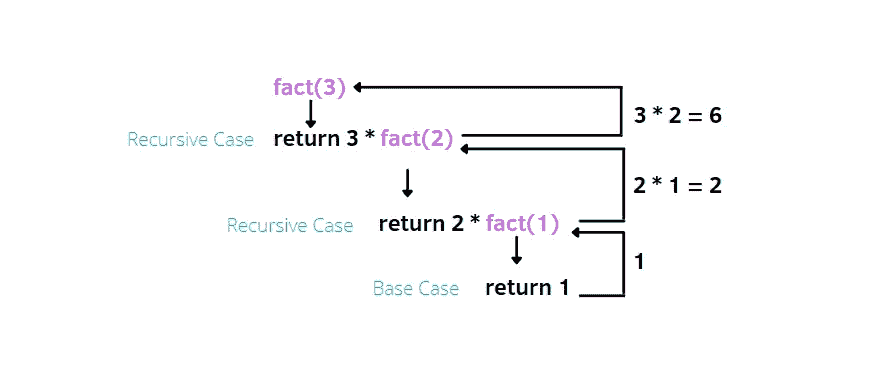
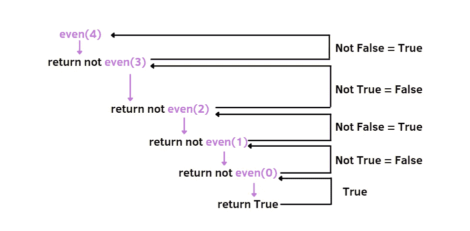

# 用 Python 编写递归函数的友好指南

> 原文：<https://towardsdatascience.com/a-friendly-guide-for-writing-recursive-functions-with-python-52441bd7ff5f?source=collection_archive---------14----------------------->

## 了解如何使用递归来优雅地编写代码


凯文·杨在 [Unsplash](https://unsplash.com/photos/Z5qD8T3wVvk) 上的照片

起初，如果解释得很糟糕，递归似乎是不可能学会的。我仍然记得第一次遇到它时，我觉得它很有挑战性。为了深入理解它，我需要做许多练习。

这很难，因为我的大脑本能地使用迭代来解决问题，比如 for 循环和 while。但是经过一些努力，我在做很多练习的同时，能够理解递归函数的基础。

在这篇文章中，我想向你介绍什么是递归，并用插图展示递归函数的例子，这肯定有助于以更有效的方式理解这个主题。

# 递归函数

从单词“recursive”中你可以直观地看出，当函数**调用自身**时，它就是递归的。因此，同一个函数被调用一次或多次。在编写任何递归函数之前，您需要考虑两种情况:

1.  **基础案例**是解决问题时需要考虑的最简单的案例。这也导致了递归的结束。
2.  **递归案例**包括解决问题的一般解法，使用递归函数。

例如，让我们尝试计算一个正数的阶乘:

在这种情况下，我们可以确定两种不同的情况:

**基本情况**:如果数字等于 0 或 1，函数返回 1

**递归情况**:我们考虑剩余的情况，其中数字大于 1。

比如我们算 3 的时候！，有一些步骤可以解决这个简单的问题:

1.  呼叫`fact(3)`
2.  `fact(3)`返回`3*fact(2)`，这里要调用的新函数是`fact(2)`
3.  `fact(2)`返回`2*fact(1)`，这里要调用的新函数是`fact(1)`
4.  `fact(1)`返回`1`
5.  从第 4 步**回到第 1 步**解决问题



作者插图。递归函数计算 3！= 6

# 其他示例

让我们试试其他三个例子，看看你是否真正理解了递归函数的工作原理。

1.  写一个递归函数，当且仅当数字是偶数时返回 True

我们需要再次确定这两种情况:

**基本情况**:如果数字等于 0，则数字为偶数

**递归情况**:我们考虑所有情况，n=0 除外。例如，当 n=4 时。



作者插图。当 n=4 时。

2.**写一个递归函数，对一个列表的元素求和，这个列表至少需要有一个元素**

这两种不同的情况是:

**基本情况**:如果列表中只有一个元素，函数返回列表的第一个元素

**递归情况**:在剩下的情况下，我们使用递归函数。每次都删除列表中的第一个。

递归调用可以通过显示以下步骤来解释:

```
sum_list([1,2,3,4])        #1st call with [1,2,3,4] 
1 + sum_list([2,3,4])      #2nd call with [2,3,4]
1 + 2 + sum_list([3,4])    #3rd call with [3,4]
1 + 2 + 3 + sum_list([4])  #4th call with [4]1 + 2 + 3 + 4              #return from 4th call with 
                           sum_list([4])=4
1 + 2 + 7                  #return from 3rd call 
1 + 9                      #return from 2nd call 
10                         #return from 1st call
```

3.给定一个列表(至少有一个元素)，写一个递归函数，只返回偶数元素

这一次，我们可以发现:

**基础案例**:如果只有一个元素，如果元素是偶数我们返回列表，否则返回[]。

**递归情况**:在剩下的情况下，应用递归功能。和以前一样，我们每次在递归函数中从列表中删除一个元素。

同样，我们可以看到递归调用被分成不同的步骤:

```
even_elements([0,1,2,3])       #1st call with [0,1,2,3]
[0]+even_elements([1,2,3])     #2nd call with [1,2,3] 
[0]+[]+even_elements([2,3])    #3rd call with [2,3]
[0]+[]+[2]+even_elements([3])  #4th call with [3][0]+[]+[2]+[]                  #return from 4th call with 
                               even_elements([3])=[]
[0]+[]+[2]                     #return from 3rd call
[0]+[2]                        #return from 2nd call
[0,2]                          #return from 1st call 
```

# 最终想法:

递归函数的概述终于结束了。现在，您应该对什么是递归以及如何编写递归函数有了更好的了解。它可以提供一些优势。首先，递归将一个复杂的任务分解成简单的子任务。此外，它适合处理 Python 数据结构，如堆栈、队列和链表。但是你也应该知道，这种类型的解决方案**并不适用于所有问题**。每个递归调用都等待下一个递归调用，然后，有时迭代会花费更多的时间。你应该比较迭代的时间和递归函数的时间来确定。无论如何，递归函数在数据科学领域有众所周知的应用，例如递归神经网络、决策树、随机树和隔离树，其中递归是使它们工作的必要条件。我希望这篇教程对你有用。感谢阅读。祝您愉快！

你喜欢我的文章吗？ [*成为会员*](https://eugenia-anello.medium.com/membership) *每天无限获取数据科学新帖！这是一种间接的支持我的方式，不会给你带来任何额外的费用。如果您已经是会员，* [*订阅*](https://eugenia-anello.medium.com/subscribe) *每当我发布新的数据科学和 python 指南时，您都可以收到电子邮件！*