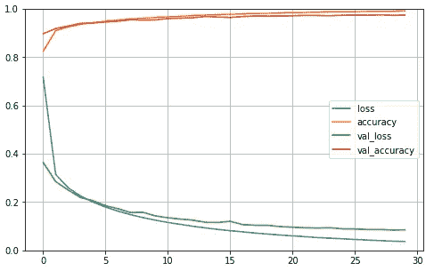

# 用人工神经网络友好地介绍计算机视觉

> 原文：<https://towardsdatascience.com/a-friendly-introduction-to-computer-vision-with-artificial-neural-networks-d2a38acc047c?source=collection_archive---------37----------------------->

## Keras 让计算机视觉变得简单

## 基于 Keras 和人工神经网络的手写数字识别

[梁杰森](https://unsplash.com/@ninjason?utm_source=medium&utm_medium=referral)在 [Unsplash](https://unsplash.com?utm_source=medium&utm_medium=referral) 上的照片

# 介绍

如果你正在寻求在高层次上理解人工神经网络，并看到它们在计算机视觉中的实现，这篇文章就是为你准备的。

**计算机视觉**:首先，我认为通过解释一下什么是计算机视觉来介绍这篇文章是合适的。

> 计算机视觉可以被广泛认为是计算机解释数字图像或视频的能力。

你可能已经在社交媒体上看到了人脸识别软件和自动照片标签的应用。它通常与其他机器学习任务结合使用。例如，它与文本到语音机器学习一起使用，为盲人提供音频描述，帮助他们理解视频内容。

# **挑战**

我希望带你通过一个入门级的计算机视觉挑战。使用神经网络，我们将建立一个程序来解释手写数字。

这项挑战是一项公开的[卡格尔竞赛](https://www.kaggle.com/c/digit-recognizer/overview)。因此，如果你是计算机视觉的新手，我鼓励你参加比赛，建立你自己的网络并提交你的分数。对于任何类型的机器学习，阅读加上实践从长远来看都会导致精通。

# 先决条件

我假设读者已经对机器学习这个概念有所了解。你应该了解机器学习过程是如何工作的，训练和测试一个模型意味着什么，以及它们通常是如何评估的。如果你对机器学习一点都不熟悉，[请阅读这篇文章作为开始](/predicting-house-prices-with-machine-learning-62d5bcd0d68f)。

# **数据**

我们收到了两个来自 MNIST(现代国家标准与技术研究所)的 CSV 文件，其中包含数字格式的手写数字。数字(从 0 到 9)由大小为 784 的一维数组表示。这实际上是一个 28 乘 28 像素的展平图像。

阵列中的每个位置代表一个像素，为该像素分配 0 到 255 范围内的整数来表示该像素的亮度。

正如 Kaggle 机器学习任务的常见情况一样，其中一个文件是我们的训练数据，另一个是我们的测试数据。训练数据被标记，而测试数据没有被标记。按照机器学习的最佳实践，我进一步将训练数据分成训练和验证集。

[更多数据请点击这里](https://www.kaggle.com/c/digit-recognizer/data)。

作者图片:Kaggle 提供的 MNIST 训练数据中的前 10 个条目

# **工具**

我们将使用带有 Tensorflow 的 [Keras API](https://keras.io/api/) 作为后端。有很多计算机视觉的框架，但是我发现 Keras 对初学者非常友好，代码也很容易解释和实现。

# **什么是神经网络？**

我不会在这里详细讨论神经网络，但是我会提供一个简单的直觉。

许多书籍使用人类脑细胞的类比作为描述和介绍神经网络的方式。在此之后，他们经常用大量的数学证明来淹没读者。在早期，我发现这种方法令人困惑，因为我无法将数学与类比相协调。我将采取一种稍微不同的方法，试图通过省略类比来揭开人工神经网络的神秘面纱。

我喜欢把神经网络想象成具有难以置信的灵活性的数学函数。正因为如此，它们可以识别数据中的模式，而更基本的功能却不能。

> **注**:数学函数就是接受输入，执行运算，然后返回输出的东西。

人工神经网络的灵活性可以通过查看以下属性来理解:

**层**:神经网络的基本结构是三层:输入层、隐层和输出层。深度神经网络有两个以上的隐藏层。增加更多的层可以在一定程度上增加网络的灵活性。

**架构**:人工神经网络的架构是指输入层、隐含层和输出层相互连接的方式。有许多可用的神经网络体系结构，每一种都适用于特定的任务。例如，递归神经网络适用于预测文本任务。

更多关于神经网络架构的信息请点击。

**学习**:人工神经网络通过反向传播的过程进行学习。这是网络中的权重在几次迭代(时期)中被调整，以最小化网络预测值和真实标签值之间的误差。一般来说，权重越大，预测复杂模式的灵活性越大。

用于调整权重和最小化误差的主要学习算法是[随机梯度下降](/stochastic-gradient-descent-clearly-explained-53d239905d31)。

**激活函数**:这些是非线性数学函数，使神经网络能够检测模式。它们被设置在隐藏层和输出层；它们的类型取决于预测任务。例如，二进制标签分类要求激活函数是 sigmoid 函数(类似于逻辑回归)。

# **架构&参数**

对于我们的数字识别任务，我构建了两个简单的人工神经网络架构。它们具有以下架构和参数:

**Layers** :一个输入层，定义为大小为 784 的一维数组。两个隐藏层，第一层有 300 个神经元，第二层有 100 个神经元。十个神经元的输出层，用于预测十个手写数字中的任何一个。

**激活函数**:隐含层神经元的激活函数为 ReLU，一般容易训练。输出层激活函数是 Softmax。这样做的理由是，我们有一个多类分类问题。

**损失函数**:这是我们训练网络时需要最小化的目标函数。对于我们的任务，我们将使用“稀疏分类交叉熵”。这是最合适的，因为目标变量(标签)是 0 到 9，每个标签都是唯一的。随机梯度下降是用于最小化该损失函数的算法。

**时期**:这是指我们将在网络上执行的反向传播的迭代次数。对于每个体系结构，我将任意将其设置为 30。

# 网络 1:序列神经网络

这是 Keras 中可以构建的最简单的人工神经网络。该结构由从输入到输出依次相互连接的层组成。

作者图片:序列神经网络模式

**构建网络:** Keras 为顺序神经网络提供了一个模板。从那里简单地添加你想要的层是非常直观的。summary()函数为您提供网络架构的详细信息，包括每层中的权重数。

总结提供了有关网络架构的信息。我们的网络中有 266，610 个参数(权重)。

**编译**:只用几行代码就实现了。

**试衣**:试衣也…

**结果**:在第 30 个历元，序列神经网络对训练数据的准确率为 99.82%，对验证数据的准确率为 97.64%。考虑到最小的超参数调整，这是一个不错的性能。

> **注意—** 预计我们的网络在验证数据上的表现稍差，但当它表现明显更差时，我们应该担心过拟合。

按作者分类的图像:x 轴上的纪元，y 轴上的准确度分数

# 网络 2:深度和广度神经网络

这种网络的体系结构使其能够通过将输入层传递到整个网络并直接传递到输出层来学习复杂和简单的模式。

图片作者:深度和广度神经网络

构建:Keras 没有为深度和广度网络提供模板，所以我们必须手动构建。

> **注意**——编译和拟合我们的深度和广度网络的代码与我们的顺序网络完全相同

与我们的序列版本相比，我们的深度和广度神经网络中有额外的 8，850 个参数。

**结果:**在第 30 代，我们的深度和广度网络在训练集上的准确率为 99.69%，在验证集上的准确率为 97.62%。这与顺序网络的性能相当。你认为这可能是为什么？

# **测试提交**

序列神经网络在测试数据上取得了 97.21%的准确率。这使得该模型在 Kaggle 排行榜上名列前 70%。

在这一点上，有许多事情你可以尝试改进。例如，卷积神经网络架构可能会导致更高的精度。

试着在每一层的神经元数量和时期数量上做些尝试，看看是否会得到更好的分数。和往常一样，您可以通过我的 GitHub 页面使用这些代码。

谢谢大家！

<https://github.com/john-adeojo/MNIST-Digit-Classification>  <https://www.linkedin.com/in/john-adeojo/> 