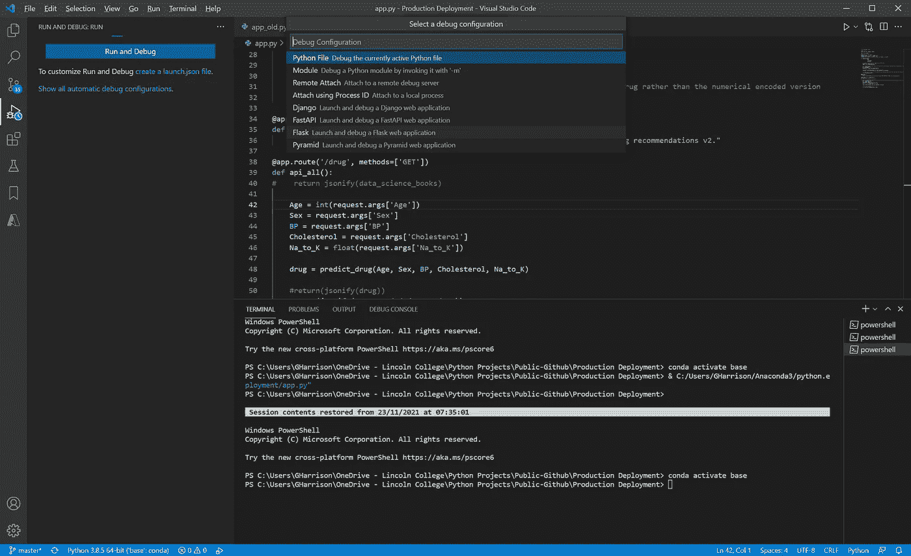
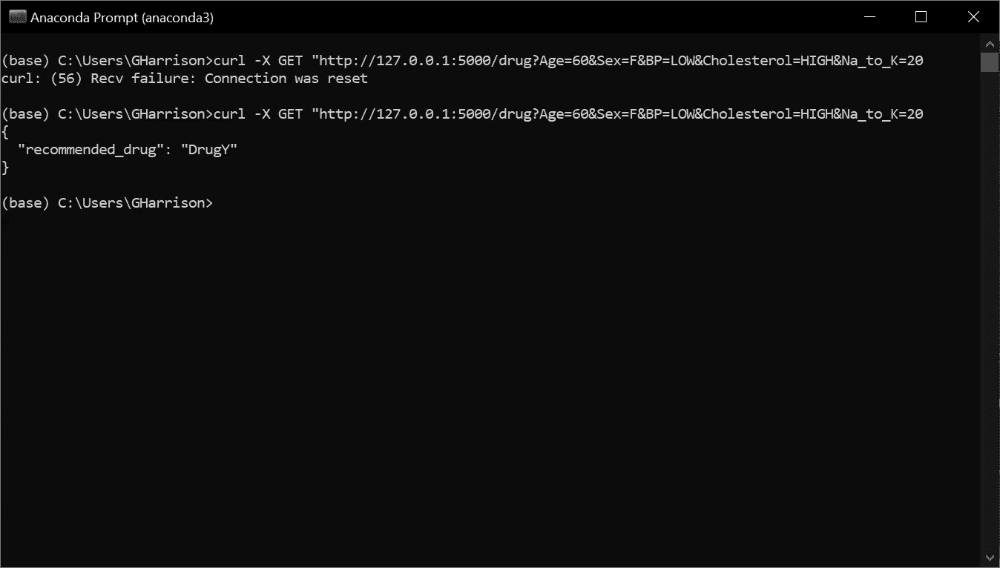
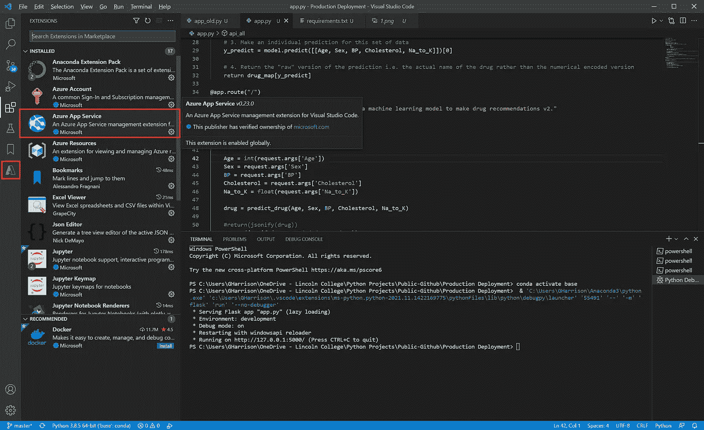
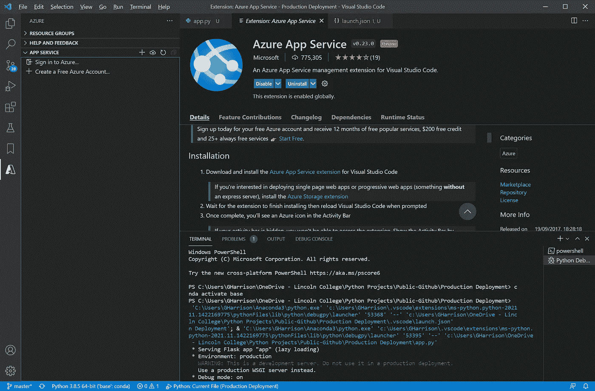
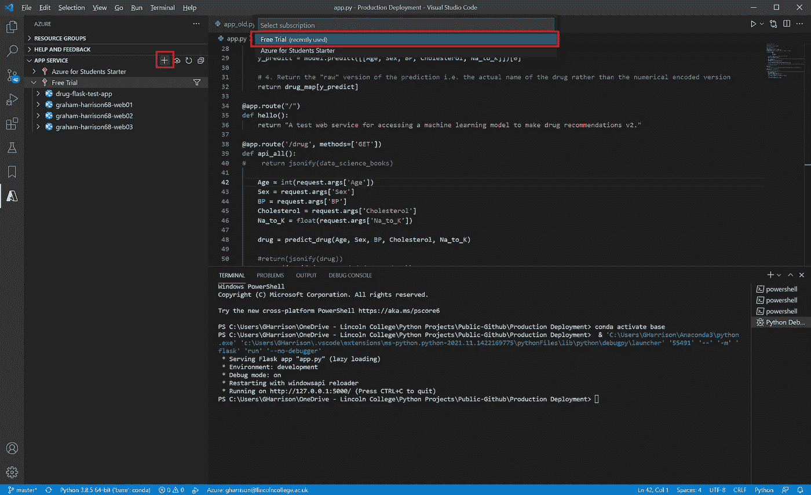
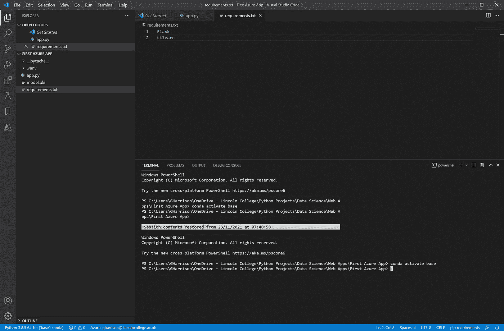
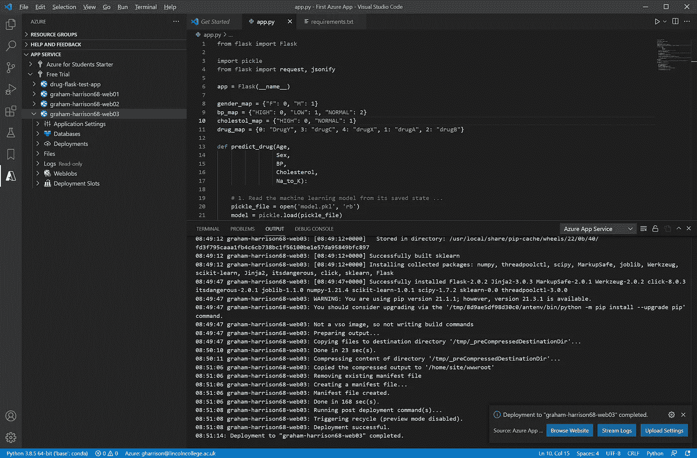
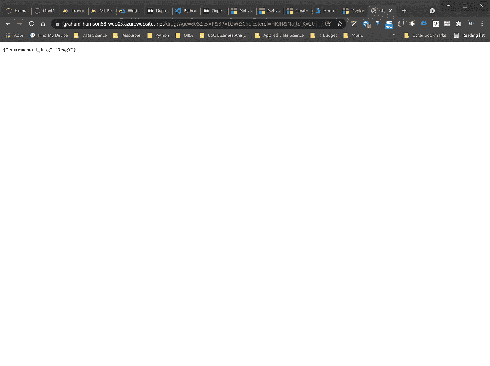
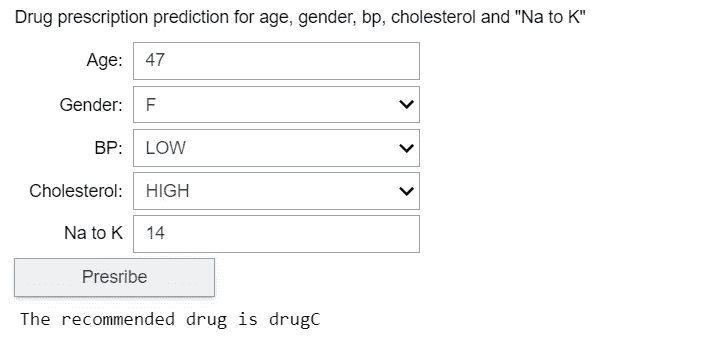

# 将机器学习算法完全端到端部署到实际生产环境中

> 原文：<https://towardsdatascience.com/a-full-end-to-end-deployment-of-a-machine-learning-algorithm-into-a-live-production-environment-3d9971ade188?source=collection_archive---------3----------------------->

## 如何使用 scikit-learn、pickle、Flask、Microsoft Azure 和 ipywidgets 将 Python 机器学习算法完全部署到真实的生产环境中


照片由 [Fotis Fotopoulos](https://unsplash.com/@ffstop?utm_source=unsplash&utm_medium=referral&utm_content=creditCopyText) 在 [Unsplash](https://unsplash.com/s/photos/python?utm_source=unsplash&utm_medium=referral&utm_content=creditCopyText) 上拍摄

# 介绍

2021 年 10 月，我撰写了一篇关于“将机器学习和数据科学项目部署为公共 Web 应用程序”的文章(参见[https://towards Data Science . com/Deploying-Machine-Learning-and-Data-Science-Projects-as-Public-we B- Applications-3abc 91088 c11](/deploying-machine-learning-and-data-science-projects-as-public-web-applications-3abc91088c11))。

在本文中，我探讨了如何使用 Voila、GitHub 和 mybinder 将 Jupyter 笔记本部署为公共可用的 web 应用程序。

文章发表后，我收到了读者的反馈，他们对如何进一步推动生产部署感兴趣，以探索如何将机器学习算法完全部署到真实的生产环境中，以便以平台无关的方式“消费”它，这导致了本文的想法…

# 第一步:开发机器学习算法

第一步是开发我们想要部署的机器学习算法。在现实世界中，这可能需要几周或几个月的开发时间，以及跨越数据科学管道步骤的大量迭代，但对于这个示例，我将开发一个基本的 ML 算法，因为本文的主要目的是找到一种方法来部署供“消费者”使用的算法。

我从 ka ggle([https://www.kaggle.com/prathamtripathi/drug-classification](https://www.kaggle.com/prathamtripathi/drug-classification))中选择了一个数据集，它是由作者以“CC0:公共领域”许可证创建的，这意味着它没有版权，可以不受限制地用于其他作品中(详见[https://creativecommons.org/publicdomain/zero/1.0/](https://creativecommons.org/publicdomain/zero/1.0/))。

开发预测性机器学习算法以在给定一系列患者标准的情况下对药物处方进行分类的 Python 代码如下

```
0.99 0.012247448713915901
```

在这一点上，我们可以看到，我们有一个经过训练的机器学习算法来预测药物处方，并且交叉验证(即折叠数据)已用于评估 99%的模型准确性。

到目前为止，一切顺利...

我们将把这个模型部署到生产环境中，虽然这是一个简单的例子，但我们不希望每次用户想要预测药物处方时都必须在真实环境中重新训练我们的模型，因此我们的下一步是使用`pickle`来保存我们训练好的模型的状态...

现在，每当我们想要使用训练好的模型时，我们只需要从`model.pkl`文件中重新加载它的状态，而不是重新执行训练步骤。

# 第二步:根据训练好的模型进行个人预测

我将在第二步做几个假设-

1.  机器学习算法的消费者要求对单个患者而不是一批患者进行预测。
2.  这些消费者希望使用类似文本的参数值(例如血压=“正常”或“高”)与算法进行交流，而不是像 0 和 1 这样的标签编码等价物。

因此，我们将从查看用作算法输入的所有标签编码分类特征的值开始…

```
Sex ['F', 'M'] [0, 1] 

BP ['HIGH', 'LOW', 'NORMAL'] [0, 1, 2] 

Cholesterol ['HIGH', 'NORMAL'] [0, 1] 

Drug ['DrugY', 'drugC', 'drugX', 'drugA', 'drugB'] [0, 3, 4, 1, 2]
```

现在我们有了一个列表，其中列出了数据中出现的每个分类特征的唯一值，以及由`LabelEncoder()`转换的相应数值。

有了这些知识，我们可以提供一组映射文本类值(例如“高”、“低”等)的字典。)转换成它们的编码等价物，然后开发一个简单的函数来进行如下的单独预测…

然后，可以通过调用该函数根据原始数据的值进行一些预测来验证该实现，这样我们就知道输出应该是什么…

```
'drugC'
```

```
'DrugY'
```

请注意，我们的`predict_drug`函数不需要训练模型，而是将之前由`pickle`保存其状态的模型“再水合”到`model.pkl`文件中，我们可以从输出中看到药物推荐的预测是正确的。

# 步骤 3:开发 Web 服务包装器

到目前为止，一切看起来都很好，但主要问题是:我们的机器学习算法的客户或消费者必须用 Python 编程语言编写，不仅如此，我们必须有能力改变和修改应用程序。

如果第三方应用程序想要使用和消费我们的算法，如果这个第三方应用程序不是用 Python 编写的，该怎么办？也许它是用 Java、C#、JavaScript 或其他非 Python 语言编写的。

这就是 web 服务的用武之地。web 服务是一个“包装器”,它使用 http GET 和 http PUT 命令接收来自客户端和消费者的请求，调用 Python 代码并将结果作为 HTML 响应返回。

这意味着客户端和调用者只需要能够制定 HTTP 请求，几乎所有的编程语言和环境都有办法做到这一点。

在 Python 世界中，有几种不同的方法可用，但我选择的是使用`flask`来构建我们的 web 服务包装器。

代码并不复杂，但要配置 VS 代码以使开发人员能够调试 flask 应用程序是一个挑战。如果您需要这一步的教程，请查看我的文章“如何在 VS 代码中调试 Flask 应用程序”，可以在这里找到—[https://towardsdatascience . com/How-to-Debug-Flask-Applications-in-VS-Code-c 65 c 9 BD bef 21](/how-to-debug-flask-applications-in-vs-code-c65c9bdbef21)。

以下是 web 服务的包装代码…

从 Anaconda Navigator 页面启动 VS 代码 IDE(或者通过启动 Anaconda 命令提示符并键入`code`)。这将使用 conda 基本环境启动 VS 代码，这是运行和调试 flask 应用程序所必需的。

通过点击“运行和调试”，然后选择“Flask 启动并调试 Flask web 应用程序”，可以从 VS 代码内部启动 web 服务



作者图片

如果一切都按计划进行，终端窗口中的最后一条消息应该是`Running on http://127.0.0.1:5000/ (Press CTRL+C to quit)`,这表明您的 flask web 应用程序已经启动并正在运行。

您现在应该使用这些方法之一来测试您的 web 服务

1.  打开网页浏览器，输入: [http://127.0.0.1:5000/drug？年龄=60 &性别=F &血压=低&胆固醇=高& Na_to_K=20](http://127.0.0.1:5000/drug?Age=60&Sex=F&BP=LOW&Cholesterol=HIGH&Na_to_K=20)
2.  打开 anaconda 命令提示符并输入:`curl -X GET "http://127.0.0.1:5000/drug?Age=60&Sex=F&BP=LOW&Cholesterol=HIGH&Na_to_K=20"`



作者图片

如果您想了解更多关于开发`flask`应用程序和 web 服务的信息，这些文章是一个很好的起点

*   [https://programminghistorian . org/en/lessons/creating-API-with-python-and-flask](https://programminghistorian.org/en/lessons/creating-apis-with-python-and-flask)
*   [https://code.visualstudio.com/docs/python/tutorial-flask](https://code.visualstudio.com/docs/python/tutorial-flask)

# 步骤 4:将 Web 服务部署到 Microsoft Azure

我们现在有一个预测机器学习算法，可以以 99%的准确率预测药物处方，我们有一个助手功能，可以进行个体预测，我们有一个 web 服务包装器，可以从浏览器或命令行调用这些组件。

然而，所有这些仍然只能从开发环境中调用。下一步是将一切都部署到云中，这样客户就可以通过公共互联网“消费”web 服务。

有许多不同的公共服务可用于 web 应用程序部署，包括-

*   Google—[https://cloud . Google . com/app engine/docs/standard/python 3/building-app/writing-web-service](https://cloud.google.com/appengine/docs/standard/python3/building-app/writing-web-service)
*   亚马逊网络服务—[https://medium . com/@ rodkey/deploying-a-flask-application-on-AWS-a 72 Daba 6 bb 80](https://medium.com/@rodkey/deploying-a-flask-application-on-aws-a72daba6bb80)
*   微软 Azure—[https://medium . com/@ nikovrdoljak/deploy-your-flask-app-on-Azure-in-3-easy-steps-B2 Fe 388 a 589 e](https://medium.com/@nikovrdoljak/deploy-your-flask-app-on-azure-in-3-easy-steps-b2fe388a589e)

我选择 Azure 是因为它是免费的(对于一个入门级的帐户)，易于使用，快速并且完全与 VS 代码集成，这是我最喜欢的开发环境。

## 步骤 4.1:将 Azure App 服务扩展添加到 VS 代码中

将任务切换成 VS 代码，进入“扩展”(Ctrl+Shft_X)，加入“Azure App Service”扩展。添加扩展后，你会在活动栏中看到一个新的 Azure 图标-



作者图片

## 步骤 4.1:创建 Azure 帐户

您必须有一个帐户才能开始部署到 Azure cloud，并且您必须在注册过程中提供信用卡详细信息。但是，除非您明确选择退出免费许可，否则不会向您收费。

你可以按照该页面上的说明进行操作—[https://azure.microsoft.com/en-gb/free/](https://azure.microsoft.com/en-gb/free/)通过浏览器创建你的免费 Azure 帐户，但最简单的方法是点击活动栏中的新 Azure 图标，然后选择“创建免费 Azure 帐户”(或者如果你已经有一个，则选择“登录 Azure”)——



作者图片

## 步骤 4.3:创建 Azure Web 应用程序

下一步是通过点击“应用服务”窗口中的“+”号创建一个 Azure web 应用来托管您的应用。系统将提示您输入应用程序的名称。该名称将用于最终的网址，它必须是唯一的，但除此之外，名称并不特别重要。

当提示输入许可证类型时，选择“免费试用”-您的 web 应用程序现在将创建完毕，您可以开始部署了。



作者图片

## 步骤 4.4 创建一个“requirements.txt”部署文件

在将应用部署到 Azure 之前，您必须在与 Flask web 应用相同的文件夹中创建一个“requirements.txt”文件，该文件包含 Azure 为了运行您的应用而必须安装的所有依赖项和库的列表。如果库不在部署的环境中，应用程序将崩溃，这一步是至关重要的。

我们 app 的`requirements.txt`内容如下-



作者图片

需要注意的几点是-

1.  如果使用 pip 安装，库名必须与您键入的完全匹配，例如`pip install Flask`。
2.  注意`Flask`有一个大写字母“F”。这是因为 Flask 的大写方式不同寻常，通常库都是小写的。
3.  需要`sklearn`来执行再水合的`model.pkl`。虽然代码中没有明确引用 sklearn 和`DecisionTreeClassifier`，但是它们是`model.fit`所需要的，所以如果省略了`sklearn`，应用程序将会崩溃。
4.  不需要对`pickle`的引用，因为这个库是核心 Python 安装的一部分。如果您包含了`pickle`，部署将会崩溃，因为您不能执行`pip install pickle`。

如果您坚持这些规则，您的部署将会工作，并且任何错误消息通常都足够提供信息，使得通过一点互联网研究就可以解决问题。

## 步骤 4.5 将你的应用部署到 Azure

如果到目前为止你已经遵循了这些步骤，那么现在你在 VS 代码中已经有了一个 Flask 应用程序。您的应用程序代码文件将被称为`app.py`，应用程序名称为`app`。Flask 应用已经在本地开发 web 服务器上进行了测试。

您已经安装了 VS Code Azure 应用程序扩展，并使用它创建了一个 Microsoft Azure 免费帐户和一个 Azure web 应用程序。

您应该在 VS 代码中打开 Flask 应用程序，并且您已经准备好将应用程序部署到云中。

只需点击蓝色圆圈图标旁边的 web 应用程序名称，然后点击“+”号旁边的云图标即可。

出现提示时，选择以下选项-

*   选择要部署的默认文件夹
*   选择“免费试用”订阅
*   选择您创建的 web 应用程序名称
*   如果提示覆盖，请选择“部署”
*   当要求“总是部署…”时，选择“现在跳过”
*   当部署开始时，单击“输出窗口”

现在坐下来煮一杯咖啡，同时应用程序展开-



作者图片

部署完成后，点击“浏览网站”,您将被带到运行`app.route("/")`功能的正确 URL。

只需添加我们用来测试本地部署的相同 URL 参数，您将看到完全部署的 web 应用程序的输出！-

【https://graham-harrison68-web03.azurewebsites.net/drug? 年龄=60 &性别=F &血压=低&胆固醇=高& Na_to_K=20



作者图片

需要注意的一点是:过了一会儿，azure 应用程序进入睡眠状态，之后的第一次调用需要很长时间。

如果你选择升级到付费的 Azure 订阅，有一个选项可以让应用程序保持刷新和“唤醒”，但在免费订阅中，睡眠相关的延迟是不可避免的，因为该订阅旨在进行测试，因此有一些限制。

# 步骤 5:构建客户端应用程序来使用 Azure 部署的 Web 服务

此时，任何可以调用 web 请求的编程语言或环境都只需几行代码就可以调用部署的 web 服务。

我们确实从 C#、JavaScript 等非 Python 环境开始。都可以使用，但我将通过编写一些代码从 Python 客户端使用`ipywidgets`调用部署的应用程序来结束这个示例



作者图片

如果您使用默认值单击“处方”,建议应该是“药物”。

将年龄改为 60 岁，将 Na 改为 K 改为 20 岁，并应规定“吸毒”。把年龄放回 47 岁，把钠对钾放回 14 岁，把血压改为“高”，应该开 drugA。

这些简单的测试证明，使用基于决策树的预测机器学习算法的 Azure 托管的 web 服务完全部署到公共云，可以被任何能够执行`http GET`命令的开发环境调用，并且完全端到端工作。

# 结论

这涉及到相当多的步骤，但使用现成的库和免费工具，包括 scikit-learn、pickle、flask、Microsoft Azure 和 ipywidgets，我们已经构建了一个完全工作的、公开可用的机器学习算法的云部署和一个完全功能的客户端，以调用和使用 web 服务并显示结果。

# 进一步阅读

如果你觉得这个教程很有趣，我会推荐这篇文章，它深入讨论了模型部署策略的细节

[](https://neptune.ai/blog/model-deployment-strategies) [## 模型部署策略- neptune.ai

### 近年来，大数据和机器学习已经被大多数主要行业采用，大多数初创公司都在…

海王星. ai](https://neptune.ai/blog/model-deployment-strategies) 

# 感谢您的阅读！

如果你喜欢读这篇文章，为什么不看看我在 https://grahamharrison-86487.medium.com/[的其他文章呢？](https://grahamharrison-86487.medium.com/)

此外，我很乐意听到您对这篇文章、我的任何其他文章或任何与数据科学和数据分析相关的内容的看法。

如果你想联系我讨论这些话题，请在 LinkedIn 上找我—[https://www.linkedin.com/in/grahamharrison1](https://www.linkedin.com/in/grahamharrison1)或者发电子邮件到[ghar rison @ Lincoln college . AC . uk](mailto:GHarrison@lincolncollege.ac.uk)。

如果你想通过订阅来支持作者和全世界成千上万为文章写作做出贡献的人，请使用这个链接——【https://grahamharrison-86487.medium.com/membership。注意:如果你使用这个链接注册，作者将收到一定比例的费用。