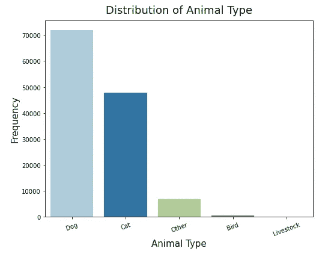
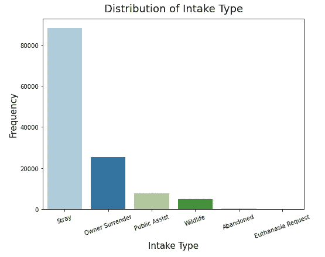
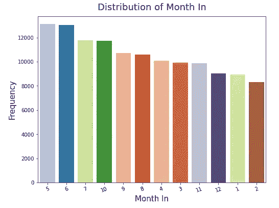
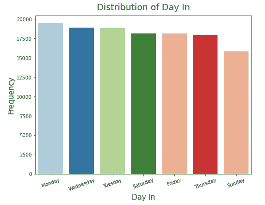
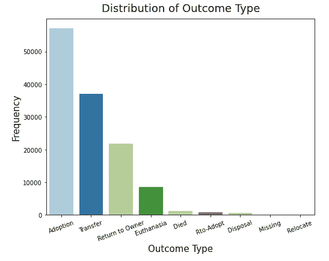
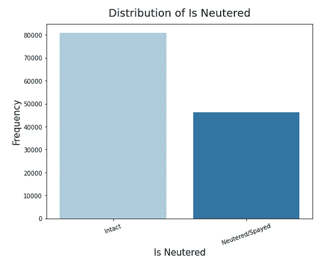
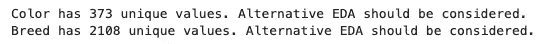
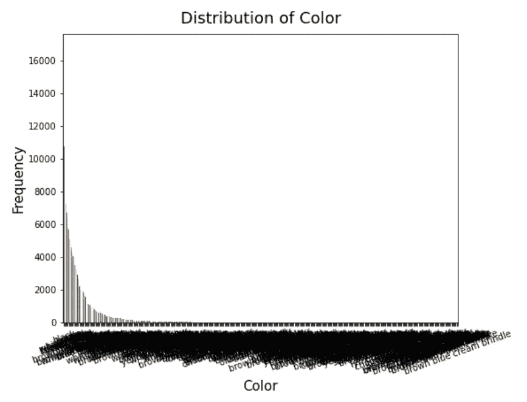
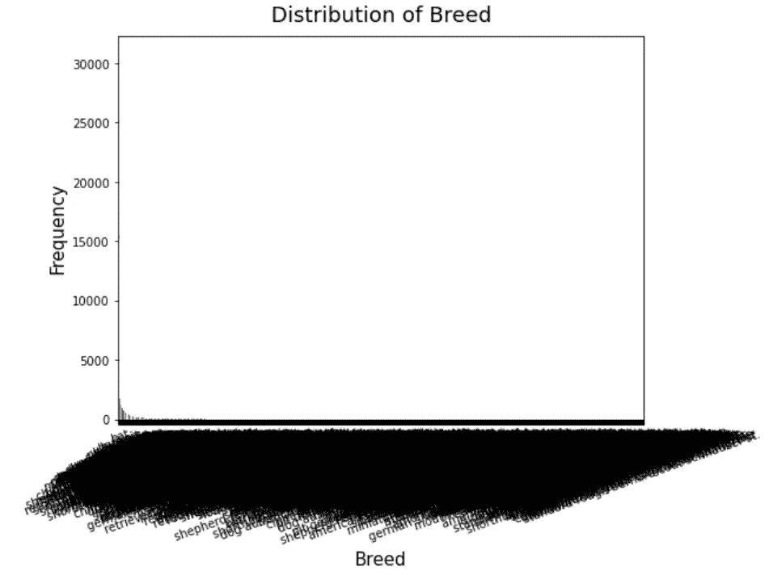

# 使您的初始 EDA 变得轻而易举的功能

> 原文：<https://towardsdatascience.com/a-function-that-makes-your-initial-eda-a-breeze-8e9549d69fb3?source=collection_archive---------26----------------------->


约书亚·阿拉贡在 [Unsplash](https://unsplash.com/s/photos/code?utm_source=unsplash&utm_medium=referral&utm_content=creditCopyText) 上拍摄的照片

EDA(探索性数据分析)是数据科学旅程中至关重要的一部分，它让我们能够理解给定的数据，并指导我们做出建模决策。在做出任何假设之前，先“感受”一下数据，这对于形成有价值的见解至关重要。坏消息呢？这通常很耗时。

我的上一个项目使用了奥斯汀动物收容所提供的数据，这些数据来自[奥斯汀开放数据门户](http://data.austintexas.gov)。基于动物的摄入信息(动物类型、年龄、品种、颜色、摄入月份等),使用预测模型来确定是否要收养动物。).收容所里有超过 150，000 只动物，为了了解奥斯汀的摄入量，探索这些不同的分布是很重要的。

当我开始探索和创建条形图时，我发现自己一遍又一遍地编写相同的代码。通常当这种情况发生时，我会问自己，“*我应该创建一个函数吗？*“最终，创建这个功能节省了我很多时间。更聪明地工作，而不是更努力。这是我创建的函数:

```
def initial_eda(df):
    # List of categorical columns
    cat_cols = df.select_dtypes('object').columns

    for col in cat_cols:
        # Formatting
        column_name = col.title().replace('_', ' ')
        title= 'Distribution of ' + column_name

        # Unique values <= 12 to avoid overcrowding
        if len(df[col].value_counts())<=12: 
            plt.figure(figsize = (8, 6))        
            sns.countplot(x=df[col], 
                          data=df, 
                          palette="Paired",
                          order = df[col].value_counts().index)
            plt.title(title, fontsize = 18, pad = 12)
            plt.xlabel(column_name, fontsize = 15)
            plt.xticks(rotation=20)
            plt.ylabel("Frequency",fontsize = 15)
            plt.show();
        else:
            print(f'{column_name} has {len(df[col].value_counts())} unique values. Alternative EDA should be considered.')
    return
```

对我的数据运行该函数时，输出如下:



请注意，没有创建颜色和品种列中的地块。如果我的函数中没有第 11 行，这两个视觉效果就会被创建出来:



呀！不是信息性的，显然不是我想在任何演示中包含的视觉效果。这解释了为什么我将函数限制为从少于 13 个唯一值的列创建图。然而，这个最大值可以调整。这些列中唯一值的数量被打印出来，以指导对这些列的进一步探索，而不是这些“不那么漂亮”的图。

对于创建的大量视觉效果，几乎不需要编码。在完善这些图形的过程中，可以进一步探索该功能，但对于初始 EDA，该功能可以在进入建模阶段之前节省大量时间。我计划在未来的项目中使用这个功能，我希望其他人也能发现这很有用！

要了解更多关于这个项目的信息，你可以在我的个人 GitHub [这里](https://github.com/ksylvia16/Animal-Outcomes-Austin-TX)查看。