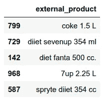
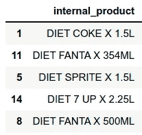
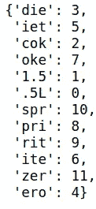
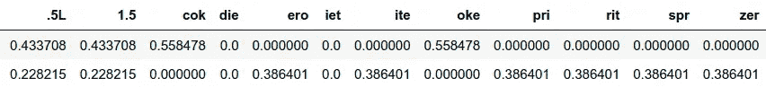
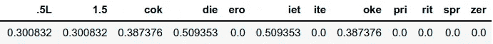
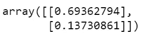
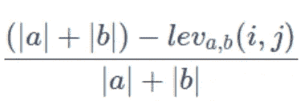
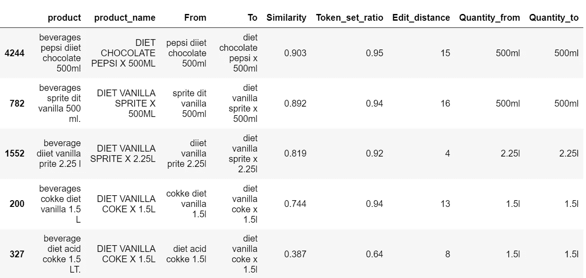

# 一个模糊字符串匹配的故事

> 原文：<https://towardsdatascience.com/a-fuzzy-string-matching-story-314bbecaa098?source=collection_archive---------11----------------------->

## 了解如何构建模糊字符串匹配基线模型


布鲁诺·马丁斯在 Unsplash 上的照片

在构建基于机器学习应用的新产品时，我们需要从不同的来源提取、收集和存储数据。无论采用何种提取方法(API、[网络抓取](https://medium.com/@eortizrecalde/a-practical-web-scraping-guide-62073b69b003)或其他)，收集的数据仍然需要经过可能是最重要、最耗时的任务，即把来自这些来源的数据整合、匹配和规范化到数据库中。

在这篇文章中，我们将讨论关于**模糊字符串匹配**。这个问题包括尝试匹配相似但不同的字符串(可能是由于拼写差异或错误)，例如“Lionel Messi”和“L. Messi”或“Argentina”和“Argentina”。

但是这有什么关系呢？我给你讲个故事吧(免责声明:*本文所有人物和事件均属虚构，与现实有任何雷同，纯属巧合*)。

## 开始

John 拥有一家大型连锁售货亭，他希望使用竞争对手(其他售货亭、附近的商店和超市)的价格建立更精确的定价模型。不久前，他曾经付钱给神秘顾客，让他们每隔一个月访问并收集一些竞争对手的价格数据，直到他意识到这根本不划算，因为价格似乎每个月都要调整多次。

意识到这一点后，他迅速采取行动，决定建立一个网络抓取服务，以更高的频率提取竞争对手的产品价格。实施该解决方案后，一切似乎都很顺利，成功地收集了数据，John 觉得他已经击败了系统，并认为他的数据团队将能够直接构建新的定价模型。然而，有一个他没有考虑到的大问题:废弃产品的拼写不一定与他的售货亭目录匹配，这意味着他无法直接将他的内部数据与外部来源进行关联和比较。例如:

【健怡可乐 1.5L】≠“可乐 dieet 1500ml”

那么，他在意识到不能使用数据后做了什么呢？首先，在一次突然的暴怒中，他弄坏了他的键盘。后来，冷静下来后，他继续询问他的数据团队是否知道如何解决这个问题(使用他的另一个键盘)。“独角兽”员工卡尔看到了赢得约翰好感的机会，他告诉约翰，他以前处理过类似的问题，可以在一周内获得 MVP(但说实话，他不知道自己在做什么)。约翰愉快地同意了，但是他没有给卡尔一周时间去做，而是给他两周时间。

## 寻找解决方案

利用过去被证明有效的方法，卡尔用他最可靠的工具“谷歌”搜索“python 中的字符串匹配”。他很快就看到了几篇关于正则表达式匹配字符串的帖子，一种他从未听说过的新距离，称为“Levenshtein 距离”，以及模糊字符串匹配的概念。但是没有一个人给他提供实用的解决方案，直到他偶然发现了一篇名为“模糊字符串匹配的故事”的文章，作者是一个叫 Ezequiel Ortiz Recalde 的人。这篇文章为他提供了一些有用的建议，告诉他如何通过一个实际的例子来完成匹配过程和构建基线模型。我们现在来看看卡尔看到了什么。

**1。Imports** 首先，我们安装并导入主库，用于匹配售货亭或超市中的饮料字符串(数据是手动生成的)。

```
#!pip install fuzzywuzzy
#!pip install python-Levenshtein
#!pip install polyfuzz
#!pip install nltkimport pandas as pd
import numpy as np
import string
import refrom nltk.metrics.distance import edit_distance
from fuzzywuzzy import fuzz
from polyfuzz import PolyFuzz
from polyfuzz.models import TFIDF
```

**2。数据**

我们已经生成了两个饮料数据集(外部数据和内部数据)。第一个是指可能通过抓取网站获得的外部数据，而第二个是复制一个售货亭的虚拟官方饮料目录的一部分。在这里，我们可以看到两者的示例:



外部数据



内部数据

**3。字符串预处理**

在尝试匹配不同来源的字符串之前，有一些有用的转换可以简化这个问题:

*   将字符串转换为小写；
*   小心地去掉符号和标点符号；
*   删除连续的空格(或全部，取决于问题)；
*   小心地删除停用词(注意删除关键词，因为它们在将来可能会有用；避免删除太多特定的单词，因为你仍然希望你的模型能够概括)；
*   标准化不同表达式的拼写(例如，在 grams 的情况下，我们可以找到 g，gr，gs，g，gr，gs。等)；

根据这些建议，我们使用下面的函数来清理两个数据帧的列:

在应用该函数之前，我们创建要修改的列的副本，以便保留原始版本:

```
external_data["product_cleaned_from"]=\
external_data["product"].copy()internal_data["product_cleaned_to"]=\
internal_data["product_name"].copy()
```

将函数应用于两个数据帧:

```
string_processing(df=external_data,columns_to_clean=["product"])string_processing(df=internal_data,columns_to_clean=["product_name"])
```

这样做之后，我们终于有了干净的数据进行匹配。接下来，我们将讨论要使用的主要方法。

**4。使用 Tf-Idf 矢量化进行字符串匹配**

词频逆文档词频矢量化是许多 NLP 应用中使用的一种技术，其目的是考虑单词在文档中以及在所有语料库中出现的次数，来近似估计该单词在文档中的相关性。通过这种方法，我们获得了每个文档中每个单词的“权重”向量，我们可以将它用作分类模型的特征。

但是，这与字符串匹配有什么关系呢？我们可以将令牌划分成 n 元文法，然后获得它们的 TF-IDF 向量化。一旦我们有了 n-gram 的权重向量，我们就可以计算它们之间的相似性。注意，相对于使用基于 Levenshtein 距离的比率来检查在所有可能的短语对的每一个之间应该进行多少编辑的缓慢过程，这允许我们利用矩阵运算的快速计算。

匹配过程如下进行:

**a)** 定义两个字符串列表，一个列表“From”(指我们想要匹配的内容)和一个列表“to”(在本例中为目录)。

**b)** 定义 n 元文法的数量，其中的字符串将被分割。

**c)** 用两个列表拟合 TF-IDF 矢量器，以便得到所有可能的唯一 n 元文法的表示。

**d)** 使用 TF-IDF 表示，将每个列表转换为相同的表示(如果一个字符串不包含矢量器的唯一 n 元语法分区之一，则该分区的值将为 0)。在这一步中，我们将获得两个矩阵，其列数与唯一 n-grams 划分的列数一样多(两个矩阵的列数相同，因为矢量器适合使用两个列表)，行数指的是每个源列表中的元素数。

幸运的是，整个过程已经集成到了 PolyFuzz 库中，但是我们仍然想知道我们是否理解了眼见为实的工作原理:

首先，我们将导入一些解释所需的函数:

```
from sklearn.feature_extraction.text import TfidfVectorizer
from sklearn.metrics.pairwise import cosine_similarity
```

接下来，我们生成要匹配的字符串列表:

```
from_list = ["coke 1.5L","sprite zero 1.5L"]
to_list = ["diet coke 1.5L"]
```

我们稍微修改了这个函数，为在 [PolyFuzz](https://maartengr.github.io/PolyFuzz/) 库中使用的标记创建 n 元语法分区，使其直接使用 3 元语法。

```
def _create_ngrams(string: str): result = []
   for n in range(3, 4):
      ngrams = zip(*[string[i:] for i in range(n)])
      ngrams = [''.join(ngram) for ngram in ngrams if ' ' not in ngram]

   result.extend(ngrams)
   return(result)
```

这个函数接收一个字符串，并为每个由空格分隔的标记创建一个 n 大小的分区。例如,“健怡可乐”会被分成“die，iet，cok，oke”。接下来，我们能够使用 *_create_ngrams* 函数来拆分标记并创建列表元素的矢量化表示，从而适应 scikit learn 的 [TfidfVectorizer](https://scikit-learn.org/stable/modules/generated/sklearn.feature_extraction.text.TfidfVectorizer.html) :

```
# Define the vectorizer
vectorizer = TfidfVectorizer(min_df=1, analyzer=_create_ngrams).fit(to_list + from_list)
```

注意这里有两个显式参数 *min_df* 和 *analyzer* 。第一个是指一个划分必须在语料库中出现以被包括在词汇表中的最小次数，而第二个是用于指定如何创建矢量器的词汇表，即从单词或 n 元语法中创建。

给定输入列表，我们可以检查结果词汇。

```
vectorizer.vocabulary_
```



这些数字表示矩阵的列索引(“. 5L”将在列 1 中)。

创建矩阵表示后，我们继续转换每个列表以匹配其结构，接收稀疏矩阵:

```
tf_idf_to = vectorizer.transform(to_list)
tf_idf_from = vectorizer.transform(from_list)
```

为了检查每行中这三个字母的权重，我们将 tf_idf_to 和 tf_idf_from 转换为密集格式，然后转换为 dataframe，使用词汇索引来设置列名:

```
matrix_from=pd.DataFrame(tf_idf_from.todense(),\
columns=sorted(vectorizer.vocabulary_))matrix_to=pd.DataFrame(tf_idf_to.todense(),\
columns=sorted(vectorizer.vocabulary_))
```

两个矩阵都有 n 个元素 x n 个词汇，如下所示:



矩阵 _ 从



matrix_to

既然我们有了矩阵，我们就能够计算 n-grams 划分的向量之间的相似性。在这种情况下，我们使用余弦相似度:

```
cosine_similarity(matrix_from, matrix_to)
```

带输出:



这给出了记号向量对之间的相似性得分。在这种情况下，我们可以看到“可乐 1.5L”比“雪碧零度 1.5L”更类似于“健怡可乐 1.5”。我们刚刚做的是矩阵之间的点积:

```
np.dot(np.array(matrix_from.iloc[0]),np.array(matrix_to.iloc[0]))
```

返回 0.6936279421797706，而

```
np.dot(np.array(matrix_from.iloc[1]),np.array(matrix_to.iloc[0]))
```

返回 0.1373086119752811。

**5。其他有用的度量:令牌集比率和 Levenshtein 距离**

我们只检查了字符串之间相似性的一个度量，但是根据您正在比较的字符串类型，还有其他可能有帮助的度量。对于这个特殊的例子，我喜欢在分析中包括记号集比率和 levenshtein 距离。

标记集比率是字符串的相似性度量，它考虑了值的重复和单词顺序的差异(例如，“diet coke”与“coke diet”相同，对于这些类型的情况，我们会对捕捉这样的直接答案感兴趣)。我们用一个简单的例子“健怡可乐 1.5ml”和“健怡库克减肥药 1.5ml”来看看如何计算:

```
# We create the 2 strings
s1="diet coke 600ml"
s2="diet cooke diet 600ml"
```

I)我们从预处理开始，将字符串分离成标记:

```
tokens1 = set(fuzz.utils.full_process(s1).split())
tokens2 = set(fuzz.utils.full_process(s2).split())
```

这里 tokens1 = { ' 600ml '，'可乐'，'减肥' }

ii)然后，我们取记号集，并获得它们的交集和差异:

```
# Intersection
tokens1.intersection(tokens2)# Difference (which tokens are we missing so that both sets are equal)
diff1to2 = tokens1.difference(tokens2)
diff2to1 = tokens2.difference(tokens1)
```

iii)我们连接了有序交集和差集，解决了字符串的顺序问题:

```
#We concatenate the ordered intersections and differencessorted_sect = " ".join(sorted(intersection))
sorted_1to2 = " ".join(sorted(diff1to2))
sorted_2to1 = " ".join(sorted(diff2to1))
```

iv)我们组合每个选项中的标记来重构整个字符串:

```
combined_1to2 = sorted_sect + " "+ sorted_1to2
combined_2to1 = sorted_sect + " "+ sorted_2to1
```

v)我们消除了重复的空白:

```
sorted_sect = sorted_sect.strip()
combined_1to2 = combined_1to2.strip()
combined_2to1 = combined_2to1.strip()
```

vi)我们计算不同组合对的模糊率(即归一化的 Levenshtein 距离):



模糊率

```
pairwise = [fuzz.ratio(sorted_sect, combined_1to2)/100,
 fuzz.ratio(sorted_sect, combined_2to1)/100,
 fuzz.ratio(combined_1to2, combined_2to1)/100] 
```

带输出[0.8，0.77，0.97]。

vii)我们保留具有最大模糊率的配对及其相似性。

关于 Levenshtein 距离，我们简单地使用 nltk 的 *edit_distance* 函数。这告诉我们将一个字符串转换成另一个字符串所需的编辑次数。

**6。构建基线模型**

现在我们已经对这个过程有了更好的理解，剩下的就是构建一个管道，它接受两个列表，用它们内容的分区来拟合一个矢量器，计算矢量之间的点积，并匹配具有最高相似性得分的对。这就是 Polyfuzz 库发挥作用的地方，它为我们提供了一个完全遵循我们刚才解释的模型。此外，我们可以向最终结果添加一些额外的信息(标记集比率和 Levenshtein 距离),以避免在后验结果过滤中只有一种方法来检查匹配质量。

以下代码块详细描述了整个过程:

7 .**。结果**

这里有一个获得结果的例子，你可以通过检查[笔记本](https://github.com/eortizrecalde/string-matching/blob/main/string_matching.ipynb)来探索其余的。



**8。结束语**

在这篇简短的文章中，我们展示了一个简单的框架，它可能能够为任何模糊字符串匹配问题产生不错的结果(至少对我来说是这样)。不管 kiosk 产品的例子是什么，只要您需要将非规范化或自由文本与某种已经过企业理想验证的目录或参考进行匹配，这应该会对您有所帮助。

## 结束了

读完之后，在着手解决他的匹配问题之前，Carl 做了每个人都会做的事情，即他喜欢并分享了这篇文章😉。

# 参考

[](https://en.wikipedia.org/wiki/Approximate_string_matching) [## 近似字符串匹配-维基百科

### 在计算机科学中，近似字符串匹配(通常通俗地称为模糊字符串搜索)是…

en.wikipedia.org](https://en.wikipedia.org/wiki/Approximate_string_matching) [](https://openclassrooms.com/en/courses/6532301-introduction-to-natural-language-processing/7067116-apply-the-tf-idf-vectorization-approach) [## 应用 TF-IDF 矢量化方法

### 自然语言处理(NLP)允许我们对大量文本数据进行分类、校正、预测，甚至翻译…

openclassrooms.com](https://openclassrooms.com/en/courses/6532301-introduction-to-natural-language-processing/7067116-apply-the-tf-idf-vectorization-approach) [](https://github.com/MaartenGr/PolyFuzz) [## GitHub - MaartenGr/PolyFuzz:模糊字符串匹配、分组和评估。

### PolyFuzz 执行模糊字符串匹配、字符串分组，并包含广泛的评估函数。PolyFuzz 是…

github.com](https://github.com/MaartenGr/PolyFuzz)