# 异方差的高斯过程模型

> 原文：<https://towardsdatascience.com/a-gaussian-process-model-for-heteroscedasticity-aa0db109473e?source=collection_archive---------45----------------------->

## [思想和理论](https://towardsdatascience.com/tagged/thoughts-and-theory)

## 如果你的回归方差是非平稳的，试试这个

# 介绍

在处理连续回归问题时，一个常见的现象是非常数残差方差，也称为[异方差](https://en.wikipedia.org/wiki/Heteroscedasticity)。虽然异方差经常出现在统计学和计量经济学中，但它在主流机器学习和数据科学文献中似乎没有受到太多的关注。尽管通过最小化 MSE 来预测平均值通常就足够了，而且更加实用，但对方差的适当处理有时也是有帮助的。请看我的[过去的博文](https://numbersandcode.com/why-probability-and-uncertainty-should-be-an-integral-part-of-regression-models-part1)来了解更多关于这个话题的想法。

在这篇文章中，我想展示一个如何使用高斯过程来模拟异方差数据的例子。因为解释每一个理论方面都远远超出了这篇文章的范围，所以如果你对这样的模型感兴趣，我推荐阅读参考资料。首先，让我们从一个简单的问题定义开始。

# 问题定义

非恒定方差模型的核心是假设输入数据和目标变量的方差之间存在某种函数关系。假设也是高斯目标变量，我们可以构建以下概率设置:

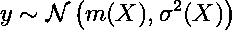

简单地说，给定一些输入数据，相应的目标应该是高斯型的，均值和方差是我们输入的任意函数。因为我们今天的重点是方差，所以让我们用一个零均值函数来简化一下，即

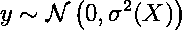

我们现在的任务是为 sigma 平方找到一个合适的函数。

如果我们事先不太了解我们的目标函数，那么无论我们提出什么模型，都应该考虑到我们对于 sigma 平方的实际函数形式的不确定性。这也被称为[认知不确定性](http://www.ce.memphis.edu/7137/PDFs/Abrahamson/C05.pdf)，也是[贝叶斯机器学习](https://algorithmia.com/blog/bayesian-machine-learning)的主要考虑因素之一。简单地说，我们现在不再期望单一的模型能够最好地描述我们的目标函数。取而代之的是，考虑一组可能无限大的模型，我们的目标是在这组模型上放置一个概率分布(也称为后验分布),以便在给定假设(也称为先验分布)的情况下，最能描述数据(也称为可能性)的模型是最有可能的模型。

这通常是在权重空间中通过描述模型行为的参数集以隐含的方式定义我们的模型集来完成的——可能机器学习中最著名的例子是[贝叶斯神经网络](https://medium.com/neuralspace/bayesian-neural-network-series-post-1-need-for-bayesian-networks-e209e66b70b2)。另一种更抽象的方法是直接在函数空间中工作，也就是说，我们现在明确地寻找最可能的函数，而不需要参数来首先描述它们。因为我们在贝叶斯领域工作，这也意味着先验和后验分布不再放在参数上，而是直接放在函数上。这种建模最具代表性的框架之一是[高斯过程(GP)回归](https://distill.pub/2019/visual-exploration-gaussian-processes/)。

如果这对你来说是一个新概念，听起来很混乱，我建议现在不要担心潜在的假设，只看公式。根据引用数量，最受欢迎的关于高斯过程模型的书籍之一，[机器学习的高斯过程](http://www.gaussianprocess.org/gpml/) (GPML)非常清晰地介绍了理论设置，并且是完全开源的。为了防止这篇文章过于浮泛，我不会过多地讨论细节，而是建议你研究你自己不了解的主题。

# 模型

我们的目标是通过 GP 对目标变量的变化方差进行建模，如下所示:

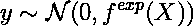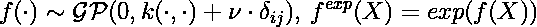

这意味着我们的方差函数的对数是一个 GP，我们需要通过指数压缩原始 GP，以确保方差总是大于零。将实数直线映射到正实数的任何其他函数在这里都可以，但指数函数无疑是最受欢迎的函数。以上也暗示了 GP 实际上是我们模型的一个潜在组成部分，我们只是从收集的数据中间接观察到的。最后，我们通过 delta 被加数假设 GP 核上的附加噪声，这使得模型在实践中更加稳定。

然后，我们可以通过贝叶斯定理导出后验分布，如下所示:

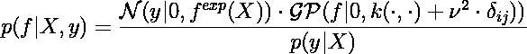

虽然对于一些基本 GP 模型，可以推导出封闭形式的左侧，但在我们的情况下，我们不能这样做。相反，我们将应用[拉普拉斯近似法](https://cedar.buffalo.edu/~srihari/CSE574/Chap4/4.4-Laplace.pdf)并通过一个合成的多元正态来近似它

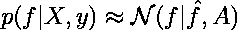

对于二元分类模型，拉普拉斯近似的确切步骤在 GPML 著作第 3 章中有解释，我们只需要调整我们模型的方法。

总之，我们近似的平均参数应该匹配后验的模式，而它的协方差矩阵是我们的数据对数似然函数的 Hessian 矩阵的负逆。我们有:

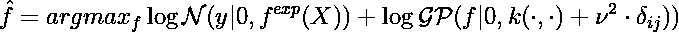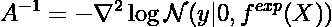

第一个方程是从后验公式的分母不依赖于我们的目标这一事实和对数函数的单调性推导出来的。后一个方程是从后验函数最大值附近的二阶泰勒展开式导出的。

为了找到稍后一些示例数据的近似平均值和最佳核超参数，我们将把整个损失插入到自动微分包中，并让计算机完成剩下的工作。对于我们近似的协方差矩阵，我们需要实际计算海森矩阵。GP 模型的一个常见简化是假设实现了潜在 GP，目标变量的独立观测值:

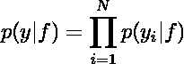

这允许我们将 Hessian 矩阵简化为处处为零，除了它的对角线是对数似然函数相对于 GP 的二阶导数:

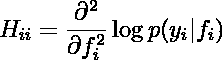

右手边可以通过将标准高斯对数似然相对于方差微分两次来导出，同时考虑我们的指数变换:

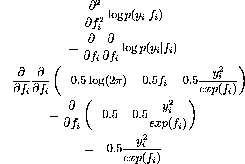

这产生了

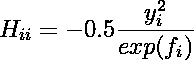

和

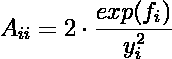

最后，我们需要推导出所谓的后验预测分布，即我们对新的、未观察到的输入的预测:

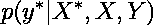

对于我们的设置，我将只陈述来自 [GPML 第 3 章](http://www.gaussianprocess.org/gpml/chapters/RW3.pdf)的结果，没有前面的推导。首先，我们需要计算潜在 GP 的后验预测分布，使用我们上面的近似，它是另一个 GP:

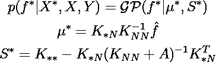

其中 K 变量表示训练和评估数据集的核协方差矩阵，以及训练和评估数据集之间的核互协方差矩阵。如果您熟悉 GP-回归，您可以看到后验均值和协方差项与标准情况下几乎相同，只是我们考虑了拉普拉斯近似的均值和协方差。

最后，我们可以通过忽略 GP 后验预测函数来导出新数据的后验预测分布:

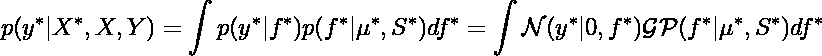

这个积分也是难以处理的——幸运的是，由于我们只想评估后验预测分布，我们可以通过蒙特卡罗抽样从目标分布中进行抽样。

为了在实践中演示这种方法，我在 Julia 中实现了一个简单的例子。完整的代码可以在 Github 上的[这个 Jupyter 笔记本中找到。](https://github.com/SaremS/MediumBlogPosts/blob/master/001_GaussianProcessModelForHeteroscedasticity/Notebook.ipynb)

# 一个使用 Julia 的快速示例

数据是一个简单的 1D 玩具示例，有 200 个观察值和生成分布

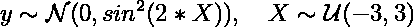

即，输入变量在-3 和 3 之间被均匀采样，并且目标是从具有周期性方差的零均值高斯中提取的:

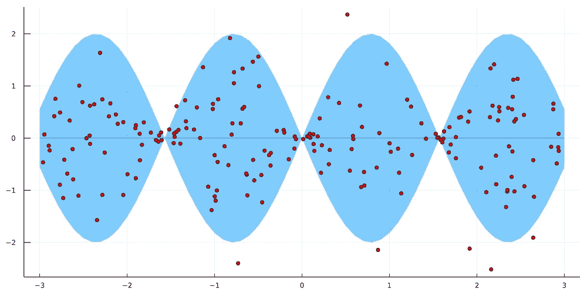

*200 个训练观测值(红点)采样自零均值(蓝线)高斯分布，方差遵循 X 的正弦函数；蓝色区域表示平均值的两个标准偏差。*

为了完全定义 GP，我们还需要指定核函数——这里我选择了一个标准平方指数(se)核加上已经提到的加性噪声项，即

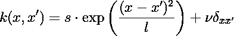

其中所有三个超参数都需要为正。我们现在有了定义必要的函数和结构所需的所有公式(Julia 的对应物是面向对象语言中的类)

在优化上述核超参数和拉普拉斯近似之后，得到的函数后验预测分布如下:

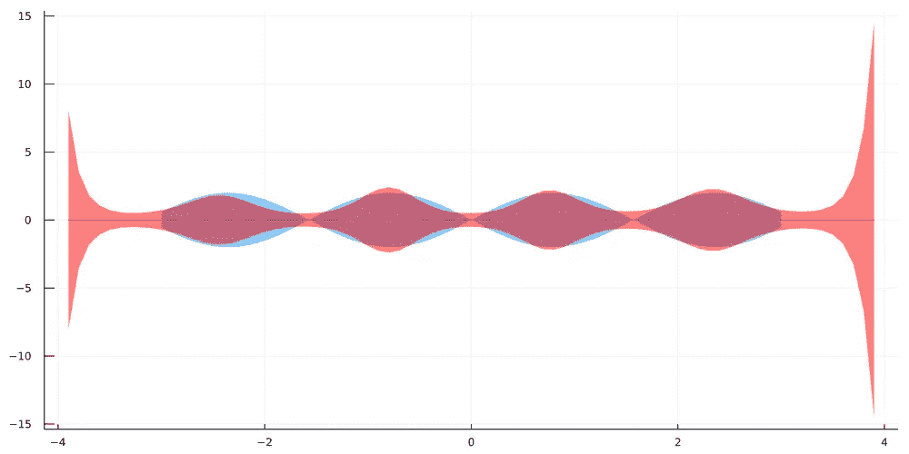

*数据生成过程(蓝色)与后验预测分布(红色)。已经为更大范围的输入域绘制了后验预测分布，以证明观察数据之外的不确定性的增加。*

为了查看位于我们的训练数据范围之外的数据会发生什么情况，对该间隔执行了评估。正如你所看到的，随着我们对未知的研究越深入，后验预测方差会急剧增加。

这正是在认知不确定性的影响下应该发生的事情。在某种程度上，模型可以学习哪些函数描述了与训练数据接近的目标函数。另一方面，可能同样很好地描述我们观察之外的数据的候选函数集随着我们远离训练数据而变大。

简而言之，我们的测试数据与训练数据越不相似，我们的预测就越不确定。这种不确定性由后验预测分布的方差表示，方差越大，不确定性越大。

通过比较位于观测数据中心的 X 的后验预测密度与位于该范围之外的 X 的后验预测密度，我们也可以很好地看出这一点:

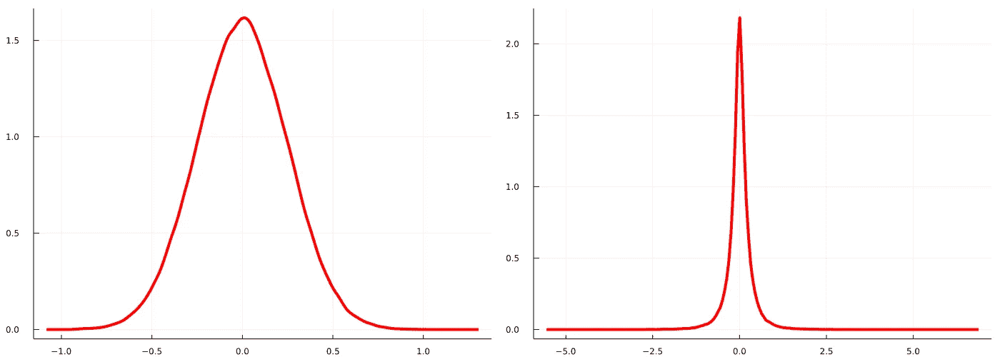

X=0 时的后验预测密度(左)与 X=-3.5 时的后验预测密度(右)。由于 X=-3.5 位于我们的训练数据的范围之外，后验预测不确定性更高，这导致了重尾分布。

很明显，在-3.5 处的后验预测密度意味着 y 的潜在值的范围比零处的后验预测密度宽得多。能够量化这种不确定性是贝叶斯机器学习最有趣的特性之一，我强烈建议深入研究这个庞大的主题。

# 更进一步

很明显，我们使用的示例只是一个玩具数据集，还不能证明所提出的模型在现实世界中的能力。如果您感兴趣，请随意使用和修改代码，并在更真实的东西上尝试该模型。

这种模型的一个潜在应用是金融时间序列数据，众所周知，这些数据在危机时期表现出高度可变的变化。虽然 GARCH 模型在这里通常被认为是最先进，但 GP 模型可能是一个有趣的替代模型。对一般连续回归问题的另一个可能的改进是也将数据均值建模为 GP。

关于可伸缩性的最后一句话:像我们在这里讨论的普通 GP 模型因对大型数据集不可行而臭名昭著。幸运的是，许多聪明人已经找到了解决这些问题的方法，至少在某种程度上。如果您对此类方法感兴趣，您可以在 2019 年高斯过程暑期学校的[这些幻灯片中找到概述。](http://gpss.cc/gpss19/slides/Dai2019.pdf)

今天就到这里。感谢你读到这里，如果你有任何问题或者在这篇文章中发现任何错误，请在评论中告诉我。

*原载于 2021 年 6 月 28 日*[*【https://sarem-seitz.com】*](https://sarem-seitz.com/blog/a-gaussian-process-model-for-heteroscedasticity/)*。*