# 共轭先验的温和介绍

> 原文：<https://towardsdatascience.com/a-gentle-intro-to-conjugate-priors-8be6ac0d31f6?source=collection_archive---------21----------------------->

## 为了更快更简单的贝叶斯推理

共轭先验可以使贝叶斯推理更快更直接。让我们看一看贝叶斯法则，来理解我们的意思。

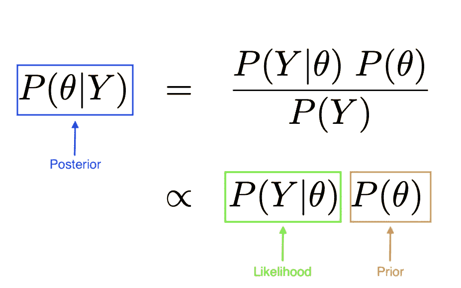

贝叶斯法则:后验概率与似然概率和先验概率成正比。图片作者。

当我们进行贝叶斯推断时，我们通常试图识别参数的**后验**(我们在看到数据后对真实模型参数的信念)。就像任何类型的建模一样(回归、深度学习等。)我们要学习参数。这里我们将它们量化为分布而不是点估计。

P( *θ* )是我们对参数的先验信念，是我们在推断之前必须赋予的东西。P(Y| *θ* 是给定参数下我们数据的**似然**。出于这些目的，我们可以忽略 P(Y ),因为它对θ的所有值都是一样的。

*注:要了解更多关于贝叶斯推理的直觉背景，请随意参考我以前的* [*文章*](/from-bayes-theorem-to-bayesian-inference-b261124633a6) *。*

## 可能性

可能性是我们关注的第一个术语。它的形式取决于我们选择使用什么样的模型。例如，在线性回归模型中，我们假设数据围绕回归线呈正态分布。因此，每个数据点的可能性对应于具有平均 X^T B(即回归线上的点)和方差σ(误差方差)的正态 PDF(概率密度函数)。

不过，线性回归不是本文的重点。我们将使用一个更简单的(单参数)模型，二项式似然模型。

二项式分布模拟了一系列的伯努利试验。伯努利试验是一种*单次*随机二元试验(如抛硬币)，结果 1 的概率为 *θ* ，结果 0 的概率为(1- *θ* )。二项式分布对所有 n 次试验的结果总和(即抛硬币的头数)进行建模。

伯努利试验的可能性对于值 1 是简单的 *θ* ，对于值 0 是(1- *θ* )。对于 0.7 的 *θ* 值，伯努利试验可能性如下所示:

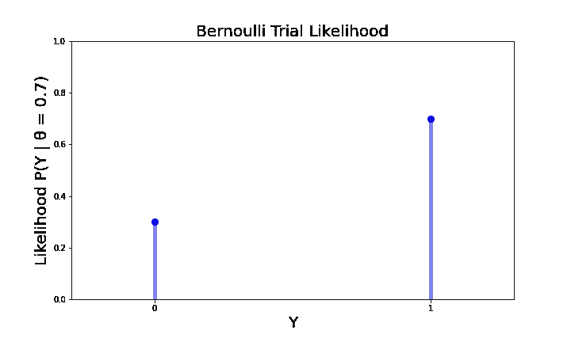

作者图片

或者作为一个等式:

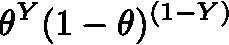

作者图片

对于 Y=0 和 Y=1 的值。

用概率 *θ* 对 *n* 次伯努利试验的总和进行建模的二项式似然性具有类似的似然函数。

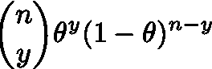

作者图片

其中这个时间 *y* 是“成功”的总次数，或者结果= 1 的次数，其中的可能值在 0 和 *n* 之间。

让我们用一个例子来更具体地说明这一点。

我们有一种降压药，它有偏头痛的副作用，我们想弄清楚当你服用这种药时，头痛的概率是多少。假设我们正在研究 30 名患者。“数据”或患头痛的患者总数的可能性是:

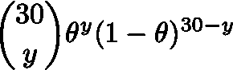

作者图片

对于 *θ* = 0.1(或副作用概率为 10%)，可能性看起来像这样:

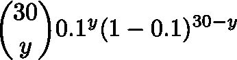

作者图片

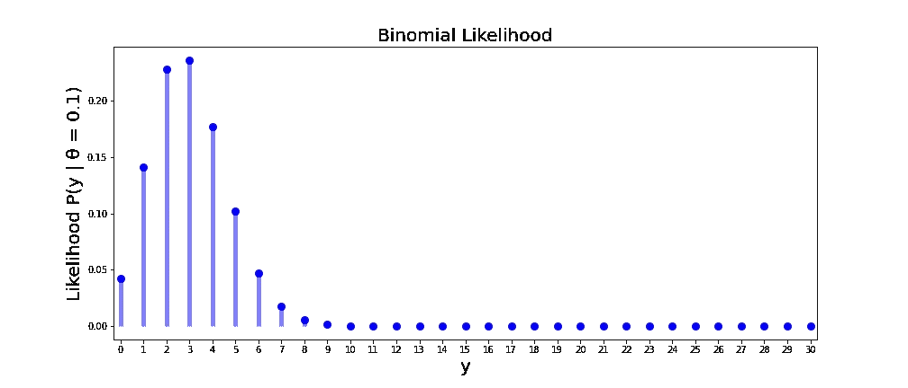

一系列 *n=30 次伯努利试验的二项式可能性(y 成功的可能性)，其中* θ = 0.1。(图片由作者提供)

正如所料，在给定 *θ* = 0.1 的情况下，最有可能的情况是，我们的患者群体中有 10% ( *y* =3)出现了副作用。

## 在先的；在前的

现在回到我们问题的贝叶斯部分。请记住，我们试图使用一些数据*来推断副作用发生率 *θ* 。*我们实际上从类似的、已经测试过的药物中获得了一些先验信息，即副作用发生率往往在 15%左右。由于我们使用的数据有限(我们只有 30 个受试者要测试)，我们希望以某种方式将我们的先验知识融入到模型中。

我们用前面的**项 P( *θ* )来做这件事。P( *θ* )代表我们对副作用发生率 *θ* 真实值的信念，所以应该是某个概率分布，可能值在 0 到 1 之间。从技术上讲，P( *θ* )可以是任何一种分布。但是回头看看贝叶斯法则:**

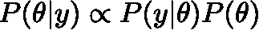

作者图片

请记住，对于 *θ* 的所有可能值，我们将可能性 p(y| *θ* ) 和先验 P( *θ* )相乘，这样我们就可以得到 *θ | y.* 的后验置信分布

*一个有点幼稚的方法是，为 P( *θ* )选择一些分布，从这个分布中取一堆样本，将 P( *θ* )的 PDF 乘以每个 *θ* 样本的 P(y| *θ* )的 PDF，形成我们的后验概率。但是我们可以用更聪明的方法来做，根本不需要任何采样。*

*如果似然 P(y| *θ* 和先验 P( *θ* )可以来自同一个“家族”，或者相对于 *θ* 有相同的项，那么我们就可以很容易地将两个概率分布相乘。结果是一个与先验类型相同的后验分布。除了更快的推断之外，每当我们获得更多的数据时，我们可以使用这个后验作为先验。*

*让我们再次看看药物副作用例子的可能性分布。二项式可能性是*

*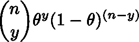*

*作者图片*

*在我们的研究中，我们有 *n* =30 名患者，所以我们的可能性等式看起来像这样。*

**

*作者图片*

*现在，我们希望找到一个具有相同项(相对于 *θ* )的先验分布，以便我们可以执行一个乘法步骤，而不是任何积分或采样。我们实际上并不关心 30-choose-y 项，因为和 P( *y* )一样，它对所有的 *θ* 值都是一样的。*

*因此，我们检查了一些可能的分布…并发现 2 参数贝塔分布看起来很像二项式似然！*

*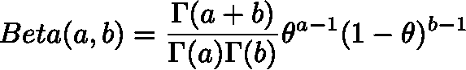*

*作者图片*

*Beta PDF 的第一部分中的[伽马函数](https://en.wikipedia.org/wiki/Gamma_function)并不是非常重要；同样，我们不必关心它们的推论，因为它们不是 *θ的函数。*其他项( *θ* 的某次方幂和(1- *θ* )的某次方幂，与我们的可能性相匹配。*

*现在，我们知道应该使用带有参数 *a* 和 *b* 的 Beta 先验分布进行快速推断。换句话说，我们将需要选择参数 *a* 和 *b* ，使贝塔先验分布看起来像我们关于 *θ* 的先验信念。*

## *在后面的*

*接下来，当我们将似然性 P(y| *θ* 和先验 P( *θ* )相乘时，我们得到一个后验 P( *θ | y* )，它也具有贝塔分布。*

*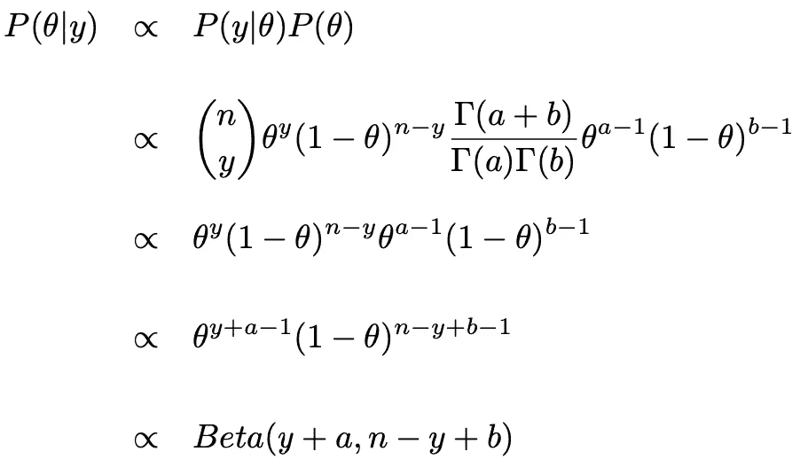*

*二项似然模型后验分布的推导。图片作者。*

*就是这样！对于任何先前的 P( *θ* ) = Beta( *a* ， *b* )，我们有关于 *θ* 的后验置信，以及 *n* 试验的任何数据，并且 *y* 总“成功”(结果等于 1，原谅称副作用成功的误称)。*

*现在回到我们的例子，我们之前认为副作用发生率可能在 15%左右，我们可以使用β(a = 3，b=17)，看起来像这样:*

*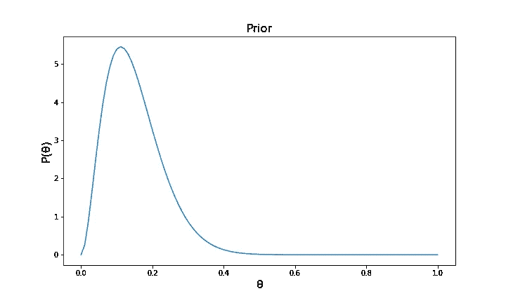*

**θ的先验分布。*图片作者。*

*用 E[P( *θ* )]或均值 0.15。注意:如果我们不太有信心，我们可以选择一个更宽的先验，其均值仍然为 0.15。值得试验一下先验参数，以找到一个准确描述先验置信度的参数。*

*如果我们给 30 个病人服用这种药物，发现有副作用，我们的后验概率就变成了*

*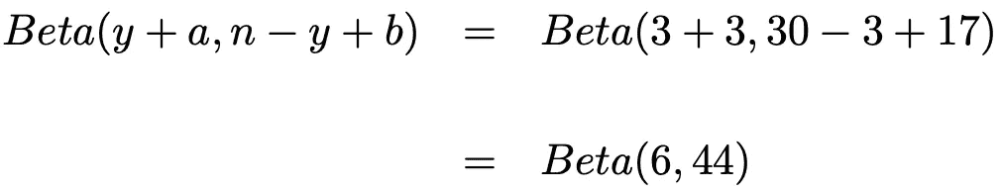*

*二项式后验概率的例子。作者图片*

*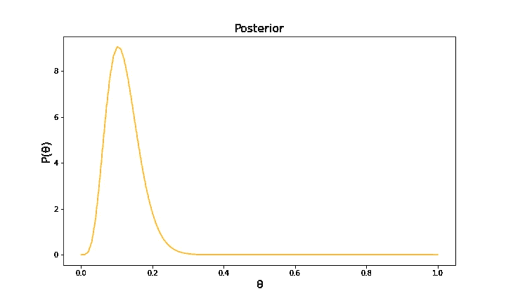*

**θ的后验分布。*图片作者*

*我们从之前的信念(在看到数据之前)到之后的信念(在看到数据之后)的变化如下:*

*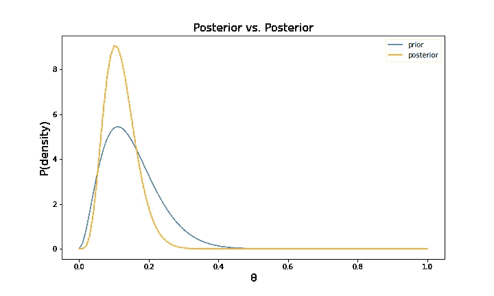*

**θ的先验和后验分布。*图片作者*

*我们现在对我们关于副作用率的信念更有信心了一点(如更窄的后验曲线所示)，期望值或均值从 0.15 变为 0.12，这可以从已知的 [Beta 分布的均值](https://en.wikipedia.org/wiki/Beta_distribution) a/(a+b)计算出来。*

*总之，使用共轭先验进行贝叶斯推断的步骤如下:*

1.  *定义您正在使用的模型，以及该模型的可能性*
2.  *找到与可能性具有相同形式(相对于 *θ* )的先验分布类型*
3.  *通过将似然性和先验相乘找到后验分布。*

*使用共轭先验的一些好处是速度(不需要 MCMC 采样)，以及由此产生的明确定义的后验，从中可以很容易地获得汇总统计或用作将来接收更多数据时的先验(“贝叶斯更新”)。*

*一些示例共轭先验是二项式似然的β先验、泊松似然的γ先验以及正态似然的平均参数的正态先验(具有已知方差)。*