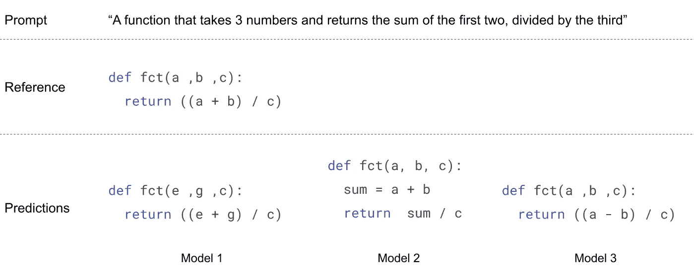
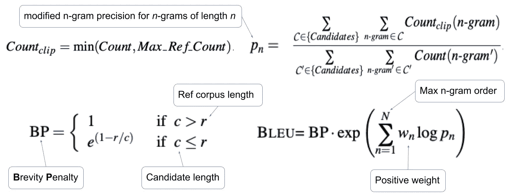
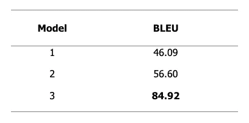
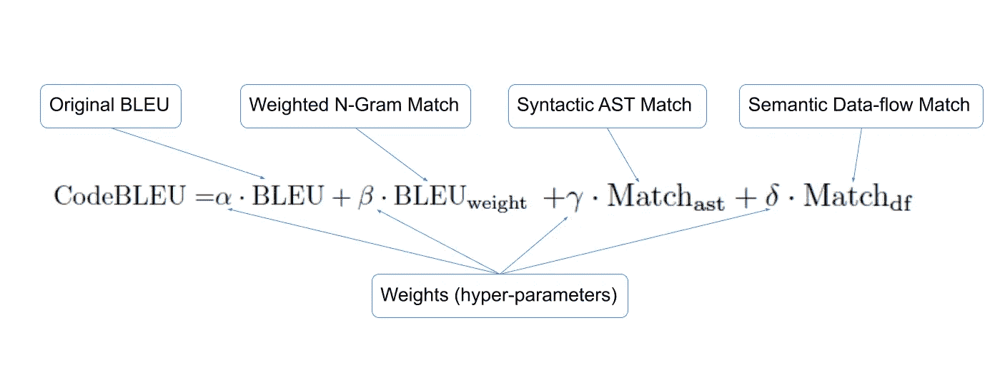
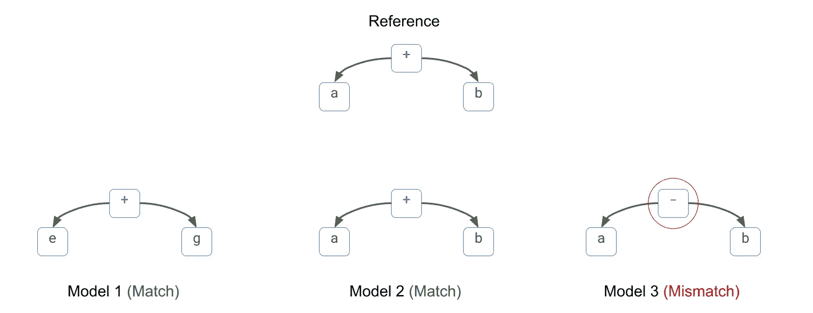
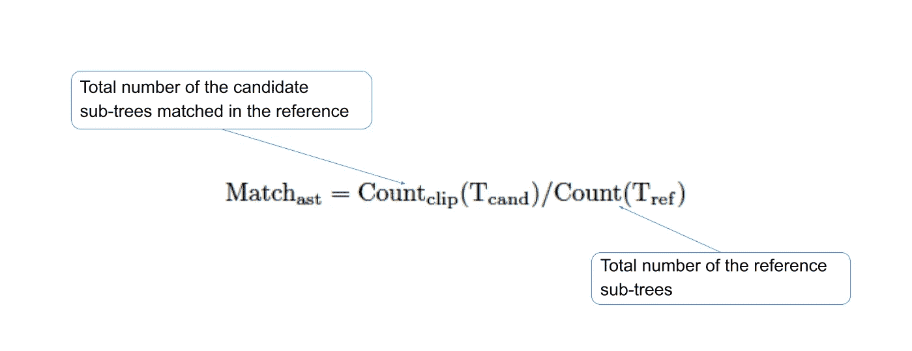
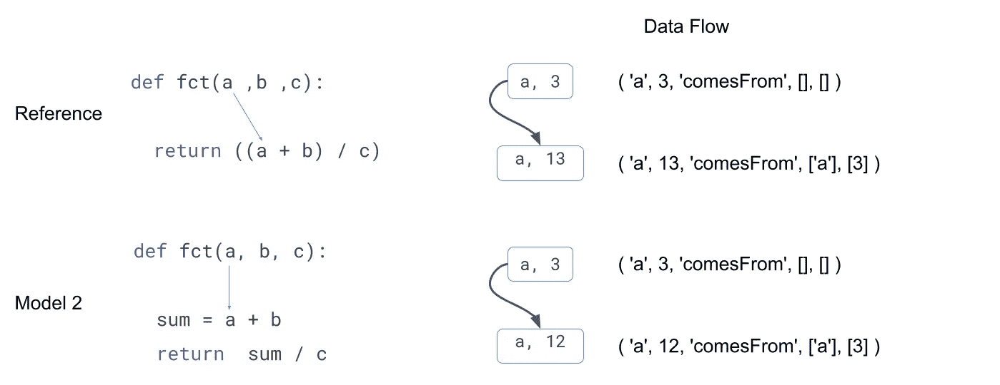
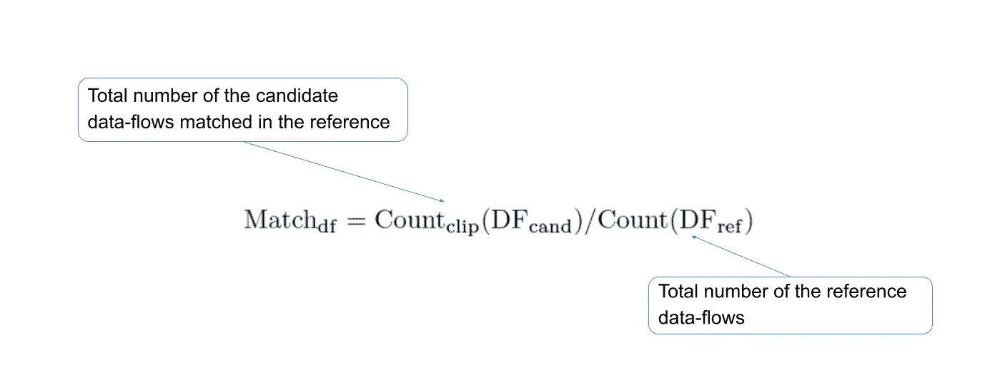
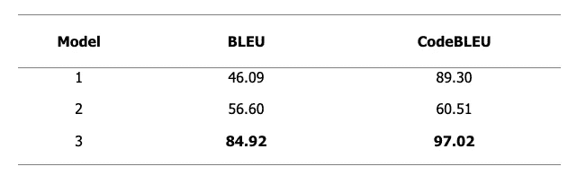

# 代码生成评估的简明介绍

> 原文：<https://towardsdatascience.com/a-gentle-introduction-to-code-generation-evaluation-c8dff8c3d19a?source=collection_archive---------33----------------------->

## 可用代码生成评估指标的概述和比较

由[威廉·沃比](https://unsplash.com/@wwarby?utm_source=medium&utm_medium=referral)在 [Unsplash](https://unsplash.com?utm_source=medium&utm_medium=referral) 上拍摄的照片

随着 OpenAI Codex 模型的发布，主要由于一些模型的令人印象深刻的结果，使用深度学习的代码生成正在成为一个热门话题，我认为这将使我们重新评估和重新想象我们未来如何创建软件。

与任何深度学习模型一样，训练过程需要一个指标来评估性能。目前，有很多方法可以评估这类模型。然而，还不清楚(我认为)哪一个是最好的，这促使我写这篇文章。

这篇文章概述了用于代码生成模型的度量标准，并使用一个真实的例子来比较每一个度量标准，以突出它们的优点和缺点。

# 运行示例

为了帮助评估每个指标，我们将使用下面描述的示例，其中我们有三个模型负责预测所提供提示的代码片段，我们希望使用分数来选择最佳模型。在现实世界中，人们会比较整个测试或验证集的结果，但是为了这篇文章，我们将只使用一个样本。

图片由作者提供。

您可能已经注意到，模型 3 的预测是错误的(`a-b`而不是`a+b`)。我添加了这个预测来查看哪些指标只标记了逻辑和语法错误。

# 精确匹配

精确匹配(EM)或有时被称为完美准确度或精确度，是检查候选人是否与参考精确匹配的度量。在我们的示例中，所有候选人的 EM 分数都是 0。

在分类任务中，准确性可能会有所帮助。然而，这一指标并不能帮助量化代码生成的性能。众所周知，一个特定的功能可以用不同的方式实现(例如递归对迭代，函数对命令，等等。)，并且这个度量不能考虑这方面，使得它对于代码生成任务没有用处(我认为)。

尽管如此，一些代码生成基准仍然使用它，但这可能是因为遗留的原因。例如，CodeXGLUE benchmark [1]确实在代码生成排行榜中报告了 EM 分数，但他们仍然依赖 CodeBLEU 进行整体评估。

# 蓝色

BLEU**【2】是最初引入来衡量机器翻译性能的指标，其中精确匹配未能考虑一个句子有多个有效翻译以及人工评估代价昂贵的事实。**

**BLEU 度量的基础是基于精度测量的*改进的 n 元语法精度(pn)* ，直觉地认为如果参考标记在候选翻译中匹配，则认为该参考标记用尽。该指标的计算方法如下:**

****

**图片由作者提供。灵感来源于[2]。**

**BP 因子使长候选项(即*c*t【18】t【6】r)的分数保持不变，并惩罚短候选项(即 *c* ≤ *r* )并且直觉地认为较短的预测具有包含来自参考的所有单词的更大概率。**

**以下是我们示例的 BLEU 分数结果，其中 N=4， *wn* =1/N。**

****

**图片由作者提供。**

**如果我们依靠 BLEU 分数来选择最佳候选，我们将选择第三个，它是与参考共享最多标记的一个。但是逻辑上是错误的(`a-b`而不是`a+b`)。还有，你可以看到第一个候选人比第二个得分低，即使是变量名不同的同一个函数。**

**一个单词不会(可能)改变整个句子的翻译意义，因此蓝色是这项任务的一个很好的度量。然而，对于代码生成来说，未能捕捉到这样的问题使得 BLUE 对于文本到代码的生成来说是次优的。**

# **CodeBLEU**

**CodeBLEU 通过包含编程语言的语法和语义特征来扩展 BLUE for code。该指标的计算方法如下:**

****

**图片由作者提供。灵感来源于[3]。**

**应用于每个术语的权重是总和为 1 的超参数。**

****加权 N-Gram 匹配**是 BLEU 分数的加权版本，其中关键字(即 for、int、public 等。)与其他单词相比具有更高的权重。此指标的计算类似于 BLEU，只是对修改后的 n-gram 精度稍作调整，如下所示，其中带红色下划线的术语表示不同标记的权重。在 CodeBLUE 论文[3]中，作者选择关键词权重是其他标记权重的五倍。**

****

**图片由作者提供。灵感来源于[3]。**

****语法 AST 匹配**是通过比较参考和候选语法子树来计算的准确性度量，同时忽略叶子，因为它们代表变量或函数名。子树是使用树-sitter 工具从抽象语法树(AST)中提取的[4]。下图比较了我们示例中的一个子树。**

****

**图片由作者提供。**

**语法 AST 匹配计算如下:**

****

**图片由作者提供。灵感来源于[3]。**

**该度量的主要目标是评估候选语法，因为子树的不匹配意味着存在语法错误(即，缺少标记、数据类型错误、错误的运算符等)。).**

****语义数据流匹配**是一种使用数据流来评估推荐人和候选人之间的语义差异的指标[5]。**

**数据流是一个图表，其中变量代表节点，它们的源代表边。下图是参考文献中第一个参数和我们示例中第二个候选参数的数据流图。**

****

**图片由作者提供。**

**如果我们将代码视为单词列表，则数据流中使用的索引(即`a, 3`)就是该特定变量的索引。例如,`def`的索引为 0，参考文献中`return`的索引为 10。**

**语义数据流匹配度量计算如下:**

****

**图片由作者提供。灵感来源于[3]。**

**现在我们对 CodeBLEU 指标有了一个高层次的理解，让我们看看它在我们的例子中是如何表现的。下表显示了每个候选人的 CodeBLEU 分数。**

****

**图片由作者提供。**

**从上面的结果可以看出，第三个候选人仍然是 CodeBLEU 的最佳候选人，分数甚至高于 BLUE。但是，第一个候选人的分数比第二个候选人的分数好，与蓝色分数相比有所提高。**

**尽管 CodeBLEU 通过增加语法和数据流信息，在正确的方向上衡量代码生成性能，但我们仍有改进的空间。首先，在这个例子中，我们仍然会选择错误的候选人。第二，CodeBLEU 仍然倾向于“格式化”与参考相同的预测，使得前两个候选之间的得分差异显著(89.30 对 60.51)。**

# **功能正确性**

**即使从我们的简单示例中，也很容易看出基于匹配的度量，无论是精确的(准确性)还是模糊的(BLEU 或 CodeBLEU)，对于代码相关的任务来说都是次优的(要进行更深入的研究，可以查看 Ren 等人的工作(2020) [3])。因此，最近的工作[6，7，4]转向功能正确性。**

**功能正确性背后的想法是，如果代码片段通过了一组精心策划的单元测试，就像开发人员验证他们的代码一样，那么它就是有效的。它通常与 *pass@k* metric [7]结合使用。模型的任务是为特定问题生成 *k* 个预测(或者在代码生成的情况下给出提示)。如果只有一个解决方案通过了单元测试，那么问题就被认为是解决了。**

**在我们的例子中使用单元测试，我们可以很容易地发现前两个候选项是有效的，而最后一个是无效的。然而，通过各自的单元测试收集足够大的一组问题，并确保这组问题代表整体的模型性能，这并不是一项简单的任务。希望随着该领域研究的进展，我们会有更多像 OpenAi 的 human-eval [9]这样的精选数据集。**

# **结论**

**这篇文章概述并比较了用于评估代码生成模型的指标。我们已经看到，基于匹配的度量是次优的，要么过于严格(即准确性)，要么不能完全捕捉代码的语法和语义属性(即 BLEU 和 CodeBLEU)。另一方面，功能正确性可以正确地测试代码，代价是为每个问题制定一组单元测试。**

## **在你走之前**

**在 [Twitter](https://twitter.com/amine_elhattami) 上关注我，我经常在那里发关于软件开发和机器学习的微博。**

# **参考**

*   **[1] [CodeXGLUE 基准测试](https://microsoft.github.io/CodeXGLUE/)**
*   **[2] [帕皮尼，k；鲁科斯，s。t .沃德；朱，王伟杰，2002。BLEU:一种自动评估机器翻译的方法。《计算语言学协会第 40 届年会论文集》，311–318](https://aclanthology.org/P02-1040.pdf)。**
*   **[3] [任，s，郭，d，陆，s，周，l，刘，s，唐，d，孙，n，周，m，Blanco，a，马，s .arXiv 预印本 arXiv:2009.10297，2020。](https://arxiv.org/abs/2009.10297)**
*   **[4] [树保姆](https://github.com/tree-sitter/tree-sitter)**
*   **[5] [郭，婷；任；鲁；冯；唐博士；刘；周；段；尹；姜博士；等人 2020。GraphCode-BERT:用数据流预先训练代码表示。arXiv 预印本 arXiv:2009.08366](https://arxiv.org/abs/2009.08366) 。**
*   **[6] [Lachaux，M.-A .，Rozi`ere，b .，Chanussot，l .，和 Lample，g .编程语言的无监督翻译。ArXiv，abs/2006.03511，2020](https://arxiv.org/abs/2006.03511)**
*   **[7] [Kulal，s .，Pasupat，p .，Chandra，k .，Lee，m .，Padon，o .，Aiken，a .，和 Liang，P. S .，Spoc:基于搜索的伪代码代码。h .沃勒赫、h .拉罗歇尔、a .贝格尔齐默、f .阿尔奇 e-Buc、f .福克斯和 r .加内特(编辑。)，神经信息处理系统进展，第 32 卷。柯伦联合公司，2019。](https://proceedings.neurips.cc/paper/2019/file/7298332f04ac004a0ca44cc69ecf6f6b-Paper.pdf)**
*   **[8] [陈唐山、杰里·特沃克、希佑俊、元、恩里克·庞德、贾里德·卡普兰、哈里·爱德华兹、尤拉·布尔达、尼古拉斯·约瑟夫、格雷格·布罗克曼等。评估基于代码训练的大型语言模型。arXiv 预印本 arXiv:2107.03374。](https://arxiv.org/abs/2107.03374)**
*   **[9] [OpenAI 人类评估](https://github.com/openai/human-eval)。**