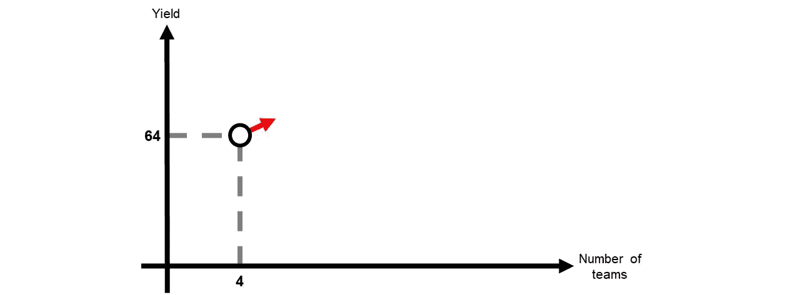
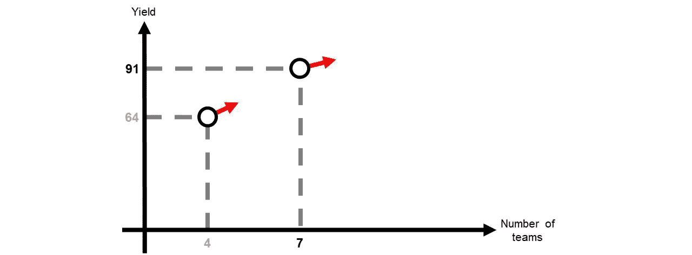
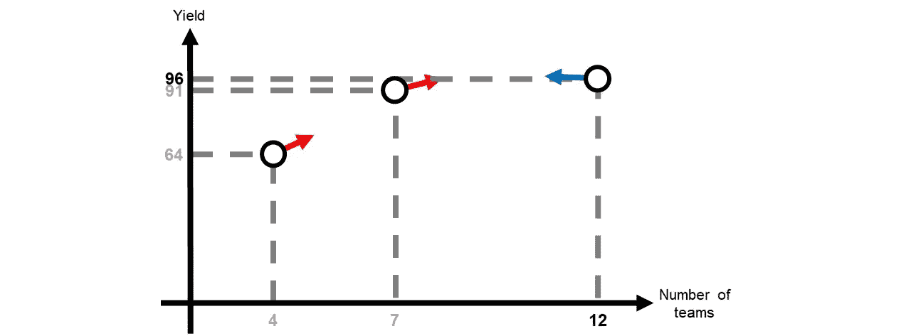
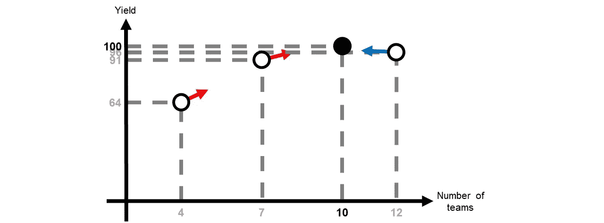
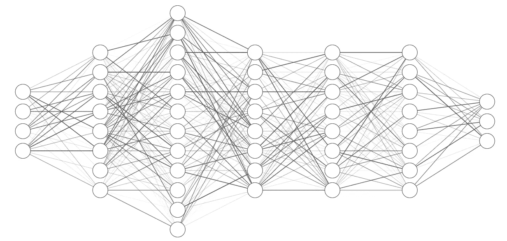

# 微分编程的简明介绍

> 原文：<https://towardsdatascience.com/a-gentle-introduction-to-differentiable-programming-a5f7f5781741?source=collection_archive---------15----------------------->

## 了解人工智能工具如何解决非人工智能问题

罗马法师在 [Unsplash](https://unsplash.com?utm_source=medium&utm_medium=referral) 上拍摄的照片

在一个高层次上，差异化编程是编写可以自动差异化的软件的范例。用简单的英语，我们可以快速检查程序输入的变化如何影响程序输出。例如，假设我们编写了一个自动微分汽车模拟器。使用这个系统，我们可以模拟一辆汽车，并研究如何改变它的一些变量(例如，轮胎半径，悬架等。)与其输出(例如，燃料消耗、噪音等)的变化有关。).

这种模拟器的美妙之处在于，它使我们能够不断改进我们的模拟汽车。例如，如果我们的目标是减少燃料消耗，我们可以迭代运行我们的模拟，寻找对其消耗有负面影响的变量，并尝试新的设置。同样，一个可区分的工厂模拟器可以调整其操作，以减少浪费或增加产量。

差异化不是一个新颖的概念。可区分编程的真正创新是自动完成，没有定制的例程或解算器。这个微小的变化包含了相当多的含义，因为通过差异化进行优化是一个强大但极其昂贵的框架。

迄今为止，利用导数解决问题一直是一个小众话题，只留给更倾向于数学的领域，如人工智能和运筹学。然而，有了自动微分，启动和运行这些系统所需的许多数学基础工作都被取消了，从而将这些方法展示给了更广泛的受众。

如果你仍然不确定这个概念是否与你相关，请考虑深度学习的进展量。有了自动微分，研究人员开始询问这些系统如何改进它们的网络，以在特定数据集上表现更好，这一过程被称为反向传播。通过这样做，该领域开始更容易地探索不同的网络和方法，最终取得了我们今天看到的巨大成功，如 GPT-3 和斯泰勒根模型。

在整篇文章中，我将详细阐述什么是微分以及它能实现什么，然后概述如何使用 TensorFlow 进行通用微分编程。最后，我们概述了它的一些局限性以及在哪些情况下不能使用它。

如果这个话题引起了你的兴趣，请继续阅读:)

# 可微分规划

让我们从什么是差异化编程的一些定义开始，从最字面的定义开始，到更有用的定义:

*   一种可以自动区分程序的编码方式
*   使用梯度下降解决问题的通用范例
*   将深度学习推广到更广泛的一类问题

解开这些定义，三个概念脱颖而出:*微分、梯度下降、*和*深度学习*。为了理解接下来的部分，我们需要更好地理解这些术语。

## 区别

想象你是一家成长中企业的老板。你有一个单一的工厂，你对它的生产力相当不满意。为了改善这种状况，你雇佣了一位顶尖的数学家，他仔细研究了工厂流水线，并得出结论:其生产率遵循以下公式:

*F(x)= ~此处添加疯狂数学~*

即 *x* 工厂中工作的团队数量和 *F(x)* 工厂产量，以生产的单位数千计。其余的呢？其余的你不知道。所以我们能做的就是尝试数值和询问数学家。

现在，有四个团队，所以，根据公式，你的工厂产量是 *F(4) = 64* 千单位。作为所有者并寻求提高工厂产量，你问数学家:*我应该增加还是减少团队数量？*

暂停一下这个例子，你刚才问了数学上人们称之为**的函数导数**:改变一个输入如何影响输出。在我们的案例中，改变团队数量如何影响工厂的整体生产。

如果导数为正，意味着增加团队数量会提高生产率。同样，负导数指出更少的团队会更有生产力。但是，请记住*导数只告诉你正确的方向；它没有告诉你应该改变多少。*

梯度下降优化的第一步。作者图片

从视觉上看，我们知道有四个团队，工厂生产 64，000 个单位，增加组的数量(向右移动)，我们期望增加我们的产量。

回到例子，*你不需要知道如何计算导数，因为我们可以自动计算。我说的自动，是指值得信赖的数学家，他会告诉你导数是正的。*

## 梯度下降

因为我们知道我们需要往哪个方向发展(雇佣更多的团队)，但是我们不知道我们需要增加多少个团队，*我们做一个猜测:我们再雇佣三个团队*。结果工厂用七个团队生产 F(7)= 9.1 万台，提高了 2.7 万台！

第二步。从 4 个团队到 7 个团队，我们的产量从 64，000 台增加到 91，000 台。作者图片

看到结果，你决定再次向数学家寻求更好的方向——*和* *答案是雇佣更多的团队。*

有点贪心，你决定比上次更进一步，所以你雇佣了五个新团队，总共 12 个。回到公式，F(12) = 96。这次没有这样的改善，尤其是考虑到你现在有更多的薪水要付。

第三步。从 7 个团队到 12 个团队的巨大飞跃只是略微增加了产量:从 9.1 万台增加到 9.6 万台。这一次，导数换到了另一边(蓝色箭头)。指出我们现在需要减少(而不是增加)团队的数量。作者图片

你困惑地问数学家，你是否应该雇用更多的人。数学家这次摇摇头，告诉你裁员会提高生产率(开玩笑，她说的原话是“导数是负的”)。

伤心但贪婪的你决定放走两队，一共保留十队。使用公式，F(10) = 100。事实上，正如这位数学家所说，让一些人离开会让工厂不那么拥挤，从而提高生产率。

第四步也是最后一步优化。通过取消两个团队，你达到了最佳表现。你知道它是最优的，因为导数是 0。因此，你找到了最佳点。作者图片

此时，你不确定是否应该解散更多或更少的队伍，所以你再次询问数学家。令你惊讶的是，她说工厂现在很完美。导数为零。向任何方向发展都会损害生产力。

本节描述的过程是*梯度下降(或上升)*，梯度只是导数的一个别称。在非正式的术语中，我们通过沿着梯度冲浪来优化一个函数。如果它说增加，你就增加。如果它让你减少，你就减少。

这个过程完美吗？不，不是的。从某种意义上说，这是一种数学直觉。它告诉你方向，但不是你要走多远。此外，你要从某个地方开始，根据你从哪里开始，你将不得不走或多或少，直到你找到那个甜蜜点。

## 深度学习

到目前为止，你可能会问，每个团队的成本是多少？我们优化的只是生产率，而不是利润。要做到这一点，我们需要在公式中加入其他相关元素，如工人的工资、单位成本、销售价格、产品需求等。

其中一些因素是季节性的，如工资和需求，每月略有不同。其他的随着生产力而变化。例如，你做的越多，通过大量购买材料你就能节省越多。相反，当你向市场投放更多的产品时，你的产品需求会向相反的方向下降。此外，获得的利润也要缴税，具体视总收入而定。

考虑到 *t* 为当前月份， *u* 为生产的单位数量， *p* 为您打算出售每个单位的价格， *x* 为团队数量，数学家得出您工厂的利润是所有这些项的组合，如公式所示:

*利润(t，u，p，x) =税收(需求(t，p) ⋅ u⋅ (p 成本(u))—工资(x)*

最后，为了得到一整年的感觉，数学家建议对所有十二个月的这个公式的值求和。

你的第一印象是你究竟会用这样一个方程做什么。但是，你很快回忆起*你不必知道很多；只要你有一个梯度可以遵循，你就可以慢慢的但是稳步的优化*这个公式，沿着梯度方向走。你唯一真正的任务是定义利润函数；系统会完成剩下的工作。

在人工智能中，神经网络只不过是简单函数的组合，这些简单函数产生一个复杂的整体。通过反复向它提供输入并查询方向来调整它的参数，我们将这个数字怪物从输出胡言乱语驯服为输出值。神经网络是复杂性理论的完美例子，随机森林也是如此。他们展示了复杂的行为是如何从简单、愚蠢的片段中产生的。

神经网络只不过是一堆神经元阵列。使用 [NNSVG](http://alexlenail.me/NN-SVG/index.html) 创建

深度学习中的“深度”是这些系统基于冗长的功能组合，从它们的普通片段中产生复杂的“深度”行为。因此，这些系统对于简单的问题来说过于强大，但对于复杂的问题来说却足够强大。相反，肤浅的模型擅长更直接的任务；然而，它们的简单性是有限制的。

几十年来，深度模型从未流行过:(1)它们太重了，无法使用，以及(2)它们很难训练。虽然摩尔定律有望解决前者，但难以捉摸的后者仍然难以捉摸。

什么变了？*基于梯度的技术*。我们不使用直接且可解释的训练算法，而是迭代优化模型，以在关键指标上获得更高的分数。更好的是，如果我们设计算法来为我们计算梯度，我们可以疯狂地研究模型，而不太关心整体分析表达式的存在(或长度)。

在我们的例子中，一个真正的工厂模拟器将是一个复杂的元素组合，每个元素都有自己的一组变量来模拟真实事物的基本工作方式。虽然这种系统几乎不可能进行分析推理，但自动微分引擎给了我们难得的机会来理解这些复杂的野兽，并根据需要驾驭它们。

用一种更哲学的语气来说，虽然我们无法计算生活的梯度，但我们总是努力遵循我们认为会改善生活的方向。无论是攻读学位、转换领域，还是仅仅为了升职，我们都在一次又一次地猜测，希望能过上更幸福、更充实的生活。如果我们可以缩小视野，展望未来，我们会的，但是既然我们不能，我们最好的选择就是跟随我们所知道的本地最佳方向。某种意义上，对数学来说，梯度下降只是应用生活。

# 编码示例

在上面的例子中， *F(x)* 实际上是 *-x + 20x。*当时，我们进行了人工梯度下降。在这一节中，我们将讨论如何通过软件实现这一点，以及我们可以如何巧妙应对。代码如下:

优化函数的梯度上升的简单张量流实现

上面的 TensorFlow 代码定义了一个函数 *x* 和两个变量: *x0* ，初始化为 TensorFlow 变量，以及*步骤*，这是我们将执行的优化遍数。第 8–14 行定义了实际的优化循环。对于每一步，我们使用一个 *GradientTape* 对象来记录 *y = function(x0)* 的梯度。换句话说，我们正在对当前 *x0* 的 *F(x)* 的值进行采样，并将其保存到一个名为 *y* 的变量中。

真正的魔力在第 12–14 行中定义。首先，我们让磁带计算 *x0* 相对于 *y 的梯度。*换句话说，我们在问 *x0* 如何影响*y——输入如何影响输出*。然后，在第 14 行，我们沿着渐变的方向移动当前的猜测( *x0* )。这一次，我们使用*渐变值*作为我们应该移动多少的预感。具体来说，我们移动四分之一的梯度。原因很简单:步长越大，超过优化的几率就越高。小步走总是比大步走更安全。最后，第 13 行打印了我们的进度。

运行该代码片段，我们得到:

> 步长[1/10]: F(7.00) = 64.00，梯度:12.00
> 步长[2/10]: F(8.50) = 91.00，梯度:6.00
> 步长[3/10]: F(9.25) = 97.75，梯度:3.00
> 步长[4/10]: F(9.62) = 99.44，梯度:1.50
> 步长[5/10

到了第八步，我们已经非常接近 10，可以将结果四舍五入到 100。用数学术语来说，我们*在八步之内收敛*。这种方法的最终目标是趋同——达到一个除此之外任何改进都微不足道的程度。

出于教育目的，我强烈建议您自己运行上面的代码片段，并使用 0.25 系数。我们称之为“*学习率*”或“步长”如果你把它设置得太大，比如 2，优化就会失败。从 4 会到 28，-44，172，-476，1468……如果你设置的太小，0.01，那就要走 100 多步才能到达 *x = 10。*在实践中使用这些技术时，调整学习率对于提高结果至关重要。

上面的例子是一个*坡度上升*的场景。我们希望*最大化*一个函数。更流行的算法是*梯度下降*，它寻求*最小化*一个函数。后者更受欢迎，因为它允许我们*设定目标*并不断向*推进，以最小化到目标*的距离。例如，当在机器学习中工作时，我们经常希望我们的模型的误差达到 0。因此，这是一个最小化公式。

下面的代码片段试图优化我们的函数，通过最小化 *y* 和 48 之间的距离来逼近任意值 48。

实现梯度下降以找到接近目标的函数值。

我们添加了函数*接近目标*，该函数计算 *y* 和我们的目标 *t* 之间的平方距离。在我们的优化过程中，我们现在计算 *y，*，然后我们计算 *t* 。此外， *x0* 的梯度现在是相对于 *t* 而言的。最后我们把学习率调整为 *-0.001* 。负号表示*坡度下降*中的*下降*。通过反复试验找到了 0.001 的值。大于该值的值不会在十步内收敛。

到目前为止，上面的代码片段足以解决许多需要您为函数找到一个好的输入值的任务。神经网络的训练仅仅是寻找最佳参数来匹配输入和输出。例如，考虑关于定制训练循环的官方指南。该函数成为神经网络， *approach_target* 被损失函数代替，并且 *x0* 更新变成(Adam)优化器。然后，整个过程被布置成在几个时期内对几个批次进行工作。

# 限制

作为实现梯度下降的可微分编程框架，它的用例与限制本质上是相同的。梯度下降的一般用例如下:

1.  问题是数值的(即，它可以被定义为数学表达式)
2.  它足够光滑(也就是说，你可以计算它的导数)
3.  它太复杂了，你不能用更简单的方法解决它

这导致了可微编程的主要限制:它不能解决不能作为纯数值问题的问题。例如，如果你的问题充满了 if 语句，它就不再足够平滑，并且很可能无法通过梯度下降进行优化。另一方面，如果你的问题本质上是随机的，这些技术仍然可以使用，但是也要考虑梯度的随机性。

相反，如果你的问题完全是数值化的，但过于简单，就应该使用其他技术。在上面的例子中， *F(x)* 是 *-x + 20x。*我们使用梯度下降四次将其优化为 *F(10) = 100* 。但是，如果我们早一点知道解析表达式，我们会计算导数的解析形式(*F’(x)=-2x+20*)，求它的根(x = 10)，得到我们的答案。此外，这些方法不适合整数，因为它们不平滑。为此，您需要使用一些额外的技巧来生成整数解。

到目前为止，这些都是你根本不应该使用梯度下降的情况。然而，即使在你可以使用它的情况下，有一件事你也不应该忘记:*你总是需要一个优化的起点。*

如果从其他位置开始尝试几次梯度下降优化，您可能会收敛到不同的值。对于多变量的多维问题更是如此。不能保证你会达到最好的结果。唯一的保证是，你会在一个比你开始时更好的地方结束，或者，在最坏的情况下，留在你现在的地方。

你可以把它想象成在喜马拉雅山的一个随机的地方，能够看到你面前只有十英尺。这足以爬到你所在的山顶，但你永远不会知道你是在最高峰还是仅仅在局部最大值。正如下图所示。

本杰明·沃罗斯在 [Unsplash](https://unsplash.com?utm_source=medium&utm_medium=referral) 上拍摄的照片。作者编辑

他的一切都是为了现在。如果你对这篇文章有任何问题，请随时评论或与我联系。

如果你是中新，我强烈推荐[订阅](https://ygorserpa.medium.com/membership)。对于数据和 IT 专业人员来说，中型文章是 StackOverflow 的完美组合，对于新手来说更是如此。注册时请考虑使用[我的会员链接。](https://ygorserpa.medium.com/membership)

感谢阅读:)