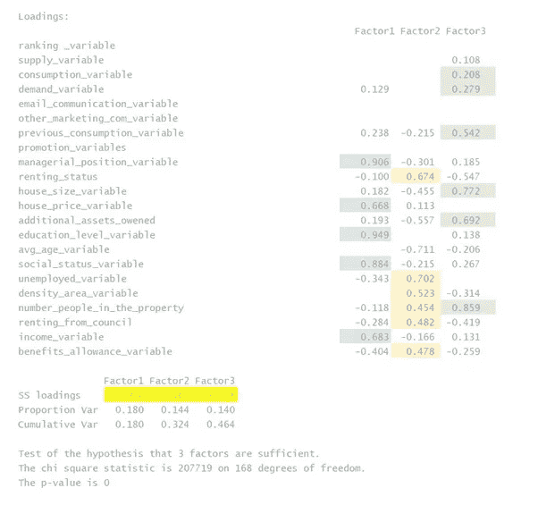
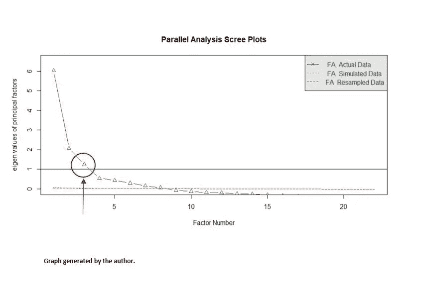
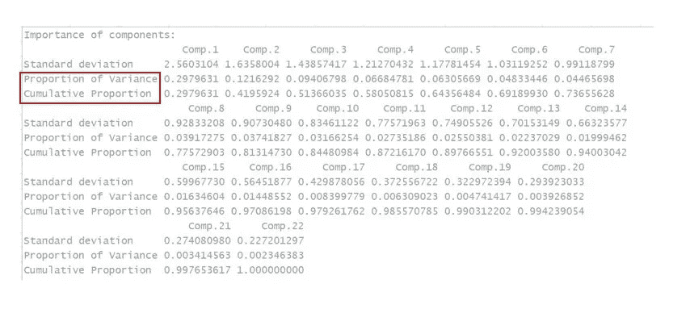
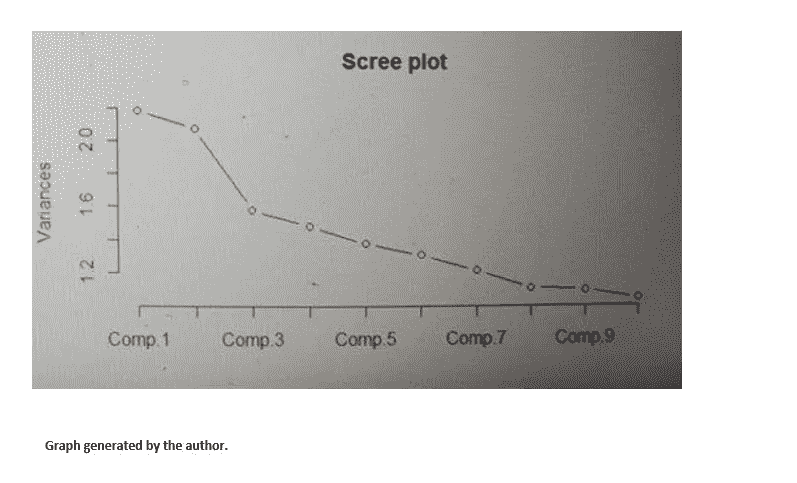

# 维度缩减的简明介绍

> 原文：<https://towardsdatascience.com/a-gentle-introduction-to-dimensionality-reduction-21b3fa63f1ca?source=collection_archive---------30----------------------->

## **采用探索性因子分析(EFA)和主成分分析(PCA)**

作者拍摄的

正如探索性一词所暗示，探索性因素分析(EFA)是寻求理解变量之间关系的初步*检验。当第一次接触数据时，研究人员可能对输入变量及其关系没有任何假设。研究者的出发点是了解模式和影响这种模式的因素，以确定变量之间的关系。本文的主题 EFA 是一种统计技术，旨在确定影响这些变量的潜在因素。*

*为了在这个主题上有所发展，我将下一步进入模型构建领域(我最喜欢的学科)来解释全民教育的基本原理。在建立模型时，收集给定数量的输入变量(自变量)，这些变量被识别为与解释输出变量(也称为因变量)的变化相关。假设输入和输出变量之间存在某种关系，人们试图测量输出变量的变化量，这种变化量可以用一个保持所有其他常数的输入变量来解释，“其他条件不变”。由于“噪声”，如人们无法捕捉的未观察到的人类行为，缺乏时间和资源来收集影响输出变量的全部输入，因此引入了一个误差项，该误差项表示模型中未包括的任何其他内容。从数学上讲，这可以用以下公式表示:*

**

*在运行上述线性回归模型时，要检查的一件事是输入变量之间的关联程度(如果它们解释了因变量的变化，那么它们之间一定存在某种关系)。我们称之为“相关性分析”，旨在测量两个或多个输入变量之间的关联程度。因为太多的输入变量会导致模型过于完美，所以需要确保模型中只包含相关变量，即解释因变量大部分变化的变量。如果过度拟合，模型会变得过于特定于它所训练的数据，因为它会记住正在建模的关系。不够一般化，当模型在看不见的数据上运行时，它就不能理解现在存在于数据中的“更新”关系，从而导致不可靠的预测。因此，太多的变量是不好的，但人们希望确保相关的变量被包括在内。这就是全民教育发挥作用的地方。在机器学习术语中，诸如 EFA、主成分分析(PCA)等技术属于无监督学习方法的范畴，后者是一种仅分析输入变量以从数据中学习并理解输入之间的模式以及识别具有重大影响的因素的技术。*

*现在，让我们退一步，问一问:我们能不能确定一个给定数量的对多个输入变量有着共同重要影响的“因素”？相关输入之间的一些变化可以用“共同因素”来解释吗？如果是这种情况，是否有可能将“独特因素”变异类型确定为影响单个输入变量？在这种相互关联的关系中，是否也存在一种无法测量的遗传误差比例？在 EFA 中，输入变量是以下各项的函数:公共因子、独特因子和误差项。从技术上讲，这是这样写的:*

**

*在这里，共同的变化是我们感兴趣的！EFA 关注影响多个变量的共同因素，因此可以使用这些因素来减少进入模型的变量数量，从而降低其复杂性，而不损害其预测能力。*

*探索性因素分析中的一个关键概念是关于潜在变量的概念。从变量的形式来看，这些是未被观察到的但有影响的因素，它们解释了输入变量中常见的很大一部分变化。在本文中，我将交替使用“潜在变量”和“因素”的定义。在最顶层，潜在变量是从原始输入变量的组合中产生的。因此，生成的因子的数量等于原始变量的数量。根据每个原始投入所占的方差比例，产生一个加权值，称为因素负荷。这些很重要！因素负荷是范围从-1 到 1 的系数，测量给定因素对给定输入的相关性和影响大小。主要目的是确定潜在变量的数量，其中包含在原始输入变量中的最大量的信息被保留，如通过因子加载所测量的。*

*好的，那么如何计算因子载荷呢？好了，是时候再退一步，深入了解更多细节了。在 EFA 中，生成的潜在变量(新变量)的数量等于原始输入变量的数量。在此基础上，一个众所周知的变量之间的相关矩阵和相关矩阵的特征向量和特征值被导出。成对地，对于每个潜在变量，生成特征向量和特征值。前者，每个特征值的权重向量指示一个方向，而后者测量由该方向上的给定潜在变量解释的方差的量。取特征值的平方根(潜在变量的标准偏差)是奇异值分解，当乘以特征向量时产生因子载荷。因此，上面的转换为跨因子的每个原始输入变量生成一个因子加载。这很重要！*因子载荷反映了每个原始输入变量与潜在变量*的相关程度。具有最高特征值的特征向量是第一个潜在变量。因此，按照降序，第一个潜在变量是最重要的潜在变量，占数据中大部分(普通)方差，其次是第二个，依此类推。*

*随着额外的潜在变量的增加，数据中较少的差异得到解释。传统上，加载值大于 0.3 的因子表示相关变量。如同在相关性中一样,“高”相关值在定义时是一个主观点。现在，负载系数大于 1 的情况时有发生。这些被视为虚假结果的指示，由所谓的不当解决方案引起，是输出有问题的迹象。*

*接下来，我将通过实现 EFA 和主成分分析(PCA)来说明以上内容。这样做，我的目的是强调这些统计技术在揭示和描述数据集的底层结构方面的力量。在比较这两者时，本文只讨论关键的相同点和不同点，主要是为了根据手头的分析来强调这两者的用途。*

*本文使用了来自一家私人公司的 98，586 个观察值和总共 22 个输入变量的数据集。由于保密原因，数据来源不能透露。然而，使用类似的变量类型可以很容易地再现该分析。通过对上述数据集进行 EFA 和 PCA，我的目标是在实施降维技术时建立一种合理的方法，而不是关注输出本身。*

*分析由三个阶段组成:第一阶段:根据人口数据的 14 个变量分析第一次产出。在第一组输入变量中，发现了相对较少数量的缺失值，因此提供了相对较大的数据集作为分析的基础。第二阶段:在初步结果的基础上，对输入处理提出了一些调整。与第一阶段相反，输入变量现在被标准化为标度变量，因此它们的范围都在(0–1)之间。第三阶段:在市场营销、消费者行为数据(即消费、沟通渠道)的基础上纳入额外变量，共 22 个变量进行分析。添加这些是为了说明模型设定错误，因为后者已被确定为可能导致不当解决方案的相关元素。但是，添加的第二组输入变量中存在大量缺失值，导致运行分析的数据集较小。*

> *第一阶段:初步结果*

*可变治疗:*

*某些输入变量缺少值的条目被删除，因为这些条目仅占总数据点的 0.03%，从而将观察值的数量从 98，594 减少到 98，586。*

*由于异常值的存在，使用四分位间距方法，Q3+(1.5*IQR)以上的数据点被封顶，因此移除了位于盒图上超出上须的值。*

*主要结果:*

*海伍德案件侦破。海伍德案例是方差被限制为负值或接近零值的因子载荷的结果。正如我们在上面看到的，因素分析是基于被分析变量的相关矩阵。在海伍德的情况下，一组变量的任何线性组合都会产生一个不正定的协方差矩阵。从技术上讲，由于方差是标准偏差的平方根输出，因此它不能为负，因为这表示有偏差/不可靠的因子加载估计。*

*这就是所谓的不适当的解决方案，其中估计值(因子负载)被限制在一个定义的范围内，使得潜在的问题(负方差)未被修正，从而允许无效的估计值。在这里，由于潜在变量的**解释明显不符合分析的目的，因此因素负荷是有偏差的，因此需要纠正。在这种情况下，软件产生以下信息(或类似信息):“潜在变量的协方差矩阵不是正定的”。在这里，输入变量领域的研究人员可以选择使用协方差表会话运行模型摘要，以检查高度相关的变量，并相应地整理/移除它们。***

*纠正海伍德案例需要考虑的因素主要有:1)变量中的高值，2)模型设定错误，3)样本大小。由于我使用的是相对较大的数据集，并且假设变量没有定义域，我将首先尝试不同的输入模型来说明模型的错误设定，即添加第一个和(可能)删除后面的输入变量，因为我的兴趣是识别潜在变量，突出所有可用变量中最重要的输入变量。在此之前，我将首先归一化输入变量，以确保它们都在相同的值范围内，从而消除较高值导致有偏差结果的可能性。*

*基于以上所述，进行第一次整改。*

> *第二阶段:变量规范化。*

*可变治疗:*

*在这个阶段，变量被规范化，保持其他一切不变。使用最小-最大缩放变量进行缩放，数据点固定在 0-1 范围内。上述目的是通过防止偏向具有较大值的特征从而促进最小梯度下降和收敛来提高算法的性能。*

*主要结果:*

*海伍德案件仍然存在。根据型号规格进行进一步调整。*

> *第三阶段:正常化*和*模型规格。*

*可变治疗:*

*在第三个也是最后一个阶段，增加了更多的变量。这组输入变量被发现有更大比例的缺失值。在这个阶段，我将删除最近添加的一组变量中缺少值的条目，使观察总数减少到 65，605。具有缺失值的变量的中值填充是常见的做法，以便保留原始的观察值。在本文中，考虑到在此之后留下的相对较大的数据集，我将删除丢失的值，因此我确保分析符合其目的，并且没有其他偏见元素被带入分析。*

*因为机器学习技术被证明为具有较高值域的特征分配较高的权重，所以变量保持归一化，如在先前阶段执行的那样。*

*主要结果:*

*没有找到不合适的解决方案。*

*最终输出是什么样的？这是如何解读的？根据所使用的包，EFA 输出中会显示不同的信息和指标。然而，从最终产出的分析来看，就相关因素而言，仍应得出相同的结论。在不同的软件包中，我使用来自 R 的 factanal 函数，它是基于最大似然估计(MLE)的。尽管最大似然估计可能更为人所知，但其他软件包有一个参数，可以用来建立一个给定的估计量。读者应该熟悉其他软件包执行的不同评估方法，这超出了本文的范围。*

*下面一行代码显示了 factanal 函数的主要参数:*

**

*根据 factanal 函数，定义了以下参数:数据框架、因子数量(怀疑相关)和因子轮换方法。简而言之，对于给定数量的因子，对于所有涉及的变量，不存在唯一的因子加载矩阵解，而是存在无限数量的(因子加载)解。在二维空间中，出于可视化和解释的目的，两个因子可以被认为是两个*轴*，其中因子负载作为代表来自每个原始输入变量的方差贡献的值。这些轴的旋转方法(基于方差方向的最佳拟合)被称为正交因子、垂直因子(轴)的“varimax ”,即假设因子之间没有相关性。从希腊单词“直立角”的意思来看，这仅仅意味着坐标空间中的轴是垂直的，因此没有关联。我再次建议读者熟悉不同的旋转方法。*

*运行 factanal 函数的输出如下所示。让我们提醒自己，一个是选择潜在变量的数量，这些潜在变量在原始输入变量中捕捉到最大数量的(公共)方差。因此，EFA 旨在确定一个少于原始变量总数的最佳潜在变量数。以下输出基于 3 因素解决方案。可以看出，唯一性度量是首先提供的。范围从 0 到 1。基于每个原始变量的独特方差类型贡献，解释该度量的一种方式是获得所谓的公度性度量。公度是一组原始输入变量共有的方差的比例，由变量 ith 贡献，并由所选因子的数量(在本例中为 3)说明。这通过从唯一性值中减去 1 来计算。*

*是的，唯一性值越低，给定输入变量的方差贡献越大。例如，从下面的输出来看，教育对原始变量中常见的数据总方差有 92%的显著贡献，即(1–0.079 = 0.921)。事实上，该变量的因子负荷接近 1，即 0.949，因此与因子 1 高度相关，因子 1 之后是管理角色变量。让我们再一次提醒自己，因子载荷代表了一个给定变量相对于一个给定因子的相关性。它的范围从-1 到 1。正如我们在整个分析过程中所讨论的，以及我们将在接下来演示的，因子加载用于理解一个因子中具有最高公共方差贡献的变量。重要的是，这有助于描述和标记潜在/未观察到的变量/因素。*

*那么,“高”方差是如何定义的？这是全民教育中隐含的主观性的一部分。因此，这应该主要由研究者的解释和它如何适合手头的分析来确定。好的，给定这个，如何解释载荷，从而描述和定义它们？*

****

*从输出中，突出显示了因子负载大于 0.3 的变量。该值越高，给定输入变量相对于因子的相关性越高。*

*可以看出，因素 1 将教育水平、社会地位、房价、收入、需求、管理角色职位等变量确定为相关变量，它们都与个人的**社会经济水平**的潜在变量相关联。*

*因素 2 确定了与**社会保障转移、社会福利、津贴指标的潜在变量相关的变量，如租房、从未工作或失业状态、面积密度、房子里的人数、福利状态。***

*最后，因素 3 确定了一些变量，如一个家庭的人数、房子大小、来自其他资产的收入，作为衡量生活水平、购买力的潜在变量**。***

*输出的最后部分显示 SS 加载、比例方差、累积方差和假设检验。SS 载荷是载荷的平方和，如果该值大于 1，则表明该因子具有显著的解释力。如黄色单元格所示，这些值的减少是后续因素，解释了数据中较少的变化。值高于此阈值的因子将被保留。累积方差告诉我们，当考虑到前三个因素时，数据中 46%的常见方差得到了解释。这可能看起来很低，表明需要包括更多因素，在这种情况下超过 3 个。同样，这是基于手头的分析。可以运行具有不同数量的因素以及不同数量的原始输入变量的测试，以验证最后一部分如何基于后续调整而变化。*

*可以绘制特征值图来形象化上述内容。在 R 中，Dino 的“paran”包可用于运行平行分析 Scree 图。如图所示，特征值标绘在 y 轴上(由因子解释的总公共方差),因子数标绘在 x 轴上。正如我们所了解的，特征值代表由给定因子解释的所有原始变量的总公度方差。因此，我们希望选择值大于 1 的因子数。这被用作因子选择的标准，其中 1 个因子预期比 1 个原始变量解释更多的方差。正如预期的那样，可以看到因子 1 占最大方差，如蓝色曲线所示，从第一个因子到最后一个因子，方差逐渐减小。事实上，三因素解决方案显示并验证了足够数量的因素可用于此分析。*

**

*两者都是用于降维的统计技术，为了便于比较，本文额外提到了主成分分析(PCA ),从而突出了与 EFA 相比的关键差异。*

*主成分相当于一个潜在变量，是观察到的原始变量的线性加权组合。考虑坐标空间中的轴，PCA 最小化数据相对于主分量(轴)的平方距离的和。提取的成分数量旨在保留观察到的由原始变量引起的大部分方差。在这里，与 EFA 类似，高度相关的变量(因此对数据中的大部分方差有贡献)在第一个分量中表示，这是解释数据中的大部分方差的分量，随后是第二个分量，随后随着分量的增加，解释的方差越来越小。对于 PCA，原始变量的总数被变换到具有相等数量的新变量(主分量)的新坐标系中。根据线性变换，生成特征值和特征向量。代表由每个变量贡献的方差量的特征值，以及作为代表最适合数据的方差方向的权重的特征向量，迭代地导出本质上正交的分量。主成分和 EFA 共享相似的假设，当如上所述处理原始输入变量时，在本分析中已经考虑了这些假设。对这些的详细描述超出了本文的范围，但这是研究人员需要进一步研究的主题。*

*在 R 的不同包中，princomp()函数用于执行 PCA，输出如下所示。*

**

*其中参数“cor”在函数中定义了使用相关矩阵来导出主分量。*

**

*可以看到，已经创建了 22 个组件，这等于原始变量的数量。在这里，我们将“方差比例”理解为由给定成分解释的最大方差。“累积比例”将提供一个累计的最大变化量，该变化量可解释给定数量的成分。对于比较例 3，这是 51%。事实上，通过提取所有 22 个成分，我们将考虑数据中的所有变化，这就是“累积比例”等于 1 的地方。然而，我们已经知道 PCA 的目标是一个少于原始变量数的最优分量数。现在，这很重要:在这里，最大值这个词在理解 PCA 和 EFA 之间的关键区别时变得很重要。简单地说，主成分分析报告了由成分解释的观察到的原始输入变量的最大变化量。相比之下，全民教育报告的是由于无法测量和/或观察的因素而在给定数量的原始输入变量中常见的变化总量。因此，PCA 坚持共同方差等于总方差的强假设。这是，*

**

*因此，使用哪一个主要基于手头的分析。*

*下表显示了五氯苯甲醚在碎石图上的特征值。y 轴标绘方差，x 轴标绘分量数，这清楚地显示了随着更多主分量的加入，方差被解释为下降的速率。*

**

***结论***

*本文使用了一个大小为 98，594 x 22 的数据集。它执行 EFA 和 PCA 作为统计技术来降低数据集中的维数。*

*在 EFA 下，潜在变量的数量代表由于未观察到的因素而出现在数据中的共同方差。*

*在 PCA 下，提取的成分的数量解释了来自观察到的原始变量的数据中存在的最大方差。*

*这两种技术都旨在获得一个最优解，其中组件的数量或因子的数量少于原始输入变量的数量。*

*出于演示目的，本文使用相同的数据集来运行这两种技术。然而，基于手头的分析，研究人员应该致力于确定最合适的技术来使用。*