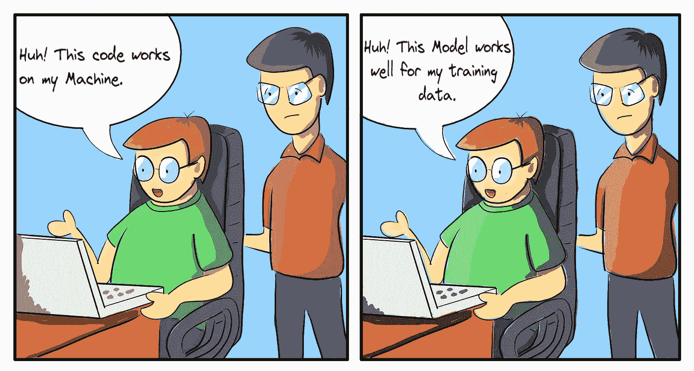
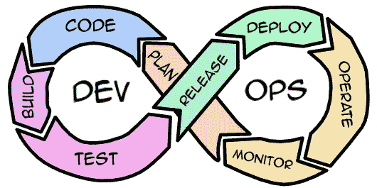
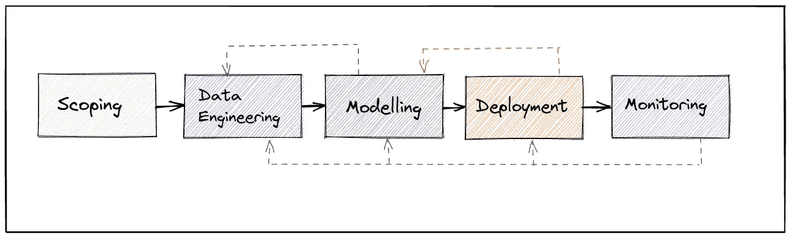
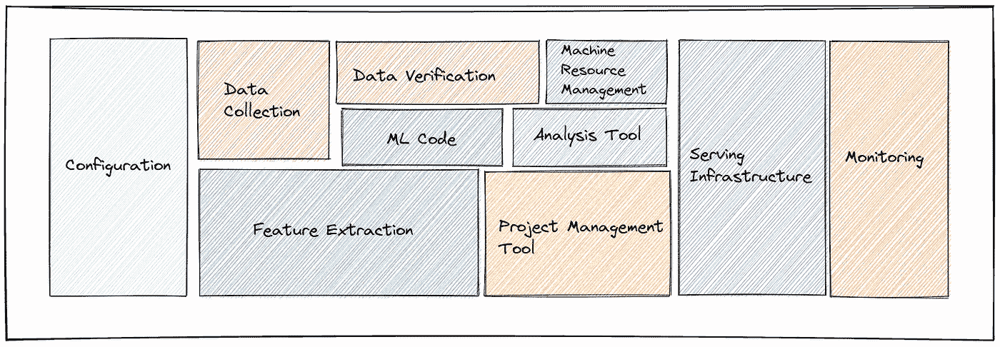
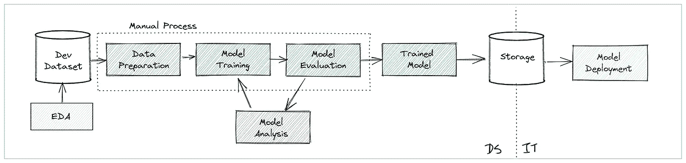
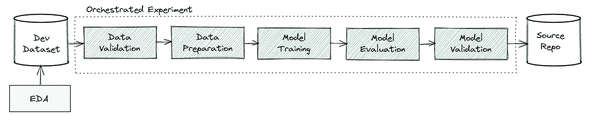
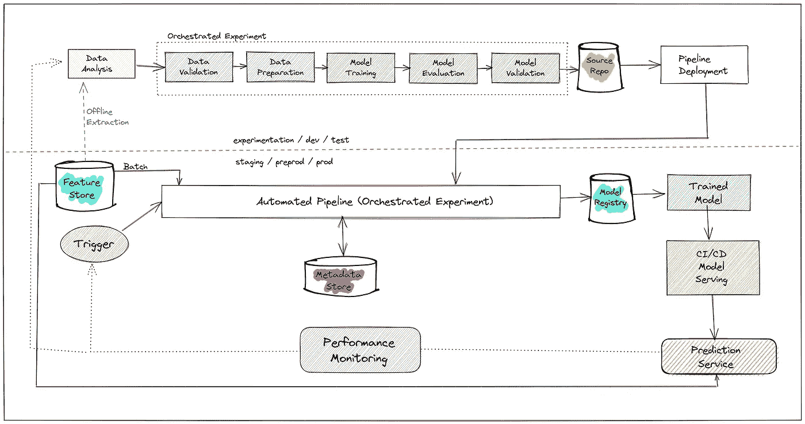

# 对 MLOps 的简单介绍

> 原文：<https://towardsdatascience.com/a-gentle-introduction-to-mlops-7d64a3e890ff?source=collection_archive---------1----------------------->

作者图片

## [行业笔记](https://towardsdatascience.com/tagged/notes-from-industry)

## 机器学习操作世界指南。

你好。

你想了解 MLOps，你来对地方了。

在本文中，我们将了解什么是 MLOps 或机器学习操作。我将试图简化 ML 操作及其相关基础设施的庞大而有趣的世界。这篇文章是写给那些想了解 ML 模型如何被部署到产品中，阶段，过程，以及它所涉及的问题的人的。😅

让我们开始吧！

**来源:**G【iphy.com】T4

# 什么是 MLOps？

机器学习操作涉及一组过程，或者更确切地说，涉及为将 ML 模型部署到生产环境而实施的一系列步骤。在 ML 模型生产就绪之前，需要采取几个步骤。这些流程确保您的模型可以针对大量用户进行扩展，并准确执行。💯

# 我们为什么需要 MLOps？

创建一个 ML 模型来预测你想让它从你输入的数据中预测什么是很容易的。然而，创建一个可靠、快速、准确并能被大量用户使用的 ML 模型是困难的。

MLOps 的必要性可总结如下:

*   ML 模型 ***依赖于海量数据*** ，单人难以掌握。
*   ***难以掌握的参数*** 我们在 ML 模型中进行了微调。微小的变化会导致结果的巨大差异。
*   我们必须跟踪模型使用的特征，特征工程是一项独立的任务，对模型的准确性有很大的贡献。
*   监控一个 ML 模型不同于监控一个已部署的软件或 web 应用程序。
*   ***调试一个 ML 模型是一门极其复杂的艺术***
*   ***模型依赖真实数据进行预测，随着真实数据的变化，模型也要随之变化。这意味着我们必须跟踪新的数据变化，并确保模型进行相应的学习。***

还记得软件工程师使用的老借口吗😅我们想避免它。

软件工程师 vs ML 工程师(图片由作者提供)

# DevOps 与 MLOps

你一定听说过老好人德沃普斯。构建和部署软件应用程序的过程。您可能想知道 MLOps 有何不同。

DevOps 循环(图片由作者提供)

DevOps 阶段的目标是开发软件应用程序。您计划要发布的应用程序的功能、编写代码、构建代码、测试代码、创建发布计划并部署它。您监控部署应用程序的基础设施。如此循环，直到应用程序完全构建完成。

在 MLOps 中，事情是不同的。我们实施以下阶段

ML 项目生命周期(图片由作者提供)

**范围界定—** 我们定义项目， ***检查问题是否需要机器学习来解决*** *。执行需求工程，检查相关数据是否可用。验证数据是否无偏见，是否反映了真实世界的用例。*

**数据工程—** 该阶段包括收集数据、建立基线、清理数据、格式化数据、标记和组织数据。

**建模—** 现在我们来到编码部分，在这里我们创建 ML 模型。我们用处理过的数据训练模型。执行误差分析，定义误差测量，并跟踪模型性能。

**部署—** 在这里，我们打包模型，根据需要将其部署在云中或边缘设备上。打包可以是——用暴露 REST 或 gRPC 端点的 API 服务器、部署在云基础设施上的 docker 容器、部署在无服务器云平台上的模型包装，或者基于边缘的模型的移动应用。

**监控—** 部署完成后，我们依赖监控基础设施来帮助我们维护和更新模型。这一阶段有以下组成部分:

1.  监控我们部署的基础架构的负载、使用、存储和运行状况。这告诉我们 ML 模型部署的环境。
2.  监控模型的性能、准确性、损耗、偏差和数据漂移。这告诉我们模型是否如预期的那样执行，对于真实世界的场景是否有效。

有时会有一个反馈循环，因为一些模型可能需要从用户输入和预测中学习。这个生命周期对于大多数 ML 用例都是有效的。

了解了 ML 项目的基本生命周期之后，让我们看看 ML 方面的基础设施场景是怎样的。

# ML 生产基础设施

ML 基础设施(图片由作者提供)

现在，我们了解了将模型部署到生产环境中所需的基础设施设置。上图可以看到，ML 代码只是其中的一小部分。让我们一个一个的去了解组件。

**数据收集—** 该步骤包括从各种来源收集数据。ML 模型需要大量的数据来学习。数据收集包括整合与问题相关的各种原始数据。也就是说，图像分类可能需要你收集所有可用的图像或者在网上搜寻图像。语音识别可能需要您收集大量的音频样本。

**数据验证—** 在这一步中，我们检查数据的有效性，收集的数据是否是最新的、可靠的、反映真实世界的，是否采用适当的可消费格式，数据的结构是否正确。

**特征提取—** 这里，我们为模型选择最佳特征进行预测。换句话说，您的模型可能不需要完整的所有数据来发现模式，一些列或部分数据可能根本不会被使用。当删除几列时，一些模型表现良好。我们通常根据重要性对特征进行排序，高重要性的特征被包括在内，低重要性或接近零重要性的特征被丢弃。

**配置—** 这一步包括建立通信协议、系统集成，以及管道中的各种组件如何相互通信。您希望您的数据管道连接到数据库，您希望您的 ML 模型以适当的访问权限连接到数据库，您的模型以某种方式公开预测端点，您的模型输入以某种方式格式化。系统所需的所有必要配置都需要正确完成并记录在案。

**ML 代码—** 现在我们来看实际的编码部分。在这个阶段，我们开发一个基础模型，它可以从数据中学习并进行预测。有大量的 ML 库支持多种语言。例如:tensorflow，pytorch，scikit-learn，keras，fast-ai 等等。一旦我们有了一个模型，我们就开始通过调整超参数来改善它的性能，测试不同的学习方法，直到我们满意地认为这个模型比它的前一个版本表现得相对更好。

**机器资源管理—** 这一步包括 ML 模型的资源规划。通常，ML 模型在 CPU、内存和存储方面需要大量资源。深度学习模型依赖 GPU 和 TPU 进行计算。训练 ML 模型涉及时间和金钱方面的成本。较慢的 CPU 需要更多的时间，功能强大的 CPU 价格更高。模型越大，您需要投资的存储空间就越大。

**分析工具—** 一旦您的模型准备就绪，您如何知道该模型的性能是否符合标准。我们在这个阶段决定模型分析。我们如何计算损失，我们应该使用什么样的误差度量，我们如何检查模型是否漂移，预测结果是否正确，模型是否过拟合或欠拟合？通常，我们用来实现模型的库附带了分析工具包和误差度量。

**项目管理工具—** 跟踪一个 ML 项目非常重要。在处理庞大的数据、特性、ML 代码、资源管理时，很容易迷失和混乱。幸运的是，互联网上有很多项目管理工具可以帮助我们。

**服务基础设施—** 一旦模型被开发、测试并准备就绪，我们需要将它部署到用户可以访问的地方。大多数模型部署在云上。像 AWS、GCP 和 Azure 这样的公共云提供商甚至有特定的 ML 相关特性来简化模型的部署。根据预算，您可以选择适合您需求的提供商。

如果我们正在处理基于边缘的模型，我们需要决定如何使用 ML 模型，它可以是用于图像识别、语音识别等用例的移动应用程序。我们还可以为某些用例定制芯片和处理器，比如特斯拉的自动驾驶。在这里，我们必须考虑有多少计算能力可用，以及我们的模型有多大。

**监控—** 我们需要实现一个监控系统来观察我们部署的模型和运行它的系统。收集模型日志、用户访问日志和预测日志将有助于维护模型。有几种监控解决方案，如 greylog、elasticstack 和 fluentd。云提供商通常会提供他们自己的监控系统。

# 走一遍

现在我们已经了解了 ML 项目生命周期是如何工作的，ML 产品中的基础设施场景是怎样的。我们将学习如何在生产中部署 ML 模型。

## 为了理解这一点，我们来看看 Jen 和她对 ML 引擎的追求。

> 珍有一大片南瓜地，每年她都把南瓜卖给市民和当地的南瓜香料拿铁工厂。由于她每年都有巨大的需求，她看着每个南瓜并检查它是好是坏变得很乏味。
> 
> 所以她找你来帮助她开发一个 ML 引擎，帮助她预测一个给定的南瓜是好是坏。

珍需要有人帮她分类南瓜。(图片由作者提供)

这是一个简单的**分类问题。**

让我们讨论一下解决这个问题的方法。

1.  首先，我们收集所有关于 Jen 的南瓜的信息。所有好南瓜，好南瓜，坏南瓜的照片。然后我们请好心的市民寄来他们从珍那里买的南瓜的照片。(有发西瓜图的！😑他们真可耻😒)**这一步是 EDA +编译数据集。**
2.  既然我们已经收集了很多图片。是时候给这些照片贴标签了，在 Jen 的帮助下，我们给几百张照片贴了标签。我们检查图片的分辨率，设置标准分辨率，丢弃低质量的图像，格式化图像对比度和亮度以获得更好的可读性。**这一步是数据准备**
3.  现在我们训练一个张量流模型来对图像进行分类。假设我们使用带有 ReLU 激活的顺序神经网络。我们定义 1 个输入层，2 个隐藏层，1 个输出层，只是一个基本的卷积神经网络。我们将图像数据集分成训练集和测试集，将训练数据作为输入提供给卷积网。模型被训练。**这一步是模特训练。**
4.  一旦模型被训练，我们通过使用测试数据集来评估模型。基于预测，我们比较结果并检查预测的准确性。**这一步是模型评估。**
5.  我们调整模型的超参数，以增加准确性，重新训练模型，并再次评估它。这个迭代一直进行到我们对 Jen 的模型满意为止。**这一步是模型分析。**
6.  现在我们有了工作模型，我们部署它，以便 Jen 可以在日常工作中使用这个 ML 引擎。我们在云中创建一个带有预测 API 的服务器，创建一个应用程序或网站，她可以在那里上传图像并实时获得结果。**这是模型部署。**

从数据准备到部署，所有工作我们都是手动完成的。**恭喜你！这个 MLOps 的过程叫做 Level-0。**我们已经实现了我们的部署，但是所有的事情都是手动完成的。可以参考下图。

MLOps 级(图片由作者提供)

珍很开心。😄

分类(按作者分类的图片)

现在需求已经开始上升。您不能每天手动训练模型。因此，您创建了一个自动化管道来验证数据、准备数据并训练模型。您还试图通过比较多个误差度量来获取最佳可用模型。管道会处理好一切。**该流程是 MLOps 的一级。**这里模型的训练和分析是自动进行的。您只需检查是否有适当的数据可用，并确保没有倾斜的数据集，以便模型得到适当的训练。

MLOps Level-1(图片由作者提供)

大多数公司都达到了这一水平。这也可以由单个数据科学家或 ML 工程师实现。当您在开发环境中测试模型时，这已经足够好了。

现在让我们问自己几个问题。

*   你的模型能够用不同种类的南瓜复制这个结果吗？
*   当新数据添加到数据集中时，您的模型能够重新训练吗？
*   你的模型能同时被几十万人使用吗？缩放良好？
*   当您在一个大区域甚至全球范围内部署模型时，您如何跟踪它们呢？

这将我们引向**级别 2。**

> 是时候**看大图了……**

MLOps Level-2(图片由作者提供)

我们来分解一下流程。

*   我们所做的一切 ***红线上方的*** ，在流程图中——就是***Level——1***。
*   这整个 ***精心安排的实验*** 现在是 ***自动化 ML 流水线的一部分。***
*   我们引入了一个 ***特征库*** ，它从各种来源提取数据，并将数据转换成模型所需的特征。ML 管道批量使用来自存储的数据。
*   ML 管道连接到一个 ***元数据存储器*** 。可以把它想象成簿记，因为您不需要手动训练模型——这个存储有管道中每个阶段的记录。一个阶段完成后，下一个阶段查找记录列表，找到前一个阶段的记录，从那里开始。
*   然后将模型存储在 ***模型注册表中。*** 我们这里存储了一堆各种精度的模型。基于需求，适当的模型然后被发送到 ***CI/CD 管道*** ，该管道将其部署为 ***预测服务。*** 授权用户能够在需要时访问预测服务。
*   对该系统的性能进行监控。假设你有一批新的转基因南瓜。你的模特没有意识到这一点。这是一个新的数据集，被错误分类的概率很高。 这种性能下降会触发一个触发器，导致模型根据新数据进行重新训练。
*   这种循环继续下去。

当性能下降或有新数据可用时，我们会重新训练模型。保持模型是最新的，以便真实世界的变化反映在模型中。 ***例句:你的模型不应该推荐盒式磁带，当世界已经转向数字流媒体的时候。***

> 如果你不知道卡带是什么，就去谷歌一下😆

# 从这里去哪里？

唷！那真是一次冒险。拍拍自己的背😄

我们讨论了什么是 MLOps？你为什么要用它？生产基础架构设置会是什么样的？而且，一旦您有了基础结构，您将如何实施它—过程。

您可以从创建简单的模型和自动化步骤开始。记住，这是一个反复的过程，需要时间来做好。

一定要检查一些 MLOps 工具，如 [MLFlow](https://mlflow.org/) 、[谢顿核心](https://github.com/SeldonIO/seldon-core)、 [Metaflow、](https://metaflow.org/)和 [Kubeflow 管道](https://www.kubeflow.org/)。

感谢您的阅读！注意安全！再见！👋 😄

莫斐斯是对的！(**来源:**[Giphy.com](https://media.giphy.com/media/QJE93F8fx3Bzjc62zJ/giphy.gif))

学分:

从 DeepLearning.ai 的 [MLOps Specialization 获得的参考和概念](https://www.deeplearning.ai/program/machine-learning-engineering-for-production-mlops/)很优秀的课程，可以去看看。

本文中使用的所有图片，除了 gif，都是我创作的。我用 [Krita](https://krita.org/en/) 画画。