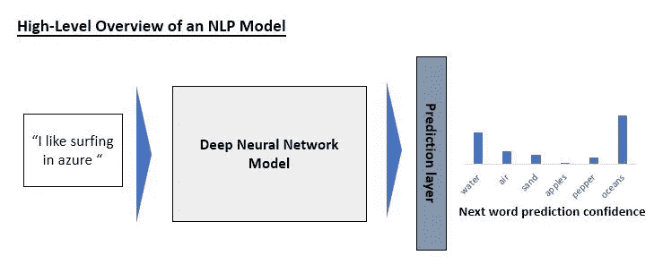

# 自然语言处理中的迁移学习

> 原文：<https://towardsdatascience.com/a-gentle-introduction-to-transfer-learning-in-nlp-b71e87241d66?source=collection_archive---------12----------------------->

## 迁移学习是 NLP 中最热门的话题之一——了解它是什么，以及如何将它应用到您自己的项目中

照片由 Pexels 的 Lisa Fotios 拍摄

本文简要概述了什么是自然语言处理(NLP)中的迁移学习，以及为什么它是自切片面包以来最伟大的事情。如果你想体验一下玩这些令人敬畏的预训练模型是什么感觉，请在这里和文章末尾查看代码的[链接；几乎没有编程经验的人也可以在 NLP 中做一些真正高级的事情。](https://colab.research.google.com/drive/1hBwM6QITP8elGEI05L9SwAGqozgI1vRT?usp=sharing)

作为本文的简短入门，自然语言处理(NLP)指的是使用机器学习来处理自然文本，其中“自然”指的是我们在书籍和报纸中找到的那种文本，而不是例如计算机编程代码(好的，一些模型是[学习编码](https://twitter.com/sharifshameem/status/1283322990625607681)，但我们将在这里更一般地谈论“自然”语言)。这项技术正在推动令人惊叹的事情，从自动文章摘要，到反应灵敏的聊天机器人，甚至创造性的写作生成。

训练计算机视觉或自然语言模型可能会很昂贵。它需要大量的数据，在计算机视觉的情况下，这些数据需要由人类来标记，并且需要花费大量时间在昂贵的硬件上进行训练。开放人工智能(Open AI)于 2019 年发布的基准设定语言模型 GPT-2,[估计已花费约 160 万美元训练](https://arxiv.org/pdf/2004.08900.pdf)。有了这样的成本，任何人将如何与开放人工智能或任何其他在 NLP 领域进行研究的组织竞争？

好消息是，你不需要和他们竞争。你可以在网上免费下载这些模型，在巨大的数据集上进行了预先训练，随时可以使用。更好的是，您可以非常快速地微调这些模型，以处理特定数据集的细微差别。为了让你对微调和训练模型之间的区别有所了解，微调就像把你的车拿到机械师那里换一个新的火花塞，而训练/预训练就像换一个全新的引擎。举一个具体的例子，假设你经营一家大型食品配送公司，你想了解人们对你公司的推文的情绪(积极或消极的意图),这样你就可以迅速处理消极的情绪。考虑到你有足够多的推文输入到模型中，你可以在很短的时间内对其进行微调，以预测推文是正面还是负面的。例如，我最近为我的硕士研究微调了一个关于食品评论的分类模型，只用了大约 40 分钟的训练就达到了 98%的分类准确率(预测评论是正面还是负面)。如果您要从头开始训练一个模型，可能需要几个小时或更长时间，需要您自己收集和预处理大量数据，并且不如微调后的模型准确。多么大的胜利！

这一过程是所谓的迁移学习的本质，即采用一个被训练来完成一项任务的模型(正如这些预训练模型被训练来做的那样)，然后对其进行微调，以完成一项相关但不同的任务。它在计算机视觉中的应用刚刚超过五年，并且已经在 NLP 中掀起波澜大约三年了。为了更好地理解它是如何工作的，我们需要短暂地转向对语言模型如何工作的高级理解。

作者图片

在将单词转换成机器学习模型可以理解的数字形式后，这些被输入到模型的主要部分，该部分(最常见的)是一个深度的多层[神经网络](https://www.forbes.com/sites/bernardmarr/2018/09/24/what-are-artificial-neural-networks-a-simple-explanation-for-absolutely-anyone/#7f276ec51245)。目前最流行的语言模型 Transformer 有一个结构，在这个结构中，它们在句子中的每个单词之间建立了一套非常深刻的关系，创建了一个句子的非常丰富的(数字)表示。这种丰富的表示然后被输入到模型的最后一层，给定句子的一部分，该层被训练来预测下一个单词。它通过给出预测下一个单词是什么的置信度来做到这一点。在上图的例子中，模型非常确定下一个单词是“oceans”。

NLP 中迁移学习的一个迷人之处是，研究人员发现，当你训练一个模型来预测下一个单词时，你可以拿起训练好的模型，砍掉预测下一个单词的层，放上一个新层，只训练最后一层——非常快——来预测句子的情绪。现在，记住这是**而不是**模型被训练去做的事情；它被训练来预测句子中的下一个单词；然而，当它处理并转换成丰富的表示时，它似乎正在捕捉句子中的大量相关信息，这些信息被输入到最后一层以预测下一个单词。但你可以做的不仅仅是微调模型来预测句子的情绪。你可以将模型微调为一个对话式人工智能，非常快([这些家伙](https://arxiv.org/abs/1901.08149)在两个小时内完成了)，或者你可以将模型微调为接受问题并相对快速地从一段文本中提取答案。

所以你为什么要在乎呢？以前，语言模型通常是为非常具体的任务而训练的，并且经常是从零开始训练，相信我，从零开始训练语言模型可能是一件痛苦的事情！作为一名研究人员，这意味着你可以通过下载这些预训练的模型并根据你的用例调整它们来快速测试新的想法。例如，我正在为我的硕士论文做一些无监督风格转移的工作，能够使用预先训练的模型完成这些任务意味着我可以非常快地重复想法。作为一名从业者，这意味着你可以相对容易地开始将 NLP 整合到你的产品或服务中；你需要更少的数据来微调模型，你可以开始利用尖端技术原型化新的想法，你可以开始真正地发挥创造力。不过有一点需要注意:让一个 250MB 到 1.5GB 的模型足够快地运行以满足客户的需求无疑是云工程的一项重大成就。

HuggingFace 的团队做了令人难以置信的工作，使得这些模型非常容易使用。你基本上只需要几行代码就可以加载这些预先训练好的模型，并开始尝试各种可能性。如果你想检查一下，我已经把 [**这个在线笔记本**](https://colab.research.google.com/drive/1hBwM6QITP8elGEI05L9SwAGqozgI1vRT?usp=sharing) 放在一起，你可以玩玩。你几乎不需要任何编程经验——只需阅读说明——并开始想象如何将这一惊人的技术融入到你的产品或服务中。作为参考，如果你不熟悉 python，笔记本基本上是运行 python 脚本的一种简单方式。

对于一些轻松的事情，[到这里](https://transformer.huggingface.co/doc/gpt2-large)来玩一下本文中提到的 GPT-2 模型。清除文本，键入一两句你自己的话，按 tab 键，看看人工智能会给出什么。摆弄这个让我思考人类与 AI 艺术交互的未来会是什么样子。

如果你想更深入地了解迁移学习的技术概况，请查阅[这篇令人难以置信的文章](https://ruder.io/transfer-learning/)，如果你想知道迁移学习如何应用于计算机视觉等其他领域，请查阅[我之前写的这篇文章](https://medium.com/analytics-vidhya/a-gentle-non-technical-introduction-to-transfer-learning-in-artificial-intelligence-2fd178bd7e54)。