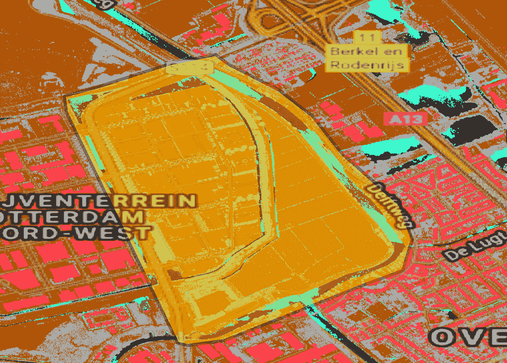
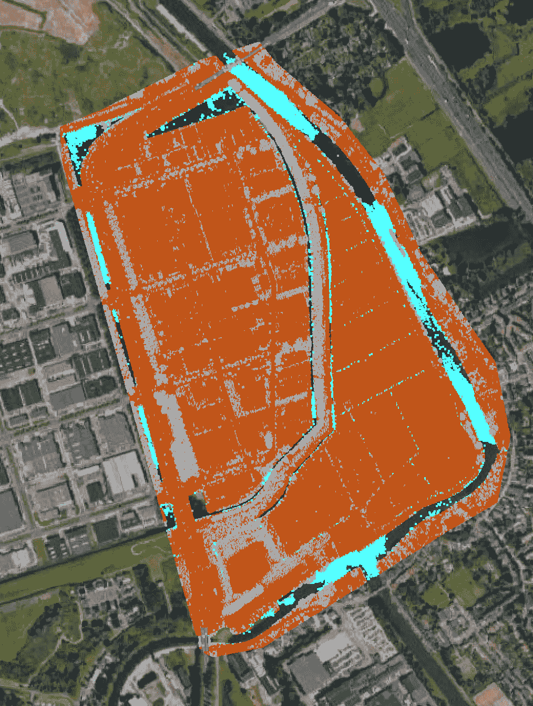

# 用于激光雷达点云特征提取的 GIS 管道

> 原文：<https://towardsdatascience.com/a-gis-pipeline-for-lidar-point-cloud-feature-extraction-8cd1c686468a?source=collection_archive---------5----------------------->

## 如何从激光雷达点云中自动提取特征


使用 DBSCAN 无监督的基于密度的机器学习模型“Image by Author”对点云数据点进行分类

在本文中，我将带您以自动化的方式从激光雷达点云中提取要素。

激光雷达点云数据是描述表面或对象的点的集合。每个点都用 x、y、z 坐标描述，在某些情况下还与附加属性相关联，例如点的分类。

激光雷达数据用于精确提取地理参考矢量要素，如建筑物、道路、树木。认识到如[1]中有两个主要步骤:

1.  **分类**:给点云数据集中的每个点分配一个类。如果有足够的训练数据，一种方法是使用 PointCNN 神经网络。输出是每个数据点的一个类。
2.  **GIS 管道**:从分类后的点云数据中提取有用格式的相关特征。除了提取之外，生成所提取特征的属性信息，例如物体高度、物体表面积、质心纬度/经度、与其他特征的接近度(例如..g 离最近的路有多远)，等等。

本文将扩展第(2)点，重点关注**自动 GIS 特征提取**，假设数据已经分类，并且每个数据点都被分配了一个类别。

# 数据和预处理

本节将深入研究数据采集、预处理和目视检查。在开始科学或开发工作之前，这通常是重要的一步。

## **1。数据下载和转换**

有许多服务提供激光雷达数据下载。为了配合本教程进行样本数据采集，我们将从[3]下载一个激光雷达数据集。使用地理空间数据时，了解数据集的空间参考系统始终非常重要。此切片的空间参考系统是 EPSG:7415 [4]。根据维基百科，空间参考系统的定义是

> 空间参考系统或坐标参考系统是用于定位地理实体的基于坐标的本地、区域或全球系统

下载数据的服务器不是很快，所以下载可能需要一些时间。

> 我花了几个小时下载数据集，所以在这一节的最后，我将分享一个从我的 google drive 下载预处理版本的链接。

下载的文件是 **Laz** 格式

> LAZ 格式是激光雷达数据的无损压缩。

它可以将原始 Las 文件压缩到其大小的 7%到 25%。速度是每秒一百万到三百万点[5]。

下载的文件大小为 2.2 GB。解压缩 LAZ 文件到原来的 Las 的一个选择是使用 pylas。提取的 Las 文件为 13 GB。令人印象深刻的压缩比！下面是如何使用 pylas python 包在 python 中将 LAZ 文件解压缩为 LAS 文件。

```
#!pip install pylas[lazrs,laszip]
input_laz_path = ‘data/C_37EZ2.laz’
output_las_path = ‘data/C_37EZ2.las’
laz = pylas.read(input_laz_path)
las = pylas.convert(laz)
las.write(output_las_path)
```

## 2.点云目视检查

从 QGIS 3.18 开始，QGIS 中提供了直接加载和可视化 las 点云数据的功能。它非常简单，允许数据可视化，叠加卫星图像，并呈现高质量的地图。

我们必须手动定义点云文件的 CRS(坐标参考系统),以显示在 QGIS 的查看器窗口中。对于卫星图像叠加，有许多 QGIS 插件，其中最好的一个是由 NEXTGIS 开发的快速地图服务，它拥有最著名的底图 XYZ URL[6]。我们正在使用的数据集已经对大多数点进行了分类，并且可以使用如下图例进行映射:


在 QGIS“作者提供的图像”中目视检查下载的点云文件

仔细观察叠加了卫星图像的分类点云，我们可以看到，并非所有要素都与背景卫星图像中的完全相同。仅捕获地面、建筑物、水对象，没有关于例如树木的道路表面的附加信息。

一个原因可能是点云数据获取的日期(2014 年)与叠加背景图的日期(谷歌的 2021 年)不同。绿色区域也被错误地归类为地面，也许这是一个多雪的冬季？

对于 POC(概念验证),我们应该将数据大小减少到最小 AOI(感兴趣区域)。但是，我们还应该考虑到，当缩放到更大的数据集时，基于最小 AOI 的输出算法将保证相同的结果。

为此，让我们手动选择一个包含大多数类的 AOI，并在屏幕上绘制一个具有相同 CRS 的多边形，如下所示:



用户定义的感兴趣区域，用于在开发过程中减少数据量“按作者排序的图像”

要将激光雷达点云数据裁剪为特定的 AOI，有许多工具和库，如 LAStools [7] clip 或其他 python 选项，如 PDAL。为什么我们需要将激光雷达数据集裁剪成较小的感兴趣区域:

1.  在开发阶段，我们需要尝试许多解决方案，每次在大数据集上运行脚本并等待解决方案验证是一场噩梦
2.  在大多数情况下，开发发生在本地机器上，那里的资源是有限的。那么同样的代码可以在云或者更大的服务器上使用
3.  如果数据很小，可以放入内存中，那么直观地检查算法的质量就容易得多。

输出较小的感兴趣区域如下所示:



从大型激光雷达数据文件“作者提供的图像”中截取感兴趣区域

快速直观调查显示，数据包含三类类别:

1.  建筑物
2.  地面
3.  水
4.  不保密的

建筑物的特征似乎表现得很好，并且很容易识别几何形状。水特征看起来不完整，如果我们从这个样本中自动捕获它，可能会导致连线的多边形片段。


感兴趣区域中分类激光雷达数据点中的每个类可视化“按作者分类的影像”

> 为了限制此分析的范围，此工作将只关注从分类的激光雷达数据中提取建筑物。

# 特征抽出

根据[1],从激光雷达数据中提取物体有两种技术可以使用，这两种技术中的每一种都可以适用于特定的用例，并且取决于业务需求和验收标准:

1.  **光栅分析**通过光栅化点云图层，然后将光栅应用于多边形
2.  使用**无监督机器学习算法 DBSCAN** 将每个对象分离为一个簇，然后应用边界多边形操作或其他操作来逼近对象的边界。

> 在本报告中，我们将解释并应用这两种技术。

## 1.光栅分析

要从激光雷达数据点捕捉要素，第一步是将 3d 矢量点(X，Y，Z)转换为基于格网的栅格表示。此过程称为栅格化，输出栅格将是数字表面模型(DSM)。并且还将包含每个像素中相应的平均点高度。

一个可以做到这一点的图书馆是 PDAL[7]。为了向前推进，我们需要指定结果 DSM 的分辨率。在这种情况下，让我们使用 4 倍的平均点间距，这是最佳做法，但可能会因使用情形而异。点与点之间的平均间距大约为 30 厘米(手动在屏幕上测量几次)，然后我们选择像素大小为 1.2 米。

要在 mac 上安装 PDAL，请使用以下命令:

```
brew install pdal
Pip install pdal
```

PDAL 有一个 python API，可用于脚本编写和从 python 创建数据管道，API 实现如下:

```
pdal_json = {
 “pipeline”: [
 INPUT_LAS_PATH,
 {
 “type”: “filters.range”,
 “limits”: “Classification[6:6]”
 },
 {
 “filename”: OUTPUT_TIFF_DEM,
 “gdaldriver”: “GTiff”,
 “output_type”: “all”,
 “resolution”: “1.2”,
 “type”: “writers.gdal”
 }
 ]
 }
 pdal_json_str = json.dumps(pdal_json)
 pipeline = pdal.Pipeline(pdal_json_str)
 count = pipeline.execute()
```

在上面的代码块中，JSON 对象 pdal_json 存储了所需的管道定义。首先，我们输入 las 文件路径作为 INPUT_LAS_PATH，然后我们指定我们要提取的限制类是 6 号类，它是 building。之后，我们将输出文件名指定为 OUTPUT_TIFF_DEM，并指定输出 TIFF 图像的分辨率。

一旦我们将该定义文档传递给 PDAL 管道 API，它将根据输入开始执行，并从输入列表中输出 TIFF 文件。非常简单方便。

这将产生如下的 GeoTIFF 文件，它是一个我们指定的像素大小为 1.2 米的光栅文件。此外，每个像素包含点云数据中像素的高度。下面的可视化可以使用 QGIS 和 quickmapservices 插件为背景卫星图像生成。


使用 PDAL“作者提供的图像”从点云输出栅格

下一步是从生成的 DEM 中提取建筑物覆盖区。有不止一种工具可以做到这一点。例如:

1.  使用 GDAL 多边形化实现
2.  使用栅格形状

这两种工具都为栅格中共享一个公共像素值的所有像素连接区域创建矢量面。每个多边形都创建有一个指示该多边形像素值的属性。由于 DEM 包含作为像素值的像素高度，因此从 DEM 文件中提取多边形会产生多个具有相同像素值的小多边形。这不是我们要找的。

要提取建筑物覆盖区，我们应该将 DEM 视为二进制 tiff 文件，其中建筑物像素可以设置为 1，并且没有建筑物数据设置为 np.nan 值。这个预处理步骤然后可以进入另一个 rasterio 形状提取或 *GDAL 多边形化*的过程，以提取与一个多边形具有相同值的像素。


对激光雷达数据点应用栅格化和 GDAL 多边形化

最后，有了每个多边形的多边形化坐标，我们就可以使用 shapely 和 geopandas 创建一个地理数据框架，将每个建筑物作为一个要素。

> Shapely 和 geopandas 是 python 中最著名的地理空间数据处理库。

请注意，在此步骤中，在保存输出矢量文件之前，特征的 CRS 应设置为 7415。

> 总共提取的特征是感兴趣区域中的 **155 个建筑物**

```
import rasterio
from rasterio.features import shapes
import numpy as np
from shapely.geometry import Polygonmask = None
with rasterio.Env():
 with rasterio.open(‘SlopeNew.tif’) as src:
 image = src.read(1) # first band
 results = (
 {‘properties’: {‘raster_val’: v}, ‘geometry’: s}
 for i, (s, v)
 in enumerate(
 shapes(image.astype(np.float32), mask=mask, transform=src.transform)))

 geoms = list(results)
```

通过这样做，我们遍历了每个提取的多边形，并将它们全部保存到一个几何列表中。这些几何图形可以在 geopandas 中读取，并将显示为如下所示的地理数据框架，这样，90%的困难工作就完成了。


生成的矢量化建筑物形状如下所示，在本文的后面，我们将应用后处理步骤从这些建筑物中提取有意义的特征，请继续阅读。


来自激光雷达的矢量化建筑物“作者提供的图像”

## 2.无监督机器学习 DBSCAN 聚类

在上一节中，我们使用栅格分析和多边形化提取了建筑物覆盖区。虽然这种方法工作正常，但它需要将数据转换为完全不同的类型(栅格),这会丢失一些与原始数据点相关的重要值。

在下面的方法中，我们将使用无监督的机器学习聚类方法来将彼此靠近的所有点聚类为一个聚类，然后从这些点提取建筑物边界。

激光雷达数据存储在 las 文件(或压缩的 laz 文件)中。要应用聚类，让我们首先提取每个点 X、Y、Z 的坐标以及每个点的相关类，如下所示:

```
def return_xyzc(point):
 x = point[0]
 y = point[1]
 z = point[2]
 c = point[5]
 return [x, y, z , c]pcloud = pylas.read(input_las_path)
points = [return_xyzc(i) for i in pcloud]
building_pts = [point for point in points if point[3] == 6]
```

产生的数据格式将是点 X，Y，Z，C 的数组，其中 X 是经度，Y 是纬度，Z 是高程，C 是点的类别。感兴趣区域的总数据点为 12，333，019。从建筑数据开始，我们只过滤建筑类别，即类别 6。这导致总共 1，992，715 个建筑点

```
[[87972210, 439205417, 699, 6],
 [87972259, 439205351, 57, 6],
 [87972267, 439205339, 1716, 6],
 [87972419, 439205135, -331, 6],
 [87972319, 439205284, 1030, 6]]
```

然后可以在背景地图上显示上述点，以查看建筑物类在 2d 中的外观，在这种情况下，每个数据点都存储为存储在 shapefile 中的 2d GIS 点，高程是一个属性。这不同于以前的 las 文件数据存储。


提取一类(建筑类)“作者图像”的矢量数据点

之后的下一步是应用 **DBSCAN 集群。**

> DB scan 是对有噪声的应用程序进行基于密度的空间聚类。寻找高密度的核心样本并从中扩展聚类。适用于包含相似密度聚类的数据。

在 DB 扫描中，有两个核心参数，第一个是ε，它是两个样本之间的最大距离，其中一个样本被认为在另一个样本的邻域中。第二个参数是 min_samples，它是被视为核心点的点的邻域中的样本数(或总权重)。这包括点本身。

使用 DBSCAN 算法，输出如下，其中每个点都与将该聚类与其他数据点分开的聚类标签相关联，对于是噪声且不靠近ε参数内的其他点的点，该算法会将其值设置为-1，因为它不与任何聚类数据点相关联。看看下面的输出有多清晰


使用 DBSCAN 对激光雷达数据点进行聚类，并在背景卫星图像上进行可视化“作者提供的图像”

下一步是分别使用来自每个聚类的数据点来提取建筑物覆盖区和该对象的相关属性。为了单独处理每个群，问题陈述如下:


在背景卫星图像地图“作者提供的图像”上分离并可视化的一组点

以上建筑总积分= 35580 分，只针对一个单体建筑。

给定一个物体的三维坐标，下一步的目标是:

1.  提取该物体的平均高度
2.  计算对象的二维边界
3.  计算相关的几何细节，如面积和质心点。

为了从对象的相关矢量数据点提取对象的 2d 边界，有许多技术，例如凸包和阿尔法形状。为此，我们将使用阿尔法形状

> **阿尔法形状算法在数据点周围构建最佳拟合边界**

python 的 API 用法很简单，唯一需要的参数是 alpha。在我们的例子中，我们将它设置为 1，因为数据点彼此靠近，我们对精确的边界感兴趣。

```
 building = building_pts_gdf[building_pts_gdf.cluster==76]
shape = alphashape(building.geometry, alpha=1)
```

Alpha Shape 算法的输出是一个易于识别的多边形，可以存储为任何几何格式，如 WKT


对 DBSCAN 分类点云“按作者分类的图像”的一个聚类运行 Alpha Shape 算法的结果

> 让我们花些时间来看看基于输入点的边界有多清晰。如果使用凸包，输出看起来会像一个圆

我们现在要做的就是遍历所有集群，分别计算每个集群的建筑边界。

接下来，对于每一个建筑形状，我们都可以计算出以下属性，这对于使用输出数据文件非常有用:

1.  边界几何形状
2.  以点的中位高度计算的建筑物标高
3.  总面积
4.  周长
5.  质心 x 坐标
6.  质心 y 坐标

这可以使用简单的 python 和匀称的函数来完成

```
building = building_pts_gdf[building_pts_gdf.cluster==76]
shape = alphashape(building.geometry, alpha=1)
height = building.z.median()
area = shape.area
perimeter = shape.length
centroid_x = shape.centroid.x
centroid_y = shape.centroid.y 
```

生成的提取建筑形状如下，令人敬畏且干净，就像是由 AutoCAD 专业人员手动绘制的一样。


包含建筑物高度的 LIDAR 点云矢量特征提取结果“作者图像”

艰苦的工作已经完成，现在我们有了一个数据管道，可以接受点云输入和输出自动提取的特征和相关的几何属性。接下来是后处理

# 后处理

通常在主处理管道完成后进行后处理。后处理工作的目的因项目和数据类型而异，广义而言，这些是一些后处理目标:

1.  质量检查和异常值去除:例如，去除具有不现实区域或小区域的特征，检测重叠特征并将其合并，等等
2.  几何计算:从物体几何中计算有意义的信息，如面积或周长。例如，计算要素质心、计算要素
3.  丰富性:从外部数据集中向要素添加更多属性信息，例如通过参考公交车站的外部数据源，为所有房屋与最近公交车站的距离添加附加信息。

## 1.质量检查和异常值去除

自动化质量检查和异常值消除需要对提取特征的允许应用有相当好的理解，并与最终用户或产品经理(最终用户的声音)合作，以制定最终的产品质量验收标准。


从上一步“作者图像”中创建的 GIS 数据管道中提取的建筑物中的离群建筑物

对于我们的用例，我们将把质量检查和异常值去除的范围限制在提取的建筑区域，在那里它应该在合理的范围内。为此，我们假设最小的建筑包括一个 3*3 平方米(9 平方米)的房间。该后预处理步骤将消除 40 个多边形，使感兴趣区域中提取的建筑物总数达到 115 个。


离群点检测和移除“作者图像”后最终提取的建筑层

## 2.几何计算

为了在实际业务中使用，并创建一个易于查询的数据集，可以在后处理步骤中为每个要素提取有意义的计算属性。这些特征的一些例子是面积、质心 x、质心 y 等等。该步骤将在以后帮助非空间数据用户查询各种业务用例和利用率的数据。

geopandas 中的几何计算非常简单，如下所示

```
building_gdf[‘area_m2’] = building_gdf.area
building_gdf[‘centroid_x’] = building_gdf.geometry.centroid.x
building_gdf[‘centroid_y’] = building_gdf.geometry.centroid.y
```


## 3.数据丰富

丰富通常是指用从其他来源获得的相关上下文来附加或增强收集的数据。地理空间数据丰富意味着通过引用外部数据源向数据集添加更多属性。几种常见的数据源是:

1.  道路基础设施网络
2.  兴趣点数据库
3.  人口分布
4.  行政边界

我们将在本报告中跳过应用此步骤，因为它可以无限扩展。

# 工程

在笔记本上写对于原型制作很有效，但是为了创建一个数据管道并与其他团队成员协作，需要对最终逻辑正确的脚本应用很少的步骤。下面是产品化的三件速成之事。

1.  **代码格式化**

当有人在做原型的时候，通常代码的样式不是很好，缩进和空格在这个阶段不是优先考虑的。完成逻辑后，你可以使用一个自动化的造型工具，如谷歌的 YAPF[8]。一旦安装了这个库，从命令行运行它，让 google 设计你的代码。

```
yapf building_extractor.py > building_extractor_styled.py
```

**2。对接**

对 python 应用程序进行 dockerize 是一个很好的做法，可以避免依赖性冲突，特别是在这种情况下，我们使用了如此多的库，其中一些依赖于单独安装的二进制数据，如 PDAL。在没有 docker 的情况下复制相同的环境将是一个挑战。

**3。单元测试**

在运行输出之前，应该使用单元测试来测试逻辑函数，如 alpha shape 算法、几何计算。

# 形象化

除了静态地图之外，拥有一个交互式地图并能够可视化输入和输出总是很棒的。为此，我使用了 deck.gl 和一些额外的 HTML / JS 代码。

## 1.输入点可以是交互式的

为了可视化输入点云，我从 DBSCAN 分类点云数据的输出中提取了一些建筑物，交互式地图如下:

[https://xmap.ai/maps/pcloud/dbscan_pcloud_3d.html](https://xmap.ai/maps/pcloud/dbscan_pcloud_3d.html)


HTML 三维可视化，用于查看 DBSCAN“作者图像”中的点云数据

## 2.输出具有丰富属性的提取面

这是地理信息系统数据管道的最终产品。输出数据保存为 geojson 对象，使用 deck.gl 进行可视化，并按高度着色。

[https://xmap.ai/maps/pcloud/buildings_vector.html](https://xmap.ai/maps/pcloud/buildings_vector.html)


GIS 管道最终输出产品的 3D 可视化，构建-构建带有“按作者分类的图像”属性的矢量

# 摘要

激光雷达数据处理对于测绘和自动驾驶等许多应用来说是必不可少的。对于大多数应用来说，自动目标检测和提取是确保激光雷达产品取得商业成功所必需的。虽然现在许多工具都提供现成的分析工具，如 Arcgis，但编程自己的工具可以更加灵活地添加或调整以适应特定的用例。在本文中，我们探讨了如何使用两种不同的技术从激光雷达密集点云中提取建筑物覆盖区:

1.  光栅化和多边形化
2.  无监督机器学习基于密度的聚类和阿尔法形状边界检测

我们还探索了标准的后处理技术，例如

1.  提取每个几何图形的基本属性(如面积、周长和质心)的几何计算
2.  如有需要，可从外部数据集(如 POIs 数据库的道路网络)中添加更多实体属性

然后，我们研究了一些确保代码可重用性的工程步骤，例如:

1.  使用自动格式化工具进行代码格式化
2.  码头化
3.  单元测试

最后，我们使用交互式地理空间可视化来查看分类的点云和最终输出的建筑数据，如以下两个链接所示:

 [## xMap.ai - DBSCAN 3d 点

### 此可视化显示了作为 gis 管道一部分的 dbscan 聚类的输出，用于从…提取矢量要素

xmap.ai](https://xmap.ai/maps/pcloud/dbscan_pcloud_3d.html)  [## xMap.ai - gis 管道构建矢量

### 该可视化显示了从 gis 管道中最终提取的矢量建筑物

xmap.ai](https://xmap.ai/maps/pcloud/buildings_vector.html) 

该报告中的整个分析可以端到端自动进行，如果需要，可以安排为批处理作业。

# 问题或询问

我在这里[https://mohamedbatran.com](http://mohamedbatran.com/)，如有任何问题或希望我们合作，请联系我们！

https://www.linkedin.com/in/mbatran/领英

# 参考

[1][https://medium . com/geoai/object-extraction-from-mobile-lidar-point-clouds-with-machine-learning-CB 15 fcbb 5597](https://medium.com/geoai/object-extraction-from-mobile-lidar-point-clouds-with-machine-learning-cb15fcbb5597)

[2][https://github.com/beedotkiran/Lidar_For_AD_references](https://github.com/beedotkiran/Lidar_For_AD_references)

[https://download.pdok.nl/rws/ahn3/v1_0/laz/C_37EZ1.LAZ](https://download.pdok.nl/rws/ahn3/v1_0/laz/C_37EZ1.LAZ)

[https://epsg.io/7415](https://epsg.io/7415)

[5][https://www . cs . unc . edu/~ isenburg/lastools/download/laszip . pdf](https://www.cs.unc.edu/~isenburg/lastools/download/laszip.pdf)

[https://plugins.qgis.org/plugins/quick_map_services/](https://plugins.qgis.org/plugins/quick_map_services/)

[7]https://github.com/LAStools/LAStools

[8]https://pdal.io/workshop/exercises/analysis/dtm/dtm.html

[https://github.com/google/yapf](https://github.com/google/yapf)