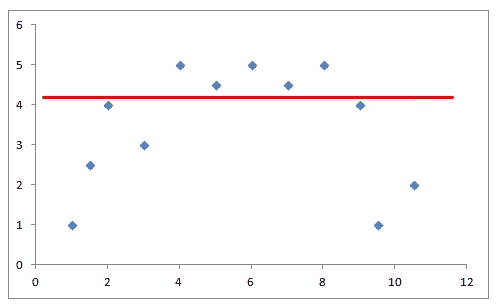

# 机器学习词汇表

> 原文：<https://towardsdatascience.com/a-glossary-for-machine-learning-52ecf147ce38?source=collection_archive---------28----------------------->

## 简要解释基本术语和概念

萨曼莎·加德斯在 [Unsplash](https://unsplash.com/s/photos/simple?utm_source=unsplash&utm_medium=referral&utm_content=creditCopyText) 上的照片

如果你正在阅读这篇文章，你正在或计划在数据科学领域工作。因此，我认为你很清楚这个领域的潜力和重要性。

数据科学是一个如此广阔的领域，可能存在于我们可以收集数据的任何过程中。工具和技术因任务而异，但最终目标是相同的:使用数据创造价值。

机器学习是数据科学的一个主要子领域。它涉及在没有明确指示的情况下探索数据中的规则、模式或关系的算法。我们将数据提供给机器学习算法，并期望它从中提取有价值的见解。

在这篇文章中，我将简要解释你在机器学习中可能遇到的关键术语和概念。在某种意义上，它可以被认为是机器学习的词汇表。

注:*如果你想阅读这篇西班牙语文章，它发表在* [*Planeta 聊天机器人上。*](https://planetachatbot.com/glosario-machine-learning-e844439ec378)

## 监督学习

监督学习涉及标记的观察或数据点。给定一组观察值，监督学习算法对自变量(即特征)和因变量(即目标或标签)之间的关系进行建模。

考虑一个模型，根据房子的年龄、位置和大小来预测房子的价格。在这种情况下，年龄、位置和大小是特征，价格是目标。

## 无监督学习

无监督学习不涉及观察的标签。无监督学习算法在一组观察值中寻找潜在的结构或模式。

一个例子是零售企业根据顾客的购物行为将他们分成不同的组。没有与客户相关联的标签。相反，无监督学习算法有望找到这样的标签。

## 强化学习

强化学习基于行动奖励原则。代理人通过反复计算其行为的回报来学习达到目标。

这可以被视为从互动中学习。从这个意义上说，强化学习类似于我们从错误中学习的方式。主体与环境相互作用以达到其目标，并评估其行动的结果。强化学习的常见应用是计算机游戏和机器人。

## 分类

分类是一种处理离散(或分类)目标变量的监督学习技术。例如，检测电子邮件是否是垃圾邮件是一项分类任务。它也被称为二进制分类，因为目标变量只有两个可能的值，垃圾邮件或非垃圾邮件。如果目标变量包含两个以上的值(即类)，则称为多类分类。

分类算法有几种评估标准。一些常用的是分类准确度、对数损失、精确度、召回率和 AUC。

## 回归

回归是一种监督学习技术，其中目标变量是连续的。典型的例子可以是房价预测。

在回归任务中，基于预测值与实际值的接近程度来评估机器学习算法。一些常用的回归评估指标是平均绝对误差(MAE)、平均绝对百分比误差(MAPE)和均方误差(MSE)。

## 使聚集

聚类是一种无监督的学习技术。它以这样一种方式对观察值进行分组，即同一组中的观察值彼此之间比其他组中的观察值更相似。这些组被称为集群。

与分类不同，聚类中的观察值(即数据点)没有标签。根据顾客的购物行为将他们分组是聚类的一个例子。

## 过度拟合

机器学习算法通过用数据训练来学习。这些算法非常强大，可以学习训练数据的每一个细节。然而，我们不希望这样。

训练模型的主要目的是能够将它们用于新的、以前未见过的数据(例如测试数据)。训练数据和测试数据之间总会有微小的差异。因此，模型应该很好地概括，而不是记忆训练数据的细节。

当模型试图很好地拟合训练数据，以至于不能推广到新的观察结果时，就会出现过度拟合。广义模型在新的观察上表现得更好。如果一个模型比需要的更复杂，我们很可能会过度拟合。

过度拟合(图片由作者提供)

## 欠拟合

从某种意义上说，适应不足是适应过度的反义词。欠拟合模型未能捕捉训练数据的足够细节。因此，它在训练或测试数据上的表现都不好。

欠拟合(图片由作者提供)

## 偏见

偏差是平均预测值与实际值相差多远的度量。如果我们试图用一个非常简单的模型来模拟一个复杂的关系，就会产生偏差。

高偏差模型的预测非常相似。由于它对数据内的变化不敏感，因此该模型在训练数据和测试数据上的准确性都非常低。具有高偏差的模型可能导致拟合不足。

## 差异

方差是偏差的反义词，对数据内的变化敏感。具有高方差的模型对训练数据中非常小的变化或噪声很敏感。异常值也可能被模型捕获。

具有高方差的模型在训练数据上表现良好，但在测试数据上失败。因此，它们会导致过度拟合。

由[克里斯·莱佩尔特](https://unsplash.com/@cleipelt?utm_source=unsplash&utm_medium=referral&utm_content=creditCopyText)在 [Unsplash](https://unsplash.com/s/photos/control?utm_source=unsplash&utm_medium=referral&utm_content=creditCopyText) 上拍摄的照片

## L1 正则化

模型过于复杂会导致过度拟合。因此，控制复杂性是过度拟合的解决方案。

正则化通过惩罚模型中较高的项来控制复杂性。如果增加一个正则项，该模型试图最小化损失和模型的复杂性。

L1 正则化通过在每次迭代中从权重中减去一个小的量来强制无信息特征的权重为零，从而最终使权重为零。Lasso 回归使用 L1 正则化。

## L2 调控

这是控制模型复杂性的另一种技术。岭回归使用 L2 正则化。

L2 正则化迫使权重趋向于零，但并不使它们完全为零。L2 正则化就像在每次迭代中去除一小部分权重的力。因此，权重永远不会等于零。

## 原木损失

日志损失是分类模型常用的评估指标。分类算法通常输出属于特定类别的观察值的概率值。类别标签被分配为具有最高概率的标签。

Log loss 基于概率值而不是分配的标签来评估模型。因此，它提供了一个更体面和彻底的评价。

例如，-log(0.9)等于 0.10536，而-log(0.8)等于 0.22314。因此，90%的把握比 80%的把握会导致更低的测井损失。然而，在分类准确性方面，90%或 80%的把握不会产生任何影响。

## 结论

我们已经介绍了机器学习中的一些关键术语和概念。要学的东西还很多，但基础永远是重要的。他们为接下来的事情打下基础。

对基础有一个全面的了解，会对你的机器学习之旅有帮助。

感谢您的阅读。如果您有任何反馈，请告诉我。