# 为 Atari 游戏实现 PPO 的图形指南

> 原文：<https://towardsdatascience.com/a-graphic-guide-to-implementing-ppo-for-atari-games-5740ccbe3fbc?source=collection_archive---------2----------------------->

## 代码近似策略优化之旅的收获

*由* [*达里尔*](https://github.com/DarylRodrigo) *和* [*丹尼尔*](https://github.com/instance01)

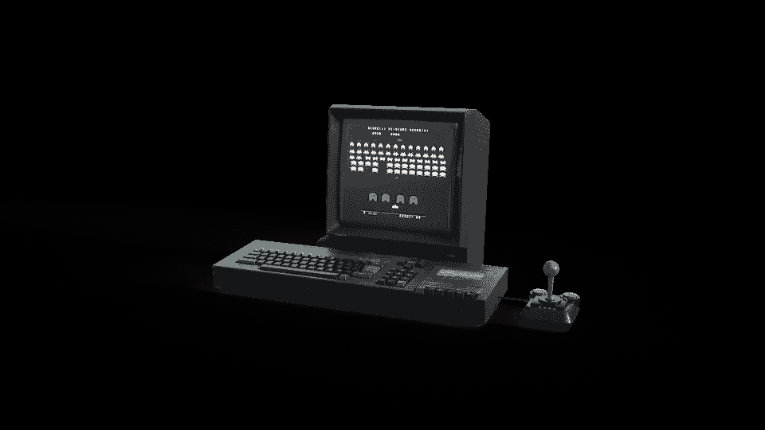

图片由 [sergeitokmakov](https://pixabay.com/users/sergeitokmakov-3426571/) 在 [Pixabay](https://pixabay.com/illustrations/computer-8-bit-old-retro-isolated-4812105/) 上拍摄

了解最近策略优化(PPO)的工作原理并编写一个有效的版本是很困难的。这可能会在很多地方出错——从误解数学和张量不匹配到实现中的逻辑错误。我和一个朋友花了大约一个月的时间才完全运行 PPO，在那里我们成功地实现了该算法，并确信我们了解它是如何运行的。本指南总结了我们努力构建最终算法和直觉的所有领域。这个博客旨在涵盖 PPO 的基本理论，我们如何决定实现我们的版本，使用张量形状，测试，并使用记录的度量来调试我们所建立的。我希望你喜欢它！

> 因为这篇博文打算覆盖 PPO，所以它将假设一些基础强化学习(RL)的先验知识。特别是 RL 问题的基本设置，关于行动者-批评家模型如何工作的一些概念，贝尔曼方程背后的概念，以及对什么是[政策梯度方法](/an-intuitive-explanation-of-policy-gradient-part-1-reinforce-aa4392cbfd3c)的模糊理解。

Github Repo — [ [链接](https://github.com/DarylRodrigo/rl_lib/tree/master/PPO) ]

# 🏔高层理论

概括一下——PPO 属于一类叫做策略梯度(PG)的算法。基本思想是直接更新政策，使采取行动提供更大未来回报的可能性更大。这是通过在一个环境中运行算法，并基于代理的动作收集状态变化来完成的——这些交互的集合称为轨迹。一旦收集了一个或多个轨迹，该算法将查看每一步，并检查所选择的行动是否导致积极或消极的奖励，并相应地更新政策。

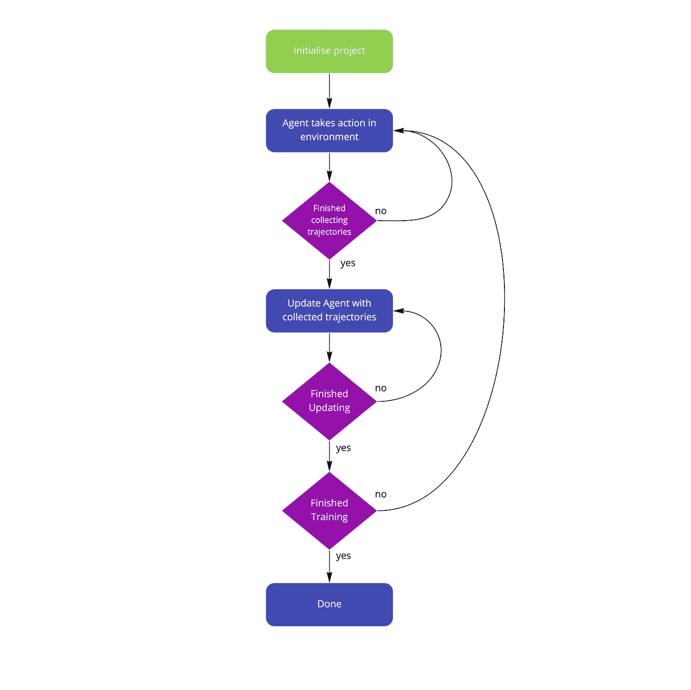

图 1.1:训练策略梯度算法的高层图。(图片由作者提供)

## 对动作进行采样并收集轨迹

通过逐步与环境交互来采样轨迹。为了采取单个步骤，代理选择一个动作并将其传递到环境中。

PG 算法通过接受输入(环境的状态或观察)来决定采取哪种行动，然后，对于离散的行动空间，输出每个可能行动的概率。神经网络通常会计算这个概率。神经网络的输出由其权重决定，通常记为π_θ，其中π表示策略，θ表示网络的权重(这对下一部分很重要)。

为了选择一个动作，代理从神经网络(称为 logits)给出的概率分布中进行采样——然后这个动作被用来为环境提供它的下一个输入。比如图 1.2 中，动作右有 50%的几率被选中(左 12.5%，上 25%，下 12.5%)。作为从概率中选择动作的结果，探索在 PG 算法中固有地存在，因为动作中的随机性来自选择概率。随着代理人越来越确定什么是正确的行动，探索将随着不正确行动的概率降低而减少。一旦采取行动，所有指标都会被存储起来，供以后在培训中使用(观察、行动、记录行动概率、价值、奖励、完成)。


图 1.2:图示了在策略梯度强化学习算法中选择动作的方法。(图片由作者提供)

## 更新代理

在深入研究 PPO 之前，先从较高的层面上了解一下 PG 算法的数学知识，以便对该算法将要做的事情有一个完整的了解。然而，由于这篇博文是关于 PPO 的实现，我们将不得不跳过计算损失和更新代理背后的推导过程的细节(另外，如果你对 PG 背后的数学不感兴趣，那么可以随意跳过接下来的 3 个标题)。

**更新策略:**任何 PG 算法的构造块都是关于如何更新网络的公式。图 1.3 中的更新公式表明，给定一个特定的状态-动作对[4]乘以学习速率[3]，网络的新权重[1]被更新为当前权重[2] +当前网络的梯度。这是如何更新网络权重的基础公式。直观上，梯度是权重的方向(+/-)，在该方向上，策略的改变将使在给定状态下采取的行动更有可能(反转它们以使它们不太可能)。

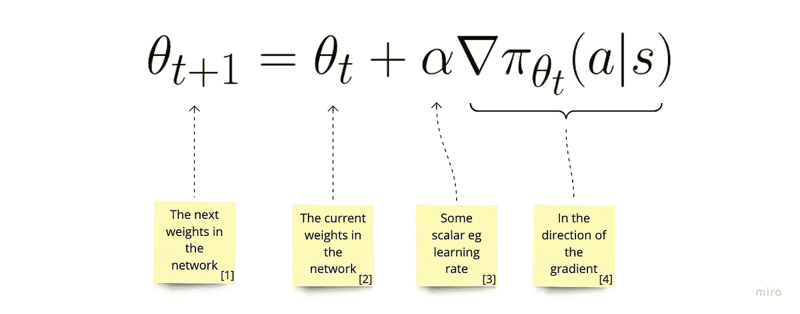

图 1.3:政策梯度权重更新方程。(图片由作者提供)

从数学角度对政策梯度更新如何工作的完整解释，没有比[大卫·西尔弗的讲座](https://www.youtube.com/watch?v=KHZVXao4qXs&ab_channel=DeepMind)更好的地方了。

> 那么我们如何计算这个梯度呢？令人欣慰的是，所有最常见的深度学习框架都会保留一个通过神经网络的信息的计算图，并保留网络梯度部分的记录。

**调整权重方向和数量:**通过更新方程，我们知道特定状态-动作对的“梯度”是什么方向——也就是说，通过改变梯度方向上的神经网络权重，使该动作(在特定状态下)更有可能。当然，我们不希望让每一个行动都更有可能，如果得到了不好的结果，我们希望降低采取行动的概率。这就是优势函数[1]所体现的——一个行动比我们预期的好或坏多少。如果一个行为导致我们比以前过得更好(积极的优势)，权重在梯度方向上改变，有效地使该行为更有可能被再次选择。如果情况更糟，我们在渐变方向上减少权重，使它变得不那么轻

另一个考虑是权重的更新量，如果仅仅是梯度的优势倍被更新，将会有非常积极的更新(为什么[在这里](/an-intuitive-explanation-of-policy-gradient-part-1-reinforce-aa4392cbfd3c)有很好的解释)。因此，为了抵消这一点，我们将更新除以策略的输出[2]，这称为重要性采样(对特定更新赋予多少权重)。

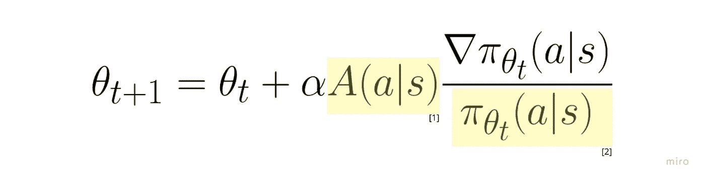

图 1.4:使用附加变量更新规则，以告知梯度需要更新的方向和量。(图片由作者提供)

例如，如果动作输出为`[2,3,5,1]`并且选择了值为 5 的动作(动作 3)，渐变将除以 5 以减少渐变的更新量。这是为了阻止行动 3 的价值快速增加，因此没有其他价值获得被选择的机会(因为这是在概率基础上完成的，如果我们有`[2,3,100,1]`，其他行动不太可能被选择)，即使它们可能在长期产生更高的回报。

**链接起来:**这就把最后一步留给了更新规则，它来自于链规则的魔力。利用这一点，我们可以用所采取行动的*梯度记录代替偏导数分数*。这一部分很重要，因为它是 PG 和 PPO 算法的基础。

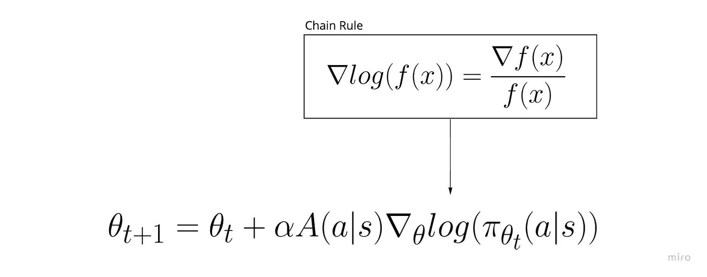

图 1.5:最终更新规则。(图片由作者提供)

同样，这并不是对策略梯度算法背后的数学理论的全面解释，而是对日志值来源的快速回顾/概括。

**可视化更新:**当理论被应用于实践时，它看起来会像图 1.6 描述的那样。首先，运行轨迹[步骤 1]，并保存所有相关值(记录概率、价值和奖励等)。一旦完成了轨迹，就可以计算贴现回报和优势[步骤 2](伟大的文章[在这里](https://example.com)解释什么是优势，但作为一个提醒，在`advantages = discounted_return - expected_return`预期回报被评论家计算为价值)。[步骤 3]接下来，通过查看对数概率并乘以优势来计算每一步的损失，如图 1.5 所示。[步骤 4]最后，我们取所有这些损失的平均值，用梯度下降法做一次反向传递。

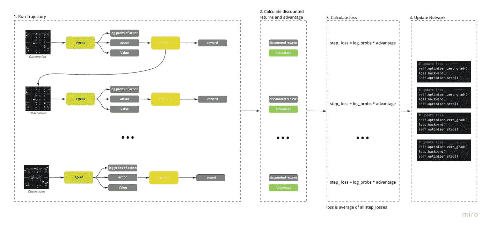

图 1.6:显示通过 4 步流程更新政策梯度权重的流程图。收集轨迹，计算优势，计算损失，最后更新网络权重。请注意，学习率是在初始化时在优化器中设置的。(图片由作者提供)

## PPO——主要理念

*原 PPO 纸—* [*链接*](https://arxiv.org/pdf/1707.06347.pdf)

使用策略梯度方法，一旦收集了一些轨迹，将使用相同的轨迹多次更新模型，以便从收集的新数据中学习。请记住，此更新的大小由优势的大小和重要性样本(表示为行动的对数概率)共同决定。

PPO 增加了一个额外的因素，即**概率比**，以防止大量更新的发生。这被定义为原始动作日志概率和新模型的动作日志概率之间的差异。

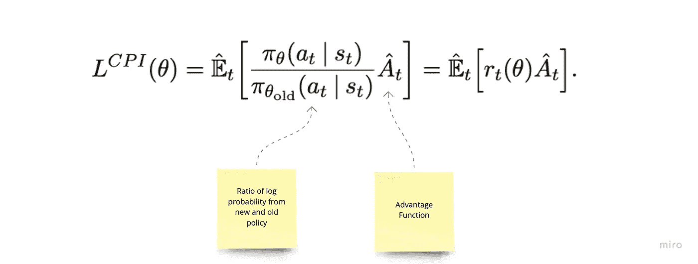

图 1.7:损失函数使用新旧政策行动日志概率的比率，称为保守政策迭代(CPI)。PPO 论文第 3 (6)节中的公式。(图片由作者提供)

**问题:**PG 算法的问题在于，当执行更新时，策略变化可能发生的幅度(即权重变化)会将策略推入一个区域，当执行另一个梯度下降时，所有方向基本相同，并且错过了奖励的峰值。图 1.8 展示了这一点——单次更新错过了回报的峰值，现在当在新的轨迹上执行梯度下降时，很难说“左”或“右”移动是否会导致更好的政策损失。这会导致更新将策略破坏到不可恢复的程度。

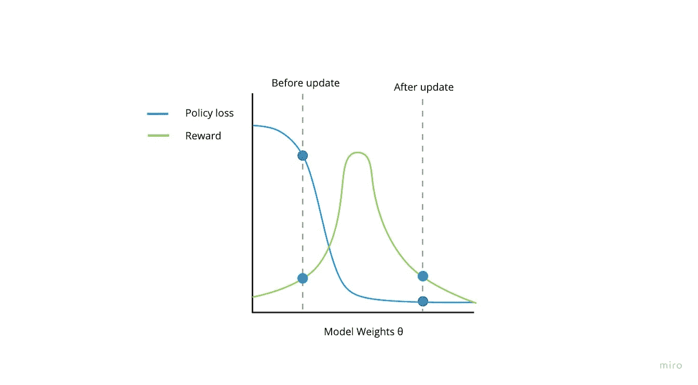

图 1.8:图表显示了一个政策更新是如何超越的，以及大量更新错过的高回报是如何获得的。(图片由作者提供)

**解决方案:**PPO 论文的解决方案是在原始动作日志概率和新模型的动作日志概率之间创建一个比值。如果该比率变得过大或过小，它将被限制在+/-一个设定值(通常为 0.2)。这将防止策略占用太多的更新步骤；这可以在图 1.9 中看到。

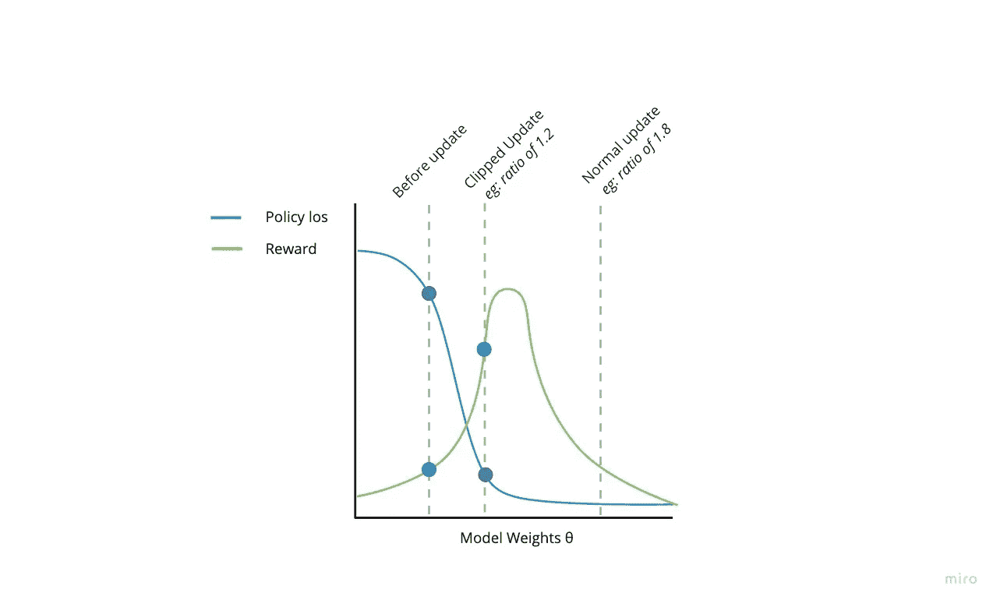

图 1.9 显示了 PPO 如何裁剪策略以强制较小的策略更新。(图片由作者提供)

在数学上，这是用一个削波函数表示的，在 PPO 论文中也称为替代函数:

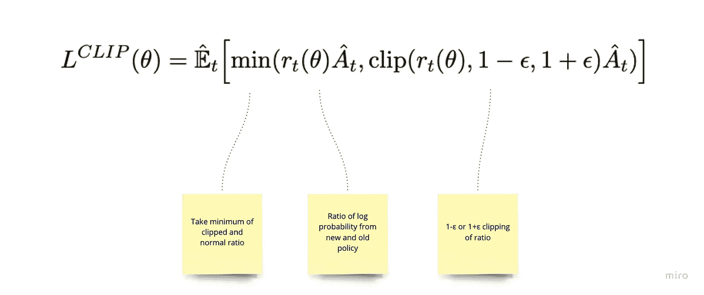

图 1.10:PPO 论文提出的截断替代(损失)函数，选择截断和未截断概率比的最小值。PPO 论文第 3 (6)节中的公式。(图片由作者提供)

> 如果你想更详细地了解这一点， [Arxiv Insights](https://www.youtube.com/watch?v=5P7I-xPq8u8) 在 YouTube 上有一个非常好的解释，从理论角度解释了 PPO 是如何工作的。

**流程的可视化实现:**从实际的角度来看，会发生以下情况:

*   首先，我们使用初始模型(model_1)收集一些轨迹，确保保存所采取行动的行动日志概率。使用我们的轨迹，初始模型被更新为 model_2，并且现在不同于原始模型。
*   然后，使用我们从轨迹[3]中收集的相同状态，计算新的对数概率[2](由于模型已经改变，这些将与初始模型不同)。
*   然后，使用新模型和旧模型的动作日志概率之间的比率来计算新策略应该更新的标量。比率是按步骤计算的。如果比例过大或过小，将根据代理函数进行裁剪。

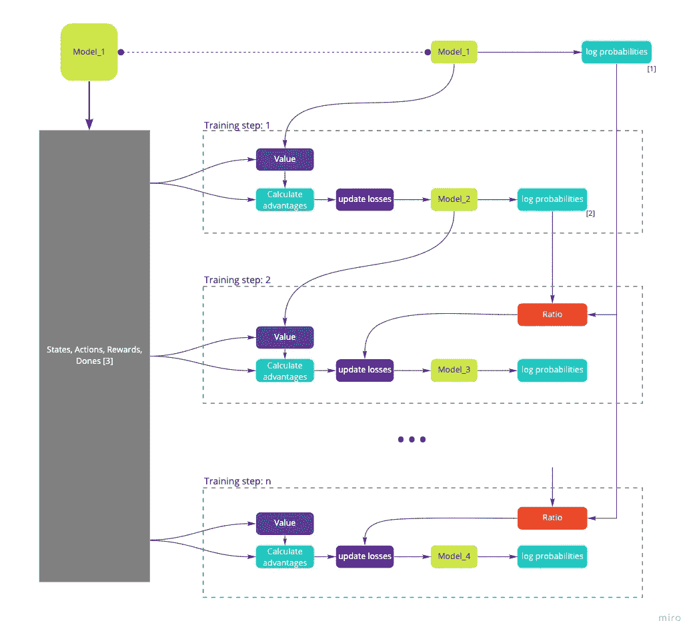

图 1.11—PPO 的更新流程。(图片由作者提供)

# 💻实施准则

*希望理论部分足以给出一些关于代理如何采取行动的直觉，模型被更新，为什么 PPO 工作以及为什么需要裁剪和概率比。接下来的部分解释了我们是如何为自己实现 PPO 的——有些可能是显而易见的，有些则不是。然而，如果你想完全理解我们的实现，浏览所有的东西可能会有帮助，因为会有差异。在本节中，将会引用我们的代码，因此将您的屏幕分成两半可能会有所帮助，一部分打开博客文章，另一部分打开代码，当然，已经说过，通读这些内容对您自己最有用！*

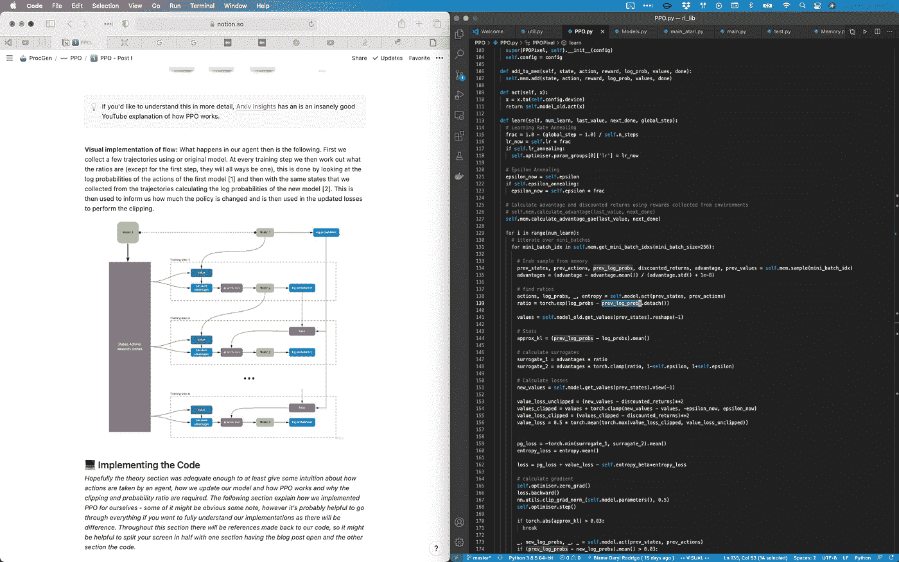

我通常如何分析旁边有博客文章的代码😋(图片由作者提供)

## 概观

总的来说，有三个主要的类和一个运行整个系统的文件:

*   `Model.py` [ [类](http://Models.py) ] -这包含了代理的逻辑，既能对给定的输入起作用，又能从轨迹收集的数据中学习。
*   `Memory.py` [ [类](https://github.com/DarylRodrigo/rl_lib/blob/master/PPO/Memory.py)——包含轨迹的所有数据，并计算优势。它还允许代理对轨迹的随机部分进行采样，以批量更新代理。
*   `Config.py` [ [类](https://github.com/DarylRodrigo/rl_lib/blob/master/PPO/Config.py) ] -这包含 RL & PPO 中所需的所有设置，例如学习率、要走的步数和超参数，如用于裁剪大小的 epsilon。
*   `Utils.py` [ [文件](https://github.com/DarylRodrigo/rl_lib/blob/master/PPO/util.py) ] -这是运行采样和训练循环的主文件。

从图 2.1 中的流程图可以看出，培训代理的方式本质上是图 1.1 中概述的扩展。首先，程序初始化我们所有的变量，然后算法分两个不同的阶段运行，收集轨迹并根据收集的数据更新代理。

**收集轨迹:**通过在健身房环境中玩耍来收集轨迹；代理根据其观察在模拟中采取行动。当该循环激活时，单个步骤保存在代理的存储器中。

**更新代理:**一旦采取了足够多的步骤，就会计算折扣收益和优势——代理然后从“内存”中采样所有步骤，以计算损失并更新代理(所有捕获的数据都经过训练)。一旦执行了所有更新，循环又从头开始。

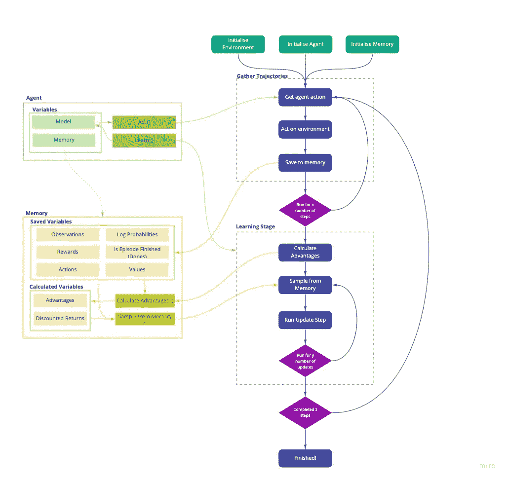

图 2.1 —流程图显示了我们的 PPO 代理如何培训以及这与我们的课程有何关系。(图片由作者提供)

# 设置

首先，实验中使用的所有组件都需要初始化。其中的主要部分是:

*   健身房环境
*   代理，包括添加模型和内存
*   记录我们的实验(我们使用权重和偏差)

## 创建雅达利环境

代理训练的环境通常是由 [OpenAI gym](https://gym.openai.com/) 创建的，这是一个为物理任务和 Atari 游戏创建模拟环境的框架。输入环境对其作出反应的动作，然后将这种变化作为一组观察结果返回给代理。随之而来的还有奖励，以及游戏是否已经让代理知道他们的行为是“好”还是“坏”。

当人类玩家看 Atari 游戏时，我们会看到构成图像的 RGB 颜色，以及我们玩游戏时画面的稳定变化。我们可以把每一帧都直接传送给我们的代理。这将被描绘成一个张量`160,192,3`，代表游戏的尺寸和 RGB 像素。然而，在典型的 Atari 游戏实现中(以及那些在[原始论文](https://www.google.com/search?client=safari&sxsrf=ALeKk03DgJ7SRuOmI-jvEFhNqTxiRF8jsw%3A1609836514548&source=hp&ei=4if0X-W6H8Hbgwept76QCA&q=Original+PPO+atari+paper&oq=Original+PPO+atari+paper&gs_lcp=CgZwc3ktYWIQAzIFCCEQoAEyBQghEKABOgQIIxAnOggIABDJAxCRAjoFCC4QkQI6CAgAELEDEIMBOggILhCxAxCDAToOCC4QsQMQgwEQxwEQowI6CAguEMkDEJECOgQIABBDOgUIABCRAjoECC4QQzoHCAAQyQMQQzoHCAAQsQMQQzoNCC4QsQMQxwEQowIQQzoICC4QxwEQrwE6CwguEMkDEJECEJMCOgsILhCxAxDHARCjAjoFCAAQsQM6AggAOgIILjoFCC4QsQM6BQgAEMkDOgYIABAWEB46BAghEBU6BwgAEMkDEA06BAgAEA06BggAEA0QHjoICAAQDRAFEB46CAgAEAgQDRAeOggIABANEAoQHjoICCEQFhAdEB5QkA9YwClgkypoA3AAeAGAAZoCiAHeFZIBBjE0LjkuMpgBAKABAaoBB2d3cy13aXo&sclient=psy-ab&ved=0ahUKEwjls-CstITuAhXB7eAKHambD4IQ4dUDCAw&uact=5)中完成的)，一些技巧被用来更有效地训练，我们已经将它们包含在了`env.py`文件中(这受到了很大的影响，并且部分复制自 Costa 的 [CleanRL](https://github.com/vwxyzjn/cleanrl/tree/master/cleanrl) 实现)。

*改变游戏风格:*

前几个技巧是关于改变游戏的基本运作方式，以帮助代理人前进一点点。

*   episodic Life Env([envs . py:61](http://envs.py:61))—这确保了一集只有在所有生命都失去时才结束，而不是一个生命都失去时。因此，折扣奖励将贯穿整个游戏而不是个人生活——这很重要，因为它将允许代理人进一步进入游戏。
*   nooplesetenv([envs . py:12](http://envs.py:12))——作为雅达利引擎中的一个技术细节，如果你从头开始玩，游戏将永远是一样的。为了获得游戏引擎中的随机行为(而不是每次都是相同的版本)，采取了一组随机的动作来将游戏设置为伪随机状态[ [论文](https://www.cs.utexas.edu/~pstone/Papers/bib2html-links/AAAI15-hausknecht.pdf) ]。这对于帮助代理概括其知识至关重要。
*   FireResetEnv([envs . py:41](http://envs.py:41))—如果游戏只在按下开火命令时开始，它会在初始化时自动开火，这样代理就不必学习如何开始游戏。
*   Max 和 Skip ( [envs.py:97](http://envs.py:97) ) —代理采取的任何动作都将应用于游戏中的四个时间步骤。将返回所有生成帧的每个像素的最大值，类似于最大池。这些帧的奖励也将被累加。长的短的是，这都是为了避免玩游戏时经历的闪烁[ [更好的解释](https://danieltakeshi.github.io/2016/11/25/frame-skipping-and-preprocessing-for-deep-q-networks-on-atari-2600-games/) ]。
*   clip rewards([envs . py:125](http://envs.py:125))—通常来说，在 RL 中，如果奖励保持在“合理的范围”(大约+/- 1)内，代理训练得最好，这是为了避免在计算折扣回报时更新太多。剪辑奖励因为这个原因把奖励削减到+/- 1。

*增加雅达利观察输出:*

*   帧堆栈( [envs.py:187](http://envs.py:187) )-代理被传递一个帧堆栈，代表实际游戏中的四个时间步骤。这是为了让代理可以有运动的感觉。例如，在突破中，球可能处于 4 个不同的位置，表示在特定方向上的移动。
*   wrap frame([envs . py:134](http://envs.py:134))—这是一个自定义方法，用于重新构造 Atari gym 环境的输出。在所有的增强都发生之后，产生了一个张量`(4, 84, 84)`——使用 WrapFrame，它随后被转换为每一帧的`(84, 84, 4)`。这是为了与我们代理的 CNN 头兼容。

就单一环境的张量大小而言，这最终看起来是这样的:

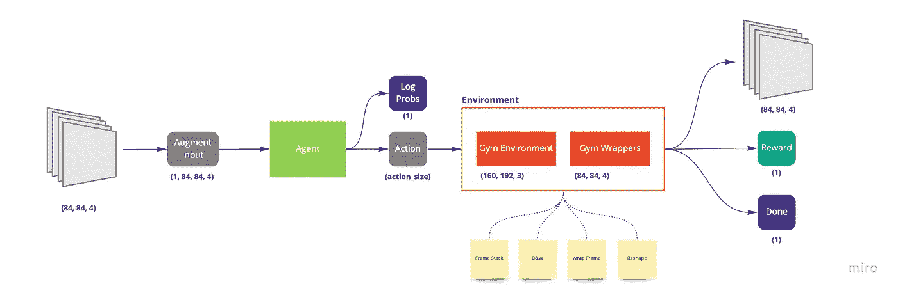

图 2.2:行动的单一环境取样，作用于环境并产生相关的输出。(图片由作者提供)

所有这些增加输出和改变游戏玩法的技术都是为代理人从 Atari 游戏环境中更有效地学习而设计的。它可以被认为是机器视觉任务中的数据增强。

实现:增强在`env.py`中实现，它们在一个名为`make_env(env_id, seed)`的 thunk 函数中分组。这个函数可以在任意点调用，指定种子和游戏类型返回一个环境；这种实现方式有助于创建多个环境。

注意:人们可能已经注意到在图 2.2 中有一个*增强输入*块，它给代理的输入增加了一个维度，这是因为 PyTorch 2D CNN 块期望输入一个批处理。在我们的例子中，这是一个一批。

## 多重环境

我们选择实现多个环境，以利用我们家用 DL 机器的额外 CPU 和 GPU。这加快了训练的速度，也是一次关于多种环境如何工作的很好的学习练习。

当添加多个环境时，健身房环境的所有输出都获得一个额外的维度 *n* ，其中 *n* 是环境的数量。然而，我们代理人的输入没有任何不同。这是因为我们已经在单一环境中增加了 4 个维度的输入(如图 2.2 所示。).

在我们的`Config.py`中实现了多个环境，这里通过包装[开放基线的](https://stable-baselines.readthedocs.io/en/master/guide/vec_envs.html#vectorized-environments)T4 中的`make_env`函数来初始化环境，如下所示。

```
envs = VecPyTorch(
	DummyVecEnv(
		[make_env(env_id, self.seed+i, i) for i in range(self.num_env)]
	), 
self.device)
```

这个函数期望“一个创建环境的函数列表(每个调用返回一个体育馆。Env 实例，这就是为什么`make_env`返回一个创建 gym-env 而不是 gym-env 本身的 thunk 函数。`VecPyTorch`本质上是基于 [VecEnv](https://stable-baselines.readthedocs.io/en/master/guide/vec_envs.html#vecenv) ，它“抽象了异步矢量化环境”。这是与矢量化环境交互的一种更简单的方式。

多环境采用我们对单个环境所做的，并以一种易于处理的方式对它们进行矢量化。所有其他游戏的增强和环境的重塑都和在单一环境中一样。


图 2.3:显示多个环境的数据流的图表，从动作的采样开始，到放置在环境中以及结果输出。(图片由作者提供)

## 创建代理

Atari PPO 代理创建自一个基类，该基类(图 2.4)通过超参数初始化两个关键部分:

*   **模型** -这是 CNN 的模型，我们已经配置好了，它被分成“头”“演员”和“评论家”。头部对传入的数据进行预处理，然后演员和评论家使用这些数据来计算他们各自的值。
*   **内存**——稍后会深入探讨这个话题，但基本上，内存存储的是在表演阶段收集的状态转换。初始化决定了存储器的形状和大小，从而决定了展开时间的长短。

通过这两个类实例，代理能够执行 3 个基本功能:

*   **Act** :接收(多个环境的)观察结果，并提供相应的行动和这些行动的日志概率。
*   **AddToMemory** :一旦采取行动，该步骤的所有数据必须存储起来以备后用。这就是 AddToMemory 函数的作用；它将信息存储在 PyTorch 张量中。
*   **Learn** :这将在后面的章节中进一步探讨——但本质上，这将从内存中获取处理过的数据，并相应地更新模型。

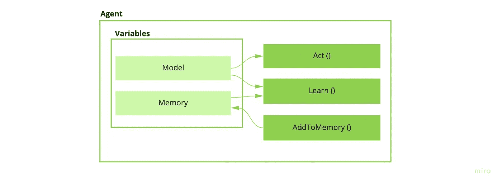

图 2.4:显示代理结构的图表。(图片由作者提供)

**型号**

这个模型是一个普通的演员-评论家网络。一个 CNN 头接收游戏的帧作为输入，加上所有像素被缩小 255，这是为了确保输入范围在 0 和 1 之间。CNN 的输出然后被传递到两个完全连接的层。第一层输出作为评论家的单个值，然后第二个网络输出作为演员的游戏环境中可用的动作的数量。

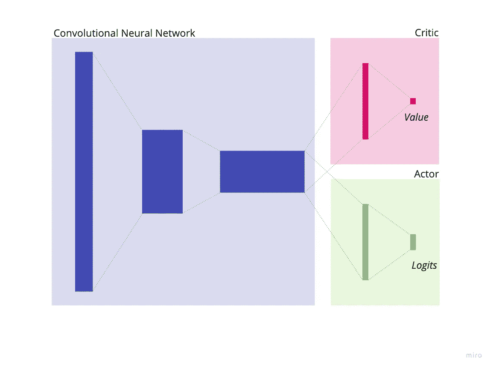

图 2.5-演员-评论家网络。(图片由作者提供)

设置该类是为了调用一个`act`方法(models.py:76)来返回演员制作的`action`、`log probabilities`和`entropy`，以及评论家预测的`value`。为了获得动作，来自参与者的逻辑立即被采样(models.py:79)。

**初始化网络权重**

最后一个重要因素是确保每一层都已经初始化。一个名为`layer_init`的通用函数包围着网络中的每一层，这是为了避免消失或爆炸梯度(解释这是如何工作的[这里](https://www.deeplearning.ai/ai-notes/initialization/)是一篇好文章)。

# 记忆

创建一个内存类(而不仅仅是将单个变量存储为 PyTorch 数组)的决定在一定程度上阻止了[强化学习讨论的不和谐](https://discord.gg/gbruDPv9)(向在促进讨论方面表现出色的社区大声疾呼)，在那里我们正在讨论核心功能的测试。众所周知，RL 算法会无声地失败，这意味着它们要么不会抛出错误，但永远不会学习，或者更糟的是，学习了，但没有发挥出最大潜力。这是一个巨大的问题，因为它使调试变得难以置信的困难，并且需要很多很多的实验；而在使用 CartPole 这样的简单环境时，v1 可能永远不会浮出水面。这就是为什么我们决定创建一个类来存储保存的轨迹，但它的责任也是计算优势，贴现回报和从内存中采样正确的数据。这样，我们可以为每个单独的函数编写测试(测试可以在`/tests/test_memory.py`中找到)以确保输出完全符合预期。这也有助于验证我们对优势和贴现回报的理解。

内存本身(如图 2.6 所示)有三个关键方面:

*   **保存的变量**-轨迹被保存到内存中。数据存储在预定义的 PyTorch 张量中，因为这样可以避免将数组转换为张量等。
*   **计算优势** —如何计算将在下一节解释；重要的部分是，它根据采样的轨迹计算优势和折现回报。
*   **从内存中采样** —因为我们所有的数据都是有序的，并且仍然是我们的`n`数量环境的格式，所以该函数本质上是将我们所有的轨迹压缩到一个长张量中，然后对随机部分进行采样以进行训练(在更新模型部分中对实现进行了更详细的解释)。

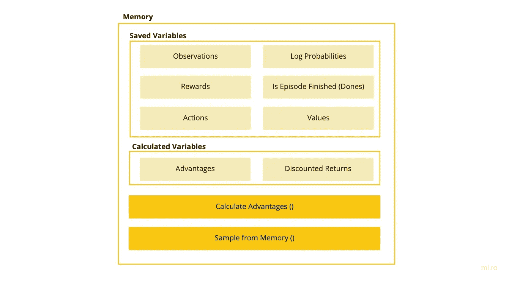

图 2.6 —显示内存类结构的图表。(图片由作者提供)

内存的初始化决定了它的形状和大小，需要各种参数。这包括环境的数量和环境本身获得的观察和行动空间。为了确定采取多少“步骤”,还需要存储器的大小。最后，还需要伽玛等超参数。

# 权重和偏差( [W & B](https://wandb.ai/)

最后，我们初始化 W & B——这是我们了解代理表现的重要工具。它允许丹尼尔和我在我们自己的机器上分析数据和运行实验，并让我们两个都可以获得结果，同时远程工作。

拥有一些测井工具对于理解哪里出错以及不同超参数对模型的影响至关重要。在后面的部分中，我们将深入研究各种度量如何帮助我们调试工作。

# 收集轨迹

训练 PPO 智能体的第一步是收集轨迹——智能体和环境初始化后，如图 2.7 所示。代理根据对环境的观察采取行动，然后采取下一步行动。然后，状态和动作的序列最终被保存到存储器中，用于训练阶段。

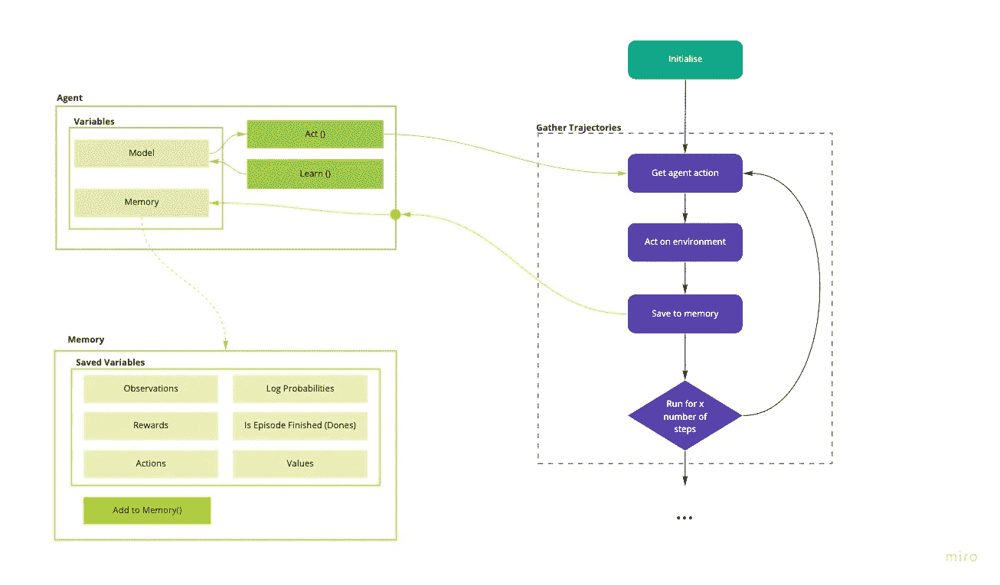

图 2.7-如何收集轨迹的流程图概述。(图片由作者提供)

# 计算代理的动作

该操作由代理[Models.py:109]上的 with act 函数执行。

```
class ActorCritic(nn.Module):
	# ... def act(self, x, action=None):
		values = self.critic(self.forward(x))
		logits = self.actor(self.forward(x))
		probabilities = Categorical(logits=logits)
		if action is None:
		    action = probabilities.sample()
		return action, probabilities.log_prob(action), values, probabilities.entropy()
```

为了行动，模型接收来自健身房环境的观察(`x`)。然后，观察结果通过返回值(该状态的值是什么)的 critic 网络，然后通过返回 logits(神经网络的输出)的 actor-network。

该值按原样返回。然而，我们想把我们的逻辑转换成一个概率分布，这样我们就可以对一个动作进行采样。这是通过 PyTorch 的[分类函数完成的——这个函数将我们的逻辑值变成与逻辑值成比例的分布，总和为 1。分类类的好处是，该类还可以从分布中抽取动作样本，计算动作的对数概率和熵(熵将在后面的部分中进一步解释)。](https://pytorch.org/docs/stable/distributions.html#categorical)

# 保存轨迹

保存轨迹是相当直观的，但对奖励、观察和完成如何从健身房环境中出来有一个可视化的表示是有用的。对于环境中的每一步，返回 3 个不同维度的变量(观察、奖励和完成——如图 2.8 所示)。

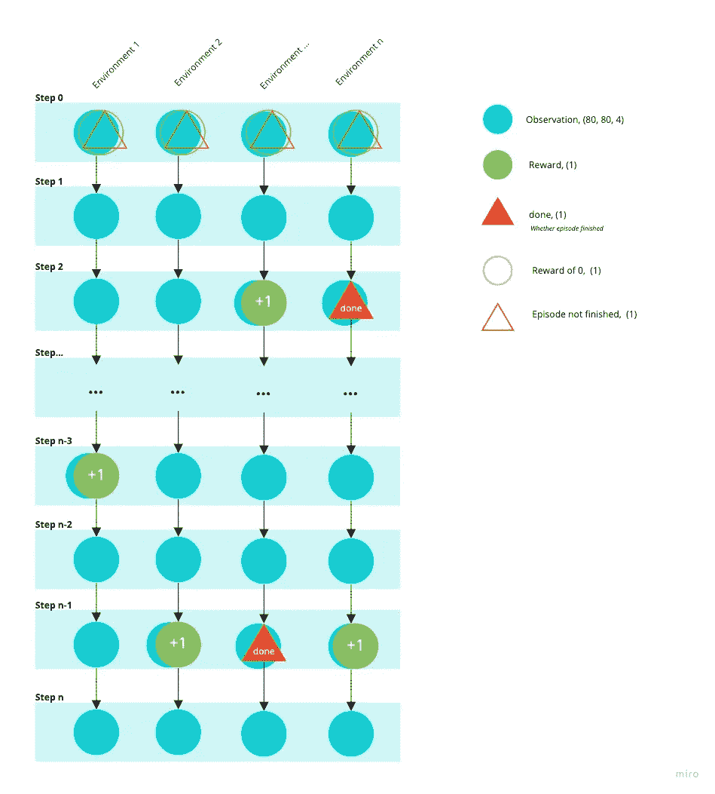

图 2.8 —从单个环境返回的数据的可视化表示。这张图显示了不同步骤的各种场景，一些得到了奖励，一些结束了这一集。图例中的数字代表返回的张量的维数。(图片由作者提供)

代理与环境的每次交互(作用于多个环境)都会返回一个观察、奖励和完成。在图 2.8 的例子中，第一步没有奖励，情节还没有结束，除非另有说明，否则以后的每一步都是如此。这说明收集的数据作为跨多个环境的完整步骤被附加到内存中，由蓝框表示。这意味着保存到存储器中的是:

*   观察结果`(n, 80, 80, 4)`
*   奖励`(n, 1)`
*   多内斯`(n, 1)`

然后以维度张量的形式保存在存储器中:

*   观察结果`(x, n, 80, 80, 4)`
*   奖励`(x, n, 1)`
*   完成`(x, n, 1)`

其中 x 是步数，这意味着代理训练的“全局”步数实际上将是 x 乘以 n，因为我们有 n 个环境的 x 个步数。

# 更新政策

PPO 的第二阶段是从我们收集的轨迹中学习——这由`Models.py` 中的 learn 函数启动，并由`util.py:L113`中的训练循环调用。当这开始时，首先计算优势，这一点很重要，因为所有轨迹都需要保持顺序，以计算正确的贴现回报。一旦完成，我们可以从内存中随机取样，计算我们的损失并更新模型。轨迹上的更新发生设定的次数，由超参数决定。一旦完成，旧的模型将被更新的模型所取代，这个过程将重新开始，但这次(希望)会有更好的性能。这个过程可以在图 2.9 中看到。

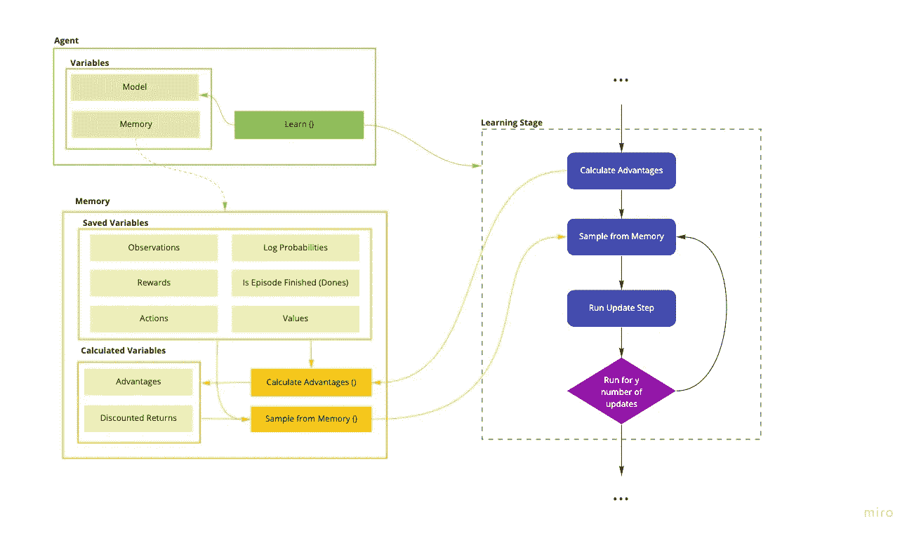

图 2.9-显示 PPO 学习阶段的流程图，该图将代理和内存类上调用的函数以及动作流混合在一起。(图片由作者提供)

# 计算优势

优势被定义为预期回报减去实际回报，这表明模型的表现比预期的好或坏。计算这些优势分两步——首先，需要计算贴现回报。然后从贴现回报中减去期望值(由评论家计算)以获得优势。

如果你不熟悉**贴现回报**，这是一个[很棒的视频](https://www.youtube.com/watch?v=36IgkgHW0MM&ab_channel=LearnVentures-DeepReinforcementLearning)，但本质上它采用当前回报+下一个状态的值乘以一个贴现因子(γ)，如图 2.10 所示(G 是贴现回报)。

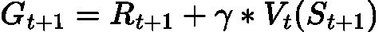

图 2.10:贴现回报公式。(图片由作者提供)

为了计算贴现收益，我们不能从轨迹的起点开始，而必须从终点开始。这是因为我们需要迭代计算下一个状态的值是多少。这在最后一个状态出现了问题，因为没有下一个值，这就是为什么该函数还采用了`last_value`和`last_done`，它们在贴现回报的第一次计算中使用(在图 2.11 的情况下，它是-0.5 作为最后一个值，这一集没有完成)。在许多书中，您可能会将此视为 n 步引导。我们不(必须)等待整个情节结束，而是在 n 步之后估计如果情节结束时该状态的值。

作为可能发生的情况的一个例子，在图 2.11 中，假设轨迹已经被收集(步骤 1)，然后迭代地向后计算贴现回报。

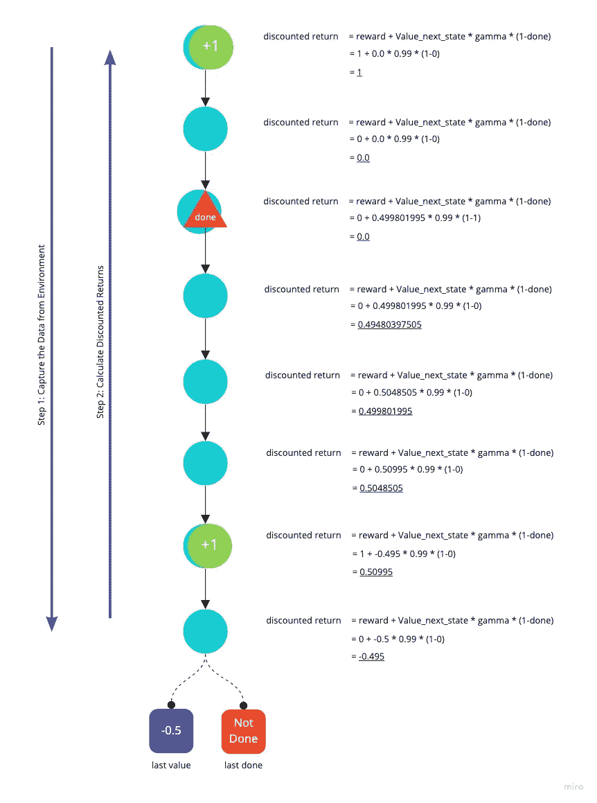

图 2.11:贴现回报的计算示例。(图片由作者提供)

这个逻辑在我们的`[Memory.py](https://github.com/DarylRodrigo/rl_lib/blob/master/PPO/Memory.py)`类中实现:

```
def calculate_discounted_returns(self, last_value, next_done):
    with torch.no_grad():
      # Create empty discounted returns array
      self.discounted_returns = torch.zeros((self.size, self.num_envs)).to(self.device)
      for t in reversed(range(self.size)):
        # If first loop
        if t == self.size - 1:
          next_non_terminal = 1.0 - torch.FloatTensor(next_done).reshape(-1).to(self.device)
          next_return = last_value.reshape(-1).to(self.device)
        else:
          next_non_terminal = 1.0 - self.dones[t+1]
          next_return = self.discounted_returns[t+1]
        self.discounted_returns[t] = self.rewards[t] + self.gamma * next_non_terminal * next_return
```

`reverse` for 循环以相反的顺序在收集的轨迹上迭代，以计算贴现收益。如图 2.11 所示，第一个计算使用评论家输出的最后一个预测值，所有其他情况都将使用以前的贴现回报。新的折现回报是奖励+ gamma *之前的折现回报。`next_non_terminal`用于检查折扣是否应设置为 0，因为剧集已结束。最后，为了获得优势，内存只需在相应的时间步长上获取 discounted_returns 并减去收集的值。

计算贴现回报可能是一件令人头痛的事情，而确保在许多不同的情况下正确计算贴现回报更是难上加难。很容易犯错误，在某些情况下，这意味着算法仍然可以训练，但性能不如预期。为了真正检查所有的边缘情况，建议编写测试用例并根据它们运行计算。对于我们的实现，这可以在`/tests/test_memory.py`中找到。

# 更新模型

**获取数据**

为了更新模型，首先对内存进行采样，这是通过从内存中保存的轨迹中提取小批量(随机分段)来完成的。这是通过`get_mini_batch_idxs`功能完成的。该函数为内存中的每个条目创建一个索引，并将它们随机分配到小批量的数组中；例如，这可能会返回

```
[ 
	[1013,456, ... 147,328], 
	..., 
	[295, 1937, ..., 49,846]
]
```

然后将小批量数组(`[1013,456, ... 147,328]`)中的第一个元素传递给`sample`函数，该函数期望从内存中取出一个索引数组。对于该数组中的每个索引，将返回以下值:

*   prev_states
*   prev_actions
*   上一个日志问题
*   折扣 _ 退货
*   优势
*   上一个值

**政策性亏损**

损失函数由保单损失和价值损失组成。作为一个提醒，可能值得查看图 1.11 来记住更新 PPO 模型的方法。

首先，需要计算两个替代函数(比率的限幅)。代理函数需要**概率比**——这使用更新模型的对数概率和当前模型的对数概率(用于收集轨迹)。这是保存操作和观察值的主要原因-现在可以将观察值传递到更新的模型中，并计算在轨迹期间采取的操作输出了哪些新的对数概率。

一旦计算出比率，代理函数就相对简单了，我们只需乘以优势(在前一节中计算)并使用[箝位](https://pytorch.org/docs/stable/generated/torch.clamp.html)函数将其限制为 1 + ϵ和 1- ϵ.那么损失是两者中的最小值。

```
# Grab sample from memory
prev_states, prev_actions, prev_log_probs, discounted_returns, advantage, prev_values = self.mem.sample(mini_batch_idx)# find ratios
actions, log_probs, _, entropy = self.model.act(prev_states, prev_actions)
ratio = torch.exp(log_probs - prev_log_probs.detach())# calculate surrogates
surrogate_1 = advantages * ratio
surrogate_2 = advantages * torch.clamp(ratio, 1-self.epsilon, 1+self.epsilon)# Policy Gradient Loss
pg_loss = -torch.min(surrogate_1, surrogate_2).mean()
```

**价值损失**

为了计算价值损失，我们采用我们认为的观察值的均方误差和实际的折现回报。

```
# Grab sample from memory
prev_states, prev_actions, prev_log_probs, discounted_returns, advantage, prev_values = self.mem.sample(mini_batch_idx)# Calculate values from new model
new_values = self.model.get_values(prev_states).view(-1)# Generate loss
value_loss = F.MSE(new_values, discounted_returns)
```

**更新**

更新也是非常标准的，我们简单地反向传播所有的损失加在一起，并包括熵。

```
# Loss
loss = pg_loss + value_loss - self.entropy_beta*entropy_loss# calculate gradient
self.optimiser.zero_grad()
loss.backward()
# Clip grad to avoid massive updates
nn.utils.clip_grad_norm_(self.model.parameters(), 0.5)
self.optimiser.step()
```

如果整个内存集的模型更新了 n 次，这个过程就会重复。然后我们再次重复整个过程，希望模型收敛！

# 最后

要运行我们的环境，请导航至 PPO 文件夹并运行:

```
python main_atari.py
```

要设置权重和偏差，您需要进行自己的配置并注册项目，如果没有，tensorboard 仍会记录所有的实验数据。

# 🕵️‍♂️分析我们的结果

运行实验时，测量的关键值是:

**剧集奖励**

这是要记录的最明显的指标，它告诉我们代理在给定步骤的表现如何。

**学习率**

记录学习率，以防其在实验的整个生命周期中发生变化。对于这个实验，它将保持不变，但是，需要退火来获得最新的结果。另一篇博客文章将会介绍这是为什么以及如何工作的。

**保单损失**

人们普遍认为，政策损失是一个难以得出结论的指标，这取决于优势是否正常化，或者如果使用学习率退火，这看起来会有所不同。

**价值损失**

这被定义为贴现回报和批评家所想之间的均方误差，它显示了批评家对一个国家价值的预测有多好。通常这个值很低，然而，当一个代理的表现比预期的好或者差很多时，价值损失就会飙升，这表明批评家正在更新它对这个状态的看法。

**熵**

RL 中的熵是一个动作是否被采取的可预测性(所以我们有多确定在一个给定的状态下我们可能向左)；因为动作是从分布中取样的，如果其中一个输出非常高，这意味着将采取什么动作是相当确定的。相反，如果所有的可能性都处于同一水平，那么就很难预测下一步会采取什么行动(这篇伟大的文章对[进行了更深入的探讨](https://awjuliani.medium.com/maximum-entropy-policies-in-reinforcement-learning-everyday-life-f5a1cc18d32d))。

从洞察力的角度来看，这意味着如果熵非常高，代理人并不真正知道什么是正确的行动，当熵较低时，代理人开始更加确定自己的行动。这就是为什么，总的来说，熵会下降。

**KL 发散**

当使用政策梯度方法计算采取何种行动时，这些行动将被表示为一组概率——这些概率的对数随后被用于计算我们模型的损失。

当您在“学习”阶段使用对数概率更新模型时，通常会克隆您的模型并更新新模型。一旦你的模型经历了所有的更新，它将会与原始模型略有不同。

KL 散度是对原始模型和新模型的对数概率差异的度量。KL 背离越高，模型变化越大。根据经验，KL 偏离值在 0+/-0.03 左右意味着模型更新良好，而高 KL 偏离值可能表明模型更新步长过大，这可能导致模型不收敛。这就是 KL 散度成为如此有用的观察指标的原因。

# 使用指标

在查看指标时，很难确定实验中的确切问题，尤其是因为很难确定某些东西是否没有收敛，或者算法是否有问题。有一件事极大地帮助了我们，那就是根据不同的指标来寻找“平均”性能。例如，从图 3.1 中可以看出，代理人似乎在学习，但却无法收敛——但当同时查看价值损失(即贴现回报和评论家想法之间的 MSE)时，很明显，评论家的行为非常可疑，价值损失无处不在，而且经常过高。经过仔细检查，我们发现价值损失的计算中有一个错误的变量名。

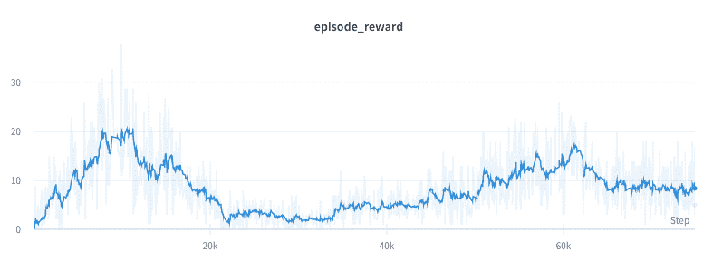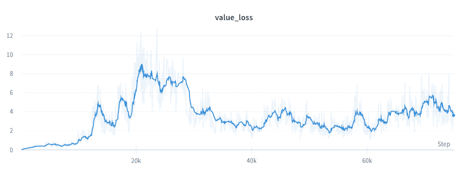

图 3.1—PPO 代理的奖励(左)和价值损失(右)，价值损失计算不正确。(图片由作者提供)

当我们构建我们的代理时，Costa 的 [CleanRL](https://wandb.ai/cleanrl/cleanrl.benchmark/runs/thq5rgnz) 指标给了我们很大的帮助。

**我们的指标**

经过大量工作，我们设法得到了 50 英镑左右的报酬。显然不理想，还有很多工作要做，但这需要给算法增加一些额外的技巧，也很有可能在更多的训练后它会达到~400。

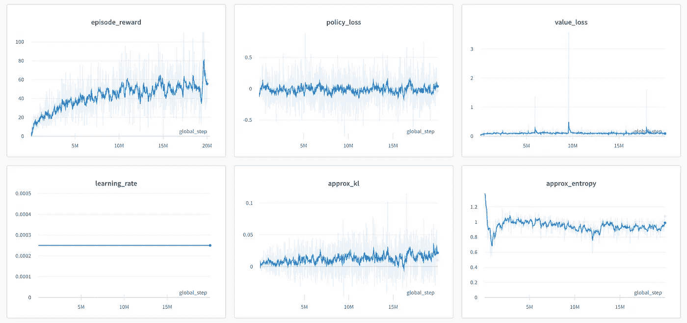

图 3.3:PPO 代理的所有记录指标。(图片由作者提供)

*创建您自己的 PPO 时，参考这些指标可能会有所帮助。*

# 查看代理

代理在不同培训阶段的表现的可视化显示。

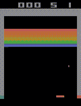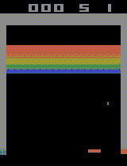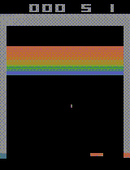

*0、10m、20m 步后代理。*(图片作者)

# 🙏结束语和未来工作

从头开始实施 PPO 是一个有趣的挑战，这无疑将我对 RL 和患者的理解延伸到了极限。真正有帮助的是有人一起工作，这既是一种动力，也有助于在我们陷入困境时提出想法。

从我们的实验来看，很明显，仅仅运行一个普通的 PPO 算法不会达到顶级的性能。因此，我们也根据基线规范实施了 PPO，达到了 **400** 的奖励。我的目标是发布一篇博文，介绍为尽快获得结果所需的修改！

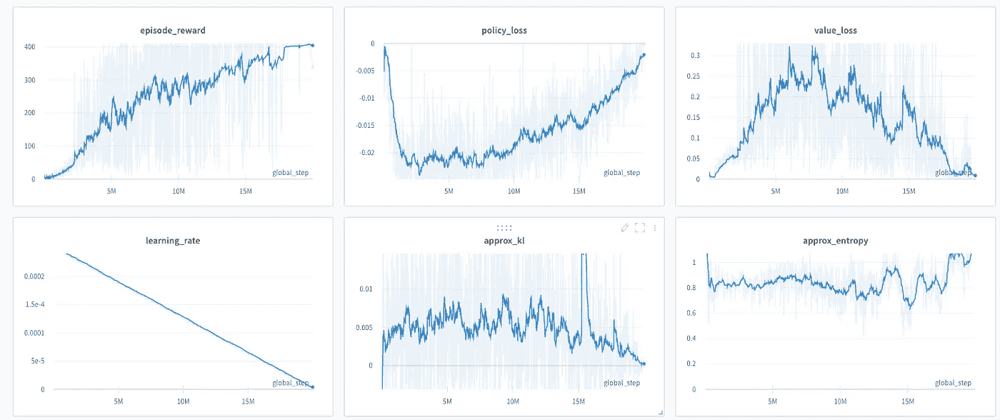

图 3.5—PPO 突破代理的培训，所有基线特征均已实施。(图片由作者提供)


PPO 突破代理正在实施所有基线功能。(图片由作者提供)

# 🔥承认

丹尼尔和我要感谢 [Costa Huang](https://costa.sh/) 在解释他的 PPO 实施如何运作时所给予的帮助。没有他的帮助，这条路肯定会长得多。