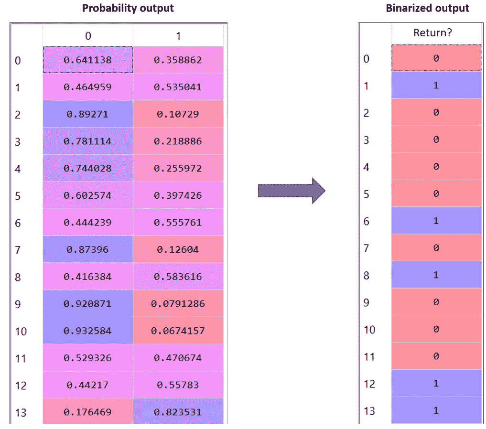

# RoC 和 AUC 的图解说明

> 原文：<https://towardsdatascience.com/a-graphical-explanation-of-roc-and-auc-183705caeb27?source=collection_archive---------23----------------------->

## 理解阈值不变性**并警惕一个常见错误**

这篇文章将帮助你理解 AUC 相对于其他指标的优势，它是如何计算的(使用 RoC ),以及为什么有必要这样计算。

大自然拥有巨鸟(图片来自[ykaaivu](https://pixabay.com/users/ykaiavu-7068951/?utm_source=link-attribution&utm_medium=referral&utm_campaign=image&utm_content=5372892)来自 [Pixabay](https://pixabay.com/?utm_source=link-attribution&utm_medium=referral&utm_campaign=image&utm_content=5372892)

## **简介**

如果您已经构建了一个分类器，那么您肯定已经使用准确度、精确度、召回率或 F 值等指标来衡量模型的性能。但是这些指标中的每一个都是在定义了衡量指标的截止概率(比如 0.5)之后计算的。

## **AUC 相对于其他指标的优势**

当你有两个竞争模型，并想比较他们的表现呢？如果模型 1 在截止值为 0.5 时表现最佳，而模型 2 在截止值为 0.4 时表现最佳，会怎样？那么只检查上面提到的指标将会给出一个不完整的视图。因此，在比较两个模型时，建议检查受试者工作特征(RoC)曲线下的面积。

这是因为 **AUC 是阈值不变指标**。我们的意思是，AUC 不依赖于用于计算分类性能的概率阈值。相反，我们迭代 0 到 1 之间的所有截止概率，并计算每个截止点的 TPR 和 FPR。

然后画一条曲线——FPR 对 TPR 的 RoC 曲线——并计算曲线下的面积。这是 AUC。

## **计算 AUC——正确的方法**

我有一个分类器，可以预测下个月顾客再次购买的可能性[ [零售交易案例研究](https://github.com/divya-chou/Retail_Transactions) ]。

分类器的概率输出[图片由作者提供]

我们使用*sk learn . metrics*中提供的 *roc_curve* 函数来计算 TPR 和 FPR。

Roc 在每个阈值返回 TPR 和 TPR 图片由作者提供]

*不用担心 1 排 1.99 的阈值。根据 sklearn 的官方文档，* [*thresholds[0]表示没有实例被预测，并且被任意设置为 max(y_score)+1。*](https://scikit-learn.org/stable/modules/generated/sklearn.metrics.roc_curve.html)

计算 AUC 如下:

并将 RoC 曲线绘制为:

RoC 的正确表示[图片由作者提供]

## **计算 AUC 时的常见错误**

很多时候，当我们太专注于编写计算 f1 的代码(或者准确度、精确回忆等)时。)喜欢:

*f1 = f1_score(y_true，y_pred)*

…我们最终复制了那一行，并对其进行编辑，以计算 AUC，如下所示:

*AUC = roc_auc_score(y_true，y_pred)*

人们忘记了 f1 使用二值化输出，而 AUC 需要模型的概率输出。因此，正确的代码应该是:

*AUC = roc_auc_score(y_true，y_pred_prob)*

为什么是错的？

**搞乱 AUC 的阈值不变性质会怎么样？对分类器的二值化结果计算 AUC 会发生什么？**

让我们用同样的例子来理解。

通过最大化 F1，我们找到了零售交易案例研究的最佳概率截止值。然后，我们将概率输出转换为二进制形式。

分类器的概率输出(L)和二值化输出(R)[作者图片]

现在计算所有可能的概率阈值下的 TPR 和 FPR..

等待..我们不是刚把输出二进制化了吗..？

这样我们只有两个概率阈值——0 和 1

所以 TRP 和 FPR 看起来像是——实际上只有两个条目——一个代表 0，一个代表 1。

二值化输出的 RoC 图片由作者提供]

RoC 图看起来像这样:

具有二值化输出的 RoC 图片由作者提供]

注意 AUC 从 74%下降到 68%。

当我们叠加两条 RoC 曲线时，差异变得明显。

由于二值化输出而丢失的区域[图片由作者提供]

蓝色和橙色线之间的区域是通过计算二进制化输出的 AUC 而损失的区域。

## **概括多个截止阈值**

通过在多个阈值上进行二进制化，绘制二进制化输出的 RoC。然后画一条连接所有曲线拐点的曲线，我们最终得到正确的 RoC 曲线。

加入拐点得到 RoC[图片作者]

紫色线实际上是绘制在概率输出上的 RoC 曲线。

## **结论**

我希望这些图表能阐明为什么 AUC 是根据分类器的概率输出计算的，以及我们所说的 AUC 是阈值不变的意思。

感谢阅读。想了解更多这样的数据科学知识，请阅读我的其他帖子，并在 Linkedin 上与我联系。