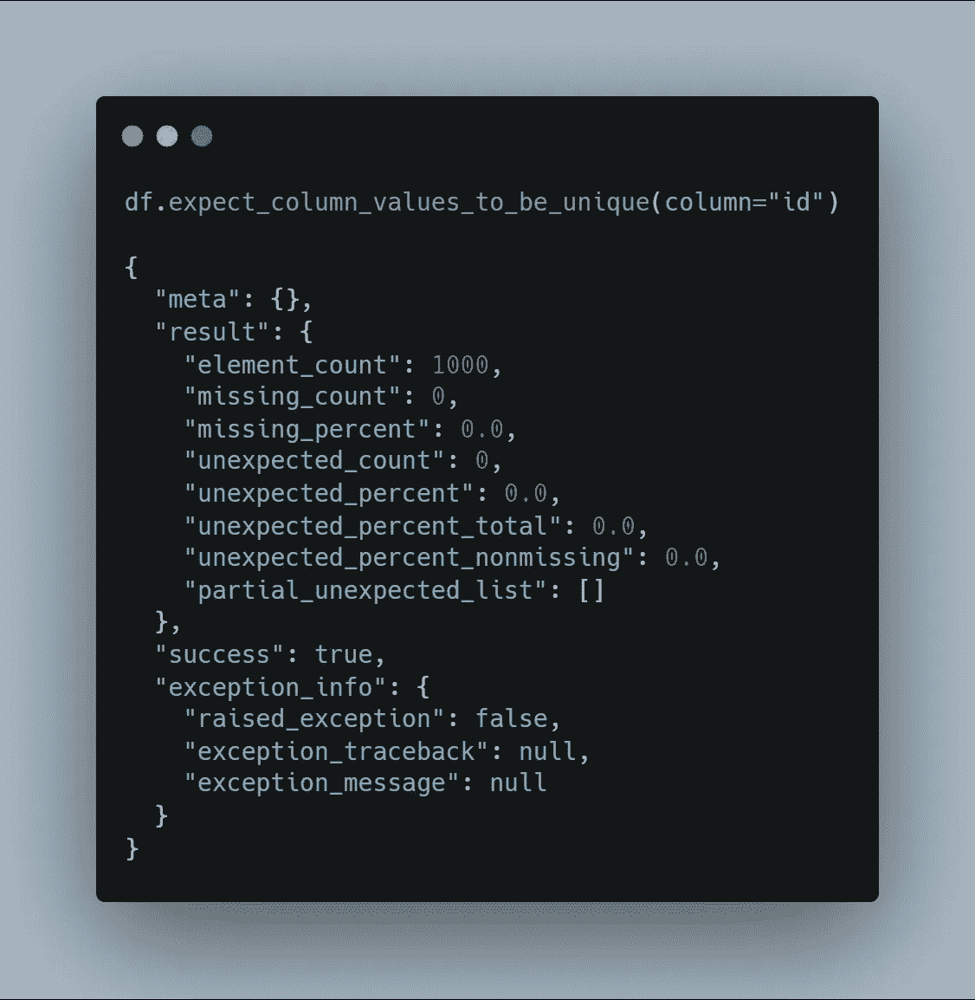
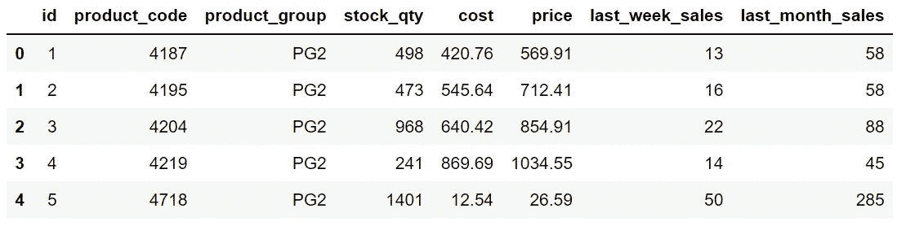
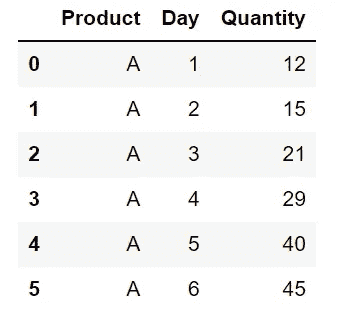

# 伟大的 Python 库:伟大的期望

> 原文：<https://towardsdatascience.com/a-great-python-library-great-expectations-6ac6d6fe822e?source=collection_archive---------2----------------------->

## 总是知道从你的数据中可以期待什么


照片由[托拉尔·穆罕默德](https://unsplash.com/@tholaal_mohamed?utm_source=unsplash&utm_medium=referral&utm_content=creditCopyText)在 [Unsplash](https://unsplash.com/s/photos/check?utm_source=unsplash&utm_medium=referral&utm_content=creditCopyText) 拍摄

我们生活在大数据时代。万亿字节的数据不断在我们周围流动。在这个巨大的数据流中，不可避免地会出现一些问题。

与数据相关的问题是我们需要应对的现实。为了获得可靠和准确的产品，持续监控数据质量至关重要。

[Great Expectations](https://greatexpectations.io/) 是一个 Python 库，它帮助我们验证、记录和描述我们的数据，以便我们始终确保它是好的，就像我们期望的那样。

Great Expectations 提供了几个函数来从许多不同的角度评估数据。下面是一个快速检查列中所有值是否唯一的示例:



`expect_column_values_to_be_unique`函数不仅返回简单的真或假答案，还提供其他有用的信息，如所有值的数量、意外值的数量等等。

在本文中，我们将通过在一个样本数据集上实现一些很棒的函数来发现 Great Expectations 库。

我们可以轻松地用 pip 安装它。

```
pip install great_expectations# in a jupyter notebook
!pip install great_expectations
```

我们现在可以导入它了。

```
import great_expectations as ge
```

让我们从创建用于示例的数据框开始。我之前已经创建了一个填充了模拟数据的[销售数据集](https://github.com/SonerYldrm/datasets)。

需要注意的是，我们需要一个兼容的数据框架，以便能够应用远大前程库中的功能。

一种选择是使用`from_pandas`函数转换熊猫数据帧。

```
import pandas as pdsales = pd.read_csv("Sales.csv")df = ge.from_pandas(sales)
```

另一种选择是直接使用《远大前程》的`read_csv`功能。

```
df = ge.read_csv("Sales.csv")df.head()
```



df(作者图片)

id 列应该总是唯一的，重复的 id 值可能会产生严重的后果。我们可以很容易地检查该列中值的唯一性。

```
df.expect_column_values_to_be_unique(column="id")# output
{
  "meta": {},
  "result": {
    "element_count": 1000,
    "missing_count": 0,
    "missing_percent": 0.0,
    "unexpected_count": 0,
    "unexpected_percent": 0.0,
    "unexpected_percent_total": 0.0,
    "unexpected_percent_nonmissing": 0.0,
    "partial_unexpected_list": []
  },
  "success": true,
  "exception_info": {
    "raised_exception": false,
    "exception_traceback": null,
    "exception_message": null
  }
}
```

Great Expectations 库的函数返回一个包含多条信息的 json 文件。我们可以把它赋给一个变量，从中提取特定的信息。

在上面的例子中，我们实际上感兴趣的是成功值是否为真。

```
uniqueness = df.expect_column_values_to_be_unique(column="id")uniqueness["success"]
True
```

如果它是假的，那么我们应该寻找进一步的细节。

假设我们预期产品的价格在 1 到 10000 之间。让我们检查一下价格栏是否符合我们的预期。

```
sales_ge.expect_column_values_to_be_between(
    column="price", min_value=1, max_value=10000
)# output
{
  "meta": {},
  "result": {
    "element_count": 1000,
    "missing_count": 0,
    "missing_percent": 0.0,
    "unexpected_count": 2,
    "unexpected_percent": 0.2,
    "unexpected_percent_total": 0.2,
    "unexpected_percent_nonmissing": 0.2,
    "partial_unexpected_list": [
      0.76,
      0.66
    ]
  },
  "success": false,
  "exception_info": {
    "raised_exception": false,
    "exception_traceback": null,
    "exception_message": null
  }
}
```

成功是假的，有两个意外值。

我们还可以检查分类列中的值是否在给定的集合中。

```
df.expect_column_values_to_be_in_set(
    column = "product_group", 
    value_set = ["PG1","PG2","PG3","PG4", "PG5"]
)
```

我没有粘贴其余示例的输出，因为它有点冗长。不过你可以自己练习。

远大前程库还有其他几个有用的功能。这将需要写几页来做一个例子。请随意查看[期望词汇表](https://legacy.docs.greatexpectations.io/en/latest/reference/glossary_of_expectations.html)，查看所有可用的功能。

另一个我觉得很有用的功能是`expect_column_values_to_be_increasing`。

考虑以下数据帧:



我的 _df

如果我们希望 quantity 列中的值总是增加，我们可以使用我刚才提到的函数。

```
my_df.expect_column_values_to_be_increasing(column="Quantity")
```

我们还可以基于多个列检查唯一性。例如，我们可能希望每个产品都有唯一的产品组和 id 组合。

下面是我们如何使用 Great Expectations 库实现这个控件:

```
df.expect_compound_columns_to_be_unique(
    column_list=["product_group","id"]
)
```

Great Expectations library 是用于数据质量检查的标准且易于维护的解决方案。我们只介绍了它的一小部分功能。我强烈建议查看[期望词汇表](https://legacy.docs.greatexpectations.io/en/latest/reference/glossary_of_expectations.html)。

你可以成为一名[媒介会员](https://sonery.medium.com/membership)来解锁我的作品，以及媒介的其他部分。如果您使用以下链接，我将收取您的一部分会员费，无需您支付额外费用。

<https://sonery.medium.com/membership>  

感谢您的阅读。如果您有任何反馈，请告诉我。