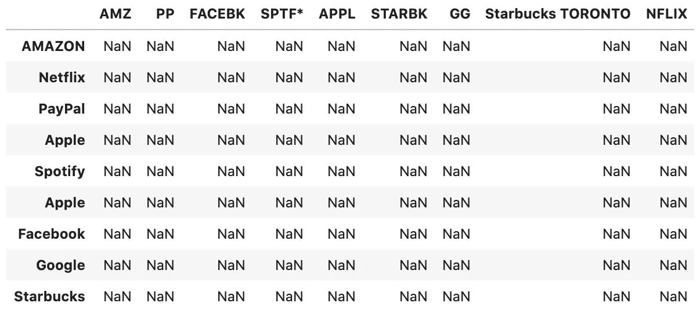
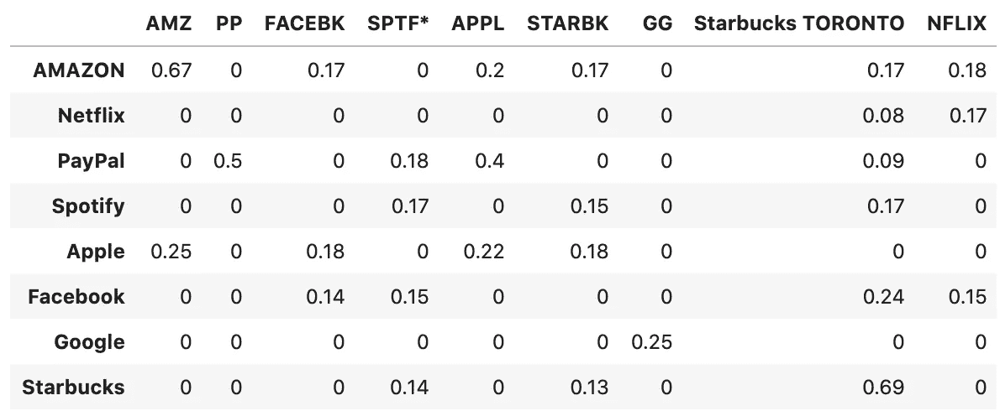
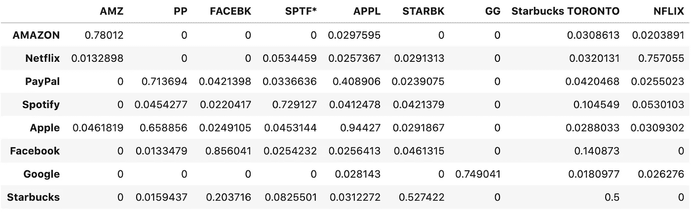
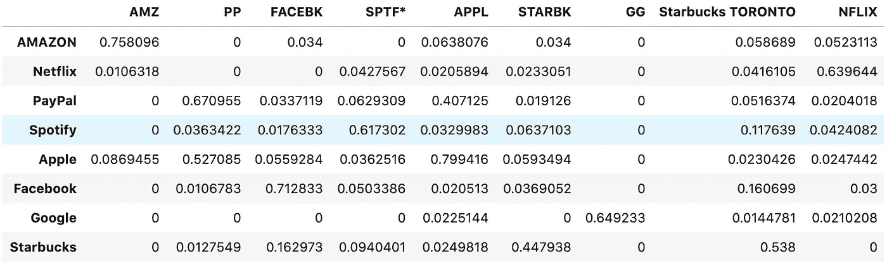
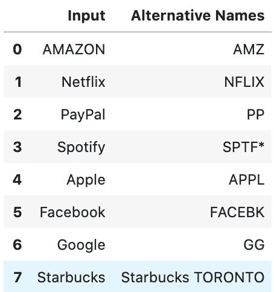

# 如何用 FuzzyWuzzy 和 HMNI 构建模糊搜索算法的指南

> 原文：<https://towardsdatascience.com/a-guide-on-how-to-build-a-fuzzy-search-algorithm-with-fuzzywuzzy-and-hmni-26855ce1818b?source=collection_archive---------14----------------------->


马库斯·斯皮斯克在 [Unsplash](https://unsplash.com?utm_source=medium&utm_medium=referral) 上的照片

在这篇文章中，我将指导你如何构建一个模糊搜索算法。这种算法的一个非常实际的用例是，我们可以用它来查找一个品牌的替代名称“亚马逊”，我们希望它返回字符串，如“AMZ”，“AMZN”或“AMZN MKTP”。

这篇文章的提纲如下:

*   用 FuzzyWuzzy 进行模糊搜索
*   用 HMNI 进行模糊搜索
*   集成算法的模糊搜索
*   返回一个替换名称表

# 用模糊不清的东西搜索

<https://github.com/seatgeek/fuzzywuzzy>  

FuzzyWuzzy 是一个很棒的 python 库，可以用来完成模糊搜索工作。本质上，它使用 [Levenshtein 距离](https://en.wikipedia.org/wiki/Levenshtein_distance)来计算序列之间的差异/距离。

根据维基百科，Levenshtein 距离是评估将一个单词变成另一个单词所需的最小数量的**单字符编辑**(插入、删除或替换)的度量。这意味着 FuzzyWuzzy 中的评估指标可以很好地对拼写错误的单词执行模糊搜索，并捕获输入之间的最长公共子序列**。**

但在某些情况下，例如，品牌名称的缩写，仅仅知道字符水平的差异可能是不够的。在返回最相似的名字匹配之前，知道语音和语义的不同也是有意义的。

因此，我想介绍另一个名为 HMNI 的库，它可以帮助我们检查输入之间的语音相似性，但首先让我建立一个样本数据集，以便进行更合适的测试。

从 FuzzyWuzzy 库开始，要安装它，我们可以运行以下命令:

```
# Using PIP via PyPI
pip install fuzzywuzzy# Or the following to install python-Levenshtein too
pip install fuzzywuzzy[speedup]
```

然后，我们将继续为我们的测试创建一个样本数据集。

```
# Sample Dataset
df = pd.DataFrame(index =['AMAZON', 'Netflix', 'PayPal', 'Apple', 'Spotify', 'Apple', 'Facebook', 'Google', 'Starbucks'],
                  columns = ['AMZ', 'PP', 'FACEBK', 'SPTF*', 'APPL', 'STARBK', 'GG', 'Starbucks TORONTO', 'NFLIX'])# Print 
df
```



样本数据集

我们将行索引设置为完整的品牌名称，将列名设置为这些品牌的可能缩写。

现在，我们可以定义一个函数，将两个字符串作为输入，返回一个相似性得分作为输出。在 FuzzyWuzzy 中，我们可以使用函数 *fuzz.ratio()* 来计算两个输入之间的相似性得分。

```
# Customized similarity function with FuzzyWuzzy
def similarity_fuzzy(word1, word2):

    score = fuzz.ratio(word1, word2)

    d = score/100

    return d
```

现在，我们只需要在每对行索引和列名上实现 *similarity_fuzzy* 函数，用相似性得分替换这些 NaN 值。

```
from tqdm import tqdmfor i in tqdm(range(8)): # range in number of rows 

    for j in range(9): # range in number of columns 

        df.loc[df.index[i], df.columns[j]] = similarity_fuzzy(str(df.index[i]), str(df.columns[j]))

df
```



FuzzyWuzzy 的输出

正如我们所看到的，FuzzyWuzzy 不能很好地为输入的品牌名称找到正确的缩写。我认为主要原因是因为缩写丢失了很多字符，所以使用 Levenshtein 距离的度量不是这种情况下的最佳解决方案。

这就是我认为计算语音相似度的新视角会有很大帮助的地方！

# 用 HMNI 搜索

<https://github.com/Christopher-Thornton/hmni>  

一般来说，HMNI 是一个遵循应用软逻辑来近似拼写和**语音**(声音)特征的认知过程的库。

一篇值得探索的好文章:

</fuzzy-name-matching-with-machine-learning-f09895dce7b4>  

为了测试 HMNI 的模糊名称匹配性能，我们可以遵循与 FuzzyWuzzy 相同的步骤。

要安装 HMNI:

```
# Using PIP via PyPI
pip install hmni
```

要初始化匹配器对象:

```
import hmni
matcher = hmni.Matcher(model='latin')
```

要自定义我们的相似性函数:

```
def similarity_hmni(word1, word2):

    d = matcher.similarity(word1, word2)

    return d
```

然后，我们可以在同一个样本数据集上测试 *similarity_hmni* 函数来比较性能。



HMNI 的产出

FuzzyWuzzy 和 HMNI 之间的区别非常明显。HMNI 似乎更善于根据潜在的语音特征找到品牌输入的缩写。

但这并不意味着使用 HMNI 没有坏处。例如，看看“贝宝”和“苹果”，我们发现 HMNI 往往不善于区分这两个品牌，因为相似性得分分别为 0.71 和 0.41 以及 0.66 和 0.94。如果我们向数据集中添加更多的输入，这可能会造成一些混乱。此外，对于“Starbucks”和“Starbucks Toronto”之间的精确匹配，HMNI 应该对其预测更有信心，但现在它只返回值 0.5。

# 使用集成算法进行搜索

这可能意味着我们应该考虑整合两个维度，语音相似性和 Levenshtein 距离，以实现最佳平衡。

我对此的解决方案很简单。只需将两个函数添加到一个新函数中，我们将调整权重以确定最终的输出分数。

```
def similarity_calculator(word1, word2):

    score_1 = fuzz.ratio(word1, word2) # score from fuzzywuzzy

    score_2 = matcher.similarity(word1, word2) # score from hmni

    score_1 = score_1/100

    score = 0.2*score_1 + 0.8*score_2 # customize your own weights 

    return score
```



集成算法的输出

通过将这两个函数整合在一起，我们似乎达到了一个平衡，即我们可以将 60%设置为一个阈值来区分匹配和不匹配。除了星巴克，我们可能应该使用*直接搜索这些大品牌。python 中的 find()* 函数。

# 最后一步

现在，剩下的工作是为品牌输入创建一个顶级备选名称匹配表。对于样本数据集，我选择只返回具有最高相似性得分的最佳匹配。代码如下所示:

```
# Return a new column 'Max' that contains the alternative names for each brand input
df['Max'] = df.astype(float).idxmax(axis=1)# Create a new dataframe 'result' to display only the input & output columns
result = pd.DataFrame(list(df.index), columns=['Input'])
result['Alternative Names'] = list(df.Max)
result
```



替代品牌表

您的最终输出将类似于上面的数据集。

感谢您的阅读。我希望这篇文章能对那些正在寻找如何用机器学习构建模糊搜索算法的人有所帮助。

我认为这篇文章可能是你开发自己的模糊搜索算法的一个很好的开始:)

再次感谢！

下篇见~