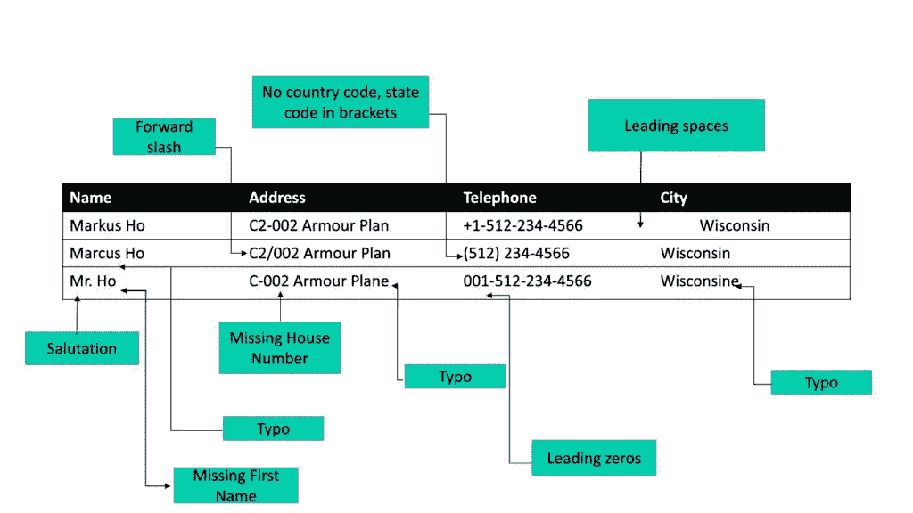
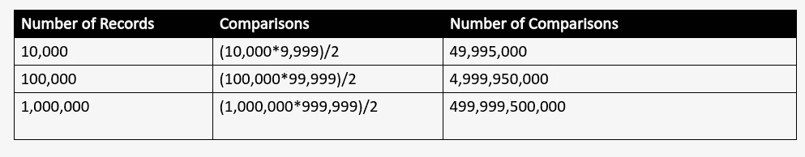
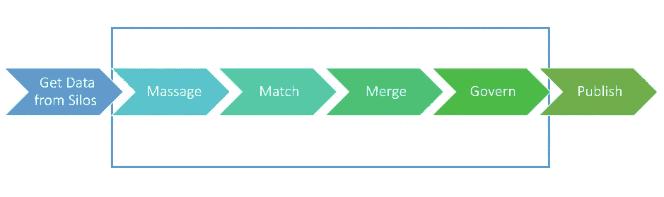

# 人工智能敏捷数据控制指南

> 原文：<https://towardsdatascience.com/a-guide-to-agile-data-mastering-with-ai-3bf38f103709?source=collection_archive---------24----------------------->

## 主数据为事务和操作提供了通用词汇。

# 什么是主数据？

组织需要处理各种数据，包括事务性数据、非结构化数据、分层数据、元数据和实体数据。例如，对于客户，组织会生成交易、客户账户信息(包括人口统计数据)、营销接触点和互动等数据。所有这些数据都是作为分散在不同数据应用程序中的零星数据点收集的。

常见的业务实体——人、事物、地点和概念是主数据。主数据定义了顶级业务对象。根据 Gartner 的调查:

主数据是一组一致且统一的标识符和扩展属性，用于描述企业的核心实体，包括客户、潜在客户、公民、供应商、站点、层次结构和会计科目表

主数据支持企业间的信息共享。它为事务和操作提供了通用的词汇表。它是构建所有业务应用程序的基础。

# 数据孤岛

让我们看一下组织中存储和管理数据的通常方式。

随着公司的发展，其数据系统也在发展。为了照顾一个业务线，或者管理一个产品，或者处理一个新的领域，一个团队的人一起工作。现在，这个团队需要特定的工具来保存和操作他们的数据。比起公司销售人员，他们可能更喜欢自己开发的 CRM 或电子表格。对于他们特定的产品线，他们可能会构建一些定制的应用程序。他们的供应链系统可能与总部的不同。在少数情况下，他们也可以通过公司的工具和系统。所以是混搭。

这一切都很好，他们需要完成工作。他们需要遵守当地法规。他们必须迎合他们的观众，并交付成果。将数据置于自己的控制之下，使他们能够快速行动，快速响应不断增长的业务需求。他们可以用对他们最有意义的方式来表示实体。内部 IT 或合同工程师，很可能是两者的结合，帮助他们运行和管理这些系统。

大公司也和其他大公司合作。他们收购或合并，为他们的数据系统鸡尾酒添加更多的组合！

概括起来

*   业务单位和部门构建并使用专门的应用程序
*   数据保存在这些独立的应用程序中
*   这些孤岛对于运营效率至关重要

数据孤岛是孤独的战士。

马特·斯卡兰迪斯在 [Unsplash](https://unsplash.com?utm_source=medium&utm_medium=referral) 上拍摄的照片

# 什么导致了数据孤岛？

数据孤岛可能是多种因素造成的。

## 结构的

部门角色和职责以及公司的结构方式通常会导致数据孤岛。

## 地理学的

除此之外，地理边界和法规(例如数据位置)也是一个因素。不同的国家有不同的做生意的方式，像在印度，手机信息是非常普遍的，所以客户记录可能会有。但是在美国，人们很注重隐私，不喜欢轻易分享他们的手机信息。此外，每个国家都有法规要求，因此业务和数据都围绕这些要求构建。数据也可以用地区语言显示。

## 技术的

大多数应用程序，包括 ERP 和 CRM，都不能很好地进行集成，所以这些专用系统也导致了数据孤岛的技术原因。您可能喜欢对数据进行分区——比如将数据分割成一个区域，以便更好地管理它。因此，这也可能是数据仓库的一个技术原因

# 数据仓库的示例

## 客户数据孤岛

这是一个客户数据如何被孤立的例子。以下是一些包含客户相关信息的企业应用程序

*   Web 数据存储
*   店内数据
*   产品级数据存储
*   电子邮件营销数据
*   遗留系统
*   通过 M&A 的客户数据

在上面的客户数据仓库的例子中，多个系统保存着客户旅程和与企业交互的片断。这通常不仅仅是这些系统。回到 2017 年，普通营销部门使用 [16 种不同的技术平台](https://www.forbes.com/sites/larrymyler/2017/06/30/your-martech-silos-are-slowly-killing-your-company-and-what-to-do-about-it/#7ed639e357c9)。

## 采购数据仓库

典型的采购流程涉及多个利益相关方和系统。供应商在 ERP 中注册，然后在另一个系统中提交并批准规格。对供应商场所和合规性的检查由另一个团队使用他们的流程和应用程序数据库来完成。签约和法律部门参与其中，他们带来了额外的数据和见解。批准供应商供应品的交付团队是他们系统的另一个参与者。

*   供应商注册
*   需求规格
*   检查
*   合同
*   交付

# 数据控制

人们意识到，当他们组合这些单元数据系统或数据孤岛时，他们可以从他们的数据中获得更大的价值。以客户数据为例。我们可以跨多个产品线连接和合并客户数据，并了解买家倾向。我们可以发现交叉销售和追加销售的机会。我们可以建立个性化的沟通和有针对性的渠道。公司可以更快、更准确地搭载客户。我们可以提高销售效率，通过他们喜欢的渠道提供他们想要的产品和服务，让客户高兴，只需对他们有更多的了解。

我们还可以管理风险和法规遵从性—了解他们与客户或家庭(比如保险)相关的风险有多大。或者说哪些系统存储了 GDPR 主题访问请求(SAR)的客户数据。

跨数据仓库的供应商数据整合产生了关于跨业务单位、区域和地理位置的供应商支出的极好的洞察力。公司可以了解跨部门的价格一致性，更快地接纳新的供应商，并管理与供应商位置和劳动实践相关的风险。

类似地，集成其他数据资产(如供应品)有助于跨部门共享它们，或找出给定供应品的最佳供应商，或推动业务部门之间的定价一致性。整合数据仓库以了解客户、产品、供应商、合作伙伴、供应品、员工和其他业务实体会产生巨大的价值。

数据掌握本质上是相信

# 整体大于部分之和

[粘土银行](https://unsplash.com/@claybanks?utm_source=medium&utm_medium=referral)在 [Unsplash](https://unsplash.com?utm_source=medium&utm_medium=referral) 拍摄的照片

**数据控制也称为主数据管理或 MDM。

# 数据控制的好处

整合不同行业的数据仓库具有巨大的价值。重要的是要明白，我们并没有打破这些数据孤岛。数据孤岛按原样存在。我们希望他们留下来——保持他们的功能，保持他们的敏捷。让各自的团队来管理和拥有它们，并在保持绩效的同时继续推动业务发展。通过数据控制和运营数据，我们还试图看到整体情况，并用整体的组织视图来增强我们的焦点视图。通过这种方式，我们可以利用从统一和集成的数据中收集的见解来增强我们已经很聪明的团队。职能团队可以使用来自 MDM 的信息，更有效地运营、节省成本、降低风险并保持合规性。

实际上，我们正在利用每个孤岛中的集体智慧，对可信数据做出明智的选择。

# 数据控制系统的关键部件

为了构建实体的统一视图，MDM 系统集成了数据仓库，并将数据集中在一个地方进行处理。然后统一它。数据主控制系统帮助企业拼凑一个实体，比如说一个客户，将它定义为名字、姓氏、电子邮件、电话号码、组织、地址、头衔等属性的组合。

# 用于数据控制的模式映射

一旦实体被定义为属性的集合，来自不同筒仓的属性被映射到该实体。有些映射很简单，你只需告诉系统 silo1 中的 last_name 可以映射到 lastName，或者 silo2 中的 lName 可以映射到 lastName。在某些情况下，我们需要对数据进行一些准备或转换，比如将数据 silo 3 中的 first_name 和 last_name 连接起来，并将其映射到统一客户数据的 customer_name 属性。我们可能还需要清除一些包含错误值的记录，如 NA 或空白，或出生年份的 1900，因为我们不希望我们的输出被破坏或出错。

# 数据匹配

在模式映射之后，数据主控系统将来自不同筒仓的实体的数据分组在一起。人们以多种方式将数据输入他们的系统，许多数据记录可能来自合作伙伴或客户提供的值。因此，在拼写错误、称呼、缩写、语言等方面有很多变化。因此，系统允许您配置对哪些记录进行分组或匹配，以代表一个客户或产品或供应商。

在一个基于规则的系统中，这些规则是由 IT 和业务协作手工制作的，并定期调整以避免命中和失误，并收敛到期望的结果。

# 数据母带——黄金唱片

一旦一个实体的数据被分组，我们就想要构建一个真正的价值——用数据管理的术语来说就是一个黄金拷贝。我们定义如何在对组有贡献的源系统中挑选一组有代表性的属性。对于电子邮件数据，我们可以更信任 CRM 这样的源系统，只有当应用程序数据库中的地址在过去 3 个月内进行了更新时，我们才更有信心。如果源系统在与组匹配的记录中有许多空白值，我们可能希望忽略其中的任何值。黄金记录可以暴露给数据仓库，他们可以使用它来丰富他们的源系统，并收集更多关于他们的数据的信息。

# 等级制度

理解关系、一个实体如何与其自身以及其他实体相关联是至关重要的。为记录分配层次结构或类别有助于我们做到这一点。一些分层数据可能是特定于组织的，例如谁向谁报告。但是在许多情况下，特别是对于零件、服务和供应品，有像 UNSPSC 或 eClass 这样的分类法来定义它们所属的类别。大多数大型组织也有完整的内部分类方案，很多时候不止一个。

数据控制系统允许我们定义自定义层次结构或选择标准层次结构并为其分配记录。这样，我们可以了解关系，并将属于同一组的不同记录组合在一起。例如，通过层级管理，我们可以说我们在电气设备或文具项下采购了多少物资。

# 数据控制流程

让我们试着理解一个典型的主数据管理系统是如何工作的。

作者图片

# 获取数据

主数据管理系统连接到数据仓库，并将数据放到一个中心位置进行进一步处理。

# 按摩

这一步包括模式映射、数据标准化和规范化。为了将记录集成在一起，我们需要输入记录具有相同的字段集。我们还需要字段以同样的方式表示在其中捕获的信息。例如，在所有记录中，像性别这样的类别应该是男性/女性或 1/2。

# 相称的

协调多条记录以表明它们中的哪些属于同一个实体称为匹配。让我们看看需要匹配的来自 3 个不同源系统的客户记录。

作者图片

在数据匹配期间，这 3 个在所有属性上都有变化并且没有公共标识符的记录将被分配一个匹配标识符或聚类标识符，以指示它们相互链接。

# 合并

一旦记录被聚集，使得属于一个实体的记录具有唯一的标识符，我们就可以将它们组合起来，以构建一个干净、统一和可信的视图。这也被称为金唱片。

# 出版

分析、报告、合规、风险和运营等下游应用程序需要针对各自的用例访问主实体。记录的这种发布使筒仓引用相同的数据属性并改进它们的功能。

# 数据控制的挑战

总的来说，当我们谈论集成时，有很多事情需要考虑端到端数据控制系统

# 赞助

赞助挑战来自于谁赞助数据控制项目。应用程序共享数据并反过来获得丰富的数据，这是业务优势还是纯技术优势？典型的主控优势分散在各个业务部门，因此预算成为一个大问题。

# 所有权

哪个部门负责构建 it 和管理主控解决方案—是为整个企业提供服务的 it 部门吗？将使用数据的是业务部门吗？由于主数据涉及销售、营销、运营、支持、采购、合规和风险，因此建立一个能够平衡每个团队的个人需求的明确所有者非常重要。通常，所有者是组织中的高层人员，有权并有义务在整个公司范围内推动主数据管理计划。

# 协调

所有利益相关者和系统需要相互协调，以确保数据管理无缝进行。

# 管理

许多数据是敏感的，或者不需要暴露给每个个人或团队。因此，当我们统一和掌握数据时，正确的访问控制至关重要。此外，确定每个数据集的所有者也很重要。

# 过程

跨地域的部门间协调需要什么样的流程？主数据管理系统如何影响企业当前的工作流程？

因此，它是所有权、协调、治理、过程的组合，这些必须在数据控制中结合在一起。

# 技术的

## 数据格式

要掌握的应用程序以不同的格式和数据存储来保存实体信息。主数据系统可能需要使用关系数据库、NOSQL 数据存储、云存储和本地文件系统的混合数据。格式可能从专有到 JSON、XML、CSV、Parquet、Avro 等等。

## 数据源中的模式变化

实体表示通常因系统而异。一个源系统中的 name 属性在另一个源系统中可能被分为名字、中间名和姓氏。即使属性相同，列命名也可能不同，例如，firstName、fName、first_name 都可以表示名字。同样，每一个类别也可能不一样。男性和女性的记录可以在一个系统中标记为 M 和 F，在另一个系统中标记为 1 和 2。

## 数据匹配

计算机理解相等或比较，但不理解模糊匹配。匹配具有属性差异且没有单一公共标识符的记录是非常具有挑战性的，因为没有现有的操作员可以做到这一点。因此，在数据匹配系统中有 3 个主要挑战

**匹配定义**

我们需要非常小心匹配过程，以及如何定义哪些属性和记录确实可以说是相同的。错别字、前缀、后缀、空白值、额外字符和缩写是需要考虑的一些常见变化。

**音阶**

一旦建立了相似性的概念，我们需要将每条记录与其他记录进行比较，计算的次数会随着记录数量的增加而成平方增加。下表列出了单个属性记录所需的比较。

作者图片

随着数据量增加 10 倍，比较的次数增加 100 倍，使得数据匹配成为一个具有计算挑战性的问题。

**品种**

企业需要处理不同种类的数据，所有企业都需要掌握这些数据。客户、供应商、产品、员工和供应品都有不同的属性，因此我们需要相应地关注每个领域。

**语言**

大型跨国公司以地区和本地语言保存数据。由于每种语言都有其复杂性，基于声音或字符串相似性来匹配记录在这里变得具有挑战性。例如，中国人的名字是短字符串，即使在完全不同的名字中也有许多相同的字符。

# 层级管理

这个世界是建立在关系之上的。客户有家庭、雇员、雇主和其他关系。他们处理特定的产品和服务。供应商有本地、地区和全球办事处。组织有多个地址—法律地址、帐单地址、送货地址对他们来说都可能不同。所有主数据都需要在 MDM 系统中有效地建模。

# 当前主数据管理工具的评论

多个行业都广泛需要主数据管理。每个与客户或供应商打交道的大型或小型组织都有一些不同的运营系统，如 ERP、CRM、PoS 和应用程序数据库，最终都必须有一个主数据管理系统来建立单一的真实来源。因此，大多数现有的主数据管理软件都提供了通用的工具和库，以满足它们所服务的不同行业的需求。这允许跨不同的域部署主数据管理工具。然而，有许多条件逻辑需要针对每个领域和行业进行调整。

企业软件传统上是围绕关系数据库构建的。在三层体系结构中，有一个基于 web 的或胖客户机，一个中间层有应用程序逻辑和关系数据库中的数据持久性，大多数主数据管理系统都是基于规则的。基于规则的主数据管理面临着巨大的规模挑战，既包括数据源和属性的数量，也包括数据匹配所需的大量比较。想象一下，试图掌握 100 个有 10 个属性的源系统。仅通过手动操作进行模式映射就需要花费几个月的时间。

类似地，想象建立实体匹配的规则。照顾不同属性的变化是一项痛苦而艰难的工作。此外，由于这是一项计算量很大的工作，我们希望避免将所有内容进行比较，因此传统的基于规则的主数据管理系统遵循一个繁琐的过程，即数据分析、标准化、规范化、模糊键定义、相似性规则定义和数据库调整。

为了确保我们可以通过传统的匹配来匹配记录，我们尝试将它们都放在同一个数据库中。进行数据分析是为了了解属性特性和缺失值。属性是标准化的，因此它们以相同的方式表示信息，例如，如果 1 在一个数据源中表示女性，而在另一个数据源中表示 F，则它们都将更改为 1 或 F 或女性。发布此消息，通过将字段值更改为相同的大小写来规范化值，删除特殊字符，将 st .更改为 Street，反之亦然。再次分析数据为我们提供了模糊匹配键，这实质上是一种将记录分组到存储桶中的方法，以便只比较存储桶中的记录。相似性规则是在更清晰的数据上定义的。由于所涉及的计算，即使在定义了模糊匹配键之后，也需要进行大量的数据库调优。

由于配置和实施中的所有这些工作流，主数据管理部署的典型成本为数百万，实施成本是基本许可证成本的 4 倍。这将导致长达数年的漫长部署周期。很多主数据项目拍预算，无法掌握每一个系统。添加新的数据控制系统既费钱又费时，需要几个月的努力。除此之外，基于规则的主数据管理系统还存在性能和可伸缩性问题，数据库调优周期长，并且无法处理数百万条记录。

# MDM 中的 AI

# 什么是人工智能

人工智能一词被广泛用于各种各样的应用。有关于人类智能、感知和判断被机器模仿的讨论。通过人工智能技术在音频、视觉和文本分析方面的许多令人兴奋的突破为我们打开了无限的可能性。机器学习是人工智能中的一套工具和技术，是一个充满希望的领域，其中一套算法从数据中导出模式并进行推理。机器学习可以在我们已经有很多我们知道的数据点的情况下被监督，或者在我们没有结果，只有输入数据点的情况下被监督。

广义地说，在监督机器学习过程中，我们从我们已经知道结果的数据中学习。哪些记录属于同一个供应商？哪一项记录是文具消费？这个输入数据集称为训练数据集。接下来，我们从这些数据中构建表示。这被称为特征工程。假设我们有一对要匹配的记录。一个特征可以是公共字符的数量。或者对于花费分类，它可以是供应品的话。

优化模型/算法以尽可能接近训练数据集的结果。最终，当我们对模型的性能感到满意时，当我们知道预测是准确的并且错误率较低时，我们可以将它转移到生产中。我们可以构建一个数据管道，从原始数据中获取特征，应用模型并获得预测。现在好的方面是，如果我们在选择人工智能模型和构建我们的特征方面做得很好，我们就不需要数据中每个变化的代表性样本。这就是规则失效、人工智能大放异彩的地方。它可以概括。有时它过于一般化，但是有一些技术来平衡它。

# MDM 中的 AI

由于所涉及的复杂性和规模，在 MDM 中使用 AI 使我们能够以更低的成本更快地获得结果。数据控制是企业数据堆栈的重要组成部分，通过利用人工智能，我们可以消除旧 MDM 技术的许多令人痛苦的方面，并用最先进的学习系统取而代之，这些学习系统部署速度快，规模大。

# 利用人工智能实现大规模敏捷数据控制

当我们审视数据主管理系统的核心时，我们意识到，自传统主数据管理系统建立以来，技术领域已经发生了巨大的变化。ETL 是一个非常成熟的领域，开源技术如 Kafka、Change Data Capture、Apache Nifi 等大量涌现，它们可以帮助我们将数据导入系统或从系统中导出数据。每个云提供商还提供其数据摄取和提取工具套件。因此，我们只需要关注核心数据按摩、[匹配](https://github.com/zinggAI/zingg)和治理。

敏捷数据控制专注于解决核心主数据功能，让我们使用我们已经熟悉的最先进的技术来提取和加载数据。通过使用人工智能，敏捷数据控制使我们能够快速构建 MDM 系统，推荐操作并增强我们的主数据工作流。AI 还允许此类工具通过自动分析和学习数据试探法进行扩展，消除脏数据的噪声，以便可以学习模式映射或模糊匹配键，并且只需要最少的数据按摩和零标准化。

作者图片