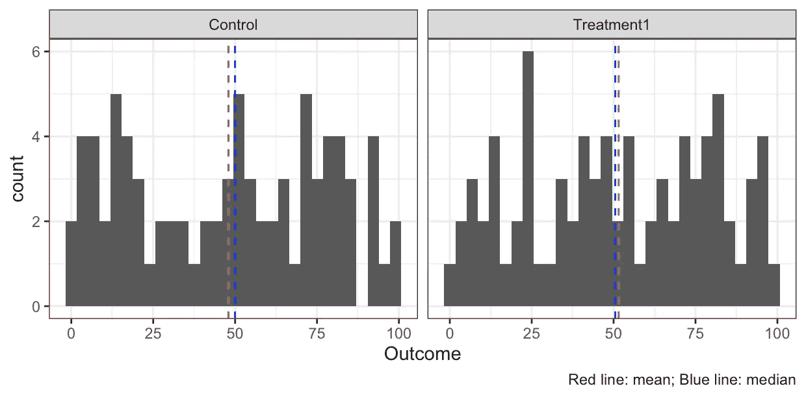
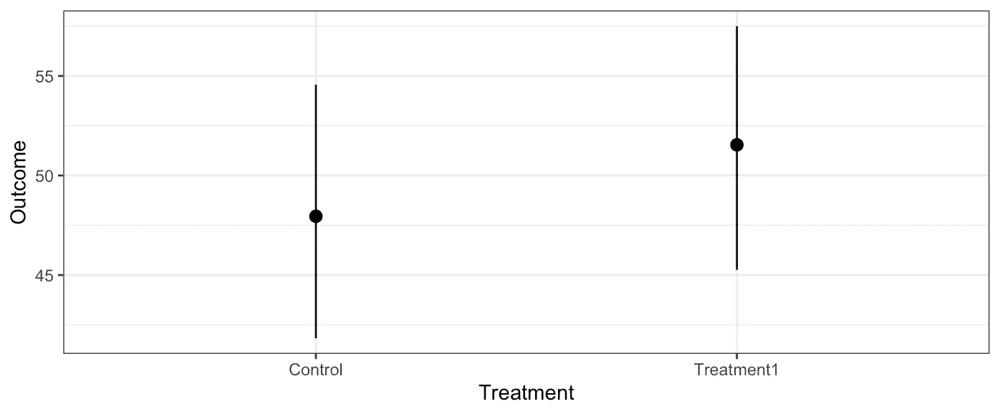
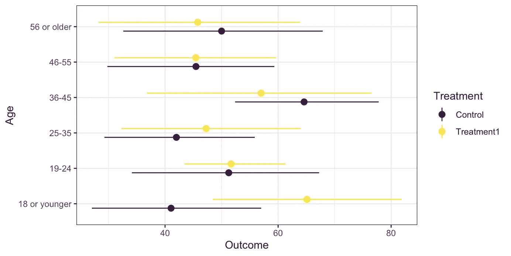

# 实验数据分析指南

> 原文：<https://towardsdatascience.com/a-guide-to-analyzing-experimental-data-7b05eea7e70c?source=collection_archive---------17----------------------->

## [动手教程](https://towardsdatascience.com/tagged/hands-on-tutorials)，[思想和理论](https://towardsdatascience.com/tagged/thoughts-and-theory)

## 如何克服创业恐慌，并从你的实验中获得有见地的结果


由[卢卡斯·布拉塞克](https://unsplash.com/@goumbik?utm_source=unsplash&utm_medium=referral&utm_content=creditCopyText)在 [Unsplash](https://unsplash.com/s/photos/experiment-survey?utm_source=unsplash&utm_medium=referral&utm_content=creditCopyText) 上拍摄

你曾经运行过实验研究，或者执行过一些 A/B 测试吗？如果有，你应该熟悉**分析前的恐慌**:如何让数据揭示你的实验是否起作用？在经济学、公共政策、市场营销和商业分析领域，我们每天都面临着来自**进行实验**和**分析**实验结果的挑战。

作为研究人员——我们自己也在为干净高效的实验工作流程而奋斗——我们决定与您分享一份**实用指南**，其中包含**您想要分析实验数据时需要**遵循的所有步骤。我们不能保证旅程会很短，但我们保证会很有趣！

像往常一样，你可以在其 [Github 库](https://github.com/elisewinn/ExperimentalAnalysis)中找到本指南中使用的所有代码。

## 谁能从本指南中受益？

本指南专门开发了一个**协议**用于实验数据的分析，如果你经常发现自己在笔记本电脑前一片空白，它会特别有帮助。

我们将简要描述什么是实验，以及为什么——如果设计得好——它能克服观察性研究的常见问题。之后，我们将使用 Qualtrics 上的简单实验流程生成模拟数据(使用哪种软件生成数据并不重要)。

最后，我们将编写一个**即用且相当灵活的 R 代码**来应用于您的实验数据。特别是，我们将强调您心目中的标准实验分析与为实现您最想要的输出而编写的代码之间的映射。

理想情况下，任何进行或计划进行实验的人都可以看看我们的指南！

# 实验流程

与观察数据相比，使用实验的主要优势在于，精心设计的实验可以让你**测量** **因果关系**。

确保因果效应估计的实验的主要特征是人们被随机分配到一个实验条件下。这种特征称为“**随机化**，它防止具有某些特征的人*自行选择*进入治疗组和对照组。

治疗组和对照组遵循相同的实验流程，但与对照组相比，治疗组的参与者面临**不同的步骤**:对**自变量**的**操纵**。

通过比较治疗组和对照组的结果变量如何变化，我们将评估自变量**的**操作**是否会对**结果变量**产生因果关系**。

# 现在，让我们编码吧！

对于这个分析，我们将使用几个 R 包来导入、整形、可视化和分析我们的(模拟)实验数据。*记住:如果你还没有安装软件包，使用代码“install.packages()”来安装，如下面注释行所示。*

```
# install.packages('packagename')library(tidyverse);library(data.table) # data wrangling and reshaping
library(ggplot2) # plotting
library(QuantPsyc) # To generate results
library(grf)
library(viridis) # For esthetics
library(stargazer) # optional, for reporting
```

# **第 0 步:导入并检查数据**

我们将在本教程中使用的数据是由 [Qualtrics](https://www.qualtrics.com/nl/lp/brand-lp/experience-management/?utm_source=google&utm_medium=ppc&utm_campaign=Brand+Search+EN+NL&campaignid=11015383115&utm_content=&adgroupid=106859202454&utm_keyword=qualtrics&utm_term=qualtrics&matchtype=b&device=c&placement=&network=g&creative=461138976401&gclid=Cj0KCQjwl_SHBhCQARIsAFIFRVXGm5tllR9CdsDZ5-FRlJobYwf2wKuwyW2hZwB9JTX-CxMJrN_2UoUaAg3QEALw_wcB) 生成的，这是一个用于设计问卷和实验调查的流行网站。

我们基于前面描述的流程开发了一个实验调查。然后，为了我们的分析目的，我们生成了 **500 个自动(“测试”)响应**。

我们下载了 **CSV 格式的**测试响应，现在**将它们导入到 r 中。我们还**重命名**最重要的变量，并将数字变量转换成——嗯，数字量:**

```
dt <- fread('ExperimentalAnalysis_TestData.csv', stringsAsFactors = F, header = T) %>% as_tibble()dt <- dt %>% 
  rename(Treatment = FL_8_DO, 
         Outcome_T = Q3_1, 
         Outcome_C = Q7_1,
         Initial_Beliefs = Q15_1,
         AttnCheck = Q16,
         Age = Q8, 
         Nationality = Q9, 
         Internet_use = Q10,
         Last_election = Q11, 
         Which_politician = Q12)dt <- dt %>% 
  mutate_at(.vars = vars(Outcome_T,Outcome_C,Initial_Beliefs), .funs = as.numeric)
```

我们将使用**"**[**tible**](https://www.tidyverse.org/)**"数据结构**，因为我们的数据集相当小，tible 允许我们直接在控制台中很好地预览数据。对于较大的数据集(即超过几百万行的数据集)，您可能希望切换到“ [data.table](https://cran.r-project.org/web/packages/data.table/vignettes/datatable-intro.html) ”结构。

实际上，你可能不仅要处理**不同的**数据大小，还要处理不同的软件，或者**成百上千的响应**——这没多大关系，只要你能导入 R 中的数据矩阵，并从数据中恢复治疗控制结果变量。

## **初始检查**

在第一次检查时，我们需要删除对我们的分析没有用的前两行(slice 函数)。但是，我们将保存第一行(slice(1))，因为它包含了变量的描述。

```
dt
colnames(dt)dt_question_labels <- dt %>% slice(1)dt_question_labels <- dt_question_labels %>% 
  t() %>%
   as.data.frame() %>% 
   mutate(Label = rownames(.))(dt <- dt %>% 
  slice(-c(1,2)))
```

## **未完成病例**

我们需要确保我们只分析来自完成调查的回答者的数据。如果您注意到样本中的许多受访者没有完成调查(通常，约 5%的遗漏情况是可以接受的)，这可能是您的调查、您的导入程序或两者都有问题的迹象。

检查分配到治疗组或对照组的参与者是否有相同的完成率是一个好的做法。如果不是这样，你的实验的内在有效性可能会有危险。

```
dt %>% 
  group_by(Finished) %>%
  summarise(n = n())# If you have 'False' in the result, kick out those peopledt <- dt %>% 
  filter(Finished == 'True')
```

## **测试响应**

我们还需要删除在任何“**预览**模式或“测试”模式中给出的答案，因为这些答案不是从您的实验样本中生成的。(注意:在我们的例子中，所有答案都是在“测试”模式下生成的)。

```
dt <- dt %>% 
  # filter(!(Status %in% c('Survey Preview', 'Survey Test')))
  filter(!(Status %in% c('Survey Preview')))
```

## **遗漏答案**

我们需要检查治疗或结果变量中是否有**缺失数据**。在这里，您可以找到治疗或结果中有缺失数据的应答，并识别应答者 ID。由于没有治疗方法，这些反应是无效的。

**如果发现数据缺失，需要尽快了解数据缺失的原因**。这可能是一个技术错误，或者是您的调查存在系统问题。

```
(test_NA <- dt %>% 
   # select respondent ID's, outcome variables, and treatment indicator
  select(ResponseId, Treatment, Outcome_C, Outcome_T) %>% 
   # mutate everything into numeric
   mutate_at(., vars(Outcome_C, Outcome_T), as.numeric) %>% 
   mutate(Treatment_numeric = as.numeric(as.factor(Treatment))) %>% 
   # if a cell is empty/missing, flag with NA
   mutate_all(., function(x) ifelse(x == '', NA, x)) %>% 
  bind_rows(tibble(Outcome_C = NA, Outcome_T = NA, Treatment_numeric = NA)) %>% 
  rowwise() %>% 
  mutate(sum = sum(Outcome_C, Outcome_T, Treatment_numeric, na.rm = T)) %>%
  filter(sum == 0))# If ResponseID is equal to NA, then you're fine and you can skip this part.# if you have missing data, you can collect the ID's here:if (sum(test_NA$sum != 0)) {

  message("Your data has missing values! Find the cause ASAP.")

  Missing_ids <- dt %>% 
  select(ResponseId, Treatment1, Treatment2, ControlGroup) %>% 
  bind_rows(tibble(Treatment1 = NA, Treatment2 = NA, ControlGroup = NA)) %>% 
  rowwise() %>% 
  mutate(sum = sum(Treatment1,Treatment2,ControlGroup, na.rm = T)) %>%
  filter(sum == 0)

  Missing_ids <- Missing_ids$ResponseId

  # and remove them from the sample

  dt <- dt %>% 
    filter(!(ResponseId %in% Missing_ids))

}
```

## **注意力检查失败**

我们还需要排除**未通过注意力检查**的回答者(在我们的数据集中标记为 AttnCheck)。在我们的模拟样本中，339 个机器人没有通过注意力检查。我们剩下 161 个可用的响应。

同样，为了保持研究的内部有效性，检查特定类别的人是否没有通过注意力检查是一种好的做法。

```
# How many people failed the attention check?
dt %>% 
  filter(AttnCheck != 'A') %>% 
  tally()dt <- dt %>% 
  filter(AttnCheck == 'A')
```

## **离群值**

作为对我们数据的最后一次健康检查，我们将检查一些回答者是否花费了**异常长的时间来完成我们的调查**。我们采用一个任意但常见的阈值:我们将标记并排除完成时间大于或小于平均值的 **3 标准差**的回答者。

在我们的测试数据中，6 个机器人的完成时间大于或小于平均值的 3 个标准差。

```
# How many outliers are there?
dt %>% 
  filter(`Duration (in seconds)` < sd(`Duration (in seconds)`)*3 & `Duration (in seconds)` > -(sd(`Duration (in seconds)`)*3)) %>% 
  tally()dt <- dt %>% 
  filter(`Duration (in seconds)` < sd(`Duration (in seconds)`)*3 & `Duration (in seconds)` > -(sd(`Duration (in seconds)`)*3))
```

## 结果变量

如果在对 Qualtrics 调查进行编码时，您分别测量了治疗组和对照组受试者的结果变量，那么我们还需要添加一个单独的列，其中包含两个结果的值。

```
dt <- dt %>% 
  rowwise() %>% 
  mutate(Outcome = sum(Outcome_T, Outcome_C, na.rm = T))
```

## 控制变量

在我们最后的数据准备步骤中，我们将**分类变量转换成因子**。这一步并不是绝对必要的，但它将有助于数据的可视化和分析。

```
dt <- dt %>% 
  mutate_at(c('Age', 'Nationality', 'Internet_use', 'Last_election'), as.factor)
```

## 随机化的完整性

我们需要确保两组(治疗组和对照组)的参与者平均拥有相似的特征——换句话说，参与者被**随机分配**到实验条件。

我们可以运行双样本独立 t 检验来评估二元变量**和连续变量** **在不同条件下**是否不同。

当变量为**分类**时，我们将使用**卡方检验**来比较这些变量在不同组之间的差异。例如:

```
chisq.test(dt$Treatment, dt$Age, correct=FALSE)
```

如果这些检验的 p 值高于 0.05，那么我们可以假设随机化起作用了。

# 步骤 1:数据可视化

在正式分析实验数据之前，重要的是我们**将它可视化**。视觉化是一个强大的工具,可以发现任何不可信的情况——比如失败的随机化，失败的操纵，或者天花板和地板效应——并且对**效应**的方向有一个初步的感觉。

首先，我们将可视化结果变量在整个实验条件下的**分布。我们对分布的一些特定时刻特别感兴趣，比如平均值和中位数。**



```
dt %>% 
  group_by(Treatment) %>% 
  summarise(mean_T = mean(Outcome),
         median_T = median(Outcome))dt %>% 
  group_by(Treatment) %>% 
  mutate(mean_T = mean(Outcome),
         median_T = median(Outcome)) %>% 
  ggplot(aes(x = Outcome)) +
  geom_histogram() +
  geom_vline(aes(xintercept = mean_T), color = 'red', linetype= 2) +
  geom_vline(aes(xintercept = median_T), color = 'blue', linetype= 2) +
  facet_wrap(.~Treatment) +
  theme_bw() +
  labs(caption = 'Red line: mean; Blue line: median')
```

从分布中我们可以看到，在这个模拟数据集**中，结果变量**的**平均值在治疗组**中(51.53)略高于对照组(47.95)。

或者，我们可以按组直接绘制**平均值，以及平均值的**自举标准误差**:**



```
dt %>% 
  group_by(Treatment) %>% 
  mutate(mean_T = mean(Outcome),
         median_T = median(Outcome)) %>%
  ungroup %>% 
  ggplot(aes(x = Treatment, y = Outcome)) +
  stat_summary(fun.data = mean_cl_boot) +
  theme_bw()
```

我们还可以检查具有不同背景特征的人之间的结果如何变化。例如，让我们看看年龄:



```
dt <- dt %>%
  mutate(Age = factor(Age, levels = c('18 or younger', '19-24', '25-35',
                              '36-45', '46-55', '56 or older')))
dt %>%
  ggplot(aes(x = Age, y = Outcome, color= Treatment)) +
  stat_summary(fun.data = mean_cl_boot, position = position_dodge(width = .5)) +
  theme_bw() +
  scale_color_viridis(discrete = T) +
  coord_flip()
```

# 第二步:分析

如果到目前为止所有的检查都给了我们关于随机化的**信心，那么**比较**在**治疗和对照**之间**结果**变量的变化将会给我们一个**因果效应。****

## 非参数分析

如果我们**不能安全地假设**我们正在分析的数据遵循**正态分布**，我们需要使用**非参数检验**来研究治疗组和对照组之间的平均结果变量如何变化。服务于此目的的测试是[**威尔克森测试**](https://www.rdocumentation.org/packages/stats/versions/3.6.2/topics/wilcox.test) **。**

## 参量分析

如果数据具有**正态结构**(参见 [Jarque-Bera 检验](https://www.rdocumentation.org/packages/tsoutliers/versions/0.3/topics/jarque.bera.test))，我们可以使用独立的**双样本 t 检验**来比较治疗组和对照组的结果变量。

```
t.test(dt$Outcome[dt$Treatment == 'Control'],dt$Outcome[dt$Treatment == 'Treatment1'] , alternative = "two.sided", paired = F)
```

除了 t 检验之外，我们还将对一个**常数**、**自变量**(治疗)——我们将把它转换为一个二元变量，如果参与者属于治疗组，则值为 1——以及所有其他**控制变量**——执行一个**线性回归**的**结果**变量。

推荐使用**回归分析**有两个原因:

1.  评估**治疗是否对结果变量有任何影响**，保持**其他一切不变**；
2.  如果随机化没有正常进行，评估**治疗**对**结果**变量的影响。

```
fit <- lm(Outcome ~ 1 + Treatment + Age + Internet_use, data = dt)
summary(fit)
```

# 步骤 3:替代(非参数)分析

我们还建议您尝试使用[广义随机森林](https://grf-labs.github.io/grf/articles/grf.html)来估计*异质性*治疗效果。当你的数据的不同阶层之间的**不同时，治疗效果是不同的——换句话说，当**的治疗效果在**不同的回答者子群**之间有很大差异时。****

为了使用 GRF 估计异质性治疗效果，我们需要将治疗(W)、结果(Y)和异质性变量(X)分别编码为三个独立的矩阵。

```
W <- dt[, 'Treatment'] %>%
  mutate(Treatment = ifelse(Treatment == 'Treatment1', 1, 0)) %>% 
  as.matrix()X <- model.matrix(~ 0 + ., dt[c('Age','Nationality', 'Internet_use')])Y <- dt %>%
  select(Outcome) %>%
  as.matrix()cf <- causal_forest(X, Y, W)
```

最后，我们可以估计全样本的条件平均处理效果(CATE)，以及处理样本的条件平均处理效果(CATT)。

```
average_treatment_effect(cf, target.sample = “all”)
average_treatment_effect(cf, target.sample = “treated”
```

# 结论

如果你做到了这一步:祝贺你完成了对实验数据的分析！

你会有什么不同的做法？你会在工作流程中增加哪些重要的步骤？请在评论中告诉我们。

## 关于作者

弗朗切斯科·卡波扎是伊拉斯谟经济学院的博士生。他利用在线和实地实验来理解人类对政治和劳动的选择。

[Martina Pocchiari](https://sites.google.com/view/martinapocchiari) 是伊拉斯谟大学鹿特丹管理学院的博士生。Martina 进行实验室和实地实验，研究人们在网络社区中的行为。