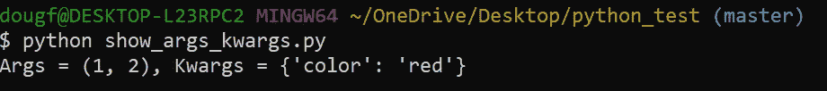
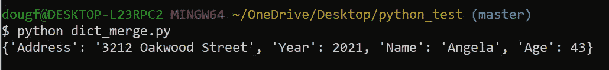
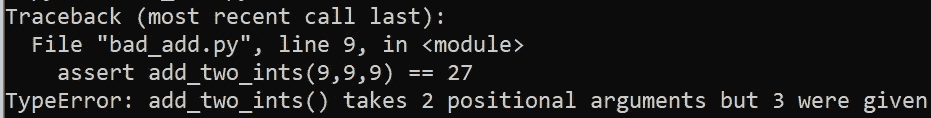
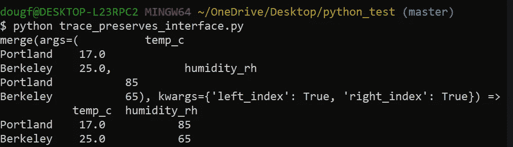
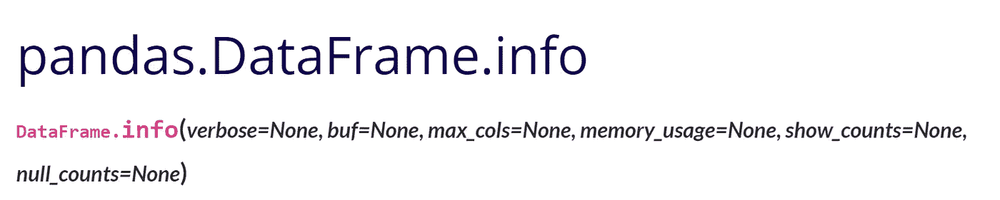
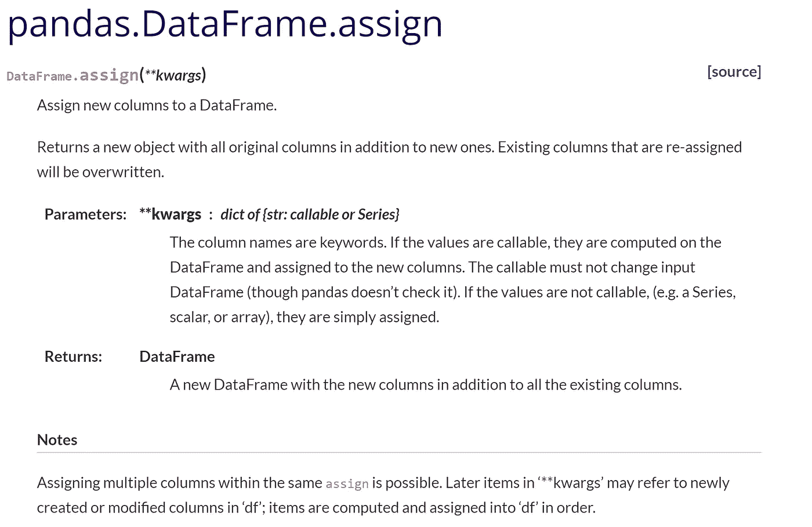
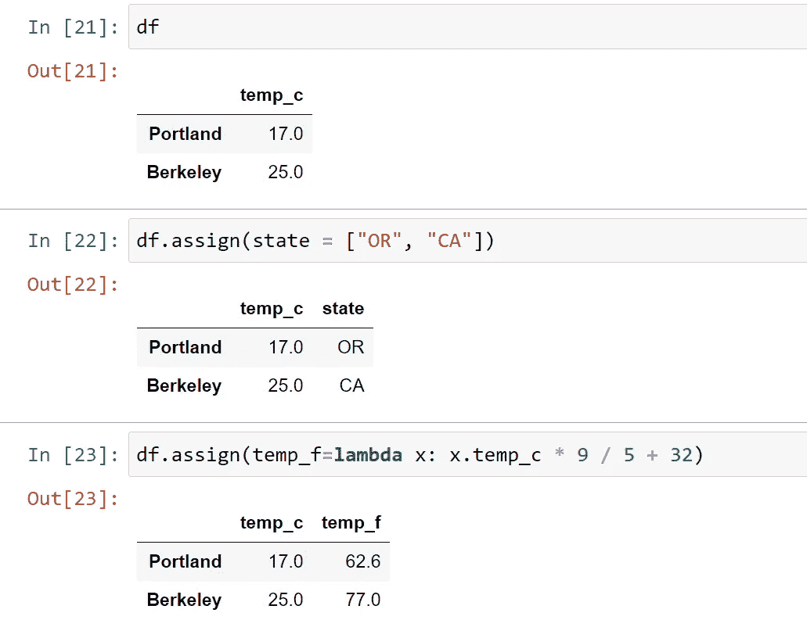

# Python 中的 Args、Kwargs、打包和解包指南

> 原文：<https://towardsdatascience.com/a-guide-to-args-kwargs-packing-and-unpacking-in-python-393095dda89b?source=collection_archive---------5----------------------->

## 这些强大的编码工具如何实现功能灵活性

作者:[爱德华·克鲁格](https://www.linkedin.com/in/edkrueger/)和[道格拉斯·富兰克林](https://www.linkedin.com/in/dougaf/)。


照片由 Michael Dziedzic 在 Unsplash 上拍摄

## 介绍

在讨论 Python 函数时，我们都听说过**参数**和**关键字参数(args 和 kwargs)** 。参数通常由数值组成，而关键字参数，顾名思义，是语义性的。在编写函数时，`*args`和`**kwargs`经常被直接传入一个函数定义。

由于函数定义中使用了星号，因此该函数可以处理任意数量的 args 和 kwargs。这些星号是打包和解包操作符。

运行该文件时，会生成以下输出。



注意，第 5 行的参数，两个 args 和一个 kwarg，根据它们的类型被正确地放入 print 语句中。同样值得注意的是输出中的圆括号和花括号。Args 被打包成一个元组，kwargs 被打包成一个字典。

在我们更深入地研究 Python 中的打包和解包值之前，让我们再多谈谈函数参数。

Python 中有两种参数，**位置参数** 和**关键字参数**，前者是根据位置指定的，后者是键值对的参数。

调用函数时不能省略没有默认值的参数。它们必须以正确的顺序和位置传递。

先简单说一下打包和拆包。

# 包装和拆包

星号是解包操作符，用于解包 Python 中 iterable 对象的值。通常与参数相关联的单星号运算符(*)可用于任何 iterable。与 kwargs 关联的双星号(**)只能用于词典。

这些星号是打包和解包的操作符。然而，你可以不用它们来打包和解包。查看下面的代码。

在这个要点中，我们将元组`t`分解成三个变量；`a`、 `b`和`c`。当我们打印这些变量时，我们将看到元组的单个元素。

```
1
2
3
```

让我们在字典上使用同样的解包模式。

当 k 和 v 被打印出来时，我们看到:

```
Hello
15
```

这个例子稍微复杂一点，你可以在第 3 行看到。我们使用`.items()`迭代一个字典，使用`tuple()`将字典转换成一个元组，这样我们就可以使用`[0]`提取元组的第一个元素。所有这些将键值对打包成`k` 和`v`。

# 包装和拆包操作员

现在您已经对 Python 中的解包值有了一些了解，让我们进入操作符`*`和`**`。看看这个带有单个星号的打包和解包的例子。

我们使用相同的解包模式，将三个变量设置为一个列表。然而，这里我们给变量`b`添加了打包操作符。你能猜到打印出来的报表会是什么样子吗？

```
1
[2,3,4,5]
6
```

我们可以看到,`a`被设置为等于列表中的第一个元素,`c`被设置为最后一个元素，中间的所有元素都被打包到了`b`中。当您知道要定义多少个变量，但不确定要在每个变量中放入多少个元素时，这可能很有用。

双星号允许我们使一些复杂的字典过程非常优雅地发生。例如，我们可以使用双星号来合并两个唯一键的字典。

字典 _ 合并. py

当我们运行这个文件时，我们会看到下面的输出。



合并词典

请注意，`merge_two_dictionaries`中的 return 语句被括在花括号中。这确保了我们的函数返回一个字典。

现在我们来讨论一下`*args`和`**kwargs`。

## *参数

注意`**args**` 只是一个名字**。你不需要使用名称`args`。这里重要的是使用**拆包操作符** ( `*`)。然而，使用`args`是规范的。记住，使用解包操作符`*`得到的可迭代对象不是`list`而是`tuple`。**

当您使用`*`操作符解包一个列表并将参数传递给一个函数时，就好像您在单独传递每一个参数。下面用一个常见的编码面试问题来展示一下`*args`的威力。

> 你的任务是编写一个将整数相加的 Python 函数。

听起来很简单，对吧？

我的初始代码可能看起来像这样。

完全符合“整数和”的标准。假设我们对照这些测试来运行它。你能看出什么会出错吗？

我们的前两个测试没有问题，但是第三个测试，对三个整数求和，产生了一个错误。看起来我们的 sum 函数只能接受两个位置参数。



2 != 3

让我们看看能否使用`*args`编写一个更好的加法函数。

现在我们有了一个可以接受任意数量参数的函数。通过循环这些参数并将它们的值加到`total`来计算总和。

现在让我们通过一些测试。

这个新函数通过了所有的测试！当我们想吸纳许多论点，但我们不确定有多少时，`*args`是一个很好的选择。

## * *克瓦查

同样，您不需要使用名称`kwargs`。这里重要的是使用**拆包操作符** ( `**`)。然而，使用名称`kwargs`是规范的。

在函数定义中`**kwargs`像`*args`一样工作，但是它不接受位置参数，而是接受任意多个关键字参数。

`**kwargs`通常用于保存在对象之间传递的消息。我们可以看到这是下面的装饰代码。如果您想了解更多关于 decorators 的知识，请查看这段代码所在的文章。

</a-simple-way-to-trace-code-in-python-a15a25cbbf51>  

tracefunc 装饰器

在第 8 行，我们看到`tracefunc_closure`将`**kwargs`作为参数。这允许我们传递给 tracefunc 的任何东西在对象之间传递时都被保留。让我们用这个装饰器来追踪一个函数，看看第一手资料。

下面是打印语句输出。



注意，tracefunc 将数据帧识别为 args，将`pd.merge`的关键字参数识别为 kwargs。此外，我们不必对 tracefunc 做任何事情来使它与`pd.merge`兼容。Tracefunc 能够接收这些 kwargs 并将它们传递给`pd.merge`。这表示接口保留。

我们可以在 pandas 文档中看到关键字参数和`**kwargs`的例子。这里我们看到 dataframe.info 可以接受 6 个不同的关键字参数。在这种情况下，我们必须使用正确的关键字或者按照位置顺序放置值。然而，后一种情况不必要地牺牲了可读性。



dataframe.assign 将`**kwargs`作为其唯一的参数。



这听起来很简单，然而`**kwargs`非常灵活。当将键值对作为`**kwargs`传递给`df.assign`时，我们的值可以是一个简单的列表，也可以是一个更复杂的 lambda 函数。列表和 lambda 函数处理在`.assign`的源代码中实现。`**kwargs`的意义在于这个函数可以拿任何一个键并使用它。我们把这个键命名为`state` 还是`temp_f`并不重要。



# 结论

无论是编写函数来接受任意数量的参数和关键字参数，还是打包和解包列表和字典中的值`*args and **kwargs`都允许一些非常灵活、可读和有用的代码。此外，`*args and **kwargs`是理解 Python 中更广泛的编程和函数编写概念的基础。