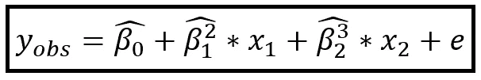
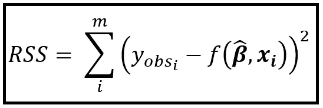
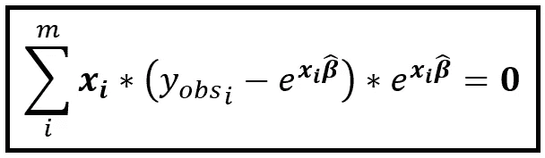

# 构建非线性最小二乘(NLS)回归模型指南

> 原文：<https://towardsdatascience.com/a-guide-to-building-nonlinear-least-squares-nls-regression-models-310b97a7baeb?source=collection_archive---------13----------------------->


图片由 [Alexandra_Koch](https://pixabay.com/users/alexandra_koch-621802/?utm_source=link-attribution&utm_medium=referral&utm_campaign=image&utm_content=1817646) 来自 [Pixabay](https://pixabay.com/?utm_source=link-attribution&utm_medium=referral&utm_campaign=image&utm_content=1817646) ( [Pixabay 许可](https://pixabay.com/service/license/))

## 以及用 Python 和 SciPy 编写的 NLS 回归教程

**非线性最小二乘法(NLS)** 是一种优化技术，可用于为包含非线性特征的数据集构建回归模型。这种数据集的模型在系数上是非线性的。

本文的结构:

第 1 部分:NLS 回归模型的概念和理论。这部分有一些数学知识。如果你喜欢数学和/或对非线性最小二乘回归如何工作感到好奇，你会喜欢它。

**第 2 部分:关于如何使用 Python 和 SciPy **构建和训练 NLS 回归模型的教程**。你不需要阅读第一部分来理解第二部分。**

# 第一部分:NLS 回归背后的理论

我们将遵循这些代表性惯例:

> “帽子”符号(^)将用于在数据上拟合回归模型的过程中生成的值。例如， **β_(hat)** 是**拟合的**系数的向量。
> 
> ***y _ OBS****是因变量 **y** 的观测值的向量。*
> 
> *普通样式的变量是定标器，粗体样式的变量代表它们的向量或矩阵等价物。例如，y_obs_i 是包含大小为(m×1)的 **y_obs** 向量的第 I 个观察值的定标器。*
> 
> *我们将假设回归矩阵 **X** 的大小为(m x n ),即它有 m 个数据行，每行包含 n 个回归变量。y 矩阵的大小为(m×1)，系数矩阵的大小为(m×1)(或者转置形式为 1×m)*

*现在让我们来看三个可以用 NLS 训练的非线性模型的例子。*

*在下面的模型中，回归系数 *β_1* 和 *β_2* 是 2 和 3 的幂，因此不是线性的。*

**

*系数非线性的模型(图片由[作者](https://sachin-date.medium.com)提供)*

**e* 为模型的残差，即观测值 *y* 与预测值(即 R.H.S. *上的 *β_0，β_1* 和 *β_2* 和**x***的组合)*

*以下模型是一个自回归时间序列模型，包含系数 *s β_1* 和 *β_2* 的乘法关系，因此本质上是非线性的。*

**

*系数非线性的自回归时间序列模型(图片由[作者](https://sachin-date.medium.com)提供)*

*在下面的模型中，预测值是回归变量 ***X*** 的线性组合的指数函数。*

**

*指数均值模型(图片由[作者](https://sachin-date.medium.com)提供)*

*最后一个公式通常用于 [**泊松回归模型**](/an-illustrated-guide-to-the-poisson-regression-model-50cccba15958) 或其衍生模型，如[广义泊松模型](/generalized-poisson-regression-for-real-world-datasets-d1ff32607d79)或[负二项式回归模型](/negative-binomial-regression-f99031bb25b4)。具体而言，拟合均值 *_cap* 被表示为泊松概率分布的条件均值，如下所示:*

**

*给定单位时间内看到 y 个事件的泊松概率*单位时间内 _(cap)个事件的平均预测率，其中 _(cap)是回归参数的函数**为了简洁起见，我们去掉了 _i 下标(图片由[作者](https://sachin-date.medium.com)提供)**

**这种泊松回归模型用于拟合基于计数的数据集，例如每天在自行车共享计划中租赁其中一辆自行车的人数。**

# **NLS 优化是如何工作的？**

**在 NLS，我们的目标是寻找模型参数向量*，它将**最小化残差**的平方和。换句话说，我们必须尽量减少以下情况:***

******

***拟合回归模型的残差平方和(图片由[作者](https://sachin-date.medium.com)提供)***

****_cap_i* (模型对数据集中第*行*行的预测)是模型参数向量 ***β_cap*** 和回归变量 ***x_i*** 的函数，即:***

******

***由模型预测的给定*x _ I 的条件均值是拟合的 ***β和 x_i*** 的函数(图片由[作者](https://sachin-date.medium.com)****

****将 *_i* 替换为*f(****β_ cap****，****x _ I****)*在前面的 RSS 等式中，我们有:****

********

****拟合回归模型的残差平方和(图片由[作者](https://sachin-date.medium.com)提供)****

****再次， ***β_cap*** 是拟合 系数的 ***向量，而 ***x_i*** 是回归变量矩阵 ***X*** 的第*与*行。*******

***最小化 RSS 的一种方法是相对于 ***β_cap*** 对 RSS 进行微分，然后将微分设置为零并求解 ***β_cap、*** ，即:***

******

***RSS w . r . t .***β_ cap***的偏导数，并设置为零(图片由[作者](https://sachin-date.medium.com))***

***由于 ***β_cap*** 是对应于 *n* 回归变量 *x1，x2，…xn* 的长度为 *n* 的向量，RSS 需要对 w.r.t .进行部分微分，这些 *β_cap_j* 系数的每一个和每一个方程都设置为零。例如，RSS w.r.t. *β_cap_1* 的偏导数如下:***

******

***残差平方和 w.r.t .系数的偏导数 *β_1* (图片由[作者](https://sachin-date.medium.com)提供)***

***由于有 *n* 个系数 *β_cap_1 到β_cap_n* ，我们得到上面在 *n* 个变量中所示的 *n* 个方程。然而，相对于[**【OLS】**](/assumptions-of-linear-regression-5d87c347140)估计，这个 *n* 方程组没有封闭形式的解。因此，我们必须使用迭代优化技术，在每次迭代 *k* 时，我们对如下所示的 *β_cap_1 至β_cap_n* 的值进行小的调整，并重新评估 RSS:***

******

***在第*k 次*迭代时，将 *β_j 增加* δ *β_j****

***已经设计了几种算法来有效地更新 ***β_cap*** 向量，直到达到将最小化 RSS 的一组最佳值。其中最主要的是基于[信任区域](https://en.wikipedia.org/wiki/Trust_region)的[方法](https://optimization.mccormick.northwestern.edu/index.php/Trust-region_methods)，例如[信任区域反射](https://epubs.siam.org/doi/10.1137/S1064827595289108)算法、[leven Berg-Marquardt 算法](https://en.wikipedia.org/wiki/Levenberg%E2%80%93Marquardt_algorithm)和被想象命名为 [Dogbox 算法](https://nmayorov.wordpress.com/2015/06/19/dogbox-algorithm/)。SciPy 支持所有三种算法。***

***让我们回到前面介绍的指数均值模型。在这个模型中，我们有:***

******

***指数均值模型(图片由[作者](https://sachin-date.medium.com)提供)***

***在 RSS 中替换:***

******

***拟合泊松模型的剩余平方和(图片由[作者](https://sachin-date.medium.com)提供)***

***注意，指数中的 ***x_i*β_cap*** 是两个维度为*【1 x n】*和*【n x 1】*的矩阵的矩阵乘法，因此结果是一个*【1x1】*矩阵，即有效的缩放器。***

***对上面的等式 w.r.t. ***β_cap*** 进行微分，并将微分设置为零，我们得到下面的一组等式(以**向量**格式表示)，其需要使用上面提到的迭代优化算法之一来求解:***

******

***该方程组的解产生泊松回归模型的拟合估计量 ***β_cap*** (图片由[作者](https://sachin-date.medium.com)提供)***

# ***第 2 部分:使用 Python 和 SciPy 的 NLS 回归教程***

***让我们使用**非线性最小二乘技术**将泊松回归模型拟合到一个为期两年的租赁自行车日常使用数据集。***

***数据集的前 10 行如下:***

******

***租赁自行车使用计数(来源: [UCI 机器学习库](https://archive.ics.uci.edu/ml/datasets/Bike+Sharing+Dataset))(图片由[作者](https://sachin-date.medium.com/))***

***你可以从这里下载数据集。***

## ***回归模型***

***我们将建立一个回归模型，其中**因变量** ( ***y*** )为:***

*****total_user_count** :自行车租赁者总数***

*****回归变量**矩阵 ***X*** 将包含以下解释变量:***

*****季节**:当前天气季节
**年份**:当前年份:0=2011 年，1=2012 年
**月**:当前月份:1 至 12 日
**假日**:测量是否在假日进行(是=1，否=0)
**工作日**:星期几(0 至 6)
**工作日
2 =薄雾+多云，薄雾+碎云，薄雾+少云，薄雾。
3 =小雪、小雨+雷雨+散云、小雨+散云。
4 =暴雨+冰粒+雷雨+薄雾，雪+雾。
**temp** :温度，归一化到 39C
**atemp** :真实感受，归一化到 50C
**嗡嗡声**:湿度，归一化到 100
**风速**:风速，归一化到 67*****

***让我们导入所有需要的包***

```
*****from** scipy.optimize **import** least_squares
**import** pandas **as** pd
**from** patsy **import** dmatrices
**import** numpy **as** np
**import** statsmodels.api **as** sm
**import** statsmodels.formula.api **as** smf
**import** statsmodels.stats.stattools **as** st
**import** matplotlib.pyplot **as** plt***
```

***将数据集读入熊猫数据帧:***

```
***df = pd.**read_csv**('bike_sharing_dataset_daywise.csv', **header**=0, **parse_dates**=[**'**dteday**'**], **infer_datetime_format**=True)***
```

***创建训练和测试数据集。由于我们将该数据视为[横截面数据](https://en.wikipedia.org/wiki/Cross-sectional_data)，我们将随机选择 90%的数据行作为我们的训练数据，剩余的 10%作为我们的测试数据:***

```
***mask = np.**random**.**rand**(**len**(df)) < 0.9
df_train = df[mask]
df_test = df[~mask]
**print**('Training data set length=**'**+**str**(**len**(df_train)))
**print**(**'**Testing data set length=**'**+**str**(**len**(df_test)))***
```

***用 [Patsy](https://patsy.readthedocs.io/en/latest/quickstart.html) 语法创建回归表达式。我们说 **total_user_count** 是因变量，它取决于波浪号(~)右侧提到的所有变量:***

***使用 Patsy 雕刻出 ***y*** 和 ***X*** 矩阵:***

```
***y_train, X_train = **dmatrices**(expr, df_train, **return_type**=**'**dataframe**'**)
y_test, X_test = **dmatrices**(expr, df_test, **return_type**=**'**dataframe**'**)***
```

***让我们定义几个函数。我们将定义的第一个函数是计算指数平均值的函数:***mu _ cap****= exp(****X *β_ cap):******

```
*****def** calc_exponentiated_mean(beta, x):
    lin_combi = np.**matmul**(np.**array**(x), np.**array**(beta))
    mean = np.**exp**(lin_combi)
    **return** mean***
```

***我们将定义的第二个函数是在给定输入矩阵 ***β*** 、 ***X*** 和 ***y_obs*** 的情况下计算简单残差*r _ I =(y _ predicted—y _ OBS)*:***

```
*****def** calc_residual(beta, x, y_obs):
    y_pred = **calc_exponentiated_mean**(beta, x)
    r = np.**subtract**(y_pred, np.**array**(y_obs).**flatten**())
    **return** r***
```

***将系数 ***β*** 向量初始化为所有 1.0 值。X 中有回归变量(数一数验证！)和回归截距，即总共两个变量。所以 ***β*** 大小为( *1 x 12)。*我们将构建的 numpy 向量将具有转置形状(12，)，这适合我们，因为我们必须将 X_train 与该向量相乘，并且 X_train 的形状为(661，12):***

```
***num_params = **len**(X_train.**columns**)
beta_initial = np.**ones**(num_params)***
```

***最后，是时候使用 SciPy 中的*最小平方()*方法在(y_train，X_train)上训练 NLS 回归模型，如下所示:***

```
***result_nls_lm = **least_squares**(**fun**=calc_residual, **x0**=beta_initial, **args**=(X_train, y_train), **method**='lm', verbose=1)***
```

***注意，我们正在使用[leven Berg–Marquardt 算法](https://en.wikipedia.org/wiki/Levenberg%E2%80%93Marquardt_algorithm) ( ***方法****=‘lm’*)来执行*向量的迭代优化。****

****`result_nls_lm.**x**`变量包含拟合的 ***β*** 向量，换句话说， ***β_cap*** 。****

****让我们将 ***β_cap*** 组织成一个熊猫数据帧并打印出这些值:****

```
****df_beta_cap = pd.**DataFrame**(**data**=res_lsq_lm.**x**.**reshape**(1,num_params), **columns**=X_train.**columns**)**print**(df_beta_cap)****
```

****我们看到以下输出显示了每个回归变量的拟合系数值和拟合回归截距:****

********

****每个回归变量的拟合系数值和拟合回归截距****

# ****预言；预测；预告****

****让我们看看我们的模型在我们之前雕刻出来的测试数据集 ***X_test*** 上表现如何。我们将使用之前定义的 calc_exponentiated_mean()函数，但这一次，我们将传入拟合的 ***β_cap*** 向量和 ***X_test*** :****

```
****predicted_counts=**calc_exponentiated_mean**(**beta**=result_nls_lm.x, **x**=X_test)****
```

****让我们绘制预测计数与实际计数的对比图:****

```
****actual_counts = y_test[**'registered_user_count'**]fig = plt.**figure**()
fig.**suptitle**(**'Predicted versus actual user counts'**)predicted, = plt.**plot**(X_test.**index**, predicted_counts, 'go-', **label**='Predicted counts')actual, = plt.**plot**(X_test.**index**, actual_counts, **'ro-',** **label**='Actual counts')plt.**legend**(**handles**=[predicted, actual])
plt.**show**()****
```

********

****测试数据集上的预测自行车用户数与实际自行车用户数的对比图(图片由[作者](https://sachin-date.medium.com)提供)****

# ****纸张、书籍和数据链接****

****Cameron A. Colin，Trivedi Pravin K .， [*计数数据的回归分析*](http://cameron.econ.ucdavis.edu/racd/count.html) ，计量经济学学会专论№30，剑桥大学出版社，1998 年。国际标准书号:0521635675****

## ****数据集****

*****Fanaee-T，Hadi，和 Gama，Joao，“结合集合检测器和背景知识的事件标记”，《人工智能进展》(2013):第 1–15 页，Springer Berlin Heidelberg，doi:10.1007/s 13748–013–0040–3。*****

# ****形象****

****本文中的所有图片的版权归 [CC-BY-NC-SA](https://creativecommons.org/licenses/by-nc-sa/4.0/) 所有，除非图片下方提到了不同的来源和版权。****

# ****相关文章****

****</an-illustrated-guide-to-the-poisson-regression-model-50cccba15958> **** 

*****感谢阅读！如果您喜欢这篇文章，请* [***关注我***](https://timeseriesreasoning.medium.com) *获取关于回归和时间序列分析的提示、操作方法和编程建议。*****