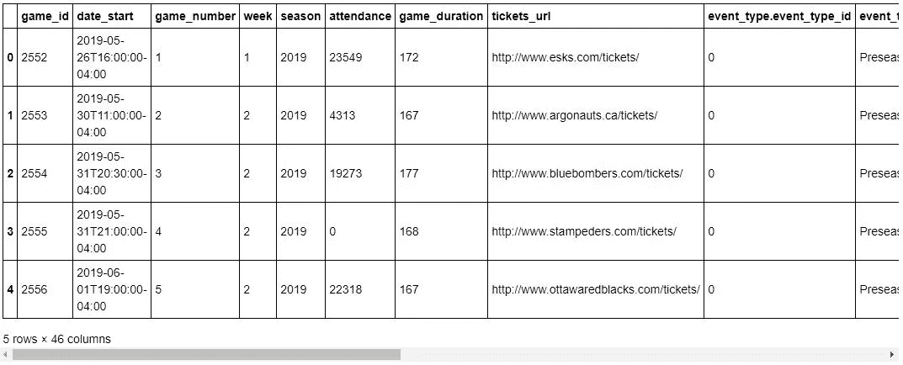
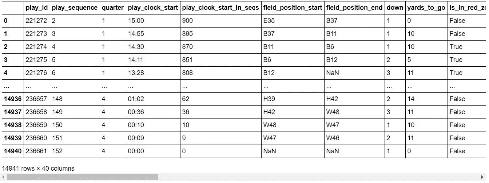

# 用 Python 编写的加拿大足球指南

> 原文：<https://towardsdatascience.com/a-guide-to-canadian-football-with-python-43fdbd8cb7a6?source=collection_archive---------65----------------------->

## 关于 Python 如何帮助我们提取加拿大足球联赛的详细数据的教程

约翰·托尔卡西奥在 [Unsplash](https://unsplash.com?utm_source=medium&utm_medium=referral) 上拍摄的照片

# 语境

如今，NFL 通过一个 API，几乎实时地发布所有比赛的信息。这使得分析师、统计学家、编码员或者仅仅是精通技术的足球迷能够分析、剖析、操纵每个动作的大量变量:倒地和距离、剩余时间、动作类型、传球、冲刺、空中、触球后获得的码数等。

这些结果的可用性使人们能够重新处理这些数据，创建预测模型并开发新的指标，如增加的获胜概率或增加的预期点数。这些新的指标给了游戏一个全新的视角，更加客观，基于以前对很多很多游戏的观察。

如果说那些数据在 NFL 越来越频繁的使用，在加拿大足坛依然不是这样。我不能假装能够解释为什么，但我认为原因之一可能是缺乏对详细比赛结果的宣传。因为是的，每部戏的细节都有。也许它们不像 NFL 的数据那样详细或干净，但通过其 API 深入了解加拿大足球联盟的详细数据是可能的。我在下文中提出了一个关于如何使用 Python 和 Jupyter 笔记本来提取 2019 赛季所有这些数据的指南。

# 对 API 的访问

首先，要访问 API，需要[向 CFL 请求一个密钥](https://api.cfl.ca/key-request)。就其本身而言，文档提供了你可以获取的每种类型数据的宝贵信息。在这里，我将重点介绍“一步一步”选项。

# 逐步指南

## 库导入

首先，让我们下载我们需要的所有库:

*   请求:对于到 API 的连接
*   pandas:用于处理数据和转换成易于分析的数据帧
*   json & json_normalize:用于结果数据类型的转换

## 连接到 API 和季节统计

该 API 的一个重要特性是，基于 game_id，一次只能下载一场比赛的详细报道。因此，第一步将是下载本赛季所有比赛的列表，以获得完整的 game _ ids 列表。

我们的请求将遵循文档中指示的结构，并且我们将在“响应”变量中传递结果。当然，在这里你必须使用你自己的密钥，由 CFL 提供:

这里我们需要一点数据转换，必须转换 JSON 对象中的响应，然后将它赋给一个新的变量“output”:

这个变量是一个字典，意味着调用 output.keys()方法将返回“数据”、“错误”和“元”。由于所有结果都在“数据”列中，我们将调用它，然后将其转换为表格，最后转换为 DataFrame:

让我们花点时间来确保 df.head()的一切看起来都很好:

作者图片

到目前为止，一切顺利！

## 导出播放数据

请注意，第一列是 game_id 列，即我们必须用于分析的列。我们的要求是 2019 赛季每一场个人比赛的总结，我们知道每行只有一场比赛。这意味着它们不是重复的，因此我们可以简单地将该列转换为一个列表，其中包含:

我们知道本赛季有 95 场比赛(包括季后赛)，但我们被限制为每分钟 30 次调用 API。为了绕过这一点并且不使 API 过载，我们将列表分成几个部分:

现在，我们创建一个循环，它将遍历第一个列表，获取每个 game_id，请求这个特定游戏的详细数据，并在 DataFrame 中转换数据。我还添加了一个带有 game_id 的列。就我个人而言，我喜欢跟踪我提取的数据，所以我将每个数据帧保存在一个单独的 Excel 文件中。这不是强制性的，但我发现如果我事后必须做一些检查，会更容易。

一旦完成，你只需要在触发第二个循环之前等待一分钟:

您可以对循环 3 和循环 4 重复相同的操作。注意，每个循环的最后一步是将所有文件名添加到一个列表中。

## 主数据框架的创建

因此，我们的最后一步是将所有列表合并成一个全局列表，并创建一个循环，遍历每个文件，打开它，将数据加载到一个数据帧中，然后关闭文件。对于我的档案，我再次将我的主数据框架保存为 Excel 文件。

最后，在我们所有的操作中，pandas 向我们的 Dataframe 添加了一个列“Unnamed: 0 ”,所以我们只需删除它，并将我们的 final_data 命名为:

这为我们提供了以下信息:

作者图片

我们做到了！2019 赛季所有比赛的所有信息的最终数据框架。

# 结论

正如我们所看到的，通过几个简单的步骤，我们可以轻松地获得整个赛季的所有比赛数据，包括季后赛。事实上，如果我们删除 Excel 步骤，代码可能会简单一点。我喜欢跟踪我提取的数据，但是如果您愿意，您可以很容易地修改这段代码并删除这些步骤。

我喜欢把这看作一个开始，而不是一个结论:我希望这可以帮助加拿大足球获得更多分析师和统计学家的关注，并且在不久的将来，我们将拥有与 NFL 相同的 CFL 指标。

*我这个教程的代码可以在* [*这里*](https://github.com/Nicolas-Schonau/sports-data-analysis/blob/master/CFL/Guide_API_play_by_play.ipynb) *找到。*