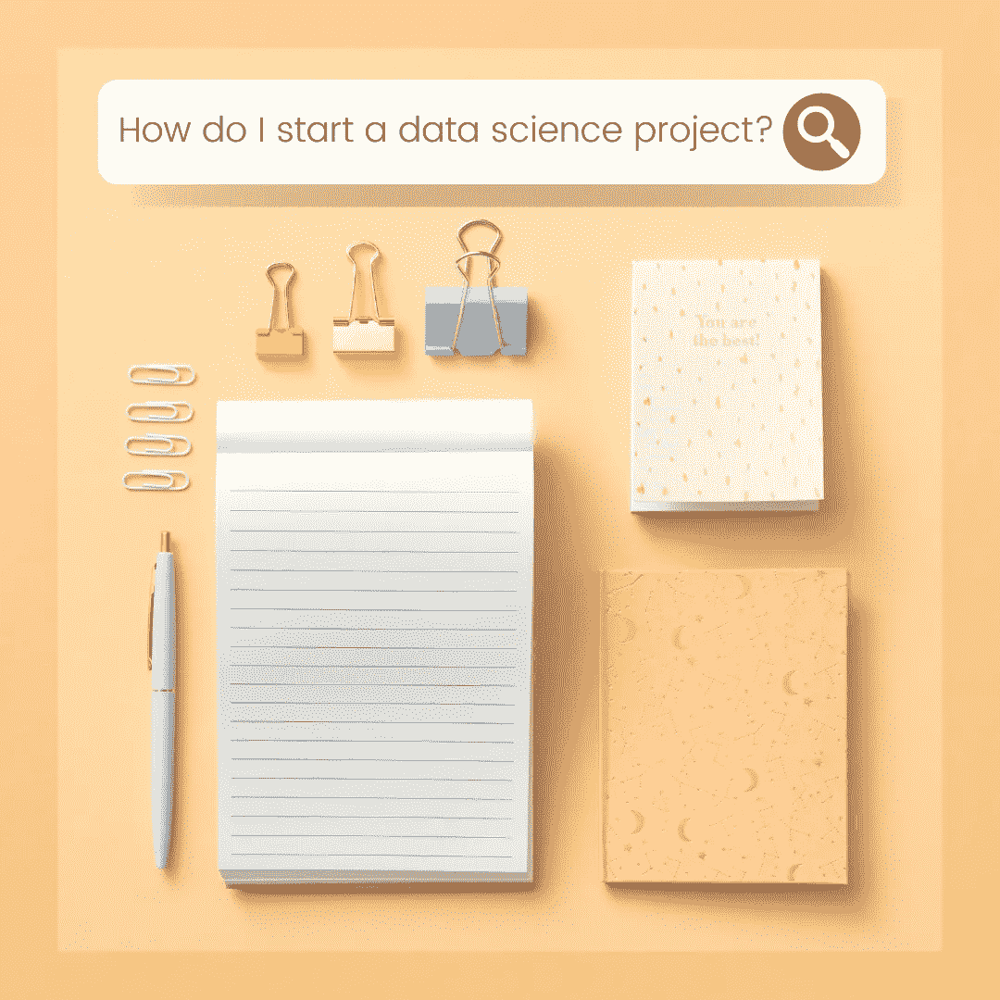

# 数据科学研究项目指南

> 原文：<https://towardsdatascience.com/a-guide-to-data-science-research-projects-a5e25f9884e8?source=collection_archive---------29----------------------->

无论你是新手还是经验丰富的工程师，开始一个数据科学研究项目都可能具有挑战性——你希望你的项目对数据科学社区和你的投资组合来说是**有意义的**、**可访问的**和**有价值的**。在这篇文章中，我将介绍两个框架，你可以用它们来指导你的数据科学研究项目。请注意，本指南并非详尽无遗，而是基于我在数据科学和机器学习方面的经验，我认为这对初学数据的科学家可能有所帮助。

# 研究过程——从构思到实施

1.  确定你想要探索或解决的研究问题。
2.  **问自己以下问题:**

*   我是想专注于工程工作还是纯研究？

例如，如果您正在构建一个新的机器学习应用程序，工程可能涉及为算法构建一个框架和用户界面，并使用部署基础架构来加快数据访问。

纯研究可能涉及尝试以创新的方式操纵模型的属性(例如，创建一个新的损失函数)或创建一个全新的模型，如您在 NeurIPS 和类似会议的论文中看到的研究类型。

也有可能将工程和纯研究结合起来——你需要考虑最适合研究目标的方法。

*   我的研究目标是超越现有基线(例如，在 ImageNet 数据集上获得最高分)，还是使用创新方法探索尚未建立坚实基线的研究领域？这两种类型的研究问题对数据科学都很有价值。

3.**进行文献综述。**查看该领域的现有工作，分析相关方法的优势和劣势。找出你感兴趣的文献中的空白。

4.**设计您提议的解决方案并实施基线/原型**(参见下面的开发流程)。

5.**根据您在步骤 2 中的回答，迭代开发原型。**

# 开发流程—先决条件

以下步骤的目标是指导您为您的用例选择最佳的数据存储选项、机器学习模型以及开发和部署流程。在概述了这些方面之后，我建议可以开始开发过程了。

1.  **数据是什么类型，如何存储？**

示例:

*   如果您试图预测的变量是数值型的，您可以将您的问题陈述定义为一个正常的回归应用程序。用于处理这一问题的流行 ML 模型很少是线性回归、决策树、支持向量机和神经网络或深度学习。
*   如果数据是按时间排序的，你可以考虑时间序列方法——除了深度学习方法，还有传统的算法。
*   如果您正在处理大量数据，根据数据格式，您可以考虑探索大数据存储和处理解决方案，如 Apache Spark、Cassandra、Redis 等。一些大数据存储解决方案可以轻松地支持机器学习工具/算法。

**2。模型将在哪里托管，如何部署？可交付物可以被结构化为管道或系统吗？如果可以，系统的输入和输出是什么样的？**

作为这一步的一部分，你需要问这样一个问题:“我可以使用的模型类型有什么限制吗？”例如，模型是用于流数据应用程序(在特定时间段(如 1 小时)内持续向模型提供数据)还是用于大型数据集的典型预测？您的用户将通过命令行或网页访问模型吗？

你可以考虑使用像 [Luigi](https://github.com/spotify/luigi) 和 [Apache AirFlow](https://airflow.apache.org) 这样的工具来帮助你的项目进行流水线和工作流管理。

**3。我正在寻找的模型有什么关键的和值得拥有的特征，什么样的 ML 算法符合这种描述？**

要回答这个问题，你需要回到你项目的目标。以下是一些你可能会问的问题:

*   你的目标是基于数据预测和改善某个因素或事件吗？
*   您认为理解您的算法用来进行预测的特征是否重要(例如，理解如何改进某个因素/事件)？

这可能会决定你的型号选择。例如，使用决策树，您可以确定算法认为哪些功能对预测和决策路径最重要，但是这些模型可能无法为您的应用程序提供很高的准确性。然而，神经网络可以提供很高的准确性，但解释起来更具挑战性。

有一些解决方案可以让你同时获得可解释性和良好的准确性。例如，神经网络和决策树可以通过[神经支持的决策树](https://github.com/alvinwan/neural-backed-decision-trees)结合，尽管这些方法可能有一定的权衡(例如，需要预先训练的权重)。你需要调查你正在考虑的方法的利弊，以评估它们如何适合你的问题陈述。

**4。你将如何调试和评估你的模型？你会考虑什么样的衡量标准和可视化？**

示例:

*   您选择的指标可能取决于文献中的现有方法，这些方法可能是您在研究过程中发现的。例如，在处理不平衡数据时，除了原始精度度量外，您还可以选择包括马修斯相关系数或平衡精度。
*   当您考虑您将为您的管道实施什么工具和流程时，请记住记录您可能对您的模型进行的超参数的任何重要更改，或者使用诸如[Weights and bias](https://wandb.ai/site)之类的工具进行调试。
*   可视化是开发过程的重要组成部分，可用于调试模型(例如，学习曲线)、可解释性(例如，显著性图)，以及数据分析和最终报告(例如，单词云)。在开始开发之前，试着考虑可以增加项目实现、质量和价值的可视化类型。

这两个框架中的每一步都需要一些思考和反复试验。我会在以后的博客文章中介绍一些有用的技巧，所以如果你觉得这篇文章有帮助，请继续关注！

*原载于 2021 年 4 月 5 日*[*【http://demystifymachinelearning.wordpress.com】*](https://demystifymachinelearning.wordpress.com/2021/04/05/a-guide-to-data-science-research-projects/)*。*