# Python 中的降维指南

> 原文：<https://towardsdatascience.com/a-guide-to-dimensionality-reduction-in-python-ce0c6ab91986?source=collection_archive---------19----------------------->

## 使用随机森林和 PCA 进行降维


照片由[斯蒂夫·约翰森](https://www.pexels.com/@steve)在[像素](https://www.pexels.com/photo/focus-photo-of-yellow-paper-near-trash-can-850216/)上拍摄

降维是将高维数据转换为低维格式，同时保留最重要的属性的过程。这项技术在许多行业都有应用，包括定量金融、医疗保健和药物研发。降维的应用很多，所以每个数据科学家都应该知道一些降维的最新方法。

一种易于理解的降维方法是随机森林特征重要性。随机森林是一种机器学习算法，它使用许多决策树来完成分类和回归任务。每个决策树都会对数据中的值提出“是”或“否”的问题，然后根据答案将它们分成相似的组。大多数随机森林包允许您提取重要的要素，这些要素是最有效地分隔数据不同部分的字段。

例如，为了预测借款人是否会拖欠贷款，信用评分将是一个重要的特征，它可以最有效地将数据分为拖欠和非拖欠借款人。虽然这种方法很有用，但它仅限于监督学习过程，在这种过程中，我们知道我们试图预测的输出。在这个例子中，输出是借款人是否会违约。

在某些用例中，数据科学家有数据，但没有框架监督学习问题。监督学习需要带标签的数据，这意味着对于每个输入，我们都有一个代表我们试图预测的结果的标签。类似地，也存在数据科学家访问高维未标记数据的用例。这里，未标记的数据只是缺少指定预测模型输出的字段。例如，有权访问贷款借款人数据，但没有任何贷款状态信息(违约/无违约)。

当面临高维、无标签数据(例如，数百到数千列)的问题时，您可以使用无监督的降维技术。最常见的无监督学习降维方法之一是[主成分分析(PCA)](https://builtin.com/data-science/step-step-explanation-principal-component-analysis) 。PCA 表示具有大量列的数据集，具有较少列的较小数据集，称为主成分，然后可以用于分析趋势、聚类和异常值，甚至可以帮助构建监督学习问题。

Scikit-learn 是一个 Python 机器学习库，它有许多易于使用的模块来进行降维。Scikit-learn 中的 ensemble 模块具有用于分类和回归任务的随机森林算法。在每个监督学习用例中，随机森林可用于减少数据的维数。对于无监督的降维任务，分解模块有 PCA 包。

在这里，我们将了解如何对 Lending Club 数据 se t 应用随机森林特征选择和 PCA。Lending Club 是一家向公众发布数据的点对点贷款公司。数据集包含借款人信用历史和贷款状态。

Lending Club 的数据集可以在 [Kaggle](https://www.kaggle.com/ethon0426/lending-club-20072020q1) 上公开获得，并受知识共享许可协议的保护。

**读入并准备数据**

让我们从导入 Pandas 库开始:

进口熊猫作为 pd

然后，我们可以放宽行和列的显示限制:

```
pd.set_option('display.max_columns', None)pd.set_option('display.max_rows', None)
```

接下来，让我们将数据读入熊猫数据框:

```
df = pd.read_csv()
```

让我们看看输出数据中有多少列和多少行:

```
print("Number of Columns: ", len(list(df.columns)))print("Number of rows: ", len(df))
```

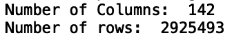

作者图片

我们看到有 142 列和 290 万行。对于大多数机器来说，这是一个相当大的数据集，因此它是降维的一个很好的候选对象。

现在，让我们显示前五行数据。由于这个数据集相对较大，下面的截图中的列被截断了。当您在本地计算机上运行此代码时，您将能够看到所有的列:

```
print(df.head())
```

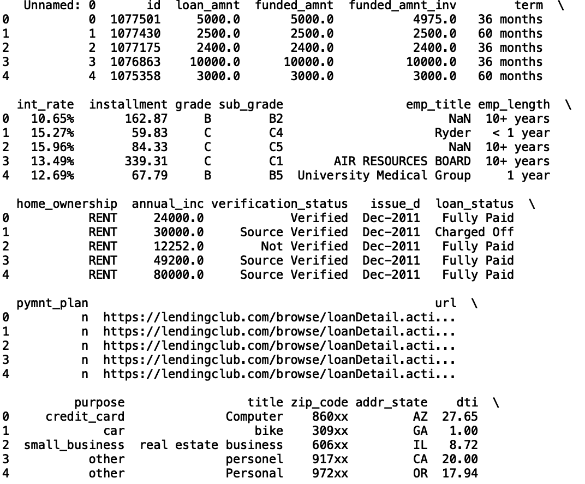

作者图片

在本地机器上处理这种规模的数据集可能会很麻烦。正如您在运行这段代码时会注意到的那样，读入数据和显示等简单任务需要相当长的时间。因此，我们将只处理这里的数据子集。在我们的分析中，我们只考虑信用卡还款贷款。这对应于值为 credit_card 的目的列。让我们过滤我们的数据，仅包含信用卡还款贷款:

```
df = df[df['purpose'] == 'credit_card']
```

让我们也取列的一个小子集。我们将考虑数据中的以下字段:

```
columns = ['loan_amnt', 'loan_status', 'funded_amnt', 'funded_amnt_inv', 'term', 'int_rate','mths_since_recent_revol_delinq','home_ownership', 'verification_status',
 'num_accts_ever_120_pd', 'num_actv_bc_tl', 'num_actv_rev_tl', 'avg_cur_bal', 'bc_open_to_buy', 'bc_util', 'chargeoff_within_12_mths', 'delinq_amnt', 'last_fico_range_low', 'last_fico_range_high']df = df[columns]
```

有关这些字段含义的详细信息，请参见[数据字典](https://www.kaggle.com/ethon0426/lending-club-20072020q1?select=LCDataDictionary.xlsx)。一些重要的领域是贷款金额、利率、房屋所有权状态、FICO 分数和活跃账户数。

现在，让我们将过滤后的数据框写入一个新的 csv 文件，我们将其命名为 credit_card_loans.csv:

```
df.to_csv("credit_card_loan.csv", index=False)
```

现在，让我们将新的 csv 文件读入一个单独的数据框。我们将把这个新的数据帧称为 df_credit:

```
df_credit = pd.read_csv(“credit_card_loan.csv”)
```

现在，让我们打印新的行数和列数:

```
print("Number of Columns: ", len(list(df_credit.columns)))
print("Number of rows: ", len(df_credit))
```

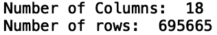

作者图片

我们看到我们的数据现在有 18 列和 695，665 行。这种尺寸设置更容易使用。

接下来，让我们打印前五行数据:

```
print(df_credit.head())
```


作者图片

在我们讨论任何具体的方法之前，请注意我们已经能够从列和行的角度显著降低数据的维度。但是我们仍然需要做更多的数据准备。请注意，有些列缺少值— NaN 表示不是数字。让我们估算每一列的平均值:

```
def fill_na(numerical_column):
   df_credit[numerical_column].fillna(df_credit[numerical_column].mean(), inplace=True)

fill_na(‘mths_since_recent_revol_delinq’)
fill_na(‘num_accts_ever_120_pd’)
fill_na(‘num_actv_bc_tl’)
fill_na(‘num_actv_rev_tl’)
fill_na(‘avg_cur_bal’)
fill_na(‘bc_open_to_buy’)
fill_na(‘bc_util’)
```

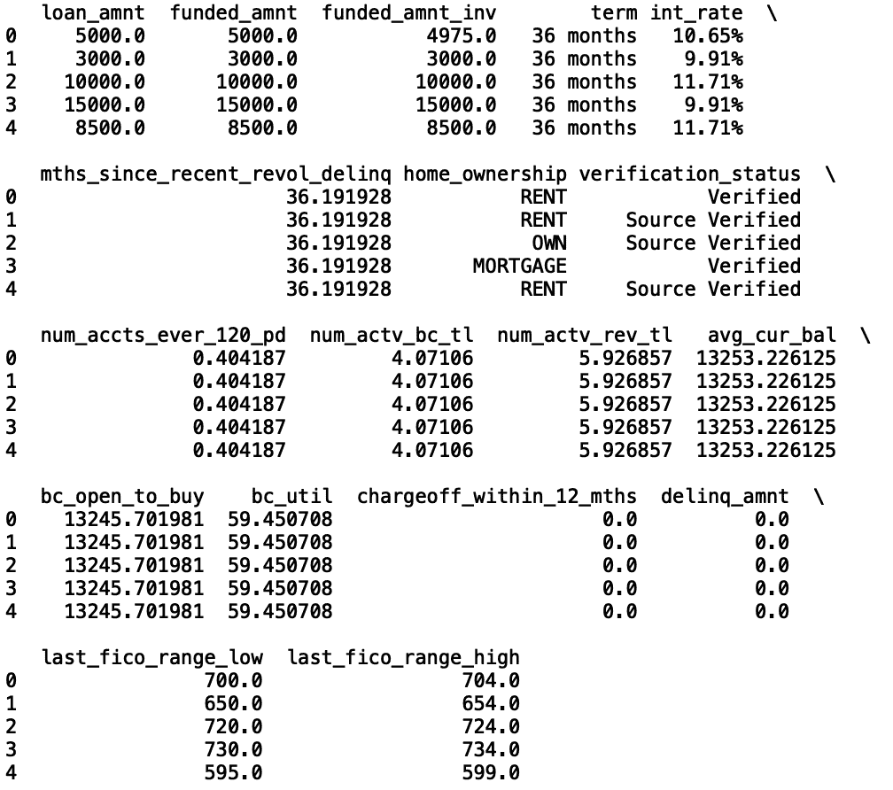

作者图片

我们看到缺失值已被估算。接下来，让我们将分类列转换成机器可读的代码。当使用 Python 中可用的大多数机器学习包时，这种转换是必要的:\

```
def convert_categories(categorical_columnn):
 df_credit[categorical_columnn] = df_credit[categorical_columnn].astype(‘category’)
 df_credit[f’{categorical_columnn}_cat’] = df_credit[categorical_columnn].cat.codes

convert_categories(‘home_ownership’) 
convert_categories(‘verification_status’) 
convert_categories(‘term’)
```

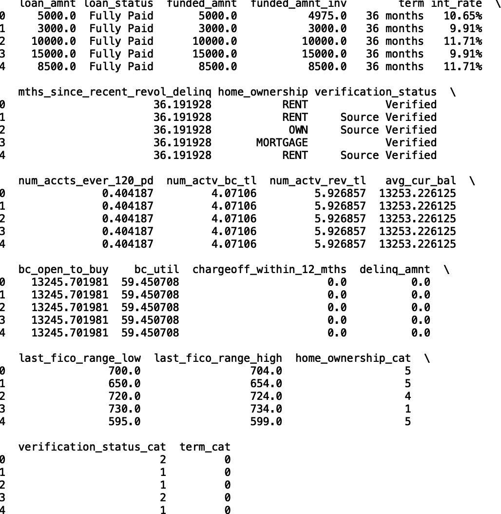

作者图片

现在，房屋所有权、期限和验证状态列有了相应的分类列。我们要看的第一种方法是使用随机森林特征重要性来降低维数。这是一种受监督的机器学习方法，因为随机森林需要标记的数据。

因此，我们需要做的下一件事是从 loan_status 列生成标签。首先，让我们打印贷款状态的唯一值集:

```
print(set(df_credit["loan_status"]))
```

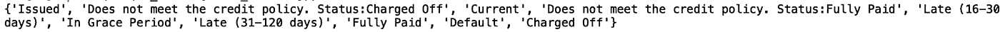

作者图片

为简单起见，让我们只考虑贷款状态结果完全支付和违约/冲销。我们也将结合这些。

```
df_credit = df_credit[df_credit[‘loan_status’].isin([‘Fully Paid’, ‘Default’, ‘Charged Off’])]
```

让我们也为这些贷款状态结果创建二元标签。值为 1 将对应于违约/注销，意味着贷款未还清且已被收回，而值为 0 意味着贷款已全部还清:

```
df_credit[‘loan_status_label’] = np.where(df_credit[‘loan_status’] == ‘Fully Paid’, 0, 1)
print(df_credit.head())
```

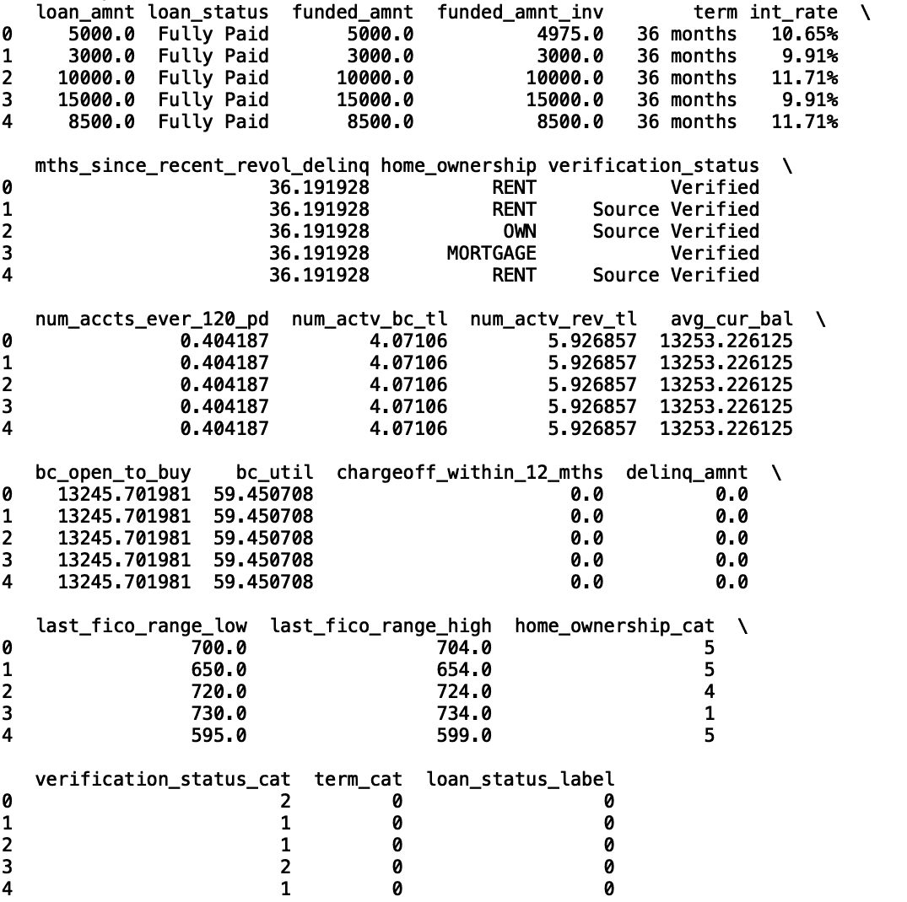

作者图片

最后，让我们过滤数据框中的列，以便我们只使用具有机器可读值的列:

```
columns2 = [‘loan_amnt’, ‘loan_status_label’, ‘funded_amnt’, ‘funded_amnt_inv’, ‘term_cat’, ‘int_rate’,’mths_since_recent_revol_delinq’,’home_ownership_cat’, ‘verification_status_cat’,
 ‘num_accts_ever_120_pd’, ‘num_actv_bc_tl’, ‘num_actv_rev_tl’, ‘avg_cur_bal’, ‘bc_open_to_buy’, ‘bc_util’, ‘chargeoff_within_12_mths’, ‘delinq_amnt’, ‘last_fico_range_low’, ‘last_fico_range_high’]
df_credit = df_credit[columns2]
print(df_credit.head())
```

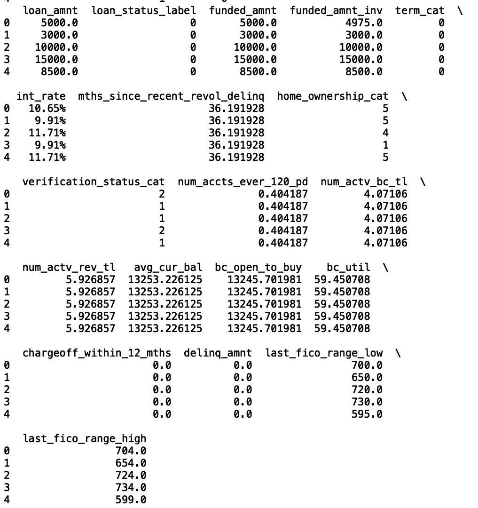

作者图片

最后，让我们将利率列转换为数字列:

```
df_credit[‘int_rate’] = df_credit[‘int_rate’].str.rstrip(‘%’)
df_credit[‘int_rate’] = df_credit[‘int_rate’].astype(float)
df_credit.fillna(0, inplace=True)
```

**随机森林**

我们现在可以应用随机森林了，这是一种基于树的集成算法，它构建了一系列树数据结构，并对数据中的统计数据提出是或否的问题。这些树中的每一个都基于答案进行预测，并且这些树被组合以进行单个预测。让我们从 Scikit-learn 导入随机森林分类器和训练/测试分割方法

```
from sklearn.ensemble import RandomForestClassifierfrom sklearn.model_selection import train_test_split
```

让我们定义我们的输入和输出，并分割我们的数据用于训练和测试。这一步是必要的，这样我们就不会过度适应训练数据中的噪声，并确保我们的模型在对未来数据进行预测时能够很好地概括。

```
X = df_credit[[‘loan_amnt’, ‘funded_amnt’, ‘funded_amnt_inv’, ‘term_cat’, ‘int_rate’,’mths_since_recent_revol_delinq’,’home_ownership_cat’, ‘verification_status_cat’,
 ‘num_accts_ever_120_pd’, ‘num_actv_bc_tl’, ‘num_actv_rev_tl’, ‘avg_cur_bal’, ‘bc_open_to_buy’, ‘bc_util’, ‘chargeoff_within_12_mths’, ‘delinq_amnt’, ‘last_fico_range_low’, ‘last_fico_range_high’]]
y = df_credit[‘loan_status_label’]X_train, X_test, y_train, y_test = train_test_split(X, y , random_state=42, test_size = 0.33)
```

接下来，让我们将随机森林模型与训练数据相匹配，并生成要素重要性图:

```
import seaborn as snsimport matplotlib.pyplot as pltmodel = RandomForestClassifier()model.fit(X_train, y_train)features = [‘loan_amnt’, ‘funded_amnt’, ‘funded_amnt_inv’, ‘term_cat’, ‘int_rate’,’mths_since_recent_revol_delinq’,’home_ownership_cat’, ‘verification_status_cat’,
 ‘num_accts_ever_120_pd’, ‘num_actv_bc_tl’, ‘num_actv_rev_tl’, ‘avg_cur_bal’, ‘bc_open_to_buy’, ‘bc_util’, ‘chargeoff_within_12_mths’, ‘delinq_amnt’, ‘last_fico_range_low’, ‘last_fico_range_high’]

feature_df = pd.DataFrame({“Importance”:model.feature_importances_, “Features”: features })
sns.set()
plt.bar(feature_df[“Features”], feature_df[“Importance”])
plt.xticks(rotation=90)
plt.title(“Random Forest Model Feature Importance”)
plt.show()
```

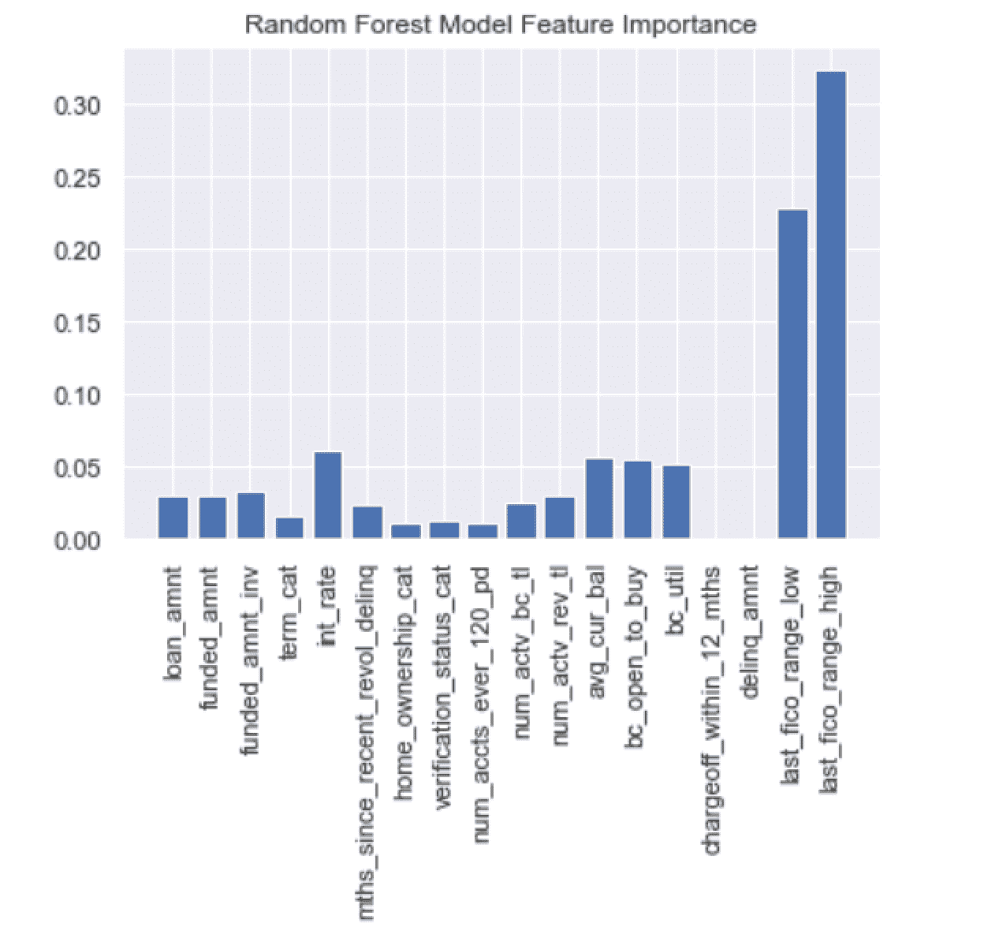

作者图片

我们看到 FICO 分数、利率和当前余额是三个最重要的特征。我们可以清楚地使用随机森林特征重要性来缩小预测信用风险时要考虑的因素。

这种方法的缺点是它假设我们有标签。在这里，它是贷款状态。但是，我们经常可以找到这样的用例，我们希望缩小数据中的一个大的列列表，而不需要任何标签。这种方法最常用的技术是主成分分析。

**主成分分析**

主成分分析的工作原理是从不相关的较大集合中找出较小的列值集合。这种方法的工作原理是将独立的、不相关的特征表示为原始特征的总和。

我们先从 Sklearn 导入 PCA 包开始。我们还需要 Sklearn 中预处理模块的 StandardScaler 方法。

```
from sklearn.decomposition import PCAfrom sklearn.preprocessing import StandardScalerNow, let’s define the input for our PCA algorithm:X = df_credit[features2]
```

接下来，让我们使用 standardScaler 方法缩放数据。当算法计算组件时，此步骤有助于数值稳定性:

```
scaler = StandardScaler()X_scaled = scaler.fit(X)
```

接下来，让我们用四个组件定义一个 PCA 对象，适合 X_scaled，然后生成我们的组件:

```
pca=PCA(n_components=4)pca.fit(X_scaled)X_components=pca.transform(X_scaled)
```

然后，我们可以将该组件存储在 Pandas 数据框中:

```
components_df = pd.DataFrame({‘component_one’: list(X_components[:,0]), ‘component_two’: list(X_components[:,1]),
 ‘component_three’: list(X_components[:,2]), ‘component_four’: list(X_components[:,3])})print(components_df.head())
```

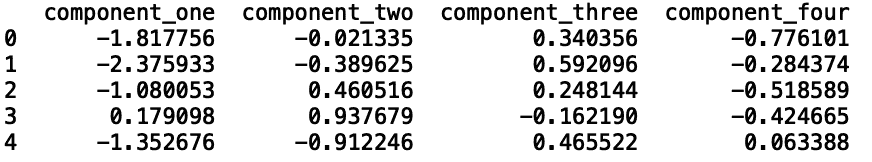

作者图片

现在，我们将该类存储在一个名为 labels 的变量中，并定义一些用于格式化我们的绘图的变量:

```
labels=X.loan_status_label
color_dict={0:’Red’,1:’Blue’}fig,ax=plt.subplots(figsize=(7,5))sns.set()
for i in np.unique(labels): 
 index=np.where(labels==i)
 ax.scatter(components_df[‘component_one’].loc[index],components_df[‘component_two’].loc[index],c=color_dict[i],s=10,
 label=i)

plt.xlabel(“1st Component”,fontsize=14)
plt.ylabel(“2nd Component”,fontsize=14)
plt.title(‘Scatter Plot of Principal Components’)
plt.legend()
plt.show()
```

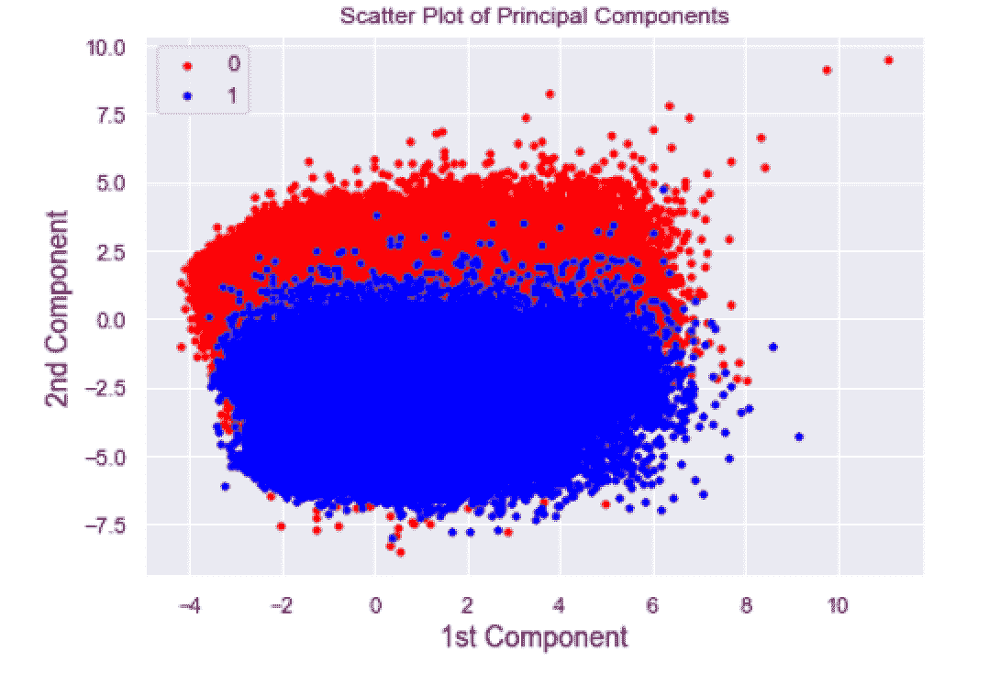

作者图片

我们可以在散点图中看到不同类别之间的明显区别。虽然我们有标签，我们可以使用我们的 PCA 算法的健全性检查，在实践中，PCA 是以一种无人监督的方式使用。这意味着我们可以使用这些方法来探索我们感兴趣的任何列的不同集群。

例如，我们可以探索信用分数甚至收入的聚类。对这些值的聚类分析可能对贷款人有用，因为它允许他们考虑信誉良好的借款人，否则他们会被拒绝贷款。一个例子是一个信用分数很低的研究生，他最近在科技行业找到了一份六位数薪水的工作。当借款人在研究生院时，他们可能在偿还贷款方面有困难，但他们现在开始新的工作时可能是有信用的。

这种类型的聚类分析可以帮助发现这些借款人，否则他们将被拒绝贷款，这可以转化为贷方的更高收入。从这个意义上说，PCA 非常强大，因为它允许您分析数据中不同的组，而不需要任何预定义的标签。

这篇文章中的代码可以在 [GitHub](https://github.com/spierre91/builtiin/blob/main/dimensionality_reduction.py) 上找到。

**结论**

大多数跨行业的数据科学团队都面临着降低数据维度的任务。这可能是为了进行简单的分析，构建可解释的模型，甚至是对大型数据集执行聚类分析。当你有一个明确定义的监督学习问题时，随机森林对于维数减少是有用的。在我们的案例中，我们的标签是信用违约和完全还清贷款。随机森林也很吸引人，因为你可以直接解释你的模型中使用的特征对于决定一个结果有多重要。当数据中没有标签时，PCA 是一个强大的工具。公司可以使用主成分分析来探索数据中的不同组，然后用于决策。

如果你有兴趣学习 python 编程的基础知识、Pandas 的数据操作以及 python 中的机器学习，请查看[*Python for Data Science and Machine Learning:Python 编程、Pandas 和 sci kit-初学者学习教程*](https://www.amazon.com/dp/B08N38XW2Q/ref=sr_1_1?dchild=1&keywords=sadrach+python&qid=1604966500&s=books&sr=1-1) *。我希望你觉得这篇文章有用/有趣。*

***本帖原载于*** [***内置博客***](https://builtin.com/data-science) ***。原片可以在这里找到***[](https://builtin.com/data-science/dimensionality-reduction-python)****。****