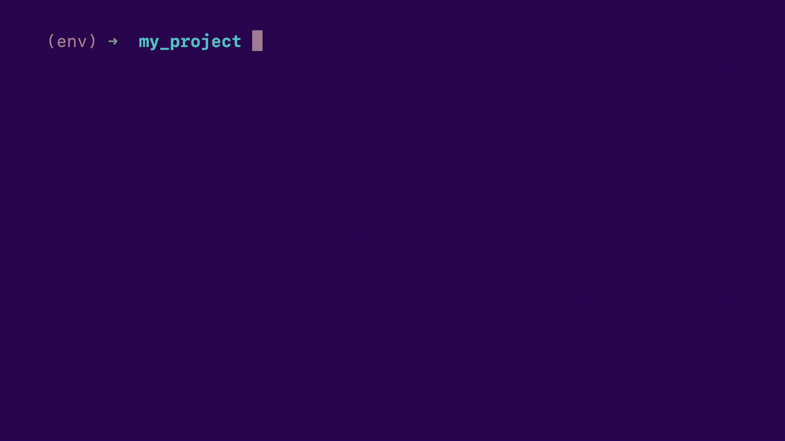
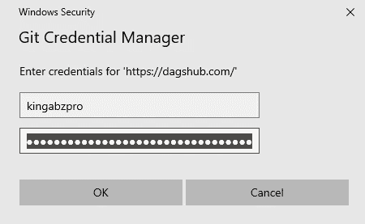

# DVC 和达格舒布机器学习实验指南

> 原文：<https://towardsdatascience.com/a-guide-to-dvc-and-dagshub-for-machine-learning-experiments-fc4d157f07e5?source=collection_archive---------32----------------------->

## MLOps

## 了解使用 DAGsHub 平台轻松管理数据、机器学习模型和监控模型性能的方法


图片作者|元素作者[(freepik.com)](https://www.freepik.com/free-vector/shipwreck-accident-ship-run-aground-sink-ocean_6198150.htm#page=1&query=titanic&position=26&from_view=search)

# DVC 和达格·哈马舍尔德简介

在本指南中，我们将了解 DVC 以及 DAGsHub 如何让机器学习工程师轻松跟踪各种实验。我们将在合成的 Titanic 数据集上训练我们的模型，并基于分类模型运行各种实验。最后，我们将使用 DAGsHub 交互式仪表板进行可视化和比较。在我们深入编码之前，我想给你们简单介绍一下 DVC、FastDS 和 DAGsHub。

## DVC

我们目前有两种选择来使用大文件版本控制。第一个是 [git-lfs](https://git-lfs.github.com/) ，这是一个基于 git 的存储库的插件。git-lfs 非常慢，很难处理，所以我们有一个替代方案，称为 DVC(数据版本控制)，它处理大型文件，如数据集和机器学习模型。DVC 旨在帮助 mlops 处理大型文件、数据集、机器学习模型和指标。它通常用于使机器学习实验具有可重复性。[数据版本控制 DVC](https://dvc.org/)

DVC 具有监控数据变化的特殊能力，并且能够更快地将数据推送到远程服务器。它与基于 git 的系统共享功能，但它是独立的版本控制，专门处理大数据。

## FastDS



图片来自 [FastDS](https://dagshub.com/pages/fds) 经许可使用

FastDS 帮助数据科学家和机器学习工程师使用 Git 和 DVC 来协助他们，以便他们可以立即对代码和数据进行版本控制。FastDS 是由 DAGsHub 开发的，旨在最大限度地减少人为错误并自动化重复任务。 [fastds PyPI](https://pypi.org/project/fastds/)

这个工具会让你在处理 Git 和 DVC 的时候变得简单

## 达格舒卜

DAGsHub 类似于 GitHub，它帮助数据科学家和机器学习工程师共享数据、模型、实验和代码。它允许您和您的团队轻松共享、审阅和重用您的工作，为机器学习提供 GitHub 体验。 [DAGsHub 文档](https://dagshub.com/docs/index.html)

DAGsHub 不仅如此，它还提供了实验、mlflow 集成、机器学习管道可视化、性能指标比较和可视化。使用 DAGsHub 的最大好处是它可以轻松地使用不同的功能，以及整个平台如何专注于帮助数据科学家和机器学习工程师。

# 使用 DAGsHub 构建机器学习模型

在这个机器学习项目中，我们将学习如何使用 DAGsHub 库来跟踪超参数和性能指标。我们将在简单的泰坦尼克号数据集上工作，通过在 3 个不同的机器学习模型上进行实验来预测乘客的存活率，并最终在 Kaggle 表格竞赛上检查我们的模型性能。该项目涉及多种工具，我们将学习如何使用它们来简化跟踪实验。

# 泰坦尼克号数据集

本次比赛使用的数据集是合成的，但基于真实的数据集(在这种情况下，实际的 [OpenML Titanic](https://www.openml.org/d/40945) ！)是使用 [CTGAN](https://pypi.org/project/ctgan/) 生成的。该数据集也可在[表格游乐场系列—2021 年 4 月| Kaggle](https://www.kaggle.com/c/tabular-playground-series-apr-2021/data) 获得。

> **原始数据集受**[**Creative Commons—Public Domain Mark 1.0**](https://creativecommons.org/publicdomain/mark/1.0/)**许可，因此可以不受限制地公开使用。**

我们在数据文件夹中有三个文件可用， *test.csv、train.csv 和 submission . CSV。*我们将把训练数据集分割成训练和测试数据帧，用于训练和验证。将通过在测试数据集上预测存活率来进行最终提交。

关于变量的信息清楚地解释了每一列包含的内容，我们将把这些信息用于特性工程。

## 数据字典

**变量定义键**生存 Survival0 =否，1 =是舱位等级 1 =第一，2 =第二，3 =第三性别年龄年龄 sibsp #泰坦尼克号上的兄弟姐妹/配偶号#泰坦尼克号上的父母/子女号船票号码票价乘客舱位号码登船港口 C =瑟堡，Q =皇后镇，S =南安普顿

包含乘客社会经济地位的等级:上层、中层和下层。**年龄**小于 1 是合理的，例如 xx . 5。**sibsp**以兄弟姐妹和配偶的形式定义家庭关系。最后， **parch** 以父子形式定义家庭关系。

这个数据集是使用 CTGAN 合成的，以避免作弊，并在 Kaggle 比赛中获得满分。如果你的模型在这里表现良好，显然你会有一个更好的算法。

## 导入

1.  **dagshub** 用于跟踪性能指标和超参数的库。
2.  **pandas** 用于数据帧， **NumPy** 用于数据扩充。
3.  **sklearn** 用于特征工程和机器学习模型
4.  **joblib** 用于保存我们的模型

```
import dagshub
import pandas as pd
from sklearn import preprocessing
from sklearn.linear_model import SGDClassifier
from sklearn.tree import DecisionTreeClassifier
from sklearn.ensemble import RandomForestClassifier
from sklearn.metrics import (
    roc_auc_score,
    average_precision_score,
    accuracy_score,
    precision_score,
    recall_score,
    f1_score,
)
from sklearn.model_selection import train_test_split
import joblib
import numpy as np
```

## 常数变量

我们将删除 Name、SibSp、Parch 和 Ticket，以简化我们的数据集。我们的主要重点是学习 DVC 和达格舒布实验。我们将保持我们的数据集和模型架构师简单。

*   将目标列设置为存活。
*   添加培训、测试和提交文件路径。

```
drop_cols = ["Name", "SibSp", "Parch", "Ticket"]
obj_col = "Survived"
train_df_path = "Data/train.csv"
test_df_path = "Data/test.csv"
sub_df_path = "Data/sample_submission.csv"
```

## 特征工程

在这些功能中，我们:

1.  清洁驾驶室立柱
2.  通过结合 SibSp 和 Parch 创建新的色谱柱。

```
def feature_engineering(raw_df):
    df = raw_df.copy()
    df["Cabin"] = df["Cabin"].apply(lambda x: x[:1] if x is not np.nan else np.nan)   
    df["Family"] = df["SibSp"] + df["Parch"]
    return df
```

## 模型结构

所有三个实验都与这个函数相关，因为我们要将 SGDClassifier 更改为另一个 sklearn 分类器。我们的主要关注点将是监控我们在测试和培训绩效指标上的准确性得分。对于基线，我们使用带有 loss="modified_huber "的简单 SGDClassifier。

```
def fit_model(train_X, train_y, random_state=42):
    clf = SGDClassifier(loss="modified_huber", random_state=random_state)
    clf.fit(train_X, train_y)
    return clf
```

## 分类特征

在训练我们的模型之前，我们需要使用标签编码器将分类数据转换为数字数据。在我们的例子中，我们将**性别**、**船舱**和**上船**作为分类列。

```
def to_category(train_df, test_df):
    cat = ["Sex", "Cabin", "Embarked"]
    for col in cat:
        le = preprocessing.LabelEncoder()
        train_df[col] = le.fit_transform(train_df[col])
        test_df[col] = le.transform(test_df[col])
    return train_df, test_df
```

## 估价

这个函数使用一个模型、X 和 y 来返回一个字典，其中包含二进制分类的所有可能的度量。对于 **AUC** 和**平均精度**分数，我们将使用预测概率，但对于其余指标，我们将使用简单预测，该预测将返回 **1** 或 **0** 。

```
def eval_model(clf, X, y):
    y_proba = clf.predict_proba(X)[:, 1]
    y_pred = clf.predict(X)
    return {
        "roc_auc": roc_auc_score(y, y_proba),
        "average_precision": average_precision_score(y, y_proba),
        "accuracy": accuracy_score(y, y_pred),
        "precision": precision_score(y, y_pred),
        "recall": recall_score(y, y_pred),
        "f1": f1_score(y, y_pred),
    }
```

## 提交

提交函数将预测测试数据集上的幸存者，并将数据帧保存在 **CSV** 中，以便我们检查公共和私有数据集上的模型性能。

```
def submission(clf, X):
    sub = pd.read_csv(sub_df_path)
    sub[obj_col] = clf.predict(X)
    sub.to_csv("Submission/submission.csv", index=False)
```

## 训练功能

这个函数是主函数，它将依次运行上述所有函数。

1.  加载训练和测试数据集。
2.  将特征工程功能应用于训练和测试 _df
3.  删除不需要的列
4.  使用标签编码器将分类列转换为数字列
5.  用零填充缺失值
6.  运行 dagshub_logger 以创建 metric.csv 和 params.yml
7.  将训练数据集分为训练和测试
8.  训练我们的分类模型
9.  将模型另存为。joblib
10.  将数据存储在 params.yml 中的日志记录超参数
11.  对培训和测试进行评估
12.  记录保存在 metric.csv 中的评估指标
13.  正在创建提交文件。

主要的收获是 dagshub 库如何让我们轻松地跟踪性能和参数。DAGsHub 平台查看 metric.csv 和 params.yml，以在实验选项卡中创建交互式可视化。

你也可以通过创建一个 python 对象来做实验记录。

> *如果你有兴趣尝试各种其他方法来记录参数和指标，我建议你查看文档* [*DAGsHub 文档*](https://dagshub.com/docs/index.html) *和* [*教程*](https://dagshub.com/docs/experiment-tutorial/overview/) *。*

```
def train():
    print("Loading data...")
    df_train = pd.read_csv(train_df_path, index_col="PassengerId")
    df_test = pd.read_csv(test_df_path, index_col="PassengerId")
    print("Engineering features...")
    y = df_train[obj_col]
    X = feature_engineering(df_train).drop(drop_cols + [obj_col], axis=1)
    test_df = feature_engineering(df_test).drop(drop_cols, axis=1)
    X, test_df = to_category(X, test_df)
    X.fillna(0, inplace=True)
    test_df.fillna(0, inplace=True)
    with dagshub.dagshub_logger() as logger:
        print("Training model...")
        X_train, X_test, y_train, y_test = train_test_split(
            X, y, test_size=0.33, random_state=42, stratify=y
        )
        model = fit_model(X_train, y_train)
        print("Saving trained model...")
        joblib.dump(model, "Model/model.joblib")
        logger.log_hyperparams(model_class=type(model).__name__)
        logger.log_hyperparams({"model": model.get_params()})
        print("Evaluating model...")
        train_metrics = eval_model(model, X_train, y_train)
        print("Train metrics:")
        print(train_metrics)
        logger.log_metrics({f"train__{k}": v for k, v in train_metrics.items()})
        test_metrics = eval_model(model, X_test, y_test)
        print("Test metrics:")
        print(test_metrics)
        logger.log_metrics({f"test__{k}": v for k, v in test_metrics.items()})
        print("Creating Submission File...")
        submission(model, test_df)if __name__ == "__main__":
    train()
```

我们需要试验 Jupyter 笔记本中的所有功能，当我们认为代码中存在错误时，我们会创建一个包含所有代码的 main.py 文件。要运行这个文件，我们只需在终端中键入“python main.py”。

# DAGsHub 回购

首先，您需要在 [DAGsHub](https://dagshub.com/) 上创建一个帐户，如果您已经有了一个帐户，您只需点击创建按钮，然后点击新建存储库，如下所示。


作者图片

添加您的存储库名称和描述。如果您想添加许可证或自述文件，您可以在该选项卡上完成所有操作，最后单击“创建存储库”。


作者图片

# 法斯特、吉特和 DVC

在我们初始化之前，我们需要创建一个项目文件夹并安装 [fastds](https://pypi.org/project/fastds/) / [dvc](https://dvc.org/) 。之后，创建文件夹数据、模型和提交。最后，用一个命令“fds init”初始化 Git 和 DVC

```
pip install fastds
pip install dvc
mkdir -p Data Model Submission
fds init
```


作者图片

我们可以使用 fds 将所有三个文件夹添加到 dvc 中，但是我们的两个文件夹是空的，因为我们还没有运行主 python 文件。fds CLI 将询问您有关数据文件夹的信息，并将其添加到 dvc，但文件夹的其余部分将被忽略，因此我们需要使用“dvc add”手动添加它们。将文件夹添加到 dvc 后，我们需要将这些文件夹添加到 gitignore 中，这样它们就不会被 git 版本控制跟踪。DVC 类似于 Git，但是它在跟踪更大的文件时非常灵活，比如大于 100 MB 的模型和数据集。

```
fds add Model Data Submission
dvc add Model
git add Model.dvc . gitignore
```


作者图片

我们将对 Submission 文件夹执行类似的操作，因为我们也在跟踪 submission.csv

```
dvc add Submission
git add Submission.dvc . gitignore
```

下图包含设置 git 和 dvc 远程服务器的帮助命令。


作者图片

首先，我们将通过添加我们的存储库 URL 来添加 git 远程服务，您可以从 DagsHub 存储库中的远程按钮复制该 URL。然后，我们将通过添加远程服务器链接、用户名和密码来添加 dvc remote。之后你就万事俱备了。好运

```
git remote add origin [https://dagshub.com//.git](https://dagshub.com//.git)
dvc remote add origin [https://dagshub.com/kingabzpro/DVC-ML-Experiments.dvc](https://dagshub.com/kingabzpro/DVC-ML-Experiments.dvc)
dvc remote modify origin --local auth basic
dvc remote modify origin --local user kingabzpro
dvc remote modify origin --local password your_token
```

现在，您需要通过使用 git add、git commit 和 git push 来提交和推送您的代码以远程访问服务器。

```
git add .
git commit -m "Initialized project"
git push -u origin master
```

如果您是第一次使用它，将会弹出安全窗口。您只需要添加您的用户名和私有令牌就可以开始了。



作者图片

# DAGsHub 上的模型和实验

在这一部分，我们将使用三种不同的机器学习模型进行三个实验，我们将学习如何提交和推送 Git 和 DVC 到 DAGsHub。最后，我们将比较结果，探索惊人的度量可视化。

# 实验#1

用基线代码和一个简单的 **SGD 分类器运行我们的第一个实验。**运行 python 文件确实打印了一些训练和测试指标，但我已将其删除，以便进行简单的最终比较。

```
**python main.py**
Loading data...
Engineering features...
Training model...
Saving trained model...
Evaluating model...
Creating Submission File...
```

我们将在初始运行后提交对 dvc 和 git 的更改，以设置基线。下面的代码展示了提交更改，然后将这些更改推送到远程服务器是多么简单

```
dvc commit -f Model.dvc Submission.dvc
git add Model.dvc Submission.dvc main.py metrics.csv params.yml
git commit -m "SGDClassifier"
```

使用 git/dvc push，我们可以将数据、模型和代码推送到远程服务器。

```
git push --all
dvc push -r origin
```

下图显示了您的存储库在第一次运行后的样子。


作者图片

我们将单击“实验”选项卡，探索我们的结果。我已经删除了一些额外的列，接下来我将重命名实验名称。您还可以尝试其他选项，让您的结果看起来更容易理解。

我们的测试准确率是 60 %,这是非常糟糕的，f1 的分数是 0.17，非常糟糕。我们需要选择另一种模式或尝试不同的技术来获得更好的结果。


作者图片

# 实验#2

在第二个实验中，我们将把模型改为**决策树分类器**，然后再次运行整个过程。

1.  运行 main.py
2.  提交 git 和 dvc
3.  推送 git 和 dvc

```
python main.pydvc commit -f Model.dvc Submission.dvcgit add Model.dvc Submission.dvc main.py metrics.csv params.ymlgit commit -m “DecisionTreeClassifier”git push –alldvc push -r origin
```


作者图片

正如我们在上面的图片中看到的，我们有另一个结果更好的实验。与 SGD 分类器相比，决策树表现得相当好。我们还可以通过单击下面所示的特定实验来详细研究所有指标和参数。


作者图片

我们有相当平衡的结果，我们将通过使用集合模型来改进它们。

# 实验#3

在第三个实验中，我们将把模型改为**随机森林分类器**，然后再次运行整个过程。现在我们是专家，正在进行实验，并把它推向 DAGsHub。

```
python main.py
dvc commit -f Model.dvc Submission.dvc
git add Model.dvc Submission.dvc main.py metrics.csv params.yml
git commit -m "RandomForestClassifier"
git push --all
dvc push -r origin
```

在完成第三个实验后，我们将通过选择所有三个提交并单击 compare 按钮来比较所有三个结果，如下所示。


作者图片

正如你在下面看到的，我们很容易比较不同的结果。根据您的指标，您将收到一个折线图或条形图。很明显，兰登森林在**准确度**和 **f1** 得分上表现相当不错。


作者图片

您可以向下滚动，甚至检查所有三个实验训练指标和详细比较。

# 私有数据集分数

让我们以性能最好的模型“submission.csv”为例，在私有隐藏数据集上检查我们的结果。如你所见，我们的模型表现很好，精度为 0.7364。您还可以通过将模型提交给 Kaggle completion 或使用 Kaggle CLI 来检查模型性能。

```
kaggle competitions submit -c tabular-playground-series-apr-2021 -f submission.csv -m "Message"
```


作者图片

# 结论

在本指南中，我们学习了如何使用各种工具来开始机器学习实验，以及 DAGsHub 平台有多强大。通常我们对大文件使用 git-lfs，但是它非常慢，你可能得不到一个更好的版本系统。这就是为什么 DVC 是数据科学版本系统的更好选择，因为我们必须处理相当大量的文件和模型。我们还学习了如何使用 fastds 以及如何使用 dagshub python 库创建实验指标。 [MLflow](https://mlflow.org/) 是 DAGsHub 平台支持的另一种方法，用于跟踪指标和模型性能。该平台还提供了可视化数据或机器学习管道的能力，如果您正在处理复杂的基础设施，这将非常有帮助。总的来说，我们已经学会了如何使用简单的机器学习模型来预测泰坦尼克号的幸存者，并使用工具来跟踪参数和性能指标。

DAGsHub Experiments 提供了灵活的选项来添加标签、重命名实验和简化列。它还提供了每个实验的详细摘要，并允许我们通过使用可视化来比较各种实验。

我很喜欢摆弄这些实验，并将它们推送到 DAGsHub 服务器上。为了将来的参考，我们可以使用 TensorFlow 训练一个深度学习模型，并使用 MLflow 来跟踪模型性能。我们还可以创建一个机器学习管道，使其按照特定的顺序运行，并在 DAGshub 的帮助下帮助我们可视化整个机器学习架构。

# 源代码

你可以在 DAGsHub[kingabzpro/DVC-ML-Experiments](https://dagshub.com/kingabzpro/DVC-ML-Experiments)上找到包含代码和实验的资源库。我会建议你叉我的仓库，自己实验。DAGsHub 的互动性相当强，你会立刻爱上它。

[](https://dagshub.com/kingabzpro/DVC-ML-Experiments) [## 金加布兹普罗/DVC-ML-实验

### 在本指南中，我们将了解 DVC 以及 DAGsHub 如何让机器学习工程师轻松跟踪各种…

dagshub.com](https://dagshub.com/kingabzpro/DVC-ML-Experiments) 

# 激动人心的 DAGsHub 实验项目

*   自我监督何时能改善少投学习？——再现性报告:[阿琼 2000 阿肖克/FSL-SSL](https://dagshub.com/arjun2000ashok/FSL-SSL)
*   这个库是 Python 3.8 和 TensorFlow 2.4 中深度解释惩罚的重新实现:[shaileshsridhar 2403/Re-CDEP](https://dagshub.com/ShaileshSridhar2403/Re-CDEP)
*   该项目使用 DAGsHub 中所有可用的功能来预测 Kaggle Titanic 数据集上的存活率: [jnirschl/titanic_dvc](https://dagshub.com/jnirschl/titanic_dvc)

# 学习资源

*   要获取 DAGsHub 实验的完整教程:[概述— DAGsHub 文档](https://dagshub.com/docs/experiment-tutorial/overview/)
*   观看关于 DVC 和数据版本控制的视频教程:[用 DVC 进行数据版本控制(动手教程！)— YouTube](https://www.youtube.com/watch?v=kLKBcPonMYw)
*   了解如何处理泰坦尼克号数据集并产生最佳结果: [Kaggle Titanic:机器学习模型(前 7%) |作者 Sanjay。M |走向数据科学](/kaggle-titanic-machine-learning-model-top-7-fa4523b7c40)
*   了解 ml flow:[ml flow 简介——机器学习生命周期的开源平台——YouTube](https://www.youtube.com/watch?v=VokAGy8C6K4)
*   了解禁食:[禁食(dagshub.com)](https://dagshub.com/pages/fds/)
*   Kaggle 竞赛最佳计分器解决方案: [DAE +堆叠 CV 分类器| Kaggle](https://www.kaggle.com/yus002/dae-stacking-cv-classifier)

# 关于作者

[阿比德·阿里·阿万](https://www.polywork.com/kingabzpro) ( [@1abidaliawan](https://twitter.com/1abidaliawan) )是一名认证数据科学家专业人士，热爱构建机器学习模型和研究最新的人工智能技术。目前在 PEC-PITC 测试人工智能产品，他们的工作后来获得批准用于人体试验，如乳腺癌分类器。

> 你可以在我每周发布文章的 LinkedIn 上关注我。

*原载于 2021 年 10 月 5 日*[*【https://www.analyticsvidhya.com】*](https://www.analyticsvidhya.com/blog/2021/10/a-guide-to-dvc-and-dagshub-for-machine-learning-experiments/)*。*