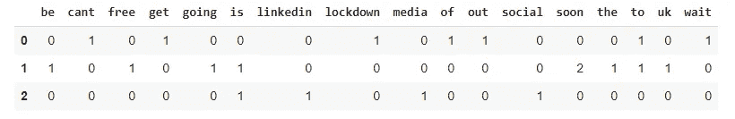
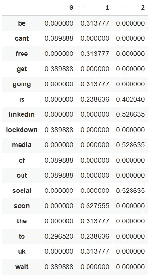

# Python 文本编码指南

> 原文：<https://towardsdatascience.com/a-guide-to-encoding-text-in-python-ef783e50f09e?source=collection_archive---------11----------------------->

## [自然语言处理笔记](https://towardsdatascience.com/tagged/nlpnotes)

## 教计算机理解人类语言


由[约书亚·阿拉贡](https://unsplash.com/@goshua13?utm_source=medium&utm_medium=referral)在 [Unsplash](https://unsplash.com?utm_source=medium&utm_medium=referral) 上拍摄的照片

我们对文本进行编码的原因是计算机不理解字符、单词或句子；计算机只能处理数字，因此，如果我们希望教会计算机理解自然语言，那么我们应该在将文本数据输入任何机器之前将其编码成数字格式。

因此，文本编码可以定义为将文本转换成有意义的数字/矢量表示的过程。在这个过程中，我们希望保留单词和句子之间的上下文和依赖关系，以便机器能够检测与文本相关的模式以及理解上下文。

对文本进行编码有多种方式:

*   一键编码
*   基于索引的编码
*   单词袋(蝴蝶结)
*   术语频率—反向文档频率(TF-IDF)
*   单词嵌入

这不是全部的清单，但足够开始了。每种编码都有自己的优缺点，每种编码都可能更适合一项任务。BOW 等最基本的编码不保留单词的顺序，而其他编码则利用 Word2Vec 等神经网络。

让我们用 Python 实现这些。

## 一键编码

一键编码将分类变量表示为二进制向量。要实现这一点，首先应该将分类值映射到一个整数，然后将每个整数表示为一个二进制向量——这意味着该向量除了整数的索引之外都是 0。

```
# define the documents
corpus = ["i cant wait to get out of lockdown", "the uk is soon going to be free soon", "linkedin is social media"]# converting text to intergers
token_docs = [doc.split() for doc in corpus]
all_tokens = set([word for sentence in token_docs for word in sentence])
word_to_idx = {token:idx+1 for idx, token in enumerate(all_tokens)}# converting the docs to their token ids
token_ids = np.array([[word_to_idx[token] for token in token_doc] for token_doc in token_docs], dtype=object)
token_ids_padded = pad_sequences(token_ids, padding="post")
token_ids = token_ids.reshape(-1, 1)# convert the token ids to one hot representation
one_hot = OneHotEncoder()
X = one_hot.fit_transform(token_ids_padded)# converting to dataframe
X_df = pd.DataFrame(X.toarray())
X_df
```


一键编码实施—按作者分类的图像

每个文档由一个张量表示，每个张量由一系列 0 和 1 组成。尽管一键编码保留了单词顺序，但随着文档变长，我们最终会得到非常大的稀疏向量。

## 基于索引的编码

基于索引的编码也保留了单词顺序。要实现基于索引的编码，只需用一个索引映射每个单词。我们还需要给每个句子添加填充，这样它们的长度就都相等了。基于字典中的映射，每个文档通过一系列索引来表示，其中每个数字是一个单词的编码。

```
import numpy as np
import pandas as pd
from sklearn.preprocessing import OneHotEncoder
from tensorflow.keras.preprocessing.sequence import pad_sequences# define the documents
corpus = ["i cant wait to get out of lockdown", "the uk is soon going to be free soon", "linkedin is social media"]# converting text to intergers
token_docs = [doc.split() for doc in corpus]
all_tokens = set([word for sentence in token_docs for word in sentence])
word_to_idx = {token:idx+1 for idx, token in enumerate(all_tokens)}# converting the docs to their token ids
X = np.array([[word_to_idx[token] for token in token_doc] for token_doc in token_docs], dtype=object)# padding the sequences
X_padded = pad_sequences(X, padding="post")# converting to pandas df
X_df = pd.DataFrame(X_padded) 
```


索引编码数据帧—按作者分类的图像

**注意**:列名代表单词在文本中出现的位置

基于索引的编码之所以失败，是因为它在文本之间引入了不真实的数字距离，例如，为什么单词“cat”的索引是数字 1，而“dog”是数字 324？

## 单词袋(蝴蝶结)

单词包编码技术的名称来源于这样一个事实，即文档中单词的任何信息或结构都将被丢弃，因此，这就像您将一组单词放入一个包中并摇晃它，它只关心一个单词是否出现在文档中以及它出现的次数。它不在乎它出现在哪里。

```
import pandas as pd
from sklearn.feature_extraction.text import CountVectorizer# define the documents
corpus = ["i cant wait to get out of lockdown", "the uk is soon going to be free soon", "linkedin is social media"]# implementing BoW
bow = CountVectorizer()
bow.fit(corpus)
X = bow.transform(corpus)# converting to dataframe
X_df = pd.DataFrame(X.toarray(), columns=sorted(bow.vocabulary_))
X_df
```



BoW 数据框—作者图片

虽然 BoW 模型是一个非常容易掌握和实现的模型，但它在许多方面都存在不足，最明显的是失去了意义，因为我们放弃了词序，我们失去了使用该词的上下文。

## 术语频率—反向文档频率(TF-IDF)

对词的频率进行评分的问题是，尽管没有给文档增加多少价值，但高频词开始在文档中占据主导地位。例如“和”、“该”、“一个”等词语。在英语中很常见，所以这些单词在文档中出现得更频繁是很常见的。TF-IDF 认识到了这个问题，并对所有文档中最突出的单词进行了惩罚。

```
import pandas as pd
from sklearn.feature_extraction.text import TfidfVectorizer# define the documents
corpus = ["i cant wait to get out of lockdown", "the uk is soon going to be free soon", "linkedin is social media"]# implement tfidf
tfidf = TfidfVectorizer()
tfidf.fit(corpus)
X = tfidf.transform(corpus)# convert to dataframe
X_df = pd.DataFrame(X.toarray(), columns=sorted(tfidf.vocabulary_))
X_df.T
```



TF-IDF 数据帧的转置—作者提供的图像

然而，由于 TF-IDF 编码是基于 BOW 编码的，它也不能捕获文本中的单词位置、语义以及在不同文档中的共现，但是它也很容易计算。

## 单词嵌入

单词嵌入是迁移学习的一个很好的例子。迁移学习是机器学习中的一个研究问题，它专注于存储在解决一个问题时获得的知识，并将其应用于不同但相关的问题。【**来源** : [维基百科](https://en.wikipedia.org/wiki/Transfer_learning)。

深入各种单词嵌入或迁移学习如何工作的全部细节超出了本文的范围，但是我们仍然会看到如何实现 Word2Vec 编码。

```
from gensim.models import Word2Vec# define the documents
corpus = ["i cant wait to get out of lockdown", "the uk is soon going to be free soon", "linkedin is social media"]# Word2Vec model
w2v = Word2Vec(min_count=1,
               size=20,
               window=2,
               alpha=0.03)# building the vocab
w2v.build_vocab(sentences=corpus)# training the model
w2v.train(sentences=corpus, total_examples=w2v.corpus_count, epochs=10)
```

> **注**:NLP 会专门为迁移学习做一篇文章。

## 包裹

对文本数据[和所有其他类型的数据]进行编码的目的是确保数据可以被机器正确地使用。在本文中，我介绍了 5 种不同的文本数据编码方法。当上下文真的很重要时，我喜欢使用分布式表示，比如单词嵌入，但是有很多例子表明像单词袋这样简单的技术是有效的，比如分类任务。

感谢阅读！在 [LinkedIn](https://www.linkedin.com/in/kurtispykes/) 和 [Twitter](https://twitter.com/KurtisPykes) 上与我联系，了解我关于人工智能、数据科学和自由职业的最新帖子。

## 相关文章

[](/a-guide-to-cleaning-text-in-python-943356ac86ca?source=collection_tagged---------0----------------------------) [## Python 文本清理指南

### 文本是非结构化数据的一种形式。根据维基百科，非结构化数据被描述为“信息…

towardsdatascience.com](/a-guide-to-cleaning-text-in-python-943356ac86ca?source=collection_tagged---------0----------------------------) [](/5-ideas-for-your-next-nlp-project-c6bf5b86935c) [## 下一个 NLP 项目的 5 个想法

### 产生一些想法

towardsdatascience.com](/5-ideas-for-your-next-nlp-project-c6bf5b86935c) [](/sentiment-analysis-predicting-whether-a-tweet-is-about-a-disaster-c004d09d7245) [## 情绪分析:预测一条推文是否是关于一场灾难

### 探索自然语言处理

towardsdatascience.com](/sentiment-analysis-predicting-whether-a-tweet-is-about-a-disaster-c004d09d7245)