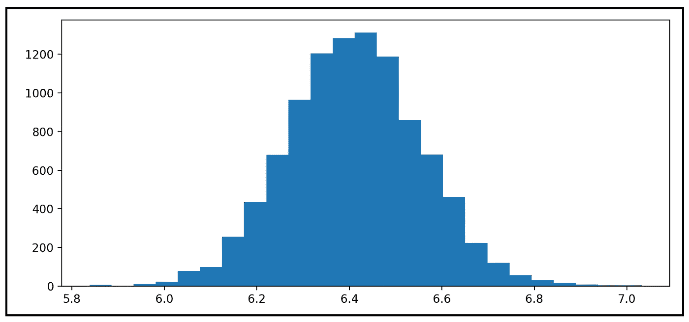

# 估计效率指南

> 原文：<https://towardsdatascience.com/a-guide-to-estimator-efficiency-bae31a06e570?source=collection_archive---------15----------------------->

## [实践教程](https://towardsdatascience.com/tagged/hands-on-tutorials)

## 使用真实世界的数据集解释效率的概念及其用法

在本文中，我们将讨论以下主题:

*   什么是效率？
*   什么是统计估计量，如何定义它的效率？
*   如何计算一个估计量的效率？
*   **如何利用效率建立更好的回归模型？**

让我们开始吧！

# 什么是效率？

用外行人的话说:

> 效率是衡量你投入的每单位时间、精力或金钱能从一件事情中得到多少使用的标准。

几乎任何事情的效率都可以用有用产出与总投入的**比**来表示:


效率的一般定义(图片由作者提供)

下面是效率的两个例子:

*   **电动机的效率:**直流电动机的效率是在其轴上测得的功率输出与泵入其中的总 DC 电功率之比。
*   **生产效率:**一个国家乃至整个地球的生产效率，往往以其 GDP 与人口之比来衡量，又称**人均 GDP。**2020 年地球的人均 GDP 为[10925 美元](https://data.worldbank.org/indicator/NY.GDP.PCAP.CD)。

**效率是一个无量纲的量。**但也有例外。在某些领域，尤其是在经济学领域，效率有一个维度，通常是货币维度，如人均 GDP。

当表示为无量纲量时，**效率是一个在 0.0 到 1.0 之间变化的实数**，表示任何设备的有用输出至多与泵入设备的总输入一样高。

有了这个背景，让我们把注意力转向统计科学中定义的效率。我们将首先介绍统计科学中的一个基本工具，即统计估计量。

# 什么是统计估计量？

让我们陈述一下评估者的非正式定义:

> 估计量是一种统计方法，用于估计总体中某些参数(如平均值或中值)的真实但未知的值。这是通过使用构成值样本的数据点中包含的信息来实现的。

## 估计量的例子

给定一个 *n* 值*【y _ 1，y_2，…，y _ n】*的样本，这里有一些总体均值 *μ* 估计量的例子(有好有坏):

**随机选择的均值(不好！):**


该估计器通过指定从样本中随机选择的值为 *μ(作者图片)*来估计总体*平均值 *μ**

**n 个值的平均值(好):**


该估计器通过取 *n* 个样本值*(图片由作者提供)*的平均值来估计总体 *μ* 的平均值

[可以证明](/understanding-estimation-bias-and-the-bias-variance-tradeoff-79ba42ab79c)n 值平均*估计量比随机选择估计量具有更好的性质。具体来说，n 值平均值估计量比随机选择估计量具有更低的方差，并且它是总体均值 *μ* *的[一致估计量。](/the-consistent-estimator-913fab06f4f3)**

## **线性模型的估计器**

让我们来看看一个常用回归模型中使用的估计量。以下估计器估计条件均值 *μ* ，即以回归变量向量 ***X*** 为条件的均值，采用一组特定的观察值*【X _ 1，x_2，…x_m】。μ_cap* 是使用 ***θ_cap*** 计算的估计条件均值，θ_cap 是拟合模型系数的向量。


线性模型的估计量(图片由作者提供)

现在让我们把注意力回到手头的话题:效率。

和其他事情一样，计算统计估计量的效率是可能的。

# 估计量的效率

考虑一个估计器 *T* ，它被设计用来估计(预测)一些总体参数 *θ。*我们刚刚复习了几个 *T* 和 *θ的例子。*例如，T =总体均值的 n 值平均值估计量 *μ* *即θ=μ。*这种估计器的效率 *T* 表示为两个方差的比值，如下所示:


总体参数θ估计量 T 的效率(图片由作者提供)

为什么 *T* 对 *θ* 的估计会有方差？这是因为，在现实世界中， *T* 无法访问整个群体的值。事实上，如果是这样的话， *T* 将不再需要“估计”任何东西。相反，在现实中， *T* 总是呈现一个值的样本。并且每次*测试*对该样本进行处理时，都有可能产生对总体参数 *θ* 的不同估计。例如，如果您向 n 值平均值估计器 *T* 提供 100 个数据样本，每个样本的大小为 *n* ，那么估计器将产生总体平均值 *μ* 的 100 个估计值。这 100 个对 *μ* 的估计会显示出真实总体均值 *μ* 附近的一些差异。这个方差叫做 *T* 的方差。

有了上面的想法，很容易看出，如果你要为同一个总体参数 *θ* 设计两种不同类型的估计量 *T1* 和 *T2* ，那么它们有可能(实际上很有可能)会各自表现出不同的特征方差。假设 *Var(T1) > Var(T2)* 。现在，假设有人对 *θ* 提出了第三种估计量 *T3* ，使得 *Var(T3)* 甚至低于 *T2* ，以此类推。人们可能有理由怀疑，如果给定一个总体参数 be，那么 *θ的估计量所显示的方差是否有一个下界。原来在一定条件下，恰好存在这样一个下界，它被称为* [**克莱姆-拉奥界**](https://en.wikipedia.org/wiki/Cram%C3%A9r%E2%80%93Rao_bound) **。**

将我们的注意力转回效率方程，我们看到上式中的分子是 [**克拉姆-拉奥界限**](https://en.wikipedia.org/wiki/Cram%C3%A9r%E2%80%93Rao_bound) 。

假设你设计了一个估计量 *T* ，它的实际方差等于克拉美–拉奥界，那么这意味着你的估计量的效率是完美的 1.0。在所有其他情况下，估计器的效率范围为*【0 到 1.0】*。

# 无偏估计量的效率

如果估计量为 [**无偏**](/understanding-estimation-bias-and-the-bias-variance-tradeoff-79ba42ab79c) ，则[克莱姆-拉奥界](https://en.wikipedia.org/wiki/Cram%C3%A9r%E2%80%93Rao_bound)是估计量的 [**费希尔信息**](/an-intuitive-look-at-fisher-information-2720c40867d8) *I(T(θ))* 的倒数。

因此，对于某总体参数 *θ* 的一个*无偏*估计量 *T* ，则 *T(θ)* 的效率表示为:


总体参数θ的一个**无偏**估计量 T 的效率(图片由作者提供)

费希尔信息可能是一个需要理解的复杂概念。我们将按以下方式描述它:

## 费希尔信息

假设你正在处理一个随机变量 *T* ，假设它遵循某种概率分布 *f(。)*，如正态或泊松分布。假设函数 *f(。)*接受某个参数 *θ。*θ的例子有正态分布的平均值 *μ* ，或者泊松分布的平均事件率 *λ* 。那么 *T* 的 Fisher 信息提供了一种方法来衡量 *T* 包含的关于θ 的*真实总体值的信息量(比如总体的真实均值)。*

# 理解估计量效率概念的三种不同方式

估计量的效率是对其特征不止一个方面的度量。以下是考察评估者效率的三种相关方法:

## **估计器效率作为其精度的度量**

与完全有效的估计量相比，*估计量的效率是对其估计的参数的真实总体值的“紧密”程度的衡量。*完全有效的估计量是其方差等于该类估计量的[克拉美-罗界](https://en.wikipedia.org/wiki/Cram%C3%A9r%E2%80%93Rao_bound)的估计量。因此，效率的概念直接基于估计者预测的变化程度。*估计者预测的方差概念非常重要，我们将很快说明如何使用真实世界的数据集来计算它。*

## **作为所需最小样本量决定因素的估计效率**

估计器的效率也是对你需要多少(或多少，取决于你的观点)数据点来达到期望的估计质量水平的一种度量。评估的质量可以用多种方法来衡量。一种流行的度量是损失函数，例如**均方误差(MSE)** 。这里的想法是，一个高效的估计器将需要比它的低效率兄弟更小的样本，以生成等于或低于 MSE 的期望阈值的预测。

由于获取数据总是一件昂贵的事情，所有其他事情大致相同，它可以帮助您获得一个高效的估计器，而不是追逐问题的最大数据集。

## **估计量效率作为比较两个估计量的一种方式**

efficiency 属性还为您提供了一种比较样本问题和相同样本数据集的两个竞争估计量的估计精度(和准确度)的方法。或者，估计器的效率为建模者提供了一种方法，如果他们选择的估计器需要匹配精度(或准确度——记住它们是[而不是同一个东西](https://en.wikipedia.org/wiki/Accuracy_and_precision),就可以确定样本大小需要多大(或多小)!)的竞争估计量。

## 一个重要的特例

两个估算器的效率可以通过简单地比较各自估算器预测的方差来进行比较，即方差较低的一个被认为更有效，**假设满足以下条件**:

1.  这两个估计量用于预测总体的同一个参数。例如，两者都是总体均值的估计量。
2.  这两个估计器属于同一类，即由这两个估计器产生的预测遵循相同的概率分布。例如，由两个估计器产生的估计是泊松分布的。在这种情况下，两个估计量对于它们正在估计的总体参数具有相同的 Fisher 信息。
3.  这两种估计量都是它们所估计的总体参数的无偏估计量。在这种情况下，它们的 Fisher 信息的倒数就是方差的 Cramer-Rao 界，这又使得两个估计量的方差的 Cramer-Rao 界相同。

当上述三个条件成立时，效率方程的分子，即方差的下限，对于两个估计量是相同的。因此，可以通过简单地比较它们各自预测的方差来比较这些估计量的效率。

因此，我们得到了以下重要结果:

> 在一组无偏估计量中，如果某个总体参数 *θ* 的预测服从相同的概率分布，那么预测方差最小的估计量就是最有效的估计量。

我们现在来看看如何计算 n 值平均值估计量的效率方程的分子和分母。

让我们从分母开始:估计者预测的**方差**。

# 估计量的方差是什么意思，如何计算？

使用以下思维实验可以最好地理解评估者预测的方差概念:

假设您希望在夏季的几个月中估计某个公共海滩上每立方毫升海水中的细菌平均数量。为此，你在一天的不同时间在海滩收集 *100 个*水样，并测量每个样本中的细菌数量。这是你的细菌计数样本数据集:*【y _ 1，y_2，…，y _ 100】*。接下来，您决定使用 n 值平均值估计器来估计平均细菌数，并使用这个观察到的样本平均值 *y_bar* 作为您对总体平均值 *μ* 的估计。总之，您使用 n 值样本平均值 *y_bar* 作为总体平均值 *μ* 的估计值。

但是现在假设，你的一个朋友在海滩上随机选择的 100 个地方收集了另一组水样。他们将获得第二组 100 个细菌计数: *[y_1，y_2，…，y_100]而另一个样本意味着 y_bar_2。*假设 *200* 人重复这个过程，他们会在他们自己当中，以 *200* 的样本结束 *y_bar_1，y_bar_2，…，y_bar_200* 。这些 *200* 样本均值本身将围绕真实总体均值 *μ分布(近似正态分布)。因此可以计算这些样本均值的方差。*

因此，总体均值μ的 n 值均值估计值本身是一个随机变量，它遵循一个既有均值又有方差的概率分布。

[可以看出](/understanding-estimation-bias-and-the-bias-variance-tradeoff-79ba42ab79c)n 值平均值估计量是总体均值的[无偏](/understanding-estimation-bias-and-the-bias-variance-tradeoff-79ba42ab79c)估计量，即它的期望值实际上是总体均值 *μ* 。此外，该估计量是[一致的](/the-consistent-estimator-913fab06f4f3)，这意味着它的预测将收敛于总体均值 *μ* 作为 *n → N* ，即整个总体的大小。在海滩示例的情况下， *N* 可以被安全地认为是无穷大。

[还可以看出](/understanding-estimation-bias-and-the-bias-variance-tradeoff-79ba42ab79c)n 个值的平均值估计量的预测方差是 *σ /n* ，其中 *σ* 是我们为了构建大小为 *n* 的样本而使用的基础总体值的方差。

事实上，估计量方差的概念对于效率的计算非常重要，我们将用一个真实的例子来说明它。

# 估计量方差的真实例子

我们将使用从 [Zillow Research](https://www.zillow.com/research/data/) 根据其[免费使用条款](https://www.zillow.com/research/contact-us/)下载的以下 30K+数据点数据集:


房价同比百分比变化预测(来源: [Zillow Research](https://www.zillow.com/research/data/)

数据集中的每一行都包含对美国特定地理位置的房价年同比百分比变化的预测。该值在列 **ForecastYoYPctChange** 中。

我们的目标是估计全美房价同比百分比变化的平均预测值，即人口平均值 *μ* 。

假设我们不能一次性访问这个 30K 行的完整数据集。相反，我们碰巧只能进入 100 个随机选择的地点。我们需要使用 100 点样本来估计全美房价年同比百分比变化的平均预测。

以下 Python 代码阐释了这项任务。

*   我们将把数据集加载到内存中
*   接下来，我们将随机选择 100 个数据点进行替换。“with replacement”技术确保每个数据点独立于任何其他点进行选择。这种技术会在我们的样本中导致重复，但是当值的总体很大时，重复的机会是最小的。从好的方面来看，需要使用替换技术进行采样，以使统计数学能够很好地工作。
*   最后，我们将使用 n 值平均值估计器来估计总体平均值 *μ* 。

```
**import** math **import** pandas **as** pd
**import** numpy **as** np
**from** matplotlib **import** pyplot **as** plt
**from** scipy.stats **import** norm**#Load the data file**
df = pd.**read_csv**(**'zhvf_uc_sfrcondo_tier_0.33_0.67_month.csv'**, **header**=0, **infer_datetime_format**=True, **parse_dates**=[**'**ForecastedDate**'**])**#Randomly select 100 data points with replacement** df_sample = df.**sample**(**n**=100, **replace**=True)**#Print the mean of the sample. This is our estimate of the population mean mu
print**('Estimate of population mean mu='+**str**(df_sample['ForecastYoYPctChange'].**mean**()))
```

现在，让我们重复上述过程 100 次，以产生总体均值 *μ的 100 个独立估计。*我们将绘制这 100 个平均值，看看预测值的分布情况:

```
means = []
for i in **range**(100):
    df_sample = df.**sample**(**n**=100, **replace**=True)
    means.**append**(df_sample['ForecastYoYPctChange'].**mean**())**#Plot the distribution** plt.**hist**(means, **bins**=25)
plt.**show**()
```

我们看到下面的情节:


样本均值的频率分布(图片由作者提供)

如果我们继续这种抽取大小为 *n (=100)* 的样本的做法，我们会发现频率分布将在真实总体均值 *μ处开始达到峰值。*

这是 10，000 个样本平均值的频率分布:



10000 个样本均值的频率分布(图片由作者提供)

我们得出了以下重要的观察结果:

> n 值平均值估计器的预测本身是一个随机变量，它遵循一个具有平均值和方差的概率分布。

如果估计量是无偏的，其预测的均值将与真实总体均值 *μ* 相同，因为预测的数量趋于无穷大:


如果估计量是无偏的，其预测的期望值 ***μ_cap*** *等于总体均值μ(图片由作者提供)*

我们感兴趣的是估计者预测的方差。

以下是均值估计器 10，000 次预测的方差:

```
print('Variance of the estimator='+str(np.**var**(means)))
```

它打印出以下内容:

```
Variance of the estimator=**0.020872772633239996**
```

上述对方差的深入研究也给我们带来了意想不到的红利。它使我们能够估计房价变化预测总体的方差 *σ* 。回想一下，n 值均值估计量的方差是 *σ /n* ，其中 *σ* 是基础总体的方差，*n =样本量=100* 。所以我们可以估计总体的方差为 **2.08728。**

## 绕回来…

让我们回到估计器 *T* 的效率等式，它产生某个总体参数 *θ* 的无偏估计:


总体参数θ的**无偏**估计量 T 的效率(图片由作者提供)

到目前为止，我们已经对估计者预测中的方差概念有了一些了解，也就是上式中的分母。

为了计算分子，我们需要知道有关估计量的费雪信息。为了知道费雪信息，我们需要知道估计量的预测的概率分布。

对于我们用来估计房价同比变化的 n 值平均值估计值，我们知道以下信息:

1.  n 值均值估计器**的预测在估计数趋于无穷大的渐近情况下近似正态分布**(这一点可以证明)。
2.  n 值平均值估计器生成总体平均值 *μ* 的无偏估计。因此，n 值平均值估计器预测的**均值就是总体均值*μ*。**
3.  估计者预测的**方差是*σ/n*其中 *σ* 是价格变化的潜在总体的方差，而 *n* 是取平均值的样本大小。在我们的例子中， *n=100* 。**

因此，我们可以对 *μ* 的 n 值平均值估计量的概率分布陈述如下:


n 值均值估计器的预测值呈正态分布，均值等于总体均值μ，方差等于总体方差 *σ，按样本大小 n 缩放(图片由作者提供)*

可以证明，正态分布且已知方差 *σ* 的未知总体均值 *μ* 的一个估计量的 Fisher 信息，就是 1/ *σ。*

**因此，总体均值 *μ* 的 n 值均值估计量的 Fisher 信息为 *n/σ。***

再次回忆一下，这个估计器预测的方差是 *σ /n* 。

因此，总体参数 *μ* 的 n 值均值估计的效率为:


总体平均值的 n 值平均值估计量的效率 *μ是完美的 1.0(图片由作者提供)*

这是一个重要的结果。它表明 n 值平均值估计量尽管简单，却是一个有效的估计量。

> 总体均值 *μ* 的 n 值均值估计量是一种有效的估计量。

# 相关阅读

</understanding-estimation-bias-and-the-bias-variance-tradeoff-79ba42ab79c>  </the-consistent-estimator-913fab06f4f3>  </an-intuitive-look-at-fisher-information-2720c40867d8>  

# 引用和版权

[Fisher R. A.](https://royalsocietypublishing.org/author/Fisher%2C+R+A) ，(1922)论理论统计的数学基础，*伦敦皇家学会哲学汇刊。A 辑，包含数学或物理性质的论文。*222309–368。【http://doi.org/10.1098/rsta.1922.0009 

## 形象

本文中的所有图片的版权归 [CC-BY-NC-SA](https://creativecommons.org/licenses/by-nc-sa/4.0/) 所有，除非图片下方提到了不同的来源和版权。

*如果您喜欢这篇文章，请关注我的*[***Sachin Date***](https://timeseriesreasoning.medium.com/)*以获得关于回归、时间序列分析和预测主题的提示、操作方法和编程建议。*