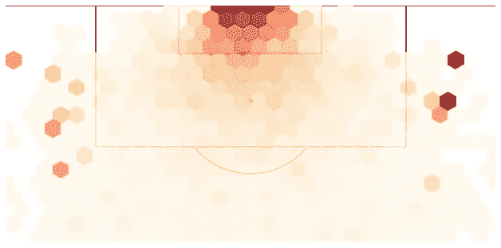
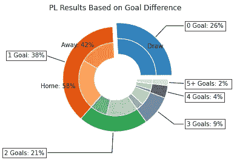
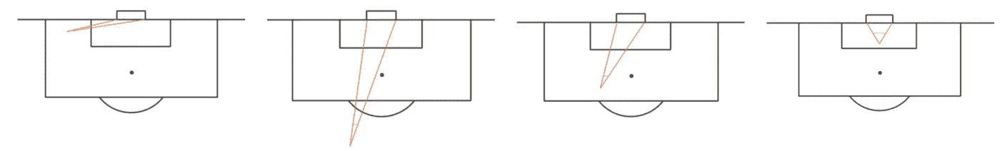
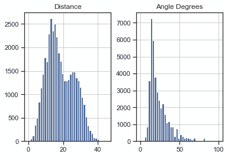
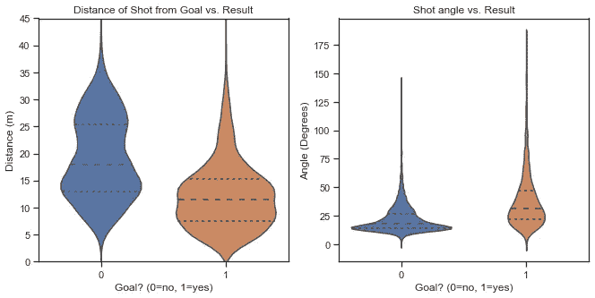
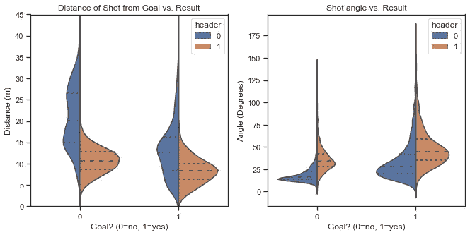
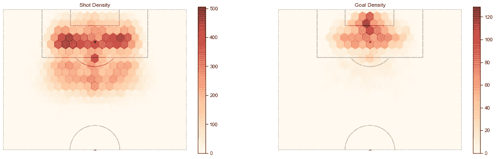
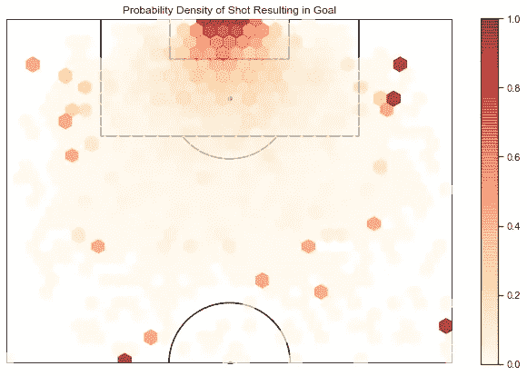
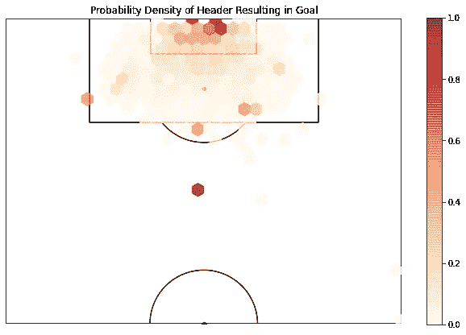
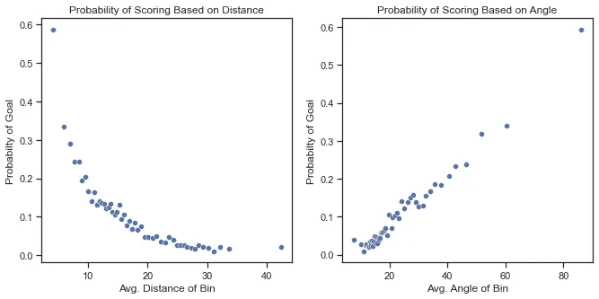

# 对预期目标的探索

> 原文：<https://towardsdatascience.com/a-guide-to-expected-goals-63925ee71064?source=collection_archive---------12----------------------->

## 使用事件数据可视化与镜头相关的趋势和概率



作者图片

在这里，我将介绍预期目标(xG)的概念，并对事件数据进行探索。这将是关于预期目标的三部分系列的第一部分。第二部分将围绕从该事件数据构建机器学习模型，而第三部分将探索该模型的应用、优势和不足。

# xG 是什么？

足球比赛的结果比其他任何运动都更容易受到随机时刻和“运气”的影响。仅仅是失误、射门偏出、守门员失误和有争议的裁判判罚就能决定最终结果。足球是一项英寸的运动。

这些影响由于进球是罕见的事件而被放大；一场比赛平均产生 2.5 个进球。此外，大多数比赛以平局告终，或者仅仅由几个进球决定，这意味着一个进球对比赛结果有很大的影响。



作者图片

因此，当如此多的比赛由细微的差距定义时，运气和随机性会产生显著的影响。这也使得绩效难以评估；顽强的 1-0 胜利是值得的表现还是一系列幸运事件的产物？有时候，这是很难用肉眼评价的。我们希望通过在检查比赛时尽可能消除随机性来量化和限定表现。

为了进球，你必须首先尝试射门。十年前，评估一场比赛的表现只需要看一下总投篮次数和目标投篮次数。虽然这些是评估机会创造的有用工具，但它们并不能说明全部情况，因为并非所有的机会都是平等的。有许多因素影响射门得分的可能性。

这就是 xG 发挥作用的地方。xG 根据许多因素来衡量射门得分的概率。这些因素包括距离射门位置的距离、相对于球门线的角度、比赛状态(比分是多少)、是否是头球、射门是否来自反击以及其他因素。为了简单起见，我们的探索将只关注其中的三个因素。我们可以使用这一指标对一场比赛中的所有机会进行求和，以根据我们在模型中汇总的因素来确定一支球队应该进多少球。我们甚至可以进一步将这一点应用到一系列比赛、一个赛季甚至一个经理的任期中。

因此，xG 可以作为一支球队进攻实力和后防实力的衡量标准。它还可以用来分析球员在危险区域创造射门机会的能力以及他把握机会的能力。总之，当我们试图量化一支球队的进球能力时，xG 模型帮助我们消除了一部分与得分机会相关的随机因素，这最终是足球的最终目标。

我们将在后面看到，我们可以使用 xG 来预测未来的结果，指导球员招募决策和评估教练指导，但首先让我们尝试探索一些数据。

# 数据探索

在我们开始构建 xG 模型之前，我们需要考虑我们对什么样的数据感兴趣。显然，我们需要大量的射门数据，但更重要的是，我们需要这些数据来描述导致进球的射门类型。我们可以推断出，我们需要的最重要的因素是拍摄时离球门的距离、相对于球门的角度以及拍摄时身体的哪一部分。



图 1:请注意，角度是指射门位置与球门线所成的角度。注意它是如何根据位置变化的。图片作者。

足球数据通常分为两种形式:事件数据和跟踪数据。事件数据记录所有有球事件以及它们发生在球场上的位置(如射门、传球、铲球、运球)，而跟踪数据记录球员的位置和球在整个比赛中每隔一段时间的位置。

我今天将使用的事件数据来自 Wyscout。它涵盖了 2017/2018 赛季欧洲 5 大国内联赛(英超、法甲、德甲、西甲、意甲)所有比赛的所有赛事。

虽然这一部分的一些发现对那些对足球有广泛了解的人来说似乎是初级的，但我始终认为检验我们的假设是重要的，因为它们有时会误导人。我认为最好的开始是问，大多数投篮发生在球场的什么地方？



作者图片

马上，我们可以得出一些结论。该分布表明:

```
1\. A majority of shots happen between 10 and 20 meters. 2\. Shots taken within about 6 meters are quite rare in comparison to shots taken outside 10 meters3\. Oddly enough, there is a trough in the local region taken between 18m to about 25m4\. As expected, players rarely take shots from angles less than 5 degrees, corresponding to central shots close to goal.
```

角度分布与距离分布一致，因为从更近(更大的角度)拍摄的镜头更难产生。

仅仅通过一个简单的分布图，我们就可以得出结论，要打出接近球门中心的射门是相当困难的。虽然我们现在知道射门是如何根据距离和角度分布的，但我们还没有解决导致进球的射门与没有进球的射门有何不同。



作者图片

上面的 violin 图与盒须图的作用相似，但也提供了数据的核分布估计(本质上是分布的平滑)。在根据射门结果划分数据时，我们可以看到，平均而言，导致进球的射门比没有进球的射门更接近球门。射门得分的平均距离约为 12 米，相比之下，那些没有进球的平均距离约为 18 米。类似地，球门通常从 20 度到大约 50 度的角度得分。

因此，虽然很难在球门附近创造射门机会，但小提琴的情节表明，那些靠近中心的射门机会往往会导致进球。

让我们看看标题是如何影响均值和分布的。



作者图片

正如我们所料，头球通常是在 18 码(16.5 米)内完成的。有趣的是，结果的平均值和分布相差不大，所以这是我们应该考虑的事情。

我们通过一些基本的分布图获得了一些惊人的洞察力，但我们可以更进一步。通过绘制球场上的投篮密度，我们可以更好地想象这些变量如何影响结果。也就是说，我们希望将间距分成多个面元，计算每个面元内拍摄的镜头数量，然后使用颜色渐变来显示面元之间的密度差异。



作者图片

这些密度图的功能与上面的小提琴图类似，但让我们更直观地了解球场的哪些区域通常会射门和进球。这是因为我们可以看到距离和角度如何影响同一地块上的镜头分布。正如我们从小提琴的情节中了解到的:

```
1\. Shots are seldom taken from either side the box due to the poor angle2\. A majority of the shots are taken around the penalty spot (11m)3\. Goals are normally scored within 11 meters and within a very narrow passage
```

在我们深入研究之前，我们需要解决为什么盒子边缘的镜头数量急剧减少。这可能有多种原因。

```
1.We have generalize that all football pitches are 105m x 68m when in reality every pitch has its own unique dimensions. The trough may be a product of our generalization.2.Another factor may be due to how Wyscout records their data. There may be an inclination to record a shot near the penalty box line as either inside the box or outside. Therefore it is possible that shots that happen on the line are being mischaracterized. 3.Lastly, there may be a psychological effect happening to the players. Players may resist the temptation to shoot when just outside the box in order to dribble into the box in the hope of winning a penalty. Defenders tend to defend much more tentatively when the opposition are in the box due to the possibility of a costly foul and it is possible that attackers want to take advantage of this.
```

还有其他的可能性，很难对低谷做出任何结论，但是现在我们必须接受它。

现在回到更多的数据可视化。正如你可能猜到的，我们可以绘制一个概率密度来评估球场的哪些区域有很高的射门概率，哪些区域没有。



作者图片

正如所料，你离球门越近，射门就越有可能进球。请注意，存在某些异常值，这些异常值中的概率密度非常高。这是因为从那些区域拍摄的一些镜头，它们导致了进球。如果我们有 10 个季度的数据，我们会看到一个更加同质的概率密度。

对于那些从未使用过 xG 的人来说，最令人惊讶的事情之一是，在 11 米以外进球的概率实际上比我们在现场观看比赛时所欣赏的要低。正是由于这个原因，这种分析是重要的。我们倾向于高估机会的质量，例如禁区外的射门，而事实上射门是非常困难和低效的。所以，下次你最喜欢的球员在 11 米开外投篮不中时，记住他只有十分之三的机会得分。

那么头球呢？



作者图片

虽然头球表现出与常规投篮相似的趋势，但它们的总体概率值较低。这似乎表明，虽然平均来说头球离球门更近，但它们也代表了一个更难把握的机会。正如我们将看到的，这是一个重要的发现，影响了我们对机会评估的解释。

在我们进入一些机器学习之前，我想结束我们对这些趋势的一些见解。我们假设球门线的距离和角度都会影响射门得分的概率，我们已经从上面的图表中看到了这一点。但是这种关系的本质是什么呢？随着我们远离目标，得分的概率如何变化？我们可以像以前一样，用一些精心设计图表来解决这些问题。



作者图片

第一件引人注目的事情是，当我们离目标越远，得分的可能性就越大。这意义深远，因为它极大地降低了远距离拍摄的价值。为什么会这样呢？到目前为止，我们忽略了这样一个事实，即随着我们远离目标，与目标的角度会减小。所以我们有这种距离的“加倍因子”。我们可以假设，这是因为当我们增加射击距离时，不仅距离更远，而且目标也变得更小。

太棒了。现在，我们已经看到了数据可视化的力量，以及即使是最简单的图表如何帮助我们辨别大型数据集背后的信息。正是由于这个原因，在数据探索上花费时间和精力是如此重要。这将为我们在下一部分讨论机器学习打下良好的基础。回头见！

这里所有与分析和可视化相关的代码，请访问我的 [github](https://github.com/iandragulet/xG_Model_Workflow) 。