# PySpark 中随机森林分类器开发指南

> 原文：<https://towardsdatascience.com/a-guide-to-exploit-random-forest-classifier-in-pyspark-46d6999cb5db?source=collection_archive---------2----------------------->

## 鸢尾花分类实用说明指南


照片由[阿德埃尔·grőber](https://unsplash.com/@ninszi?utm_source=medium&utm_medium=referral)在 [Unsplash](https://unsplash.com?utm_source=medium&utm_medium=referral) 上拍摄

在本文中，我将一步一步地指导你如何使用 PySpark 通过随机森林分类器对鸢尾花进行分类。

我使用了流行的 Iris 数据集，并在文章末尾提供了数据集的链接。我使用 Google Colab 进行编码，我还在参考资料中提供了 Colab notebook。

Pyspark 是 Apache Spark 的 Python API，pip 是 Python 包的包管理器。

```
!pip install pyspark
```

使用上面的命令，可以使用 pip 安装 pyspark。

```
from pyspark.sql import SparkSession
spark = SparkSession.builder.appName('ml-iris').getOrCreate()
df = spark.read.csv('IRIS.csv', header = True, inferSchema = True)
df.printSchema()
```

首先，我需要为 Spark 中的所有功能创建一个入口点。SparkSession 类用于此目的。`SparkSession.builder()`创建一个基本 SparkSession。使用`appName(name)`为应用程序设置名称。在这里，我将“ml-iris”设置为应用程序名称。没有必要设置名称，如果没有设置，将为应用程序生成一个随机名称。`getOrCreate()`如果没有现有会话，则创建新的 SparkSession。否则，它将获取现有会话。

`spark.read.csv(“path”)`用于将 CSV 文件读入 Spark 数据帧。数据框是一种 2D 数据结构，它以表格格式设置数据。Iris dataset 有一个头，所以我设置了`header = True`，否则 API 会把头当作一个数据记录。inferSchema 属性与列类型相关。默认情况下，inferSchema 为 false。它将以字符串的形式给出所有的列。这里我设置了`inferSchema = True`，所以 Spark 遍历文件，推断每一列的模式。`printSchema()`将以树形格式打印模式。

输出:

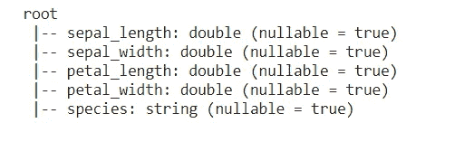

```
import pandas as pd
pd.DataFrame(df.take(5), columns=df.columns).transpose()
```

pandas 是一个用于数据分析的工具包。这里`df.take(5)`返回前 5 行，`df.columns`返回所有列的名称。`DataFrame.transpose()`转置数据帧的索引和列。它将列写成行，将行写成列。

输出:

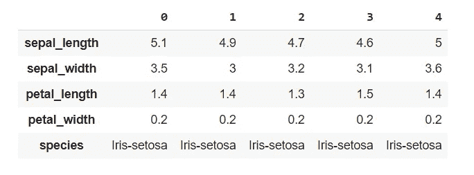

```
numeric_features = [t[0] for t in df.dtypes if t[1] == 'double']
df.select(numeric_features).describe().toPandas().transpose()
```

`df.dtypes`返回所有列的名称和类型。这里，我们将 Double 类型的列分配给 numeric_features。`select(numeric_features)`返回新的数据帧。`describe()`计算统计数据，如列的计数、最小值、最大值、平均值，`toPandas()`返回当前数据帧作为熊猫数据帧。

输出:

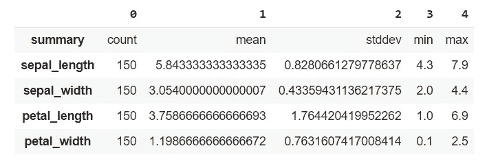

由于我们对正在处理的数据集有了很好的了解，我们可以开始进行要素转换。特征转换意味着缩放、转换和修改特征，以便它们可以用于训练机器学习模型，从而做出更准确的预测。为此，我使用了字符串索引器和向量汇编程序。

首先，我使用 Vector Assembler 将萼片长度、萼片宽度、花瓣长度和花瓣宽度组合成一个向量列。在这里，新的单一向量列称为 features。

输出:

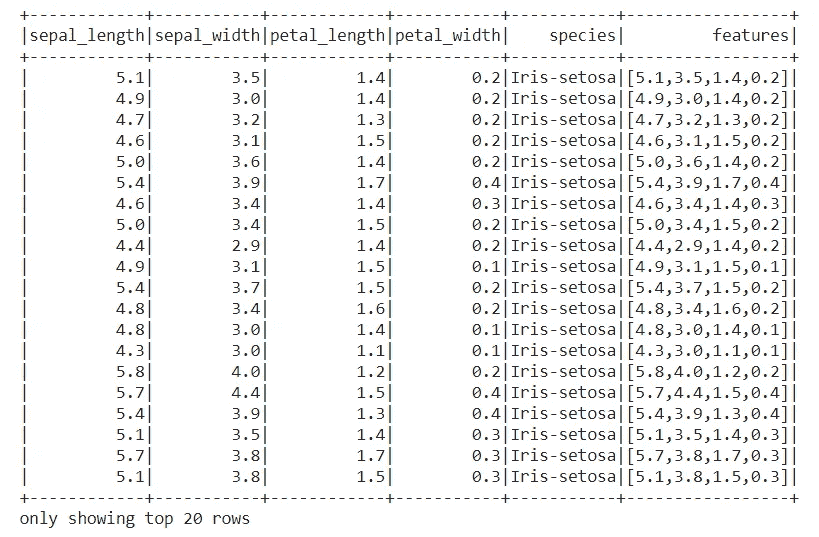

然后，我使用字符串索引器将物种的字符串列编码为标签索引的列。默认情况下，标签根据频率进行分配。因此，最常见的物种的指数为 0。

输出:

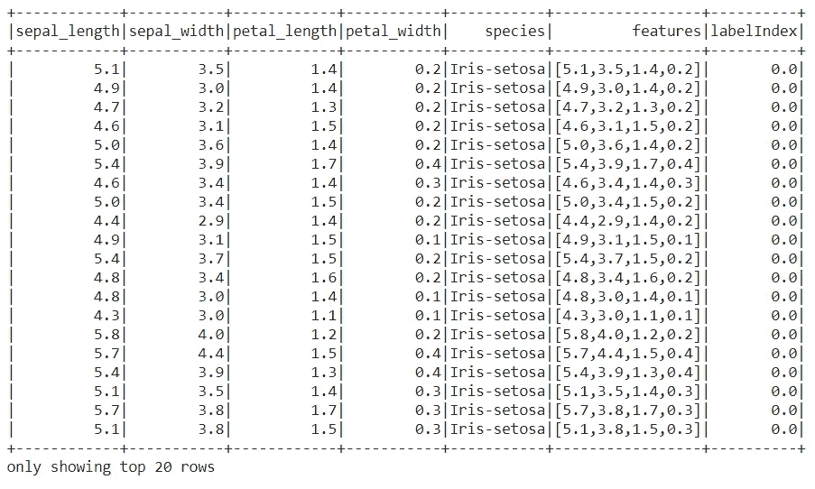

如您所见，我们现在有了名为 labelIndex 和 features 的新专栏。

```
pd.DataFrame(df.take(110), columns=df.columns).transpose()
```

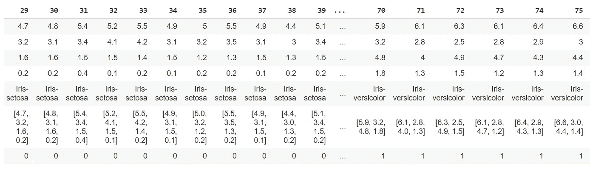

最下面一行是 labelIndex。我们可以看到 Iris-setosa 的标签索引为 0，Iris-versicolor 的标签索引为 1。Iris-virginica 的 labelIndex 为 2。

现在，我们已经转换了我们的功能，然后我们需要将数据集分成训练和测试数据。

`randomSplit(`)将数据帧随机拆分成训练集和测试集。在这里，我为可复制性设置了种子。0.7 和 0.3 是分割作为列表给出的数据集的权重，它们的总和应为 1.0。

输出:


现在我们可以导入和应用随机森林分类器。随机森林是一种通过在训练阶段构建多个决策树来运行的方法。随机森林选择大多数树的决策作为最终决策。

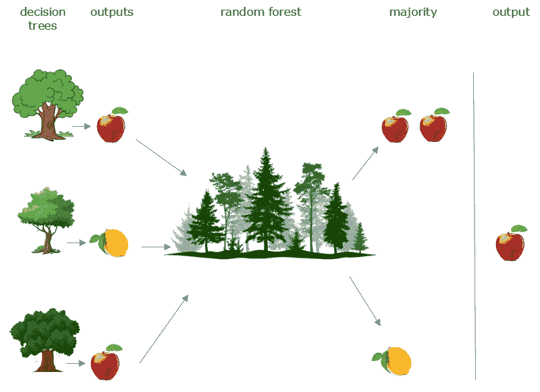

随机森林分类器的表示(图片由作者提供)

它属于监督学习，主要用于分类，但也可以用于回归。随机森林分类器是有用的，

1.  不要过度拟合
2.  高准确度
3.  估计缺失数据

这里的`featuresCol`是数据框的要素列表，在我们的例子中是要素列。`labelCol`是目标特征，即 labelIndex。`rf.fit(train)`将随机森林模型拟合到我们名为 train 的输入数据集。`rfModel.transform(test)`转换测试数据集。这将向数据框中添加新列，例如预测、原始预测和概率。

输出:

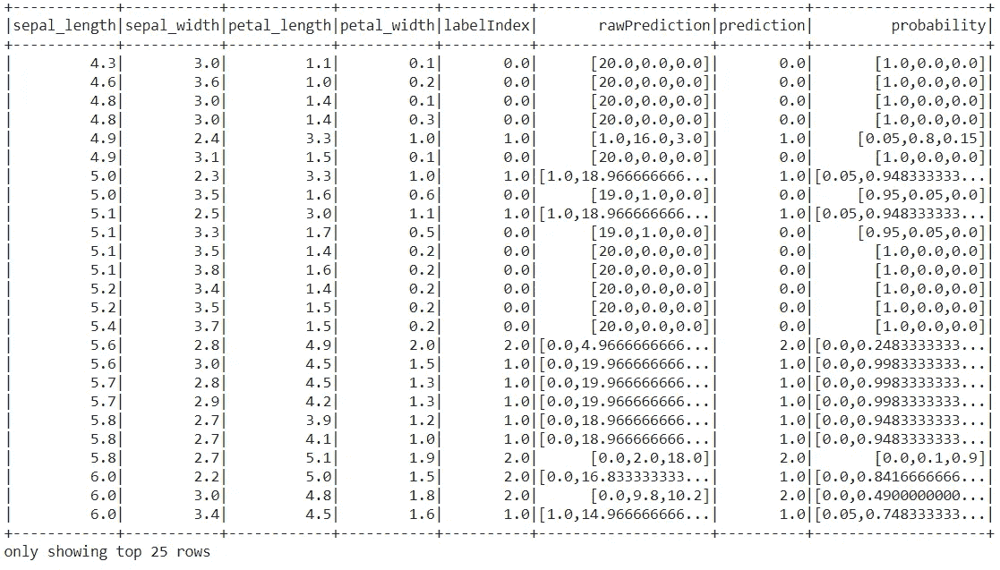

通过下面的输出，我们可以清楚地比较实际值和预测值。

```
predictions.select("labelIndex", "prediction").show(10)
```

输出:

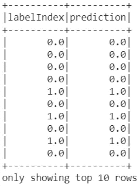

现在，我们已经将分类器应用于我们的测试数据，并且得到了预测。然后我们需要评估我们的模型。

multi classclassificationevaluator 是多类分类的赋值器。因为我们有 3 个类(鸢尾-Setosa，鸢尾-Versicolor，鸢尾-弗吉尼亚),我们需要多类分类评估器。方法`evaluate()`用于评估分类器的性能。

输出:

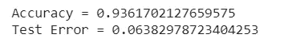

现在可以看到我们的模型精度很高，测试误差很低。这意味着我们的分类器模型表现良好。

我们可以使用混淆矩阵来比较预测的鸢尾物种和实际的鸢尾物种。

MulticlassMetrics 是 pyspark mllib 库中多类分类的评估器。

输出:

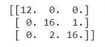

根据混淆矩阵，在 47 个测试数据中有 44 个(12+16+16)物种被正确分类。3 种被错误分类。

我希望这篇文章能帮助您学习如何使用 PySpark 并使用随机森林分类器完成分类任务。我在下面提供了数据集和笔记本链接。

编码快乐！😀

## 资源

资料组

<https://www.kaggle.com/arshid/iris-flower-dataset>  

Colab 笔记本

<https://colab.research.google.com/drive/1en1X946wqbv4SC_cCLmspJa7iGL8DvYo?usp=sharing> 