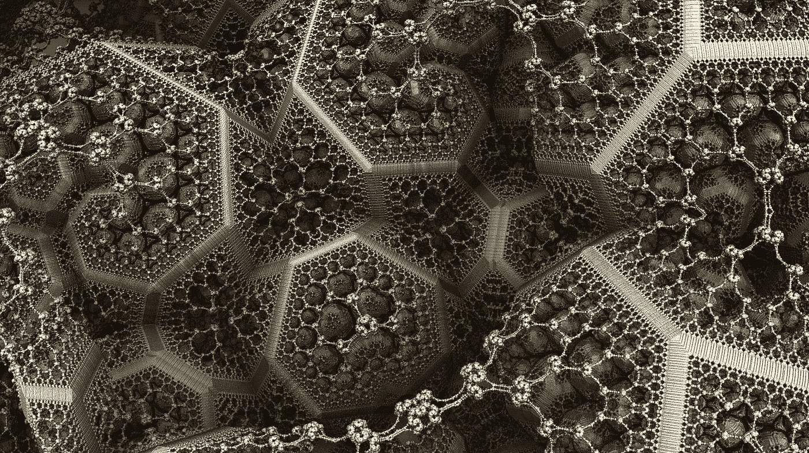
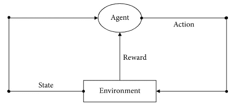
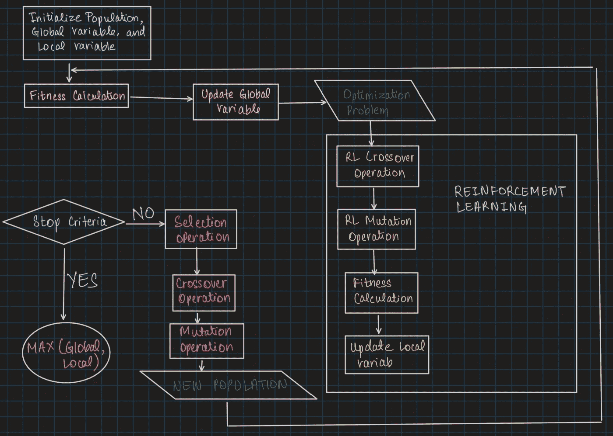
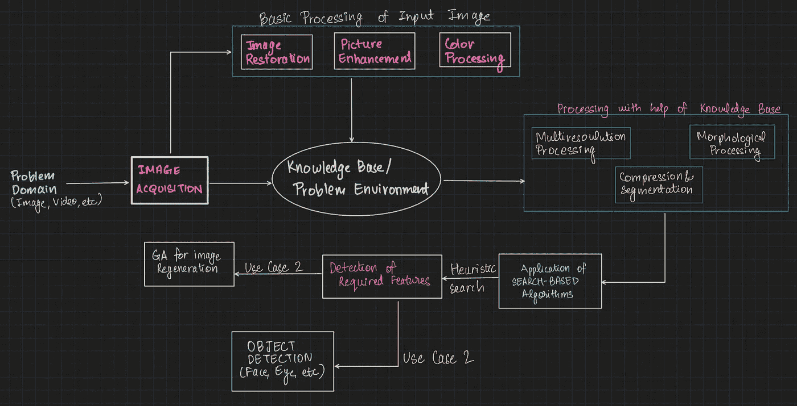
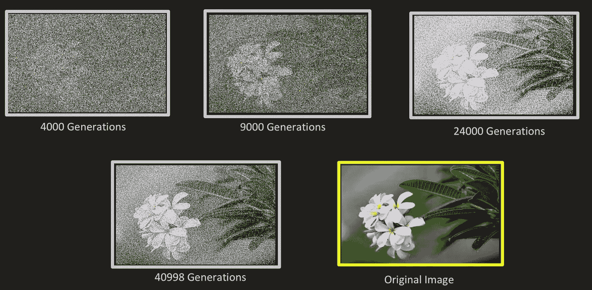

# 最优化遗传“学习”算法指南

> 原文：<https://towardsdatascience.com/a-guide-to-genetic-learning-algorithms-for-optimization-e1067cdc77e7?source=collection_archive---------21----------------------->

## 利用强化学习和遗传算法重建图像

从更广泛的数学或计算角度来看，优化问题被定义为从所有可行解中寻找最佳解的问题。在机器学习和人工智能方面，执行这些任务的两个重要算法是强化学习和遗传算法。它们的目的是为给定的问题陈述从一系列可能的解决方案中找到“最佳”的解决方案。在下面的文章中，我们将密切关注这些算法，并将看到它们在图像处理问题上的实际应用。



重复的基因突变和递归形成了遗传算法的基础|图片由[数码艺术家](https://pixabay.com/users/thedigitalartist-202249/)在 [Pixabay](https://pixabay.com/illustrations/fractal-recursive-geometry-dynamic-1119594/) 上制作

## 什么是遗传算法？

遗传算法是随机的、自适应的启发式搜索算法，作用于可行解的群体。他们需要宽松支持的群体生物学和选择机制。

> **遗传算法是基于自然选择和遗传学的思想。新的解决方案通常是通过“变异”这个群体的成员，并通过“匹配”2 个解决方案来创建替代解决方案。**

上层的解决方案被选择来繁殖和改变，因此更严重的被丢弃。它们是概率搜索方法；这意味着他们探索的状态并不完全由问题的性质决定。随机方法有助于引导搜索。遗传算法被用在人工智能中，就像不同的搜索算法被用在人工智能中一样——寻找潜在的解决方案来找出解决问题的方案。

## 什么是强化学习？



强化学习算法的运行机制|作者图片

强化学习通常被认为是一种目标驱动和高度自适应的机器学习技术。它由两个基本要素组成:状态和行动。

> **算法的策略是在某个状态下执行一个动作。学习者必须不断探索以产生最佳策略。**

强化学习在算法实现上不同于监督学习和非监督学习，因为它将学习视为主体与其环境之间通过探索和评估进行交互的过程。上图简单展示了操作是如何执行的。代理首先感知当前的环境状态，并基于此选择要应用的动作。一旦环境接受了这个更新的动作，状态就会改变，代理就会得到奖励。根据环境的新的和发展的状态，代理继续选择更新的动作，并且这被递归地重复，直到它达到终止状态。

## 强化学习与遗传算法的融合

遗传算法是一种通用的启发式搜索方法，旨在找到问题的最优解。为了在遗传算法中收敛和使用强化逻辑，在遗传算法的适应度函数中增加了一个控制结构，它可以动态地调整种群的多样性。强化学习的目标是通过调整策略来最大化累积的回报，而遗传算法的目标是执行变异，直到期望的函数适应度最大化。

> 将强化学习机制引入遗传算法的交叉和变异操作，以确定将导致最佳可能优化的交叉片段和变异点。



作者将强化学习(RL)层添加到遗传算法(GA)图像中

## 遗传算法是如何工作的？

GA(s)通过对给定问题的可能解决方案进行汇集来发挥作用。所有的可能性然后经历一系列的重组和突变(类似于我们在自然遗传学中看到的)。然后，它们生育后代，这个过程会重复好几代。一代人中的每个孩子都被赋予一个适应值。该适应值基于 GA 试图解决的目标，并且产生更高适应值的代被给予机会来交配并产生甚至更适合的个体。这一直持续到达到停止标准(退出功能)。GAs 是达尔文适者生存理论的一个伟大实现。

遗传算法结构被极大地随机化，并且这种实现的性质为优化图像处理算法提供了极大的激励。与所有其他搜索算法相比，GAs 在局部搜索中的表现要好得多(考虑到它们处理历史数据的属性),并且由于图像是复杂的基于矢量的环境的一部分，这种优化的搜索方式允许更好的处理，从而更快地执行计算机视觉任务。以下是遗传算法工作的步骤和阶段。这些步骤通常是连续的，根据算法的准确性，有些步骤可能是重复的。

## 实现遗传算法来重建图像

*   **第一步:**读取输入，第一步是随机生成一个可能的解，不考虑其准确性。
*   **步骤 2:** 初始解被赋予一个适应值。该适合度值保持为所有下一代解决方案的可比值。
*   **第三步:**对选择的解进行变异和交叉操作，然后进行重组。从这个解的组合中，提取最佳适应值。
*   **步骤 4:** 这个新产生的最佳适应度解的后代被插入到最初给我们第一个可能解的群体中。这两种解决方案然后被交叉和变异。它们的变异输出被检查其适合度值。
*   **步骤 5:** 如果这个新的解满足停止条件，则停止变异，并将其选为主解，否则步骤 4 继续进行更多的变异和交叉，直到满足基于停止条件的最佳拟合解。



常规图像处理工作流程|作者提供的图像

1.  **将图像转换成一维矢量**

大多数图像处理算法的第一步是将图像文件格式转换为数字数组，因为机器对数字执行操作。我们对输入图像做同样的处理，并将其转换为矢量。

```
def image_to_vector(img_array):
     return numpy.reshape(a=img_array, newshape =              (functools.reduce (operator.mul, img_array.shape)))
```

**2。将一维向量转换为数组**

在转换的矢量上，我们标准化矢量的形状以创建定义的图像大小。

```
def vector_to_array(input_vector, shape):
   *#Checking whether reshaping is possible* if len(input_vector) != functools.reduce(operator.mul, shape):
      raise ValueError("Reshaping failed")
   return numpy.reshape(a=input_vector, newshape=shape)
```

**3。定义适应度函数**

简单定义的适应度函数是一个递归函数，它将群体的候选解作为输入，并产生一个输出，说明该解相对于所考虑的群体是如何“适合”的，或者换句话说，是如何“有效优化”的。

理想的适应度函数应该具有以下特征:

> `计算起来应该相当快，因为在得到一个解之前，函数要进行多次(数千次)迭代。
> 
> 它必须定量地测量解决方案的适合度或确定如何从给定的解决方案中产生适合的个体。

```
image_encode = image_to_vector(input_image)def fitness_func(int_one, int_two):
     fitness_value = numpy.sum(numpy.abs(image_encode-int_one))
     fitness_value = numpy.sum(image_encode) - fitness_value
     return fitness_value
```

**4。定义回调函数**

对群体的每一代及其突变执行回调函数。这个函数的参数是 GA 算法本身、到目前为止已处理的评估数以及当前的群体大小。

```
def callback_func(genetic_var):
    if genetic_var.generations_completed % 500 == 0:
    matplotlib.pyplot.imsave( 'Final_GA_Image_ ' + str(   genetic_var.generations_completed )+'.png', vector_to_array(genetic_var.best_solution()[0], input_image.shape))
```

**5。用所有参数初始化遗传算法类**

正如在 [PyGAD 文档](https://pygad.readthedocs.io/en/latest/)中所解释的，遗传算法初始化会接受多个用于其构建的参数。使用上面定义的适应性和回调函数。指定了需要迭代的群体数量(这些数量可以根据输入的复杂性而增加)。重要的是，还定义了世代数和父母交配数，这有助于算法构建后续的子群体。最后，从上面提到的文档中，有许多突变类型可供选择(在这个例子中，我们选择了“随机”)

```
# Initiate the Genetic Algorithm class with the given parameters
# Number of Parent Solutions to consider
genetic_var = pygad.GA(num_generations=40999, num_parents_mating=12,# Choosing which fitness function to use
fitness_func=fitness_func,# Lower scale entry point (Should be integer between 0-1)
init_range_low=0,# Higher scale exit point (Should be integer between 0-1)
init_range_high=1, # Number of populations to work through
sol_per_pop=44,# Number of genes to use
num_genes=input_image.size,        
mutation_by_replacement=True,# % of genes from the population that need to be mutated
mutation_percent_genes=0.02, # Type of mutation
mutation_type="random", callback_generation=callback_func,
random_mutation_min_val=0,# Mutation minimum and maximum values (range 0-1)
random_mutation_max_val=1)
```

**6。运行遗传算法并找到最佳解决方案**

run()函数启动遗传算法，最终 best_solution()属性为我们提供了重建图像的最佳输出。

```
*# Run the GA instance* genetic_var.run()*# Metrics of the best solution* int_one, result_fit, int_two = genetic_var.best_solution()
```

## 输出

这些是输入图像和重建图像(并排)。该输出是在初始群体的 40998 代之后产生的。所有生成和结果输出都在下面链接的存储库中。我们看到，经过多代处理后，图像逐渐接近原始输入图像。



有关使用 Python 实现遗传算法代码的详细信息，请参考下面提到的知识库。往复运动图像或其他对象所需的代数高度依赖于输入的性质及其复杂性。因此，创建一个能够非常快速地评估群体的适应度函数非常重要。

[](https://github.com/rjrahul24/ga-reinforcement-learning-image-restoration) [## rjrahul 24/ga-强化-学习-图像-恢复

### 一个使用遗传算法和强化学习机制实现图像恢复和重建的项目…

github.com](https://github.com/rjrahul24/ga-reinforcement-learning-image-restoration) 

我们今天看到的大多数机器人应用程序都是使用 GAs 构建的|照片由 [Sebastian Kurpiel](https://unsplash.com/@sebbykurps?utm_source=medium&utm_medium=referral) 在 [Unsplash](https://unsplash.com?utm_source=medium&utm_medium=referral) 上发布

## 为什么要使用遗传算法？

*   气体在它们应用中是固有稳定的。
*   这些算法能够在非常大的问题空间上提供优化。
*   与传统的人工智能解决方案不同，GAs 不会因为给定输入的轻微变化或数据中存在噪声而中断。

## 结论

遗传算法通常用于生成优化和随机搜索问题的高质量解决方案。它们的应用依赖于生物启发算子，如突变、交叉和选择。今天，气体被应用于多种多样的行业，从制造创造性的机器人到卫星通讯调度，T2(由美国国家航空航天局实施)，T3。这篇文章旨在提供一个增强的教程，说明如何使用气体来重建图像。这是机器人科学的主要应用之一，其中人工机器可以学习人类的视觉。如参考文献[7]中所述，可以遵循其他几个教程来学习 GAs 的深入应用。

## 关于我

我是纽约哥伦比亚大学的一名软件工程师兼数据科学研究员，目前正在研究如何减少气候变化对世界贫困人口的影响。这些人受我们砍伐树木和在地球表面推混凝土的行为影响最大。如果你的研究或工作抱负也与我一致，请务必通过 [Twitter](https://twitter.com/rjrahul24) 或 [LinkedIn](https://www.linkedin.com/in/rjrahul24/) 与我联系，我们可以一起努力建设 ***负责任的人工智能。***

## [参考文献]

1.  [https://arxiv.org/pdf/1905.04100.pdf](https://arxiv.org/pdf/1905.04100.pdf)
2.  [https://www . science direct . com/science/article/ABS/pii/s 0957417408006064](https://www.sciencedirect.com/science/article/abs/pii/S0957417408006064)
3.  [https://www.hindawi.com/journals/mpe/2020/1698323/](https://www.hindawi.com/journals/mpe/2020/1698323/)
4.  [https://pygad.readthedocs.io/en/latest/](https://pygad.readthedocs.io/en/latest/)
5.  [https://www.staracle.com/general/evolutionaryAlgorithms.php](https://www.staracle.com/general/evolutionaryAlgorithms.php)
6.  [https://en . Wikipedia . org/wiki/List _ of _ genetic _ algorithm _ applications](https://en.wikipedia.org/wiki/List_of_genetic_algorithm_applications)
7.  [https://en.wikipedia.org/w/index.php?title =遗传 _ 算法&action =编辑& section=32](https://en.wikipedia.org/w/index.php?title=Genetic_algorithm&action=edit&section=32)