# 面板数据回归指南:理论与 Python 实现。

> 原文：<https://towardsdatascience.com/a-guide-to-panel-data-regression-theoretics-and-implementation-with-python-4c84c5055cf8?source=collection_archive---------0----------------------->

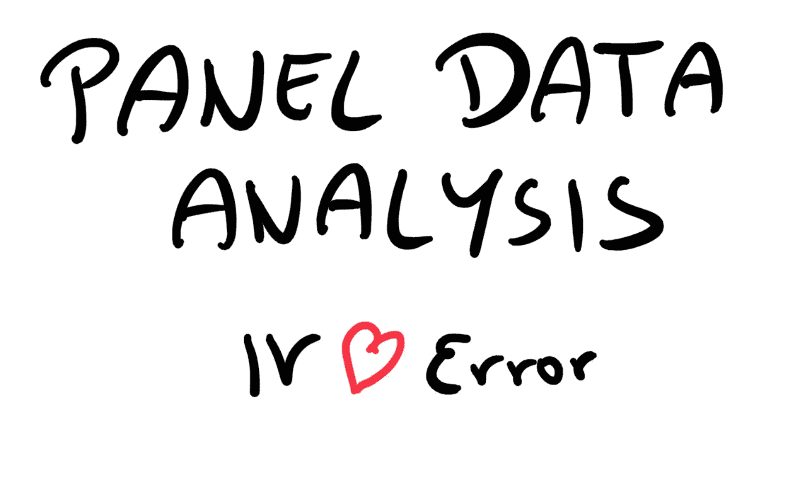

作者图片

## [入门](https://towardsdatascience.com/tagged/getting-started)

面板数据回归是控制未观察到的独立变量对因变量的依赖性的一种强有力的方法，它会导致传统线性回归模型中的有偏估计量。在本文中，我想分享这个主题背后最重要的理论，以及如何一步一步地用 Python 构建面板数据回归模型。

我写这篇文章的意图是双重的:首先，在我看来，很难找到一个简单易懂的综合面板数据回归模型的解释。其次，在 Python 中执行面板数据回归不像在 R 中那样简单，这并不意味着它的效率更低。因此，我决定分享我在最近的一个项目中获得的知识，以便使未来的面板数据分析可能更容易一些；-)

说够了！让我们深入主题，描述什么是面板数据，为什么它如此强大！

**什么是面板数据？**

> “面板数据是一个二维的概念，其中相同的个体在不同的时间段被重复观察。”

一般来说，面板数据可以被视为横截面和时间序列数据的组合。横截面数据被描述为在特定时间点对多个对象和相应变量的一次观察(即一次观察)。时间序列数据只在一段时间内重复观察一个对象。面板数据通过随时间从多个相同的对象收集数据，将两者的特征包含到一个模型中。

简而言之，我们可以把它想象成一条时间线，在这条时间线上，我们**周期性地观察同一个个体****。**

**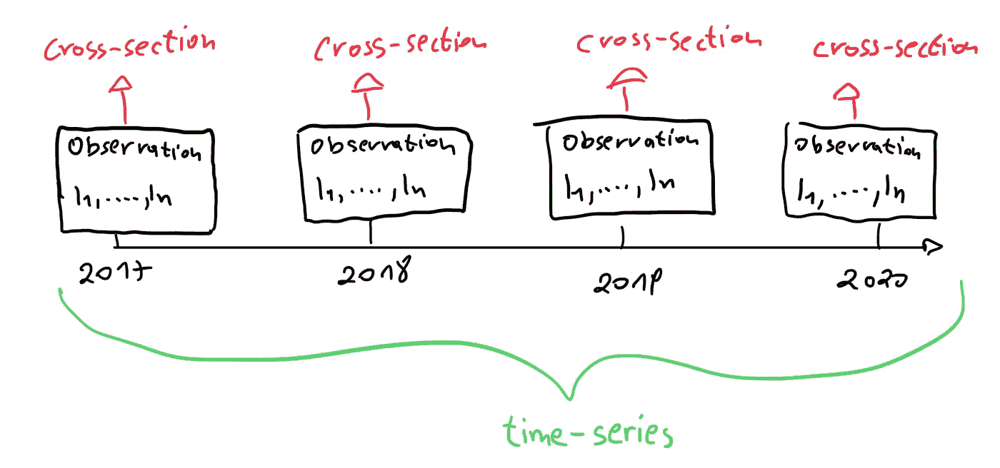**

**面板数据设计图解**

**让我们进一步分解上面的定义，并在一个样本面板数据集上逐步解释它:**

**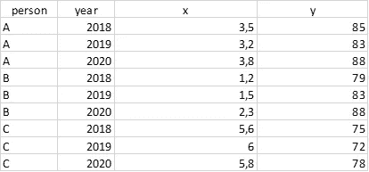**

**样本面板数据集**

*****“面板数据是一个二维概念[…]”****:*面板数据一般以行列二维方式存储(我们有一个 9 行 4 列的数据集)。值得注意的是，我们总是需要一栏来标识被观察的个人(栏 *person* )和一栏来记录数据收集的时间点(栏 *year* )。这两列应该被视为多索引。**

*****“[……]其中相同的个体[…]”****:*我们有个体*人 A、人 B 和人 C，*，我们从这些个体中收集变量 *x* 和 *y* 。个体和观察到的变量将永远保持不变。**

**注意:这种预先性也是与另一个经常混淆的数据概念的主要区别，即**汇集横截面**。虽然两者都可以被看作是一段时间内汇总的横截面数据，但主要的区别是面板数据总是观察相同的个体，而这在混合横截面中无法得到证明。**

***汇集横截面示例:***

**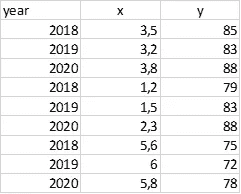**

**汇总的横截面数据**

*****”[……]*在不同的时间段反复观察。****:*我们从 *2018、2019、2020* 收集数据。***

***到目前为止一切顺利…现在我们明白什么是面板数据了。但是这个数据概念背后的含义是什么，我们为什么要使用它？？？***

***答案是…**异质性和由此产生的内生性！**也许你已经听说过传统线性回归模型中的这个问题，在这种模型中，异质性经常导致有偏差的结果。面板数据能够解决这个问题。***

***由于异质性和内生性对于理解我们为什么使用面板数据模型至关重要，我将在下一节中尝试简单地解释这个问题。***

*****未观察到的异质性导致的内生性问题*****

> ***“其他自变量的未观察到的相关性称为**未观察到的异质性**，自变量与误差项(即未观察到的自变量)之间的相关性称为**内生性**。”***

***比方说，我们想分析饮用咖啡如何影响注意力水平的关系。简单的线性回归模型如下所示:***

******

***简单线性回归***

***其中:***

*   ****Concentration_Level 是*因变量(DV)***
*   ****β0* 是截距***
*   ****β1* 为回归系数***
*   ****咖啡 _ 消费*是自变量(四)***
*   ***ɛ是错误的术语***

***然而，该模型的目标是探索*咖啡 _ 消耗量* (IV)与*浓度 _ 水平* (DV)之间的关系。假设 IV 和 DV 正相关，这意味着如果 IV 增加，DV 也会增加。让我们把这个事实加到我们的公式中:***

***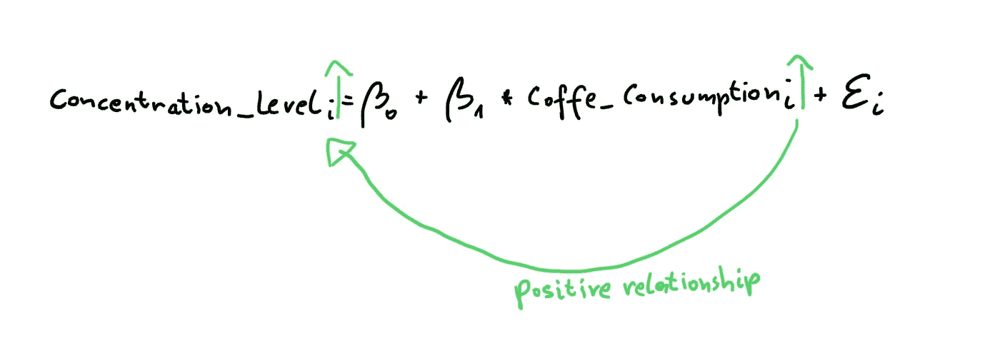***

***静脉注射与家庭暴力的关系***

***但是，如果有另一个变量会影响现有的 IV，并且没有包含在模型中，该怎么办呢？比如*疲倦*有很大几率影响*咖啡 _ 消费*(如果你很累，你明显会喝咖啡；-) ).如果你还记得本文的第一句话，这种变量被称为不可观测的独立变量。它们“隐藏”在误差项之后，例如，如果 *Coffee_Consumption* 与这样的变量正相关，误差项将随着 *Coffee_Consumption* 的增加而增加:***

***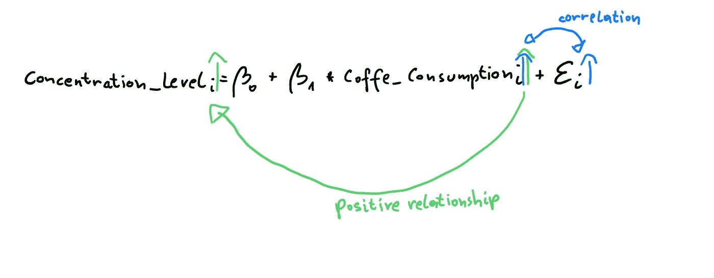***

***IV 与误差项的相关性***

***这又会导致 DV *浓度水平*的估计值过度增加。因此，估计的 DV 是有偏差的，并且将导致不准确的推断。在我们的例子中，偏差将是*浓度水平的红色过度增加。****

***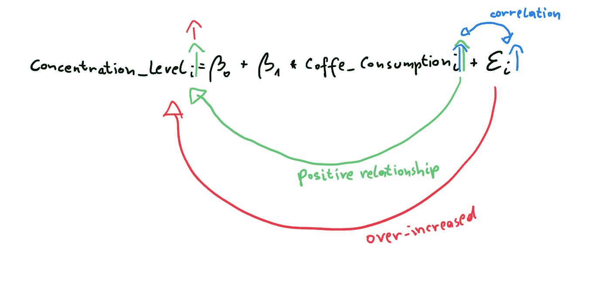***

***异质性导致的有偏估计量***

***幸运的是，有一种方法可以处理这个问题……也许你已经猜到了，**面板数据回归！**面板数据的优势在于，我们可以通过将异质性确认为**固定**或**随机**来控制回归模型中的**异质性**。但是在下一节中会有更多的介绍！***

*****面板数据回归的类型*****

***以下解释基于这种符号:***

***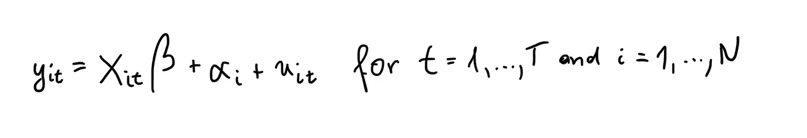***

***注释***

***其中:***

*   ***y = DV***
*   ***X = IV(s)***
*   ***β =系数***
*   ***α =个体效应***
*   ***μ =特殊误差***

***基本上，面板数据有三种回归类型:***

*****1) *联营:*** *联营*可以描述为对面板数据执行的简单 OLS(普通最小二乘)模型。它忽略了时间和个体特征，只关注个体之间的依赖**。然而，简单 OLS 要求未观察到的独立变量和 IVs 之间没有相关性(即外生性)。让我们把它写下来:*****

*****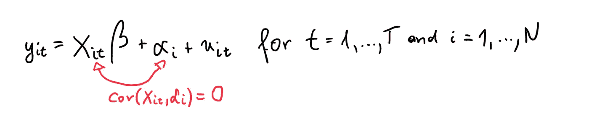*****

*****外来性假设*****

*****关于*pool dols*的问题是，即使上述假设成立， *alpha* 也可能随着时间的推移而具有序列相关性。因此，*pool dols*大多不适合面板数据。*****

*****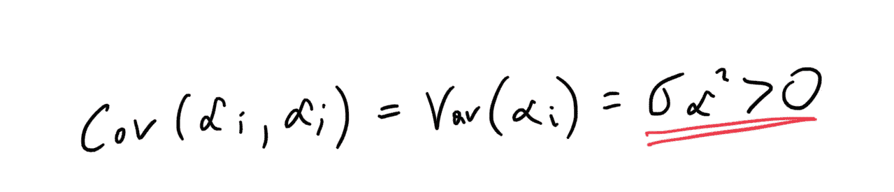*****

*****α之间的序列相关性*****

*****注意:为了解决这个问题，有另一个回归模型叫做 *FGLS* (可行广义最小二乘法)，它也用于下面描述的随机效应模型。*****

*******2) *固定效应(FE)模型:***FE 模型将未观察到的独立变量的个别效应确定为一段时间内的常数(“固定”)。在有限元模型中，未观察到的独立变量和 IVs(即内生性)之间可能存在关系:*****

*****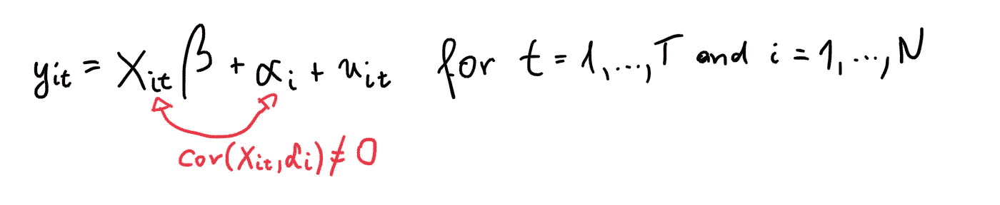*****

*****允许内生性*****

*****有限元模型的诀窍在于，如果我们假设*α*为常数，并从每个方程项中减去平均值，*α*(即未观察到的异质性)将为零，因此可以忽略不计:*****

*****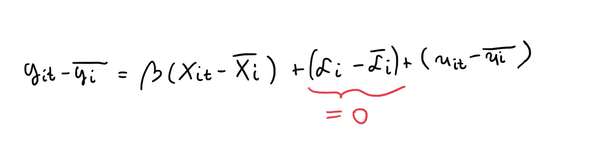*****

*****消除有限元模型中的个体效应*****

*****单独来说，特质误差(由 *my =* 未观察到的随时间和单位变化的因素表示)仍然存在，并且必须是外来的和非共线的。*****

*****然而，因为异质性是可以控制的，这个模型允许异质性存在于模型中。不幸的是，由于个体效应是固定的，依赖关系只能在个体内部观察到。*****

******注:*FE 模型的另一种选择是 *LSDV* 模型(最小二乘虚拟变量)，其中(固定)个体效应由虚拟变量表示。该模型将导致完全相同的结果，但有一个主要缺点，因为如果回归模型很大，它将需要更多的计算能力。*****

*******3) *随机效应(RE)模型:*** RE 模型将未观察到的独立变量的个体效应确定为一段时间内的随机变量。他们能够在 OLS 和 FE 之间“切换”,因此可以关注两者，依赖于和**之间的**和**个体**内的**。重新建模背后的想法如下:*******

***比方说，我们有与上面相同的符号:***

******

***注释***

***为了包括估计量之间以及估计量之内，我们首先需要定义何时使用哪种估计量。通常，如果 *alpha* 和 *IV(s)* 之间的协方差为零(或非常小)，则在它们之间没有相关性，并且 OLS 模型是优选的。如果协方差不为零，则应使用有限元模型消除以下关系:***

***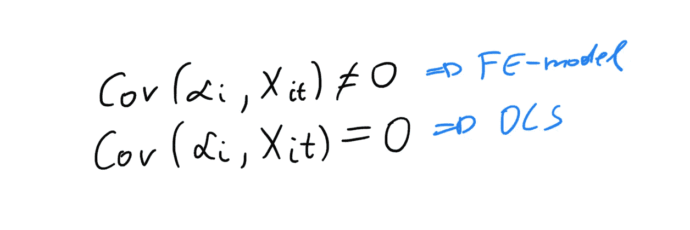***

***何时使用哪种型号？***

***如上所述，使用 OLS 的问题在于*α*随时间的序列相关性。因此，重新模型根据误差项的序列相关性来确定采用哪个模型。为此，该模型使用了术语*λ。*简而言之， *lambda* 计算 *alpha* 的方差有多大。如果它是零，那么就不会有 *alpha* 的方差，这反过来意味着 PooledOLS 是首选。另一方面，如果*α*的方差趋向于变得非常大，那么*λ*趋向于变为 1，因此消除*α*并采用 FE 模型可能是有意义的。***

***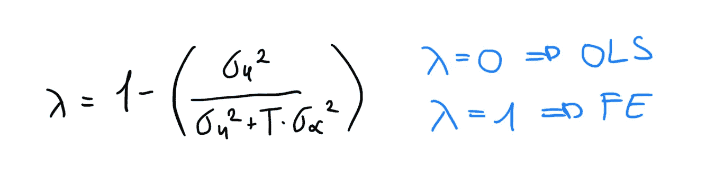***

***决策过程***

***现在我们知道了常见的模型，我们如何决定采用哪种模型呢？让我们看看那个…***

*****如何决定哪个型号合适？*****

****在 PooledOLS 和 FE/RE 之间选择:*基本上，简单线性回归模型有五个必须满足的假设。其中两个可以帮助我们在 PooledOLS 和 FE/RE 之间进行选择。***

***这些假设是(1)线性，(2)外生性，(3a)同伦方差和(3b)非自相关，(4)独立变量不是随机的和(5)没有多重共线性。***

***如果假设 **(2)** 或 **(3)** (或两者)被违反，那么 FE 或 re 可能更合适。***

****在 FE 和 RE 之间选择:*回答这个问题取决于你的假设，如果个体的、未被观察到的异质性是一个常数或随机效应。但是这个问题也可以通过豪斯曼测试来回答。***

*****豪斯曼检验:**简单来说，豪斯曼检验就是内生性的检验。通过运行 Hausman 测试，零假设是 IV(s)和 *alpha* 之间的协方差为零。如果是这种情况，那么 RE 优于 FE。如果零假设不成立，我们必须使用有限元模型。***

***所以，我们现在理解了面板数据回归背后的理论。让我们进入有趣的部分，一步一步地用 Python 构建模型:***

*****用 Python 实现面板数据模型*****

******第一步:*** ***导入数据集并转换成正确的格式。******

***我将使用“Guns.csv”数据集，它通常在 r 中提供。如该数据集的描述中所述:“Guns 是 1977 年至 1999 年美国 50 个州以及哥伦比亚特区(总共 51 个州)的平衡数据面板。”(注意:如果数据集中没有缺失值，面板数据集称为“平衡的”，否则称为“不平衡的”)。***

***为了简单起见，我将只使用数据集提供的以下列:***

*   ****状态:*这一栏代表我们被观察的个体。***
*   ****年:*年一栏记录了我们定期收集的数据(1977-1999 年之间)。***
*   ****收入:*收入是我们的 IV，表示为人均个人收入。***
*   ****暴力:*暴力是我们的家庭暴力，包括暴力犯罪率(事件/ 100，000 居民)。***

***我们的“研究”问题是: ***收入如何影响犯罪率？******

```
***# Import and preprocess data
import pandas as pddataset = pd.read_csv(‘Guns.csv’, usecols = [‘state’, ‘year’, ‘income’, ‘violent’],\
 index_col = [‘state’, ‘year’])years = dataset.index.get_level_values(‘year’).to_list()
dataset[‘year’] = pd.Categorical(years)***
```

******第二步:*** ***从池开始，检查所需的假设******

***我建议开始表演台球。因为它可以被看作是一个简单的 OLS 模型，它必须满足某些假设(那些在“如何决定哪个模型是合适的？”).如上所述，如果违反了条件 2 或 3(或两者都违反),那么有限元/重新建模可能更合适。由于条件 2 只能用豪斯曼测试进一步测试，我们现在将坚持证明条件 3。***

***执行池化:***

```
***# Perform PooledOLS
from linearmodels import PooledOLS
import statsmodels.api as smexog = sm.tools.tools.add_constant(dataset['income'])
endog = dataset['violent']
mod = PooledOLS(endog, exog)
pooledOLS_res = mod.fit(cov_type='clustered', cluster_entity=True)# Store values for checking homoskedasticity graphically
fittedvals_pooled_OLS = pooledOLS_res.predict().fitted_values
residuals_pooled_OLS = pooledOLS_res.resids***
```

***检查条件 3:***

***条件 3 分为 3a(同质性)和 3b(非自相关性)。这些假设可以通过许多不同的测试来检验。对于条件 3a，我将向您展示如何用图形识别异方差，以及如何执行*怀特测试*和*布鲁希-帕甘测试*(两者相似)。对于条件 3b，我将向你们展示*德宾-沃森测试*。***

```
***# 3A. Homoskedasticity
import matplotlib.pyplot as plt
 # 3A.1 Residuals-Plot for growing Variance Detection
fig, ax = plt.subplots()
ax.scatter(fittedvals_pooled_OLS, residuals_pooled_OLS, color = ‘blue’)
ax.axhline(0, color = 'r', ls = '--')
ax.set_xlabel(‘Predicted Values’, fontsize = 15)
ax.set_ylabel(‘Residuals’, fontsize = 15)
ax.set_title(‘Homoskedasticity Test’, fontsize = 30)
plt.show()***
```

***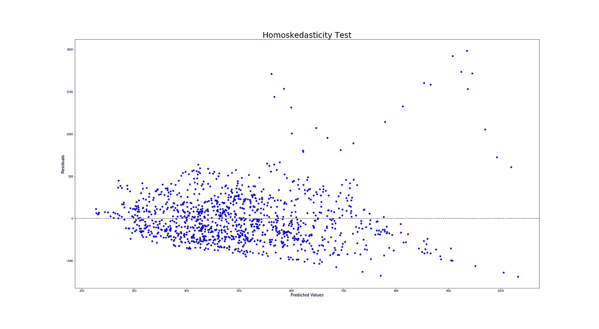***

***异方差的残差图***

***基本上，残差图代表预测值(x 轴)对残差(y 轴)。如果绘制的数据点展开，这是方差增长的指标，因此也是异方差的指标。因为这似乎是我们例子中的情况，我们可能有第一个违反。但是让我们用白人-和布鲁许-异教徒-测试来检验一下:***

```
***# 3A.2 White-Test
from statsmodels.stats.diagnostic import het_white, het_breuschpaganpooled_OLS_dataset = pd.concat([dataset, residuals_pooled_OLS], axis=1)
pooled_OLS_dataset = pooled_OLS_dataset.drop([‘year’], axis = 1).fillna(0)
exog = sm.tools.tools.add_constant(dataset['income']).fillna(0)white_test_results = het_white(pooled_OLS_dataset[‘residual’], exog)labels = [‘LM-Stat’, ‘LM p-val’, ‘F-Stat’, ‘F p-val’] 
print(dict(zip(labels, white_test_results)))# 3A.3 Breusch-Pagan-Test
breusch_pagan_test_results = het_breuschpagan(pooled_OLS_dataset[‘residual’], exog)
labels = [‘LM-Stat’, ‘LM p-val’, ‘F-Stat’, ‘F p-val’] 
print(dict(zip(labels, breusch_pagan_test_results)))***
```

***简单来说，如果 p < 0.05, then heteroskedasticity is indicated. Both tests give very small p-values (White-test: **3.442621728589391e-44** ，breus ch-Pagan-test:**6.03266972194746 e-26**。***

*****因此，我们已经证明了我们的第一次违规！**让我们执行假设 3b:***

```
***# 3.B Non-Autocorrelation
# Durbin-Watson-Test
from statsmodels.stats.stattools import durbin_watson

durbin_watson_test_results = durbin_watson(pooled_OLS_dataset[‘residual’]) 
print(durbin_watson_test_results)***
```

***德宾-沃森测试将有一个介于 0-4 之间的输出。平均值(= 2)表示没有发现自相关，0–2 表示正自相关(越接近零，相关性越高)，2–4 表示负自相关(越接近 4，相关性越高)。在我们的例子中，结果是 **0.08937264851640213** ，这清楚地表明强正自相关。***

*****因此，假设 3b 也被违反，因此，FE/RE 模型似乎更合适。*****

***因此，让我们建立模型！***

******第三步:*** ***执行 FE- and RE-model******

```
***# FE und RE model
from linearmodels import PanelOLS
from linearmodels import RandomEffectsexog = sm.tools.tools.add_constant(dataset['income'])
endog = dataset[‘violent’]
# random effects model
model_re = RandomEffects(endog, exog) 
re_res = model_re.fit() 
# fixed effects model
model_fe = PanelOLS(endog, exog, entity_effects = True) 
fe_res = model_fe.fit() 
#print results
print(re_res)
print(fe_res)***
```

***结果有限元模型:***

***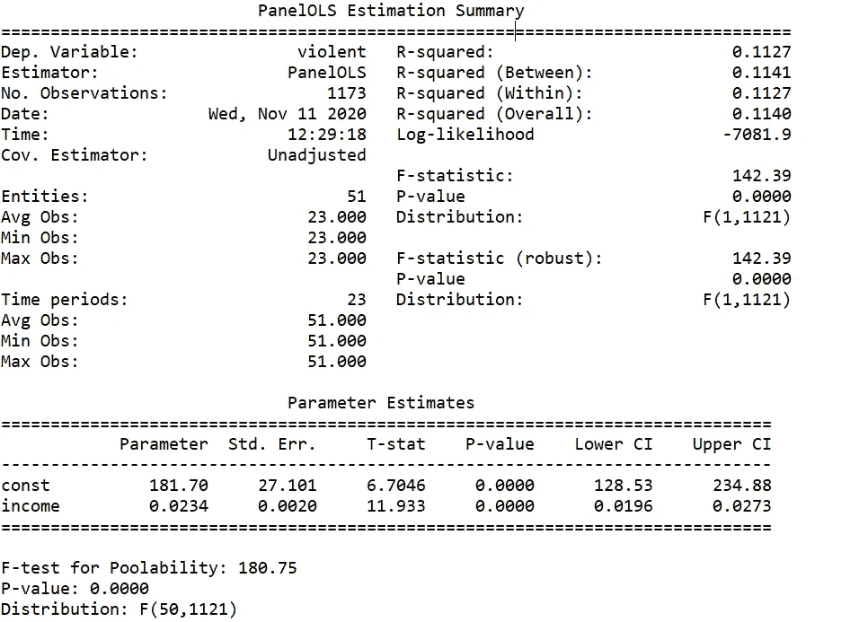***

***有限元模型结果***

***结果重新建模:***

***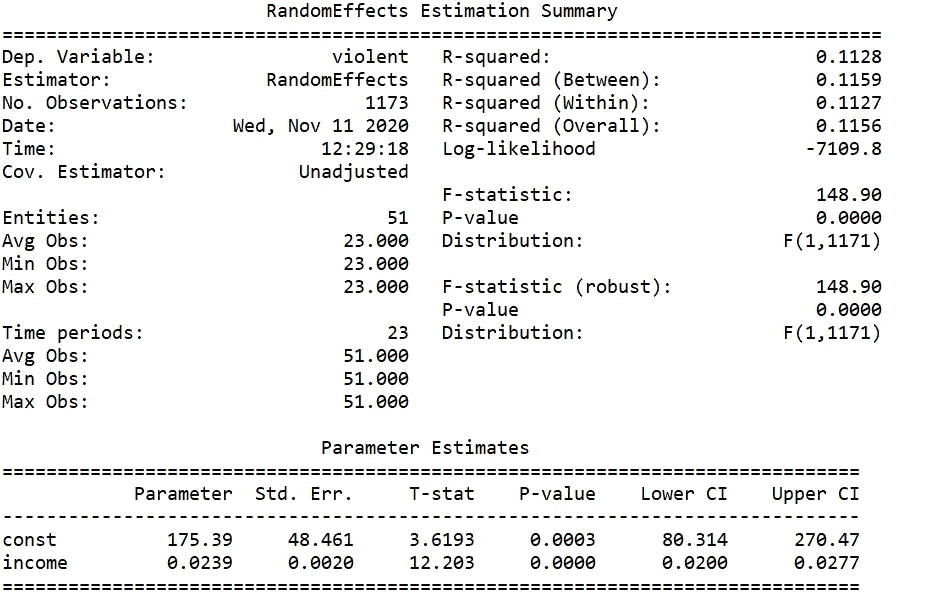***

***重新建模结果***

***在本例中，两者的表现相似(尽管 FE 的表现似乎略好)。因此，为了测试哪个模型应该是首选的，我们将最终执行豪斯曼测试。***

******第四步:*** ***执行豪斯曼测试******

***注意:因为我对 econtools 包中提供的 hausman 函数有问题(协方差不起作用)，所以我稍微修改了一下函数。所以，如果你遵循这个原则，欢迎你使用这个函数。***

```
***import numpy.linalg as la
from scipy import stats
import numpy as npdef hausman(fe, re):
 b = fe.params
 B = re.params
 v_b = fe.cov
 v_B = re.covdf = b[np.abs(b) < 1e8].sizechi2 = np.dot((b — B).T, la.inv(v_b — v_B).dot(b — B)) 

 pval = stats.chi2.sf(chi2, df)return chi2, df, pvalhausman_results = hausman(fe_res, re_res) 
print(‘chi-Squared: ‘ + str(hausman_results[0]))
print(‘degrees of freedom: ‘ + str(hausman_results[1]))
print(‘p-Value: ‘ + str(hausman_results[2]))***
```

***由于 p 值很小( **0.008976136961544689** )，可以拒绝零假设。因此，有限元模型似乎是最合适的，因为我们的模型显然具有内生性。***

***为了对内生性建模，我们现在可以执行像 2SLS (2 阶段最小二乘法)这样的回归模型，其中工具变量有助于处理内生性，但这是另一篇文章的内容；-)***

***我真的希望你喜欢这篇文章，它可以帮助你克服面板数据回归的常见问题。当然，请不要太挑剔，因为这是我在这个平台上的第一篇帖子:-)***