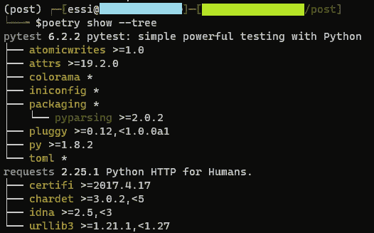

# Python 环境、依赖和包管理指南:Conda +诗歌

> 原文：<https://towardsdatascience.com/a-guide-to-python-environment-dependency-and-package-management-conda-poetry-f5a6c48d795?source=collection_archive---------23----------------------->

## 大蟒

## 如何将包自动添加到您的环境文件中，而不必担心依赖关系


**除非另有说明，所有使用的图片均为作者所有。*

如果您在不同的开发阶段处理多个 Python 项目，那么您的系统上可能会有不同的环境。有各种工具可以创建一个隔离的环境，并安装您的项目所需的库。这篇文章讨论了 Python 打包、环境和依赖管理系统的不同可用技术。然后，我们将检查一个理想的设置(当然，在我看来🙂)适合大多数使用 [conda](https://conda.io/) 和[poem](https://python-poetry.org/)的 Python 项目。

*在本文中，库和包这两个词可以互换使用，它们都指 Python 包。*

让我们首先列出不同的技术组，并强调几个工具

1.  **一个环境管理系统:**[*Virtualenv*](https://virtualenv.pypa.io/en/latest/)*、康达环境、* [*Pipenv*](https://github.com/pypa/pipenv)
2.  **包依赖解析器:** *conda，Pipenv，poem*
3.  **包库:** *PyPI，Anaconda 等。*

# 关于包存储库的快速说明

最流行的 Python 包存储库是 Python 包索引(PyPI)，这是许多 Python 库的公共存储库。您可以通过运行`pip install package_name`从 PyPI 安装软件包。Python 库也可以使用 conda 打包，conda 包的一个流行宿主是 Anaconda。您可以在 conda 环境中运行`conda install package_name`来安装 conda 包。

# 康达:百事通？

Pipenv 是为了解决 virtualenv 的许多缺点而创建的。但是，我不会将 virtualenv 和 Pipenv 视为环境管理者的主要原因是:

*   我想有安装康达软件包的灵活性。
*   与 conda 不同，virtualenv 和 Pipenv 都只是 Python 环境。

正如您在简介中可能注意到的，conda 管理环境、包和依赖项。不仅如此，它还是语言不可知的。此外，conda 还可以在活动的 conda 环境中使用 pip 来安装 PyPI 包。您可以通过运行以下命令来安装一个全新的 conda 环境

```
conda create -n env_name python=3.7
```

总是建议拥有一个包含您的库及其特定版本的环境文件。由于可移植性、可维护性和可再现性，这一点很重要。您可以使用以下命令从文件(例如，下面的 environment.yaml 文件)创建 conda 环境

```
conda env create -f environment.yaml
```

现在，你可能会说，太好了，conda 什么都做，所以，让我们在 conda 环境中使用 conda 包，让 conda 解决任何依赖问题。

# conda 的问题

我认为康达做得太多了。在使用 conda 几年后，这里是我对 conda 作为一个包和依赖管理的一些观察:

# 性能问题

我对 conda 的主要问题是它的性能问题。创建一个新的环境，甚至更新一个旧的环境，有时可能需要很长时间，尤其是当您有很多包的时候。这可能是因为 conda 试图解决依赖性。很少有超过 30 分钟的时候(是的，30 分钟，不是 30 秒！)营造环境。我最初认为有一个连接问题或连接到包存储库的问题。

# 依赖关系解析程序问题

Conda 甚至可能无法解决依赖性问题。由于我们看不到特定 conda 包的依赖性(不像 poem)，解决这些问题可能不容易。

# Python 打包

conda 的另一个问题是当你想为你的库构建一个 conda 包并发布它的时候。这不是小事(至少对我来说)，因为你需要几个配置文件(像 meta.yml，setup.py，*等*)。).你可能也有依赖问题。你可以在这里找到更多关于如何构建 conda 包[的信息。](https://docs.conda.io/projects/conda-build/en/latest/user-guide/tutorials/build-pkgs.html)

# 诗意

[诗词](https://python-poetry.org/)是 2018 年初步发布的 python 打包和依赖管理系统。它平滑地处理了依赖性，特别是如果您在一个新的环境中使用诗歌，然后添加您的 Python 包。它还可以以确定的方式处理项目的其他工具和配置，因为它使用 [TOML](https://toml.io/en/) 格式作为 Python 配置文件。简而言之，TOML 旨在使用易于阅读的最小配置文件。poem 使用`pyproject.toml`配置文件来安装 python 包并设置配置。

# pyproject.toml: Python 配置文件

`pyproject.toml` file 是在 [PEP518](https://www.python.org/dev/peps/pep-0518/) 中定义的一个新的 Python 配置文件，用于存储构建系统需求、依赖关系以及许多其他配置。在大多数情况下，您甚至可以替换`setup.cfg`和`setup.py`文件。您可以将大多数与特定 python 包相关的配置保存在一个`pyproject.toml`文件中，比如 pytest、coverage、bumpversion、Black code styling 等等。以前，你要么在单独的文件中编写这些配置，要么在其他配置文件中编写，比如`setup.cfg`。然而，`pyproject.toml`可以包含所有的需求，也可以包含所有的项目包需求。

# 提议的设置

我推荐使用 conda 作为环境管理器，pip 作为包安装器，poem 作为依赖管理器。在这种情况下，您可以获得 conda 环境中的所有 PyPI 包，在极少数情况下，您可以安装 conda 包。以下是使用诗歌和建议设置的一些好处:

*   更好的依赖性管理(通常比 conda 依赖性解析器更快)
*   具有大多数包配置(例如，pytest、coverage、bump2version、*等)。*)排成一列纵队。
*   必要时可以安装 conda 软件包(这应该是你最后的选择！)
*   诗可以自动添加新的包到`pyproject.toml`文件中。
*   诗歌可以显示单个包的库依赖列表。
*   构建 Python 包并发布到 PyPI 就像运行两个命令一样简单！
*   生产和开发环境不需要单独的环境文件。

# 步骤 1:创建一个最小的 conda 环境

您可以通过运行`conda env create -f environment.yaml`从下面的 YAML 文件中创建一个 conda 环境。这将创建一个拥有 Python 3.8 的全新 conda 环境。在 conda 环境中，您可以传递一个通道列表(顺序很重要),您可以从这些通道中安装您的软件包。除了 Anaconda Cloud 上的*默认*通道(由 [Anaconda](https://www.anaconda.com/) Inc .管理)之外，还有其他可以安装包的通道。一个受欢迎的渠道是 [conda-forge](https://conda-forge.org/) ，其中包括一个由社区主导的包集合。如果你有一个私人的康达频道，你可以写在频道部分。

# 第二步:安装诗歌工具

你可以按照他们的说明[在这里](https://python-poetry.org/docs/#installation)安装诗歌。对于 OSx、Linux 或 WSL (Windows 子系统 Linux)，推荐的方法是使用下面的命令安装 poem。

```
curl -sSL [https://raw.githubusercontent.com/python-poetry/poetry/master/get-poetry.py](https://raw.githubusercontent.com/python-poetry/poetry/master/get-poetry.py) | python -
```

注意:使用自定义安装程序的首选方法(下载 get-poem . py 脚本的第一种方法)安装诗歌将会安装与系统其余部分隔离的诗歌。

⚠️虽然不推荐，也有一个 pip 版本的诗歌，你可以安装(`pip install poetry`)。开发人员警告不要在文档中使用 pip 版本，因为它可能会导致与环境中的其他包发生冲突。但是，如果我们的环境基本上是空的(虽然在创建 conda 环境时有些基础包是像 pip 一样安装的)，那么通过`pip`安装大概就可以了！

# 第三步:配置你的诗歌

要为一个新项目配置诗歌，诗歌使得创建一个包含所有您想要的设置的配置文件变得非常容易。您可以通过简单地运行`poetry init`来交互式地创建一个`pyproject.toml`文件。这将提示一些关于您想要安装的 Python 包的问题。您可以按 Enter 键使用默认选项进行处理。


通过运行诗歌初始化进行交互式配置

正如你在上面的截图中看到的，你可以只为开发依赖添加一些包。为你的项目初始化诗歌将会创建一个`pyproject.toml`文件，它包含了我们在设置过程中定义的所有配置。我们有一个针对所有依赖项的主要部分(在生产和开发环境中都使用)，但我们也有一个部分包含主要用于开发目的的包，如 pytest、sphinx、*等*。这是相对于其他依赖管理工具的另一个优势。您的生产和开发环境只需要一个配置文件。

# 步骤 4:安装依赖项

一旦在一个`pyproject.toml`文件中有了您的依赖项和其他配置，您就可以通过简单地运行

```
poetry install
```

这将创建一个`poetry.lock`文件。这个文件基本上包含了所有包的精确版本，这些包用那些特定的版本锁定了项目。您需要提交`pyproject.toml`文件和`poetry.lock`文件。我强烈建议您不要手动更新 poetry.lock 文件。让诗歌发挥它的魔力吧！！

# 诗歌技巧

## 添加新包

如果您想在您的环境中添加(或删除)一个包，我强烈建议您使用下面的命令

```
poetry add package_name
```

这将*自动*将包名和版本添加到您的`pyproject.toml`文件中，并相应地更新`poetry.lock`。`poetry add`负责所有的依赖项，并将包添加到`[tool.poetry.dependencies]`部分。

如果您想将一个包添加到您的开发环境中，您可以简单地传递一个如下的`--dev`选项

```
poetry add package_name --dev
```

你可以指定一个包的特定版本，甚至可以通过 git+https 或者 git+ssh 来添加一个包(更多细节见[此处](https://python-poetry.org/docs/cli/#add))。

# 移除包

您可以按如下方式删除软件包

```
poetry remove package_to_remove
```

# 显示包依赖关系

如果您想查看环境中所有已安装软件包的列表，可以运行以下命令

```
poetry show
```

请注意，这也将显示包的依赖关系。有时查看 Python 包的依赖关系会很有帮助。幸运的是，您可以使用`poetry show`来做到这一点。例如，我们可以使用下面的命令来查看我们环境中的`requests`包的依赖列表

```
poetry show requests
```


项目中请求包的所有依赖项

更好的是，您只需运行

```
poetry show --tree
```



所有项目依赖关系的树

从上图中，您可以看到蓝色字体的包名(requests 和 pytest)被显式地添加到了`pyproject.toml`文件中。黄色的其他库是它们的依赖项，不需要在 toml 文件中。

注意:您可以使用`pip freeze` ( `pip freeze > requirements.txt`如果您想将结果输出到一个文件中)来输出您的环境中所有已安装的包，但是那将会非常混乱。

# 结论

在这篇文章中，我们讨论了不同的 Python 环境、包管理和依赖解析工具。然后，我们回顾了如何使用 conda 作为环境管理器和 poem 作为包管理器和依赖解析器的设置，以及在 Python 项目中使用这种组合的好处。

希望这篇文章对你有用。

感谢阅读！

[***订阅我的邮件列表***](https://www.ealizadeh.com/subscribe/)**如果你喜欢这个帖子。我喜欢写关于数据科学、机器学习、统计学以及有趣的 Python 库和技巧的文章。也可以关注我上* [*中*](https://medium.com/@ealizadeh) *，* [*领英*](https://www.linkedin.com/in/alizadehesmaeil/) *，或者* [*推特*](https://twitter.com/es_alizadeh) *。**

# *有用的链接*

 *[## 简介|文档|诗歌——Python 依赖管理和打包变得简单。

### 诗歌是 Python 中进行依赖管理和打包的工具。它允许您将库声明为您的项目…

python-poetry.org](https://python-poetry.org/docs/)* *[](https://github.com/carlosperate/awesome-pyproject) [## carlosperate/awesome-pyproject

### pyproject.toml 是 PEP 518 中定义的一个新的配置文件。它是为存储构建系统需求而设计的，但是它…

github.com](https://github.com/carlosperate/awesome-pyproject) [](/a-guide-to-conda-environments-bc6180fc533) [## 康达环境权威指南

### 如何使用 conda for Python & R 管理环境

towardsdatascience.com](/a-guide-to-conda-environments-bc6180fc533) [](https://ahmed-nafies.medium.com/pip-pipenv-poetry-or-conda-7d2398adbac9) [## Pip，Pipenv，诗歌或康达

### 2020 年用哪个 python 包管理器？pip 的替代方案。

ahmed-nafies.medium.com](https://ahmed-nafies.medium.com/pip-pipenv-poetry-or-conda-7d2398adbac9) 

*原载于*[*https://www.ealizadeh.com*](https://www.ealizadeh.com/blog/guide-to-python-env-pkg-dependency-using-conda-poetry/)*。**