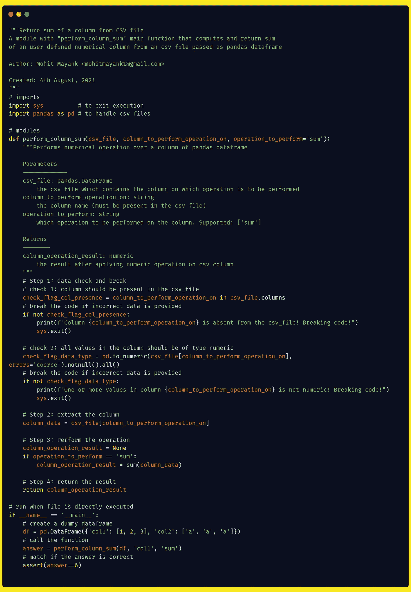
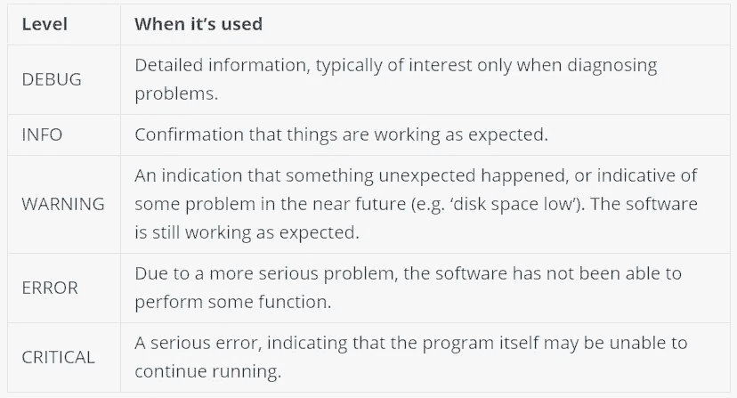

# Python 良好实践指南

> 原文：<https://towardsdatascience.com/a-guide-to-python-good-practices-90598529da35?source=collection_archive---------3----------------------->

## 回顾 Python 中的一些最佳实践，从项目结构到代码格式化，再到一些优秀的旧代码管理技巧


安德烈·卡斯塔哈在 [Unsplash](https://unsplash.com?utm_source=medium&utm_medium=referral) 上拍摄的照片

> 这篇文章是从我正在写的关于数据科学的书[“数据科学懒惰指南”](http://mohitmayank.com/a_lazy_data_science_guide/first_page.html)中的[章节](http://mohitmayank.com/a_lazy_data_science_guide/python/good_practices.html)中摘录的。阅读类似文章，参考[我的博客](https://mohitmayank.com/blog/)或[我的媒体页面](https://medium.com/@mohitmayank)。别忘了在 [LinkedIn](https://www.linkedin.com/in/imohitmayank/) 和/或 [Twitter](https://twitter.com/imohitmayank) 上问好。 *🖖*

# 介绍

编写现在有效的代码很容易。编写明天能工作的代码是困难的。编写明天就能工作的代码，并且足够直观，任何人都可以理解和遵循——现在我们已经碰到了超级困难的事情😀。通过观察和我一起工作的几位 ML 工程师和数据科学家，我注意到他们几乎都有自己独特的编码风格。嗯，不要误解我，主观上是一件好事，我认为这是导致创新的原因。也就是说，在团队中工作，甚至是在开源协作中，同意某些规则是有帮助的。这就是这篇文章背后的想法，为 python 实践者提供一套精选的指南，他们可以从中挑选。至此，让我们来看看一些好的实践，它们不仅能帮助我们创建一个工作的，而且是一段漂亮的代码😄。为了涵盖这个主题，我们将讨论三个部分，

1.  **项目结构化:**关于如何组织代码的想法
2.  代码格式:关于如何让你的代码易于理解的想法
3.  额外提示:一些对你有长远帮助的事情

# 项目结构

在这一部分中，我们将主要讨论如何构建完整的 python 项目的一些良好实践。为此，我们将着眼于两种不同的可能性，任何人都可以根据他们的项目的简单或复杂程度来选择。

## 类型 1:经典

*   这是最基本的格式，但也暗示了有组织的结构。当我们的项目仅由几个模块/脚本组成时，可以遵循这一点。示例项目的目录可能如下所示:

```
my_project             # Root directory of the project
├── code               # Source codes
├── input              # Input files
├── output             # Output files
├── config             # Configuration files
├── notebooks          # Project related Jupyter notebooks (for experimental code)
├── requirements.txt   # List of external package which are project dependency
└── README.md          # Project README
```

*   从名字可以明显看出，`code`文件夹包含各个模块(`.py`文件)，`input`和`output`分别包含输入和输出文件，`notebook`包含我们用于实验的`.ipynb`笔记本文件。最后，`config`文件夹可以包含`yaml`或`json`或`ini`文件中的参数，并且可以由代码模块文件使用【config parser】([config parser—配置文件解析器— Python 3.7.11 文档](https://docs.python.org/3.7/library/configparser.html))来访问。
*   `requirements.txt`包含项目需要的所有外部 python 包的列表。维护该文件的一个优点是所有这些包都可以使用`pip install -r requirements.txt`命令轻松安装。*(无需手动安装每个外部软件包！)*。一个例子`requirements.txt`文件如下图所示*(同* `*package_name==package_version*` *格式)*，

```
BeautifulSoup==3.2.0
Django==1.3
Fabric==1.2.0
Jinja2==2.5.5
PyYAML==3.09
Pygments==1.4
```

*   最后，`README.MD`包含了项目的内容、原因和方式，以及一些关于如何运行项目的伪代码和示例用例。

## 类型 2:凯德罗

*   Kedro 不是一个项目结构化策略，它是一个由 QuantumBlack Labs 发布的 python 工具，为你做项目结构化😎。最重要的是，它们提供了大量的功能，使我们的项目组织甚至代码执行过程变得超级简单，这样我们就可以真正专注于最重要的事情——实验和实现！
*   他们的项目结构如下所示。还有 btw，我们可以通过运行`kedro new`命令*创建一个空白项目(不要忘了先通过* `*pip install kedro*` *)* 安装 kedro)

```
get-started         # Parent directory of the template
├── conf            # Project configuration files
├── data            # Local project data (not committed to version control)
├── docs            # Project documentation
├── logs            # Project output logs (not committed to version control)
├── notebooks       # Project related Jupyter notebooks (can be used for experimental code before moving the code to src)
├── README.md       # Project README
├── setup.cfg       # Configuration options for `pytest` when doing `kedro test` and for the `isort` utility when doing `kedro lint`
└── src             # Project source code
```

*   虽然大多数目录与其他类型相似，但有几点需要注意。Kedro 对不同模块进行分组的方式是创建不同的“管道”。这些管道存在于 `*src*` *文件夹中，该文件夹又包含模块文件。此外，它们对执行的单个功能进行了明确的分离——这些功能存储在* `*nodes.py*` *文件中，这些功能随后与* `*pipeline.py*` *文件*(全部在单个管道文件夹中)*中的输入和输出相连接。Kedro 还通过将参数存储在`conf`文件夹中来分离代码和参数。
*   除了帮助组织项目之外，它们还提供了顺序或并行执行的选项。我们可以执行单独的功能*(在* `*nodes.py*` *)* ，或者单独的管道*(是功能的组合)*，或者一次完成整个项目。我们还可以创建完整项目的 doc，或者将项目编译并打包为 python `.whl`文件，只需运行一个命令。要了解更多细节，请相信我，我们只是触及了表面，请参考他们的官方文档。

# 代码格式

*   采用自顶向下的方法，让我们先来看看一段*整洁的*代码。我们将在后面更详细地讨论代码的各个方面。现在，假设有人让你写一些脚本，那么一段理想的代码文件应该是什么样子。
*   以下代码摘自`csv_column_operations.py`模块文件。它是为提示生成的:*“编写一个以 CSV 文件为输入并返回一列之和的函数”*。



```
Some might argue why do such an overkill for a simple piece of code. Note, it's a dummy example. In real life, you will develop more complex pieces of codes and hence it become quite important that we understand the gist.
```

*   现在让我们更深入地研究上面代码的各个方面。

## 模块结构

*   模块是扩展名为`.py`的 python 文件，包含可执行代码或函数或类等。
*   通常，我们从模块定义开始模块，这是我们提供模块的一些基本细节的区域。我们可以使用下面的模板*(很容易与上面显示的真实代码进行比较)*

```
"""<Short description><Long description>Author: <Name> <email>Created: <date>
"""
```

*   接下来，我们应该使用注释行清楚地隔离模块的各个部分，如导入、代码区等。
*   最后，在底部，我们可以包括一些关于如何运行代码的例子。将这些脚本包含在`if __name__ == '__main__':`中确保它们只在文件被直接执行时运行*(像* `*python csv_column_operations.py*` *)* 。因此，当您说在另一个脚本中导入模块时，这些代码段不会运行。

## 功能结构

*   函数是执行特定任务的基本代码块。一个模块由几个函数组成。为了告诉用户一个特定的代码块做什么，我们用一个函数定义来开始这个函数。下面提供了一个样本模板，

```
"""DescriptionParamters
---------
<parameter_1>: <data_type>
    <parameter_1_description>Returns
---------
<output_1>: <data_type>
    <output_1_description>
"""
```

*   在此之后，我们可以开始添加相关的代码行。确保使用注释来分隔函数中不同的逻辑代码块。
*   在编码部分的开始要处理的一件重要事情是检查参数和输入数据，以获得一些数据类型或数据内容相关的基本问题。大多数代码中断都是由于愚蠢的错误造成的，比如有人提供了错误的输入，在这种情况下，我们应该打印或记录警告消息，然后优雅地退出。上面相同的代码在步骤 1 部分包含两个这样的初步但重要的检查。

## 命名约定

我们可以遵循几个格式约定，比如[骆驼案](https://en.wikipedia.org/wiki/Camel_case)、[蛇案](https://en.wikipedia.org/wiki/Snake_case)等。挺主观的，看开发商。下面是一些命名 python 代码不同实体的例子*(取自 PIP8 惯例——有一些修改)*😇,

*   **模块名:**模块应该有简短的、全小写的名字(例如:`csv_column_operations.py`)
*   **函数或方法名:**函数名应该是小写的，单词之间用下划线分隔，以提高可读性。另外，不要忘记添加动词！(例:`perform_column_sum()`)
*   **变量名:**类似于函数名，但没有动词！(例如:`list_of_news`)
*   **类名:**类名通常应该使用 CapWords 约定。(例:`FindMax`)
*   **常量名称:**常量通常在模块级定义，全部用大写字母书写，用下划线分隔单词。(例:`MAX_OVERFLOW`和`TOTAL`)。

## 添加评论

PEP-8 定义了三种类型的注释，

*   **块注释:**这是为单个或一组代码行编写的。当你想解释一组代码行或者只是想分离代码时，这是可以做到的。在上面的例子中，你可以看到`# Step {1, 2, 3}`被用作隔离注释，而`# run when file is directly executed`被用于解释一组代码行。
*   **行内注释:**与代码添加在同一行。例如，看看`# to handle csv files`是如何被用来证明熊猫包装进口的。PEP-8 建议谨慎使用行内注释。
*   **文档字符串:**用于模块、函数或类的文档。PEP-257 建议对 docstring *使用多行注释(使用" ")*。上面的示例代码中提供了一个模块和函数文档字符串*(文档字符串的缩写)*的示例。

我们应该在评论中尽可能地描述。尝试将代码的功能部分分开，为复杂的代码行提供解释，提供关于函数输入/输出的细节，等等。你怎么知道你有足够多的评论？—如果你觉得有你一半专业知识的人不用半夜给你打电话就能理解代码！😤

## 缩进—制表符与空格

*   坦白地说，我只打算用一根长棍子去碰这个话题，🧹.已经有几篇[文章](https://softwareengineering.stackexchange.com/questions/57/tabs-versus-spaces-what-is-the-proper-indentation-character-for-everything-in-e)、 [reddit 线程](https://www.reddit.com/r/learnpython/comments/8cann8/tabs_vs_spaces_i_dont_get_it/)甚至电视剧(硅谷📺)这个话题在哪里讨论了很多！
*   想要我的 2 美分吗？选择任何现代 IDE *(比如 VSCode，Sublime 等)*，设置缩进为制表符，设置 1 个制表符= 4 个空格。完成的😏

# 其他提示

到目前为止，我们已经讨论了如何构建项目或者格式化代码。接下来，我们将介绍一组通用的良好实践，它们将为您省去一些痛苦😬

## 记录

*   而不是在控制台中打印临时的语句(做一个`cls`然后噗的一声就没了💨)，更好的办法是将这些语句保存在一个单独的文件中，您可以随时回去参考。这是伐木📜
*   Python 提供了一个用于日志记录的内置函数。通过参考官方的[如何](https://docs.python.org/3.7/howto/logging.html)，记录到一个文件超级简单，

```
 # import
import logging
# config the logging behavior
logging.basicConfig(filename='example.log',level=logging.DEBUG)
# some sample log messages
logging.debug('This message should go to the log file')
logging.info('So should this')
logging.warning('And this, too')
```

*   请注意，日志有一个层次级别，以隔离不同严重性的日志。在上面的例子中，`level`参数表示被跟踪并保存到文件中的最低级别。根据官方的 [how to](https://docs.python.org/3.7/howto/logging.html) ，这些是不同的日志记录级别，以及关于何时使用哪个*(按严重性递增顺序)*的一些细节，



Python 中不同级别的日志记录。来源:[链接](https://docs.python.org/3/howto/logging.html)

## 证明文件

*   如果您计划在可预见的将来维护代码或者将代码移交给其他人，那么代码的文档化是绝对必要的。只要问问任何一个开发人员，当他们为他们计划使用的包找到现成的、精心组织的文档时，他们会有多兴奋！另一方面，自己创建一个看起来相当困难，不是吗？我的意思是，看看 [sklearn](https://scikit-learn.org/stable/modules/generated/sklearn.ensemble.ExtraTreesClassifier.html#sklearn.ensemble.ExtraTreesClassifier) 或者[熊猫](https://pandas.pydata.org/docs/reference/api/pandas.DataFrame.merge.html)的美女博士。😮
*   很抱歉吓到你了，但实际上这很简单😉。还记得我们之前遵循的所有函数和模块 docstring 以及格式吗？事实证明，我们可以利用许多开源工具，如 [pydoc](https://docs.python.org/3/library/pydoc.html) 和 [sphinx](https://www.sphinx-doc.org/en/master/usage/quickstart.html) 来创建成熟的 HTML 文档！讨论实际细节超出了本文的范围，但是按照这两个包的“如何”步骤并准备好文档是相当容易的。
*   最后一点，如果你用的是 Kedro，这个过程就更简单了。您所要做的就是运行一个命令— `kedro build-docs --open`来创建文档并自动在您的默认浏览器中打开它！

## 虚拟环境

虚拟环境(VE)可以被认为是 python 环境的本地副本，是专门为一个项目创建的。这个本地副本就像一张白纸，因为任何需要的包都可以单独安装在这里。为任何新项目创建一个新的虚拟环境是极其重要的，因为，

*   每个项目都有自己的依赖树*(一个特定版本的包需要另一个特定版本的包才能运行)*
*   在开发一个项目时，我们可能需要降级或升级一个包，如果在基本 python 环境中进行，将会影响您的系统！
*   因此，一个单独的 python (VE)副本，在那里你可以安装任何你想要的东西，似乎是最合理的解决方案。

使用 VE 基本上需要两步，

*   **创建一个 VE:** 这可以通过在项目根目录下运行命令`python3 -m venv tutorial-env`来完成。*(注意，* `*tutorial-env*` *是 VE 的名字，你可以用重命名为任何东西)*
*   **激活 VE:** 这可以通过在 Windows 上运行命令`tutorial-env\Scripts\activate.bat`和在 Unix 或 MacOS 上运行命令`source tutorial-env/bin/activate`来完成。

就是这样！安装，卸载，升级或降级任何你想要的！

```
Remember to switch to another VE when you start working on another project or/and to deactivate the VE when you want to move to base VE.
```

# 参考

*   [Python 代码 PEP8 风格指南](https://www.python.org/dev/peps/pep-0008/)
*   [凯卓](https://kedro.readthedocs.io/en/stable/index.html)
*   [Python 3 文档](https://docs.python.org/3/)

干杯。