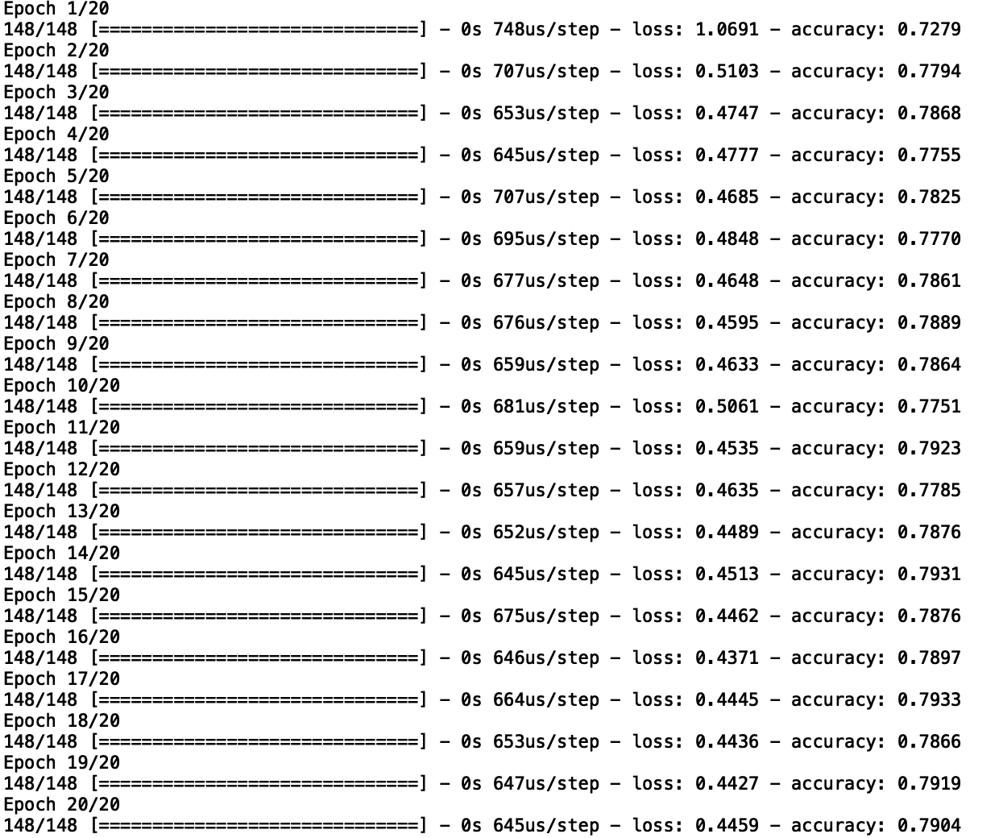
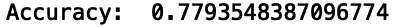
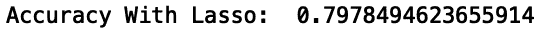
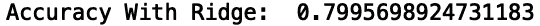

# Python 正则化指南

> 原文：<https://towardsdatascience.com/a-guide-to-regularization-in-python-8abf91ebca9a?source=collection_archive---------14----------------------->

## 使用正则化来防止深度学习模型中的过拟合


安娜·涅克拉舍维奇在[的图片](https://www.pexels.com/photo/magnifying-glass-on-top-of-document-6801648/)

过度拟合是数据科学家在构建高度复杂的模型时面临的一个常见问题。当模型非常适合训练数据，但随后在新数据上进行测试时表现不佳时，就会出现这种情况。

这个问题在构建深度神经网络模型时最常出现，深度神经网络模型是一种统计模型，松散地表示大脑中的连通性。这些模型往往很复杂，因为它们可能包含数百到数千个参数。由于高度的复杂性，这些模型可以拾取随机噪声作为真正的趋势，这导致在对新数据进行推断时性能不佳。

对于任何使用深度学习模型进行预测的企业来说，过度拟合都是一个很大的问题。例如，如果一家公司想要预测客户保持率，过度拟合模型可能会将数据中的随机噪声和异常值表示为重要的统计趋势。因此，当用于预测客户未来是否会重复购买时，该模型的表现将会很差，从而导致公司的收入损失巨大。

几种方法通常用于防止深度学习模型中的过度拟合。套索回归，也称为 L1 正则化，是一种在复杂模型(如神经网络)中防止过度拟合的流行方法。L1 正则化通过向模型添加惩罚项来工作。这种损失会导致模型中的一些系数变为零，您可以将其解释为丢弃分配了随机噪声、异常值或在数据中发现的任何其他统计上无关紧要的关系的模型权重。

通常，L1 正则化对于模型构建过程的特征选择步骤是有用的。具体来说，您可以使用它来移除预测能力不强的要素。例如，在预测客户保持率时，我们可能会访问一些对做出准确预测不太有用的功能，如客户的姓名和电子邮件。

另一种正则化方法是岭回归，也称为 L2 正则化。岭回归的工作原理是均匀收缩分配给模型中要素的权重。当模型中的要素高度相关时，此方法非常有用。在客户保持示例中，高度相关的特征可能是上次购买花费的美元或购买的商品数量。这两个特征高度相关，因为顾客购买的商品越多，他们花的钱就越多。共线要素的存在也会对模型性能产生负面影响。

Python 库 [Keras](https://keras.io/) 使得构建深度学习模型变得容易。深度学习库可用于建立分类、回归和无监督聚类任务的模型。此外，Keras 还使得将 L1 和 L2 正则化方法应用于这些统计模型变得很容易。通过在单行代码中指定参数值，L1 和 L2 正则化都可以应用于深度学习模型。

在这里，我们将使用[电信公司流失数据](https://www.kaggle.com/blastchar/telco-customer-churn)来建立一个预测客户保留率的深度神经网络模型。该数据包含一个虚构的电信公司的信息。

**数据准备**

首先，让我们导入 Pandas 库并将电信客户流失数据读入 Pandas 数据框:

进口熊猫作为 pd

```
df = pd.read_csv('telco_churn.csv')
```

接下来，让我们显示前五行数据:

```
print(df.head())
```


作者图片

为了构建客户流失模型，我们需要将数据中的客户流失列转换为机器可读的值。在 churn 的值为“否”的情况下，我们将分配标签“零”，在 churn 的值为“是”的情况下，我们将分配标签“一”

让我们导入 Numpy 包并使用 where()方法来标记我们的数据:

```
import numpy as npdf['Churn'] = np.where(df['Churn'] == 'Yes', 1, 0)
```

数据中的许多字段都是分类的。我们需要将这些字段转换成机器可读的分类代码，以便训练我们的模型。让我们编写一个函数，它接受分类列名的列表，并修改我们的数据框以包含每列的分类代码:

```
def convert_categories(cat_list):
    for col in cat_list:
        df[col] = df[col].astype('category')
        df[f'{col}_cat'] = df[col].cat.codes
        df[f'{col}_cat'] = df[f'{col}_cat'].astype(float)
```

让我们定义分类列的列表:

```
category_list = ['gender', 'Partner', 'Dependents', 'PhoneService', 'MultipleLines', 'InternetService',
                  'OnlineSecurity', 'OnlineBackup', 'DeviceProtection', 'TechSupport', 'StreamingTV',
                  'StreamingMovies', 'Contract', 'PaperlessBilling', 'PaymentMethod']
convert_categories(category_list)
```


作者图片

我们可以看到，我们的数据框现在包含每个分类列的分类代码。

接下来，让我们定义我们的输入和输出:

```
df['TotalCharges'] = pd.to_numeric(df['TotalCharges'], errors='coerce')
df['TotalCharges'].fillna(0, inplace=True)
cols = ['gender_cat', 'Partner_cat', 'Dependents_cat', 'PhoneService_cat', 'MultipleLines_cat', 'InternetService_cat',
                  'OnlineSecurity_cat', 'OnlineBackup_cat', 'DeviceProtection_cat', 'TechSupport_cat', 'StreamingTV_cat',
                  'StreamingMovies_cat', 'Contract_cat', 'PaperlessBilling_cat', 'PaymentMethod_cat','MonthlyCharges',
                  'TotalCharges', 'SeniorCitizen', 'tenure']X = df[cols]
print(X.head())
df['Churn'] = df['Churn'].astype(int)
y = df['Churn']
```

接下来，让我们为 Scikit-learn 中的模型选择模块导入训练/测试分割方法。让我们为训练和测试拆分我们的数据

```
from sklearn.model_selection import train_test_splitX_train, X_test_hold_out, y_train, y_test_hold_out = train_test_split(X, y, test_size=0.33)
```

**用于分类的神经网络**

为了开始构建我们的分类神经网络模型，让我们从 Keras 中的 layers 模块导入 dense layer 类。让我们从 Keras 的 models 模块中导入 sequential 类，从 Scikit-learn 的 metric 模块中导入 accuracy 方法:

```
from tensorflow.keras.layers import Densefrom tensorflow.keras.models import Sequentialfrom sklearn.metrics import accuracy_score
```

现在，让我们定义并拟合我们的模型，并使模型符合我们的训练数据。我们将建立一个具有两个隐藏层和 32 个神经元的神经网络。我们还将使用 20 个时期，这对应于通过训练数据的次数。

让我们定义我们的模型对象。

```
model = Sequential()
```

接下来，让我们使用 add 方法添加一个密集层。我们需要传入特性的数量，即列列表的长度，以及输入，即包含列列表长度的元组。我们还将根据正态分布并使用校正线性单位(ReLu)激活函数来初始化权重值。激活函数是模拟神经元放电的函数:

```
model.add(Dense(len(cols),input_shape=(len(cols),), kernel_initializer='normal', activation='relu'))
```

接下来，我们将使用 add 方法添加两个隐藏层。这些层将具有 32 个神经元，并且还使用 ReLu 激活功能:

```
model.add(Dense(32, activation='relu'))model.add(Dense(32, activation='relu'))
```

然后我们需要添加输出层，它将有一个神经元和一个 softmax 激活函数。这将允许我们的模型输出类别概率，以预测客户是否会流失:

```
model.add(Dense(1, activation='softmax'))model.compile(optimizer = 'adam',loss='binary_crossentropy', metrics =['accuracy'])model.fit(X_train, y_train,epochs =20)
```



作者图片

我们可以看到，随着每个历元的增加，损耗一般会减少，而精度会增加。

现在让我们进行预测。预测输出是对应于测试数据中每个输入的流失概率的列表。我们可以将预测转换为二进制分数，其中大于 50 %( 0.5)的概率值将被分类为流失，标签为 1。否则，它将被归类为标签为 0 的客户，对应于留在公司的客户:

```
y_pred = model.predict(X_test)y_pred = np.where(y_pred > 0.5, 1, 0)Let’s also calculate the accuracy of our model:print(“Accuracy: “, accuracy_score(y_pred, y_test))
```



作者图片

我们看到我们的模型准确率为 77.9%，这是相当不错的。让我们看看是否可以通过 lasso 回归来提高性能。

**拉索回归(L1 正则化)**

Keras 使得用神经网络模型实现 lasso 回归变得简单明了。Keras 中的正则化器包有一个我们可以调用的方法，在我们的神经网络层中命名为 l1。这将对层中的权重应用惩罚项，这将有助于防止过度拟合。

通常，lasso 回归将无关紧要的要素权重设置为零，从而允许模型包含最重要的要素以进行准确预测。让我们从 Keras 导入正则化包:

```
from tensorflow.keras import regularizers
```

接下来，让我们定义一个新的模型对象，我们称之为 model_lasso。

```
model_lasso = Sequential()
```

在输入层中，我们将使用正则化程序包中的 l1 方法为 kernel _ regularizer 传入一个值:

```
model_lasso.add(Dense(len(cols),input_shape=(len(cols),), kernel_initializer='normal', activation='relu', kernel_regularizer = regularizers.l1(1e-6)))
```

接下来的几行代码与我们最初的神经网络模型相同。唯一的区别是我们正在使用模型对象 model_lasso，而不是模型:

```
model_lasso.add(Dense(32, activation='relu'))
model_lasso.add(Dense(32, activation='relu'))
model_lasso.add(Dense(1, activation='sigmoid'))
model_lasso.compile(optimizer = 'adam',loss='binary_crossentropy', metrics =['accuracy'])
model_lasso.fit(X_train, y_train,epochs =20)y_pred = model_lasso.predict(X_test)
y_pred = np.where(y_pred > 0.5, 1, 0)
print("Accuracy With Lasso: ", accuracy_score(y_pred, y_test))
```



作者图片

如果模型中有许多对性能没有积极贡献的要素，套索回归是一个很好的选择。因此，它作为一个功能选择工具非常有用。

**岭回归(L2)**

在 Keras 中，将岭回归应用于神经网络模型也很容易。类似于套索方法，我们只需要在神经网络的层中调用一个方法名 l2。lasso 和 ridge 之间的区别在于，前者倾向于完全丢弃无关紧要的值，而 ridge 只是减少我们的神经网络中所有特征的权重大小。让我们定义一个名为 model_ridge 的新模型对象:

```
model_ridge = Sequential()
```

在输入层，我们将使用 l2 方法:

```
model_ridge.add(Dense(len(cols),input_shape=(len(cols),), kernel_initializer='normal', activation='relu', kernel_regularizer = regularizers.l2(1e-6)))
```

剩下的和我们上面做的类似:

```
model_ridge.add(Dense(32, activation='relu'))
model_ridge.add(Dense(32, activation='relu'))
model_ridge.add(Dense(1, activation='sigmoid'))
model_ridge.compile(optimizer = 'adam',loss='binary_crossentropy', metrics =['accuracy'])
model_ridge.fit(X_train, y_train,epochs =20)y_pred = model_ridge.predict(X_test)
y_pred = np.where(y_pred > 0.5, 1, 0)
print("Accuracy With Ridge: ", accuracy_score(y_pred, y_test))
```



作者图片

使用 ridge，精度比我们构建的第一个神经网络以及使用 lasso 的神经网络稍好。选择最佳的正则化方法取决于用例。如果使用模型中的所有输入要素很重要，那么岭回归可能是正则化的更好选择。这可能是为了训练我们的模型而需要保留某些特征的情况。

例如，一个薄弱的特征可能仍然是一家公司的杠杆。他们可能希望了解模型预测如何随着弱特征的值的变化而变化，即使它对性能的贡献不是很大。

这篇文章的代码可以在 GitHub 上找到。

**结论**

对于使用神经网络等复杂模型的数据科学团队来说，防止模型过度拟合非常重要。如果不加以考虑，过度拟合会对公司的收入产生重大影响。具有许多参数的模型，如神经网络，特别容易过度拟合，并可能给研究人员一种模型性能良好的错觉。

通常，过拟合模型在对当前数据进行测试时表现出很强的性能，而一旦向模型提供新数据，其性能就会非常差。例如，在客户流失的情况下，如果客户不会重复购买，overfit 模型可能能够以很高的准确度进行预测。然而，当出现新的客户数据时，overfit 模型将表现不佳，并且不再能够预测客户流失。这种不准确会导致公司浪费大量的金钱和资源，通过广告和促销瞄准错误的客户，而忽略了实际上可能流失的客户。出于这个原因，对于每个数据科学家来说，很好地理解如何使用 lasso 和 ridge 回归来防止复杂模型的过度拟合是一项重要的技能。

如果你有兴趣学习 python 编程的基础知识、Pandas 的数据操作和 python 中的机器学习，请查看[*Python for Data Science and Machine Learning:Python 编程、Pandas 和 sci kit-初学者学习教程*](https://www.amazon.com/dp/B08N38XW2Q/ref=sr_1_1?dchild=1&keywords=sadrach+python&qid=1604966500&s=books&sr=1-1) *。我希望你觉得这篇文章有用/有趣。*

***本帖原载于*** [***内置博客***](https://builtin.com/data-science) ***。原片可以在这里找到***<https://builtin.com/data-science/overfitting-regularization-python>****。****