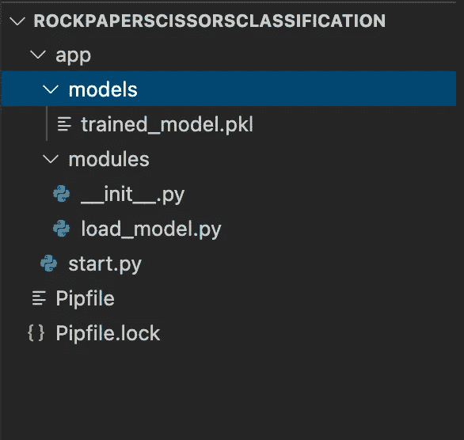
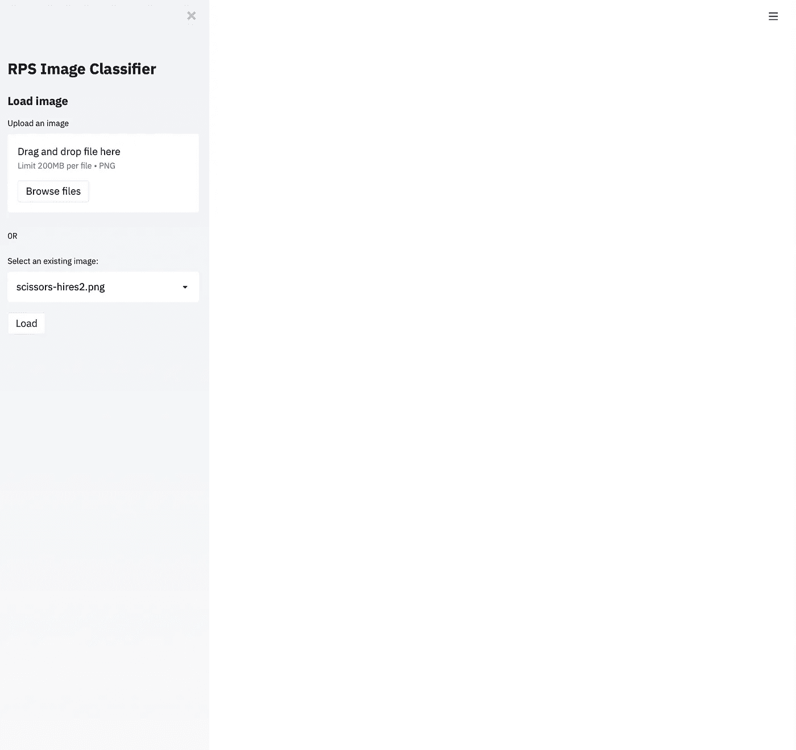
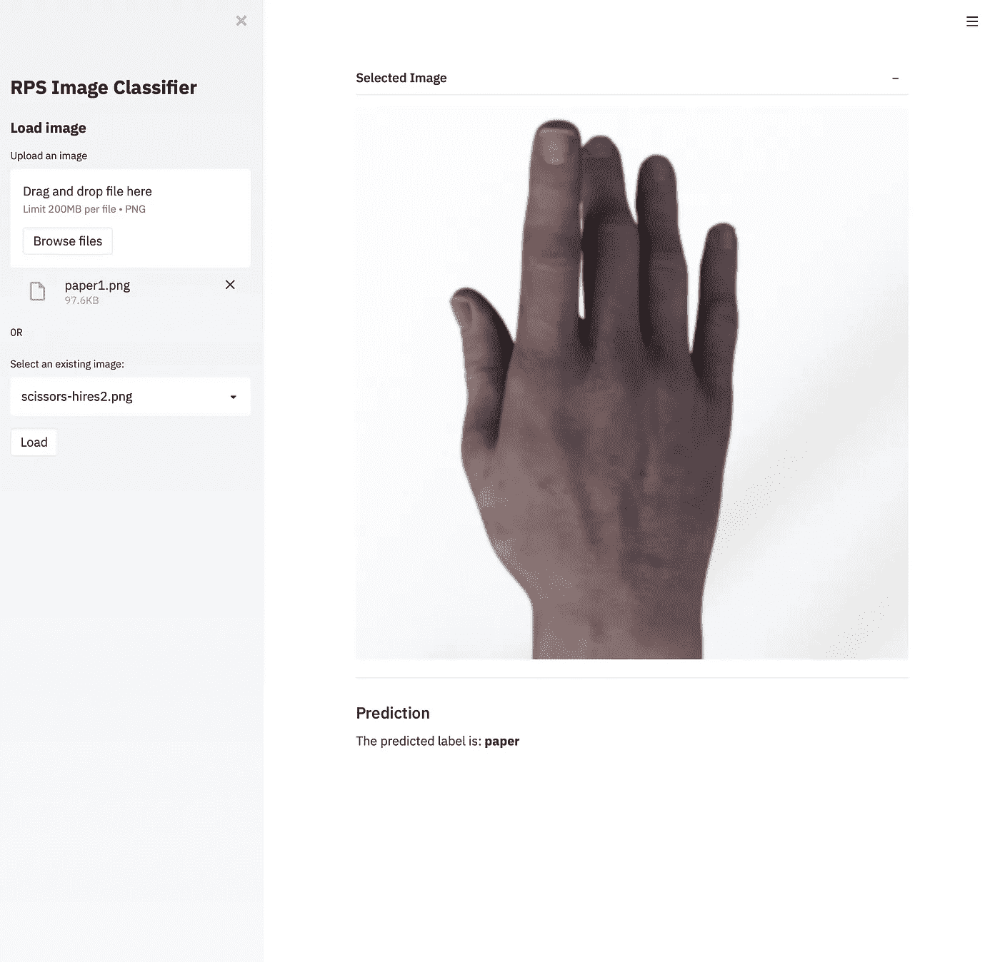
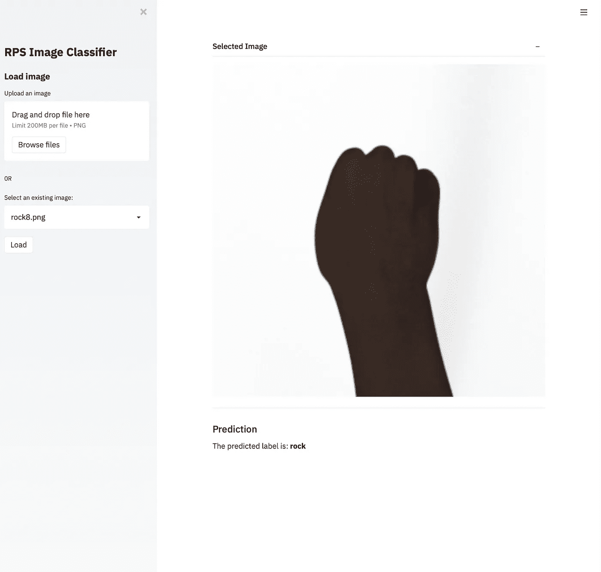

# 简化 it 指南—数据科学前端变得更简单

> 原文：<https://towardsdatascience.com/a-guide-to-streamlit-frontend-for-data-science-made-simpler-c6dda54e3183?source=collection_archive---------23----------------------->

## 让您的数据科学项目变得漂亮并可共享——所有重要概念的演练


Javier Allegue Barros 在 [Unsplash](https://unsplash.com?utm_source=medium&utm_medium=referral) 上拍摄的照片

在我们的数据科学工作中，甚至在我们投入时间和精力的一个很酷的副业项目中，我们多次面临如何正确展示我们工作的困境。我们应该自己建立一个新的网页，确保我们的模型作为一个 API 工作，最后，把它作为一个包放在一起，并期望其他人像我们一样运行和交互它吗？

做前端工作**很难**。

因此，对于我们这些从不费心费力学习 HTML、CSS 和 Javascript 的细微差别的后端人员来说，Streamlit 是来拯救我们的。

## 什么是 Streamlit？

简而言之，这是一个允许我们通过用 **Python** 编写所有代码来为我们的机器学习和数据科学应用**构建前端的库。漂亮的用户界面可以通过库中的众多组件轻松设计出来。这是他们网站上的完整文档。**

这意味着您可以轻松地在 python 项目中拥有按钮、漂亮的文本显示、可滚动框、下拉列表、文件上传功能。

## 该项目

让我们从本文中的石头剪刀布项目开始:

[](/a-fast-introduction-to-fastai-my-experience-b18d4457f6a5) [## 快速介绍 FastAI——我的经历

### 让我告诉你我是如何在不到一个小时的时间里建立一个图像分类器模型的！

towardsdatascience.com](/a-fast-introduction-to-fastai-my-experience-b18d4457f6a5) 

如果你还没有读过那篇文章，这就是我们在那里做的工作——石头剪刀布数据集是来自三类图像的图像集合，你猜对了——石头、纸和剪刀手势。**我们在**[**Fastai**](http://fast.ai)**深度学习库的帮助下，使用一些快速迁移学习对数据集进行图像分类。**

在本文中，我们导入了数据集，训练了模型并保存了它。

现在是我们围绕它设计一个交互界面的时候了。

以防你对整个代码库感到疑惑:它都在这里。阅读本教程时，请随意跟随。:)

[](https://github.com/yashprakash13/RockPaperScissorsFastAI) [## yashprakash 13/rock paper scissors fastai

### 这些笔记本包含来自 medium 系列博客文章的代码:Fastai-My 的快速介绍…

github.com](https://github.com/yashprakash13/RockPaperScissorsFastAI) 

## 该应用程序

我们将在我们的应用程序中添加以下两种预测图像的方法。我们可以:

*   从测试图像列表中选择要预测的图像，或者
*   上传新的测试图像进行预测

这听起来很简单，对吗？是的，就是它！但是有了这个，你也将获得在你进一步的项目中使用许多不同的 streamlit 组件的知识。

我们现在应该继续并确保我们安装了库。

当**在您的虚拟环境**中时，从终端执行此操作:

```
pipenv shell #activate your virtual env
pipenv install streamlit #install streamlit
```

现在，在你最喜欢的代码编辑器中打开你的项目目录。

对于此应用程序，我们将在未来构建一个完整的容器化(dockerized)可共享应用程序，因此请确保首先构建此项目结构:



项目结构

整个应用程序将存在于**应用程序**目录中。

我们的项目需要放在**模块**目录中。

我们训练过的模型(酸洗过的)将存放在**模型**目录中。

最后，我们将拥有我们的 **start.py** ，它是在模块之外但在应用程序目录之内运行应用程序的主要文件。

另外两个文件只是使用虚拟环境时生成的 pipenv 文件。

现在我们已经解决了这个问题，让我们写一些代码吧！

## 一些重要的功能

整个应用程序只包含一些辅助函数和一个运行它们的主函数。

让我们看看 **load_model.py** 里面有什么

定义训练模型路径并导入 fastai:

```
from fastai.vision.all import *SAVED_MODEL_PATH = './models/trained_model.pkl'
```

最后，定义分类器函数:

```
def _get_model():
    model = load_learner(SAVED_MODEL_PATH)
    return modeldef perform_prediction(image_path):
    model = _get_model()
    pred = model.predict(PILImage.create(image_path))
    return pred[0]
```

我们还定义了另一个函数，通过 PIL 图书馆打开并显示图像:

```
def get_opened_image(image):
    return Image.open(image)
```

现在，我们可以转到 **start.py** 了。

## Streamlit 组件

让我们将 **load_model.py** 模块中的助手函数与该文件中的函数连接起来:

```
**def** classify(image_file):
    pred = perform_prediction(image_file)
    **return** pred
```

现在让我们继续使用 streamlit 应用程序。

导入库:

```
import streamlit as st
```

首先，我们这样定义应用程序的标题:

```
st.sidebar.title("RPS Image Classifier")
```

接下来，我们确定我们有一个主函数。让我们创建一个 [**侧边栏**](https://docs.streamlit.io/en/stable/main_concepts.html#layout)——来容纳应用程序中的所有交互组件。

现在，我们定义上传图像的功能。

```
image_file = st.sidebar.file_uploader('Upload an image', type = 'png')
```

最后，我们制作了一个按钮，帮助我们将图像加载到应用程序中并显示出来:

```
if image_file and st.sidebar.button('Load'):
        image = get_opened_image(image_file)
        with st.beta_expander('Selected Image', expanded = True):
            st.image(image, use_column_width = True)
```

现在，我们还包括选择现有图像文件的选项:

```
image_file_chosen = st.sidebar.selectbox('Select an existing image:', get_list_of_images())
```

这里， **get_list_of_images** 是我们在 **load_model.py** 中定义的一个新函数:

```
def get_list_of_images():file_list = os.listdir(PATH_TO_TEST_IMAGES)return [str(filename) for filename in file_list if str(filename).endswith('.png')]
```

唷！这对于我们的 UI 来说已经足够了。

你的应用现在应该是这样的:



应用程序当前状态

这些是我们构建的组件:

*   **st.title** —写入标题的组件。各种用例的其他文本组件是: **st.text** 、 **st.write** 、 **st.markdown** 。我们在这里也会用到这些。
*   **st .侧栏**-构建上图中的侧栏。
*   **st .侧栏. file _ uploader**-使文件上传器的小部件在侧栏中可用。你也可以在没有边栏的情况下使用它，比如:st.file_uploader。然后，它将出现在上面图像中看起来空白的主要区域。
*   **st.image** —简单显示加载到应用程序中的图像的小部件。
*   **st.selectbox** —制作一个下拉列表，列出要选择的项目(这里是图片),而不是自己上传文件。

## 定义预测功能

这是我们一直在等待的部分，不是吗？多亏了 fastai，这个步骤也很简单。

```
def perform_prediction(image_path): model = _get_model() pred = model.predict(PILImage.create(image_path)) return pred[0]def _get_model(): model = load_learner(SAVED_MODEL_PATH) return model
```

这两个函数帮助我们在任何给定的图像上进行预测。我们从 fastai 加载学习模块，然后返回结果。在这种情况下，它是 **pred** 变量中的第一项。因此， **pred[0]** 。

我们现在唯一需要做的就是将这个功能链接到我们的 **start.py** 中。

```
prediction = classify(os.path.join(PATH_TO_TEST_IMAGES, image_file))
```

就这样！

让我们也显示结果吧！

```
st.subheader('Prediction')st.markdown(f'The predicted label is: **{prediction}**')
```

这个应用程序现在看起来是这样的:



## 事后的想法

如果你到目前为止一直跟随着我，花点时间祝贺你自己学习了一个酷的、有用的库的基础知识！为数据科学项目构建前端的难易程度从未如此之高，您肯定应该尝试在您未来的项目中应用更多这方面的内容。我一定会的！

**在下一篇文章中，**我将在 **Docker** 的帮助下包含这个应用程序。所以请继续关注！

谢谢你的阅读！

## 您可能想了解一些资源:

以下是我所有数据科学文章的主代码库:

[](https://github.com/yashprakash13/data-another-day#ml-mini-projects-because-crash-courses-are-the-best) [## yashprakash 13/数据-另一天

### 我在网站上学习和撰写的所有数据科学项目、概念、工具和资源的主存储库…

github.com](https://github.com/yashprakash13/data-another-day#ml-mini-projects-because-crash-courses-are-the-best) 

我也在[推特](https://twitter.com/csandyash)上写数据科学和软件工程。