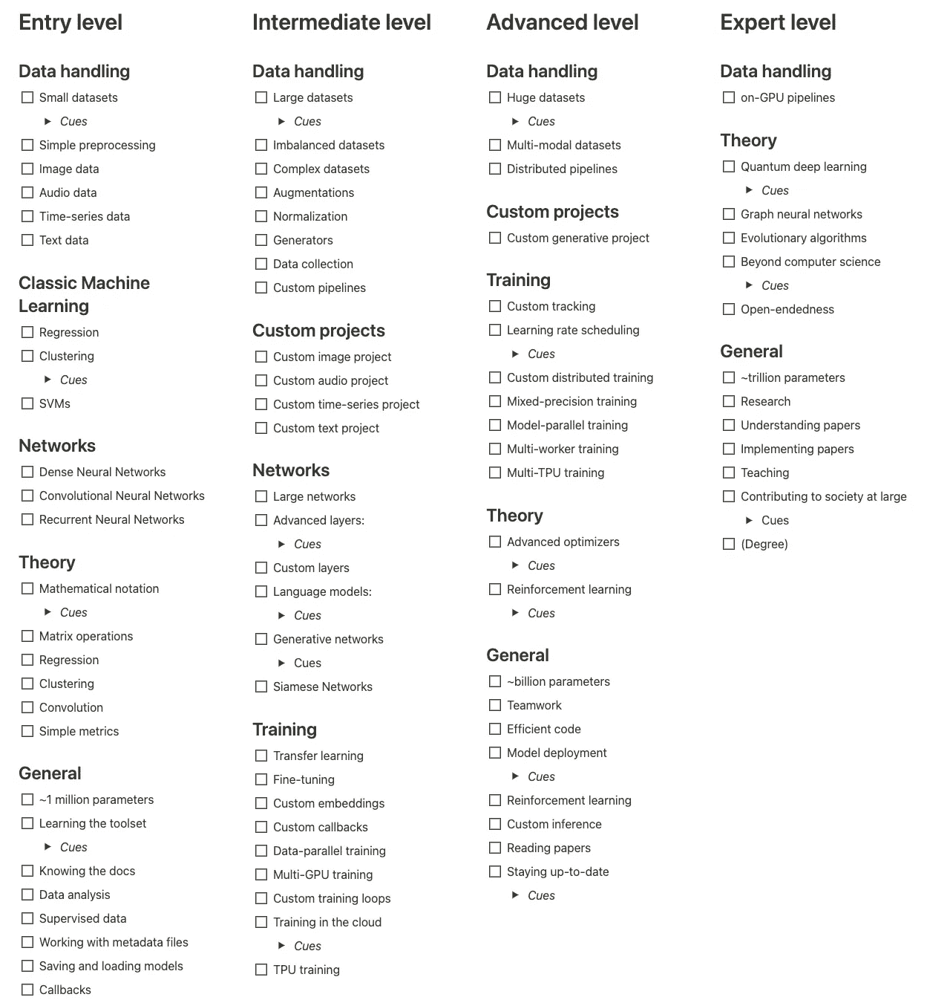
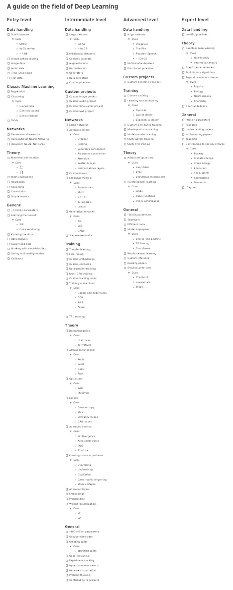

# 深度学习领域指南

> 原文：<https://towardsdatascience.com/a-guide-to-the-field-of-deep-learning-9bb9b21dae2?source=collection_archive---------14----------------------->

## 从入门级到专家级

机器学习的领域是巨大的。你很容易被外面的大量信息淹没。为了不迷路，下面的列表可以帮助你估计你在哪里。它提供了广阔的深度学习空间的轮廓，并且不强调某些资源。在适当的地方，我已经包括了帮助你定位的线索。

作者摘录的清单。这份名单可以在 GitHub [这里](https://github.com/phrasenmaeher/dl-overview)和 on idea[这里](https://www.notion.so/A-guide-on-the-field-of-Deep-Learning-fd18f24d384c4126a10873f58efa8bb8)获得。

由于列表变得相当长，我已经包括了上面的摘录；完整的列表在这篇文章的底部。

# 入学水平

入门级分为 5 类:

*   *数据处理*向您介绍小型数据集
*   *经典机器学习*涵盖了经典机器学习技术的关键概念
*   *网络*涵盖了传统的 dnn、CNN 和 rnn
*   *理论*列出了上述范畴背后的概念
*   *概述*列出了你在这个阶段遇到的主要事情

## 数据处理

在入门级产品中，使用的数据集很小。通常，它们很容易放入主存储器。如果它们没有经过预处理，那么只需要几行代码就可以应用这些操作。主要针对主要领域*音频*、*图像*、*时间序列*和*文本*进行操作。

## 经典机器学习

在进入深度学习的大领域之前，学习基本技术是一个不错的选择。这些包括回归、聚类和支持向量机。在列出的算法中，只有 SVM 算法可能稍微复杂一点。不要让你自己被这个压倒:试一试，然后继续前进。

## 网络

没有最重要的成分就没有深度学习:各种变体的神经网络；gan、AEs、VAEs、变压器、dnn、CNN、rnn 等等。但是还没有必要涵盖所有内容。在这个阶段，看一下最后三个关键词就足够了。

## 理论

没有神经网络就没有深度学习，没有(数学)理论就没有神经网络。你可以从了解数学符号开始学习。起初有点可怕，但你很快就会接受这种简洁的风格。一旦你掌握了它，看看矩阵运算，神经网络背后的一个核心概念。

有了这些知识，你就可以进行卷积运算，这是另一个核心概念。

简而言之，您将一个矩阵移动到另一个矩阵上，并计算重叠区域之间的内积。有许多变体——继续学习，你也会自然地使用它们！

## 一般

您可以放心，您可以在入门级的家用机器上使用所有类型的网络。典型的参数数量大约为一百万，对于您的任务来说已经足够了。主要是，你将不会专注于让一个网络运行，但也学习他们周围的东西。这包括学习您的工具、查阅文档、分析数据等等。

# 中间能级

中级和初级之间没有真正的分界线。你会注意到这一点，主要是通过处理更大的数据集，使用先进的网络进行定制项目，以及想出更好的方法来启动培训。你在这个阶段遇到的一切都是建立在你之前的工作之上的:

*   *数据处理*关注更大的数据集
*   *定制项目*是你将要做的事情
*   *网络*变得更加先进
*   *训练*让你更深入地训练一个网络
*   *理论*侧重于拓展你的背景知识
*   *General* 列出了您在该级别使用的几个项目

## 数据处理

一旦你处理了几个千兆字节的数据集，你就会解决新的问题。足够快地从驱动器中获取它们是至关重要的，这可能涉及规范化技术和自定义管道。由于数据集往往会变得更加复杂，您可能需要修改扩充、自定义生成器或收集额外的数据。

## 自定义项目

正如在我以前的文章中，定制项目是中级的核心。自定义意味着工作在你自己的任务上，不再跟随关于 MNIST 的教程。这涉及所有主要领域，并为即将到来的类别创造了巨大的协同效应。

## 网络

在定制项目中工作，你自然会接触到更大的网络。这些网络通常具有高级层来接管繁琐的任务。数据正常化？为此只需使用 BatchNormalization 层。但是如果你的任务还没有图层，你会怎么做呢？答案很简单:你写一个自定义层。

除了高级层，高级架构也是现阶段的一个东西。普通的密集网络慢慢被复杂的语言模型取代，CNN 用于在生成网络中生成图像，而暹罗网络对于不平衡的数据集来说很方便。

## 培养

与各种各样的网络打交道可以让你更快地接触到新技术。其中之一是迁移学习，你可以使用一个针对你的问题进行不同任务训练的网络。微调的方向类似，意味着冻结大部分权重。仅更新剩余的“非冻结”重量

前两种技术也用于嵌入的概念中。嵌入是表示额外知识的一种真正聪明的方式。想象一棵树。一棵树不仅仅是树叶和木头。一棵树净化空气，提供阴凉，并为各种动物提供一个家。换句话说，“树”不仅仅是一个词，而是一个概念，涉及各种附加信息。您可以通过使用嵌入来合并这些信息。

从这个类别中可以学到更多，嵌入只是一个开始。如果你有一个复杂的数据集，你可以写你自己的回调来控制训练进度。或者您切换到多 GPU 培训，在不同的设备上复制模型，并同步更新。

更进一步，您可以将这与定制的训练循环结合起来，大概是在云中(因为只有少数人手头有一个以上的 GPU)。如果你需要强大的动力，那就使用 TPU。

## 理论

到目前为止，你看到的所有概念还包括一个潜在的理论。学习理论方面一定不要涉及复杂的数学，而是要理解事物是如何工作的。

在神经网络的情况下，这个驱动因素是反向传播算法。解析地确定更新通常在计算上是不可行的。诀窍是通过无数次应用衍生链规则来传播更新。你甚至可以用手做到这一点！

导数受激活函数的影响，最终在优化器的帮助下应用。给定一些损失函数，这些优化器确保你每一步都做得更好。观察这种进展涉及一些目标函数来评估当前权重的良好性。这就是指标发挥作用的地方，因为您已经处于中级水平，所以您将会遇到一些高级指标。

到目前为止，您所学的所有内容也向您介绍了神经网络优化中的常见问题。有一些技术可以减轻它们，看看高级(标准化)层背后的理论。在这个意义上，嵌入不是层，但仍然是自然语言处理的一个重要部分。对于生成网络，对应的是概率计算。

## 一般

从轻量级到高级网络伴随着更多的参数。您现在将主要处理大约 1 亿、2 亿个参数的模型。训练这样的网络是可行的，是的，但是可能需要你切换到更快或更多的硬件。

在很大程度上决定训练时间的一个驱动因素是您使用的数据集。较小的数据集处理速度更快，较大的数据集需要更长时间。您现在可能还需要处理无监督的数据，或者必须创建自定义数据集分割。

一旦您为前面的任务编写了定制代码，使用代码版本控制系统就变得非常有用。您最不希望遇到的情况是，一个工作代码因为一些更改而中断，并且无法回滚。当你进行实验跟踪时，可以避免类似的问题。一旦你达到了好的指标，你就想知道为什么，像权重和偏差这样的工具可以帮助你。

现在你研究了各种各样的主题，都有自己的挑战，你磨练了思考 ML 问题的能力。这是一个有用的副产品:你把你以前在不同的环境中学到的东西用于一个新的问题。一旦你解决了这个问题，为什么不为 GitHub 上的一些项目做点贡献呢？

# 优等

与之前的中级水平相比，您现在转移到更大的数据集，在组合中添加生成网络，并检查各种技术以加快您的训练。高级级别分为五个类别:

*   *数据处理*要求您处理大型复杂的数据集
*   *定制项目*现在包括生成网络
*   *培训*探索缩短培训时间
*   *理论*包括高级优化器和强化学习
*   将军收集了你将会学到的广泛的东西

## 数据处理

从中级到高级包括处理更大的数据集。以前的大小大约是几十千兆字节，现在是几百千兆字节，大了 10 倍。请放心，您的处理管道仍将工作——但是您可能希望分布它们，以加快速度。

这个阶段的另一个主题是多模态数据集。这意味着数据集包含来自多个领域的样本:例如，结合了文本描述的图像。

## 自定义项目

除了你以前的项目，你现在探索了生殖网络的迷人世界。为此，您可以从自动编码器开始，然后过渡到 GANs 及其衍生产品。

## 培养

*培训*类别现在包括先进的技术，以提高效果和最大限度地减少培训时间。为了验证你的训练是否成功，你需要依靠精确的跟踪方法。对于简单的指标，进度条可能就足够了。但是随着更多要跟踪的内容和高级度量标准的出现，理解起来很容易变得错综复杂。解决方案是编写一个定制的跟踪例程。不过你不必从头开始，TensorBoard 和 Weights&bias 这样的工具会让记录变得简单。

一旦你达到一个平台期(简单地说，分数不再增加)，你可以尝试安排学习速度。学习速度不是固定的，而是在训练过程中进行调整。这可能包括将学习速率除以一个常数因子，或者在两个边界之间循环。尝试一下，看看什么适合你的情况。

当一台机器不能胜任时，您可以分配工作负载。将其与混合精度训练相结合，以获得更快的速度。

如果您的模型或其激活对于单个设备来说太大，您可以求助于模型并行训练。在数据并行训练中，您的模型被复制，数据被分割成副本，权重更新被同步。在模型并行训练中，您拆分模型并将其层放置在不同的设备上。

这可以与多工作人员设置相结合，其中不同的设备不仅仅是不同的本地 GPU，而是来自不同的工作人员。下一个合乎逻辑的步骤将是利用多个 TPU 工人。这带来了严重的速度问题——但是要确保你的代码是高效的。

## 理论

这个阶段的理论从高级优化器开始。每个人都知道并使用默认的，但除此之外还有许多贡献。只要看看来自 [TensorFlow 插件](https://www.tensorflow.org/addons/api_docs/python/tfa/optimizers)的可用优化器就能获得灵感。您可以将优化器与权重衰减相结合，平均更新，或者只更新一些变量。

还有强化学习领域在等着你。虽然这不是一个很难的话题，但在早期要学的东西太多了。但是一旦你具备了数学知识(初级)和中级知识，你就可以试一试了。

## 一般

就参数数量而言，您现在要处理多达十亿个参数。不用说，这已经不是一个人的项目了。建立如此大规模的网络需要团队合作和高效的代码。一旦您成功地训练了那些十亿参数模型(或者任何模型)，您就可以部署它了。

但是还有更多。一些谣言表明每天有一百篇 ML 论文发表。保持最新是不可能的。但是你至少可以通过阅读报纸和订阅精选的时事通讯来使这变得更容易。大型(科技)公司的博客也是一个很好的信息来源。就我的资源而言，我喜欢吴恩达的[*The Batch*](https://www.deeplearning.ai/the-batch/)news， [TensorFlow 的博客](https://blog.tensorflow.org)，Sebastian Ruder 的 [news on NLP](https://ruder.io/nlp-news/) ，偶尔还会访问 DeepMind 的[研究页面](https://deepmind.com/research)。

# 专家级

明确地说，你的旅程越远，界限就越模糊。以下所有有趣的事情都是建立在你之前所学的基础上的。没有什么是全新的——除了(部分)离开 CS 领域或者访问未知领域。

专家级包含三大类别:

*   *数据处理*增加了 on-GPU 流水线
*   *理论*引入量子 DL 并超越 CS
*   *通用*扩展到万亿参数型号

## 数据处理

这是一个简短的类别，它以 GPU 上的管道为唯一项目。大多数管道可以很容易地设置为在 CPU 上运行。让他们在 GPU 上工作是另一回事。我记得看过一篇关于 GPU 编程的论文，我猜是 2010 年左右的，作者描述了他们如何使用 Nvidia 的 CUDA 来编码。自那以后已经取得了很大进展，随着 JAX 的进步，另一个机会出现了。

你需要一个 GPU 上的管道吗？如果数据预处理成为瓶颈，那么是的。

## 理论

在这个层次上，你肯定知道你的兴趣是什么。为了给你一些想法，你可以看看量子物理，图形神经网络和进化算法。现在已经超越了计算机科学。

如果你仍然好奇，请阅读[开放式](https://www.oreilly.com/radar/open-endedness-the-last-grand-challenge-youve-never-heard-of/)。

## 一般

Hornik 的[通用逼近定理](https://en.wikipedia.org/wiki/Universal_approximation_theorem)指出，一个函数可以用一个单层网络来逼近，与所需参考函数的偏差相当小。挑战在于找到这个近似值。实际上，更深层次的网络往往更有效。所以，你可以试试那些万亿参数模型。

训练这样的大型架构也是你研究的一部分。研究不局限于“专家”级别，更重要的是基础知识。理解论文(嗯，大部分)，实施论文，教学也是如此。

各级最大的挑战是为整个社会做贡献。不仅仅是将卷积从 2 秒加速到 1 秒，而是更进一步 10 步，解决世界上紧迫的问题。这并不局限于计算机科学家，而是需要许多(科学)领域的共同努力。这是团队合作。我列出的线索通常是不详尽的，它们被写成路标。

# 接下来去哪里？

这是深度学习领域的一个详细但不详细的概述。详细，因为我试图创建几个阶段及其典型项目的概述。不详细，因为总是有进一步的东西要包括在内。

这样说来，有几个资源:

*   入门级的可以去查一下 [TensorFlow 开发者职业证书](https://www.coursera.org/professional-certificates/tensorflow-in-practice) (之后试试 TF 考试，看看你已经学会了什么！)
*   伯克利的[全栈深度学习](https://fall2019.fullstackdeeplearning.com/#who-is-this-for)课程
*   DeepMind 的[高级深度学习&强化学习](https://www.youtube.com/playlist?list=PLqYmG7hTraZDNJre23vqCGIVpfZ_K2RZs)讲座
*   [张量流:数据和部署专业化](https://www.coursera.org/specializations/tensorflow-data-and-deployment)和[张量流:高级技术专业化](https://www.coursera.org/specializations/tensorflow-advanced-techniques)

如果你有合理的进一步的东西，请让我知道。

# 进一步说明

*   我肯定忘记了一些重要的事情
*   根据我自己的经验，这是严重偏颇的
*   这项工作使用了我跟踪 ML 进展的帖子作为基础；我扩展了它，并添加了更多的注释
*   这是完整的列表:

作者的完整列表。在 GitHub [这里](https://github.com/phrasenmaeher/dl-overview)有，在 idea[这里](https://www.notion.so/A-guide-on-the-field-of-Deep-Learning-fd18f24d384c4126a10873f58efa8bb8)也有。