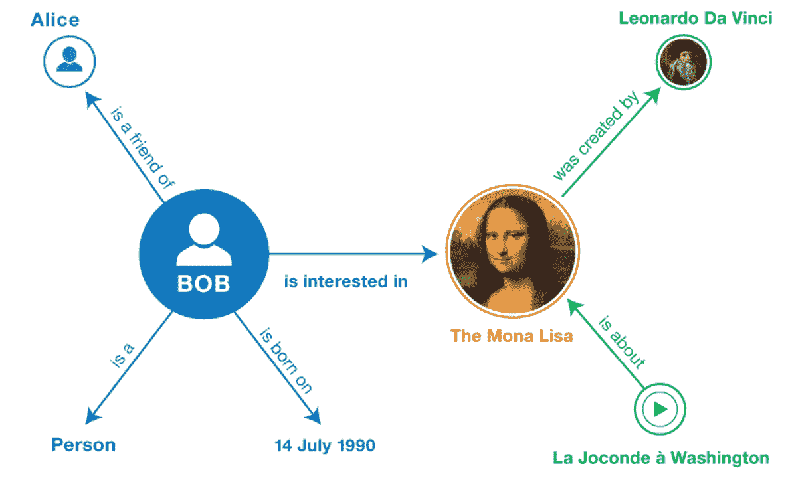
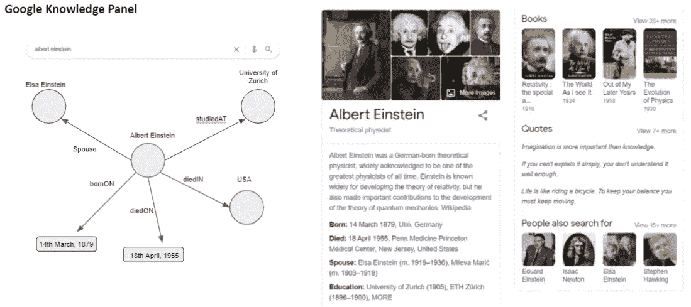
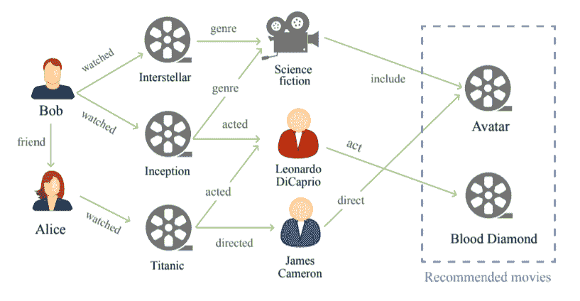
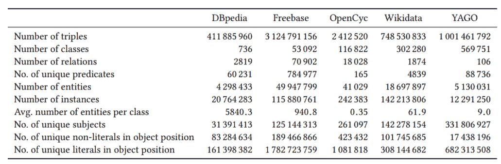
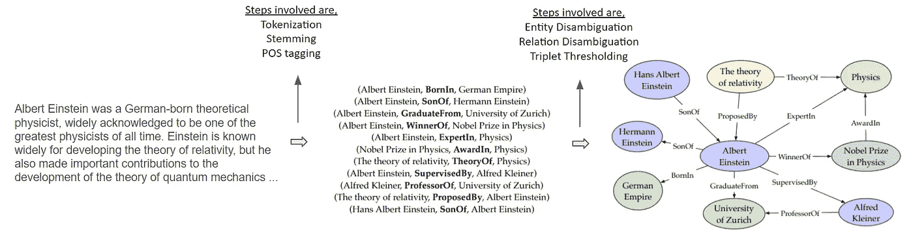
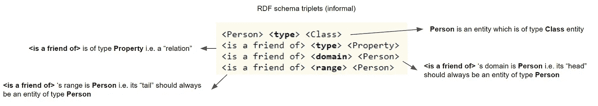
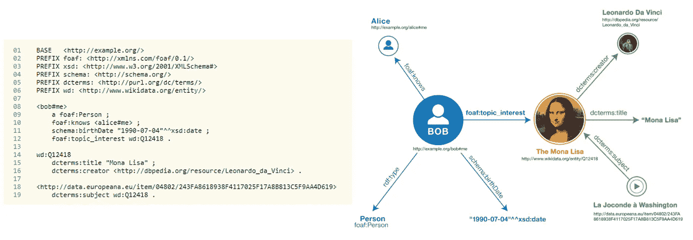
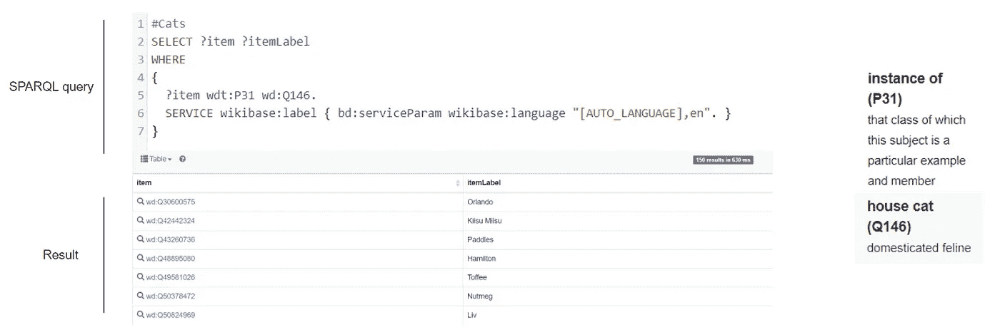
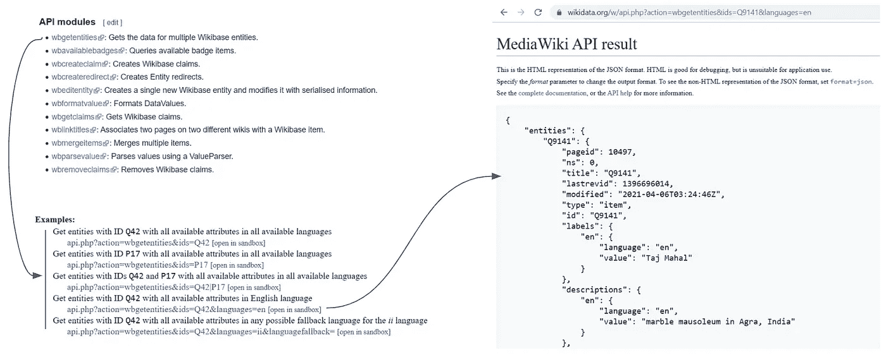

# 知识图表指南

> 原文：<https://towardsdatascience.com/a-guide-to-the-knowledge-graphs-bfb5c40272f1?source=collection_archive---------2----------------------->

## [入门](https://towardsdatascience.com/tagged/getting-started)

## 笔记的合并，简要但温和地介绍了知识图表，并在几个实际的方面发光。

照片由[克林特·王茂林](https://unsplash.com/@clintadair?utm_source=medium&utm_medium=referral)在 [Unsplash](https://unsplash.com?utm_source=medium&utm_medium=referral) 上拍摄

# 目录

*   **简介**
    -什么是知识图(KG)？
    -为什么是 KG？
    -KG 怎么用？
*   **KG in practice** -开源 KG
    -创建定制 KG
    - KG 本体
    -托管 KG(数据库)
    -从 KG 中查询事实

# 介绍

在本节中，我们将通过询问一些关于 KG 的简单但直观的问题来介绍 KG。事实上，我们将涵盖知识图的内容、原因和方式。我们还将通过一些现实世界的例子。

## 什么是知识图？

*   为了更好地理解知识图表，让我们从理解它的基本单元即“事实”开始。事实是一公斤可以存储的最基本的信息。事实可以用三个一组的方式来表示，
    - **HRT** : <头，关系，尾>-
    -**SPO**:<主语，谓语，宾语>
*   记住，上面的描述只是为了命名的缘故，因此你可能会遇到人们以任何一种方式提到这个事实。让我们遵循本文的 HRT 表示。因此，无论哪种方式，事实包含 3 个元素(因此，事实也称为三元组)，可以帮助将 KG 直观地表示为图形，
    — **头或尾:**这些是实体，它们是真实世界的对象或抽象概念，表示为节点
    — **关系:**这些是表示为边的实体之间的连接
*   下面显示了一个简单的 KG 示例。事实的一个例子是`<BoB, is_interested_in, The_Mona_Lisa>`。你可以看到 KG 只不过是多个这样的事实的集合。

知识图表示例。来源: [ 4]

*   注意，以 KG 为单位存储的事实的数据类型没有限制。如上面的例子所示，我们有一些人(鲍勃，爱丽丝，..)、绘画(蒙娜丽莎)、日期等，在 KG 中表示为节点。

## 为什么是知识图？

这是任何人被介绍给 KG 时都会问的第一个问题，也是一个有效的问题。我们将尝试讨论一些点，在这些点上，我们将 KG 与普通图，甚至其他存储信息的方式进行比较。目的是强调使用 KG 的主要优势。

**与正常图表相比**

*   **异构数据**:支持不同类型的实体(人、日期、画等)和关系(喜欢、出生于等)。
*   **模拟真实世界信息**:更接近我们大脑对世界的心理模型(像正常人一样表现信息)
*   **执行逻辑推理**:遍历一条路径中的图来建立逻辑连接(A 的父亲是 B and B 的父亲是 C，因此 C 是 A 的祖父)

**与其他存储类型相比**

*   **结构化表示**:与文本数据等非结构化表示相去甚远
*   **消除冗余**:与表格数据相比，无需添加大部分为空的列或行来添加新数据(一些事实)
*   **查询复杂信息**:对于关系比单个数据点更重要的数据，比 SQL 更好(例如，如果您必须在 SQL 查询中执行大量`JOIN`语句，这本来就很慢)

## KG 怎么用？

知识图表可以用于大量的任务——无论是逻辑推理、可解释的建议、复杂的分析还是更好的存储信息的方式。有两个非常有趣的例子，我们将简要讨论。

**谷歌知识面板**

*   在谷歌上查询一个名人、地点或概念，它会在右边返回一个知识面板。该面板包含各种各样的信息(描述、教育、出生、死亡、引用等)，有趣的是采用不同的格式(文本、图像、日期、数字等)。
*   所有这些信息都可以存储在 KG 中，下面显示了一个这样的例子。这展示了存储信息是多么容易，也说明了阅读和理解 KG 的事实是多么直观。事实上，谷歌使用 KG 作为存储此类信息的基础。

Google 使用的基于知识图的知识面板示例。[右]谷歌搜索爱因斯坦时显示的实际面板。[左]再现了我们如何在 KG 中存储类似的信息。来源:作者+谷歌。

**推荐系统**

*   经典算法考虑用户-项目交互来生成推荐。随着时间的推移，新创建的算法开始考虑关于用户和商品的额外信息，以改善推荐。
*   下面，我们可以看到一个 KG(电影 KG)，它不仅包含用户-物品连接(这里是人-电影)，还包含用户-用户交互和物品属性。这个想法是，提供所有这些额外的信息，我们可以提出更准确、更明智的建议。在不进入精确算法的情况下，让我们合理化一下可以产生什么样的推荐。
*   《阿凡达》可以推荐给，
    —鲍勃:因为它和《星际穿越》和《盗梦空间》一样属于科幻类型(鲍勃已经看过了)
    —爱丽丝:因为它是由詹姆斯·卡梅隆执导的(《泰坦尼克号》)
*   《血钻》可以推荐给，
    ——鲍勃:迪卡普里奥在《盗梦空间》中也演过
*   这个简单的思考练习应该展示如何使用 KG 很容易地以事实的形式表示大量真实世界的交互。然后，我们可以将基于 KG 的算法用于下游用例，如生成推荐。

电影推荐任务的知识图示例。来源:[1]

# 实践中的知识图

在这一节中，我们将从一个从业者的角度来看 KG。我们会通过一些开源的，随手可得的 KG。在某些情况下，我们甚至想要创建自己的 KG，所以我们也将讨论一些关于它的指针。然后通过讨论 KG 本体，我们会很快理解一个 KG 可以构造的一些规则和方式。最后，我们将讨论 KG 托管数据库，并学习如何查询 KG(从中获取事实)。

## **开源知识图表**

另一方面，虽然有一些小型的和特定领域的 KG，但是我们也有许多大型的和领域不可知的 KG，其中包含所有类型和形式的事实。一些著名的开源知识图是，

*   DBpedia 是一个基于社区的众包项目，旨在从各种维基媒体项目中提取结构化内容。
*   Freebase:一个大规模的、协作编辑的交叉链接数据数据库。被吹捧为“一个公开共享的世界知识数据库”。它被谷歌收购，用来驱动自己的公斤。2015 年，终于停产了。
*   OpenCyc :是 Cyc 全部功能的入口，Cyc 是世界上最完整的通用知识库和常识推理引擎之一。
*   **Wikidata** :是一个免费、协作、多语言的数据库，收集结构化数据为 Wikimedia 项目提供支持。
*   **YAGO** :巨大的语义知识库，来源于维基百科、WordNet 和 GeoNames。

开源知识图的高级统计。来源:[2]

## **创建自定义知识图**

尽管有几个开源的 KG，我们可能需要为我们的用例创建特定领域的 KG。在那里，我们的基础数据(我们希望从中创建 KG)可以有多种类型——表格、图形或文本 blob。我们将介绍如何从文本等非结构化数据中创建 KG 的一些步骤，因为使用最少的领域知识和脚本将结构化数据转换成 KG 相对更容易。完整的过程可以分为两步，

*   **事实创建:**这是第一步，我们解析文本(逐句)并提取类似`<H, R, T>`的三元组格式的事实。当我们处理文本时，我们可以利用预处理步骤，如标记化、词干化或词汇化等来清理文本。接下来，我们要从文本中提取实体和关系(事实)。对于实体，我们可以使用命名实体识别(NER)算法。对于关系，我们可以使用句子依存分析技术来寻找任何一对实体之间的关系。[代码为](https://www.analyticsvidhya.com/blog/2019/10/how-to-build-knowledge-graph-text-using-spacy/)的示例文章。
*   **事实选择:**一旦我们提取了几个事实，接下来明显的步骤就是删除重复的并识别可以添加到 KG 中的相关事实。为了识别重复，我们可以使用实体和关系消歧技术。这个想法是为了在重复的情况下巩固相同的事实或事实的元素。比如“阿尔伯特·爱因斯坦”在文中也可以写成“阿尔伯特·e .”或“a·爱因斯坦”，但实际上，它们都是指同一个实体。最后，我们可以有一个全面的基于规则的系统，该系统基于像冗余信息(`A → sibling of → B`存在，因此`B → sibling of → A` 是冗余的)或不相关信息这样的因素来决定哪个三元组应该被添加到 KG 或者哪个可以被跳过。

创建自定义知识图的步骤。来源:作者+ [3]

## **知识图本体**

*   本体是世界的模型(实际上只是一个子集)，列出了实体的类型、连接它们的关系以及对实体和关系组合方式的约束。在某种程度上，本体定义了实体在世界中如何连接的规则。
*   资源描述框架(RDF)和网络本体语言(OWL)是一些用于本体建模的词汇框架。它们为表达这些信息提供了一个通用的框架，因此可以在应用程序之间交换这些信息而不会失去意义。

RDF 模式三元组(非正式)。来源:作者+ [4]

*   RDF 提供了创建本体的语言，我们将用它来创建一个样本 KG。下面你可以看到 KG 用乌龟语言为 KG 创建的脚本。注意，在脚本的顶部，我们正在创建对许多预定义的本体的引用，因为没有必要重新发明轮子。接下来，为了创建 KG 的事实(或三元组),我们可以遵循`PREFIX`命令下面的行。
*   注意，每个实体和关系都有一个唯一的标识符(它们的唯一键或 UID)。在整个代码中，相同的实体或关系应该由相同的 UID 引用。接下来，使用预定义的模式，我们可以为一个实体添加事实(用图形术语来说，将一个连接的边和尾节点添加到头节点)。这些事实可能包括另一个实体(通过它们的 UID 引用)、一些文本、日期(日期时间格式)、链接等。

一个用 Turtle 语言编写的脚本，用来创建样本知识图。来源:[4]

*   最后，一旦我们准备好了脚本(带有`ttl`扩展——用于 Turtle 语言的脚本),这个脚本就包含了我们 KG 的完整模式和定义。就其本身而言，这可能并不有趣，因此该文件可以导入到任何 KG 数据库中，以实现美观的可视化和高效的查询。

## **主机知识图表**

有两种类型的数据库可用于存储图形信息。第一种是“属性图”,如 Neo4j 和 OrientDB，它们不支持 RDF 文件(开箱即用),有自己的定制查询语言。另一方面，我们有“RDF 三元组存储”，它支持 RDF 文件和查询语言，如 SPARQL，它被普遍用于查询 KG。其中最著名的有(带开源版本)，

*   [GraphDB](https://www.ontotext.com/products/graphdb/):onto text 的[解决方案，提供前端(可视化)和后端(服务器)服务来查看和查询托管的知识图。](https://www.ontotext.com/)
*   [Virtuoso](https://virtuoso.openlinksw.com/) :由 [OpenLinkSoftware](https://www.openlinksw.com/) 开发的解决方案，提供查询托管 KG 的后端服务。它还支持结合使用 SQL 和 SPARQL 来查询 KG。在它上面，很多像 DBpedia 这样的开源 KG 都托管在 Virtuoso 上。

## **查询知识图**

*   一旦事实被创建为 RDF 并托管在像 Virtuoso 这样的 RDF 三元组存储上，我们就可以查询它们以提取相关信息。SPARQL 是一种 RDF 查询语言，能够检索和操作以 RDF 格式存储的数据。一个有趣的读物是[演练 DBpedia 和 Triplestore](https://mickael.kerjean.me/2016/05/20/walkthrough-dbpedia-and-triplestore/) 。
*   大多数 RDF 三元组存储都提供了可视化的 SPARQL 查询页面来获取相关信息。对于我们的例子，让我们使用一个这样的由 Wikidata 公开的[可视化查询助手](https://query.wikidata.org/)(如下所示)。显示了一个示例查询，其中我们想要提取作为家猫实例的所有实体(我们只想要一些猫🐱).如前所述，每个实体都有一个 UID，因此关系`<instance of>`被表示为`P31`，实体`<house cat>`被表示为`Q146`。该查询很容易理解，从第 2 行到第 5 行，我们只是想表达我们想要的是家猫实例的任何实体。因为 Wikidata 包含多种语言的数据，所以需要第 6 行来过滤特定于英语的结果。结果(实体及其 UID 和一些基本细节)显示在查询下方。

用 SPARQL 语言查询知识图。来源:作者+ [5]

*   开源的 KG 也为经常使用的查询公开了几个现成的 API。下面显示了一个这样的 API(针对 Wikidata)，它返回给定实体的相关信息。下面我们可以看到查询实体`Q9141` 的`wbgetentities` API 的结果，该实体是泰姬陵的 UID。

使用可用的 API 查询知识图。来源:作者+ [6]

# 结论

让我们就此打住。到目前为止，我们已经讨论了知识图的基础，并处理了使用 KG 的一些实际问题。本文是我在 UoT 做的客座演讲的第一部分的弱转录本。第一堂课(因此也是这篇文章)的目的是向初学者介绍 KG，并向中级读者介绍一些最重要和最有用的资源和工具 w.r.t. KG。至于更高级的听众，想讨论 KG 嵌入技术或者 KG 研究与应用赛道，可以参考[第二讲](https://panopto.ut.ee/Panopto/Pages/Viewer.aspx?id=71f2092a-f035-4940-a33f-ad0e013d0ef2)。或者联系本文的第二部分🤗

> **作者注:**这篇文章也作为我的数据科学(WIP)——[*数据科学懒惰指南*](https://github.com/imohitmayank/a_lazy_data_science_guide) *的[章节](http://mohitmayank.com/a_lazy_data_science_guide/knowledge_graphs/introduction.html)出现。这是我在塔尔图大学为[计算社会科学小组](https://css.cs.ut.ee/index.html)做的客座演讲的第一部分的弱转录本。*

# 参考

1.  基于知识图的推荐系统综述，郭庆宇等，2020
2.  哪个知识图最适合我？迈克尔·费尔伯等人。艾尔。2018
3.  知识图的研究综述:表示、获取和应用，季少雄等，2021
4.  [RDF 引物](http://www.w3.org/TR/rdf11-primer)
5.  [Wikidata SPARQL 查询助手](https://www.wikidata.org/wiki/Wikidata:SPARQL_query_service/Query_Helper)
6.  [维基数据 API 服务](https://www.wikidata.org/w/api.php?action=help&modules=wbgetentities)

干杯。