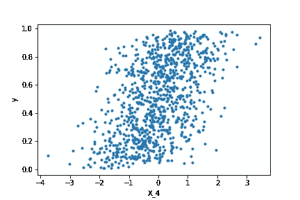
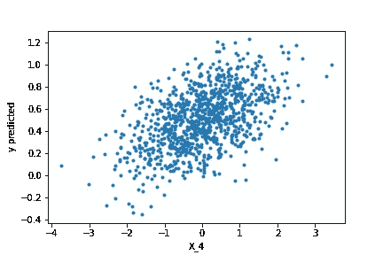
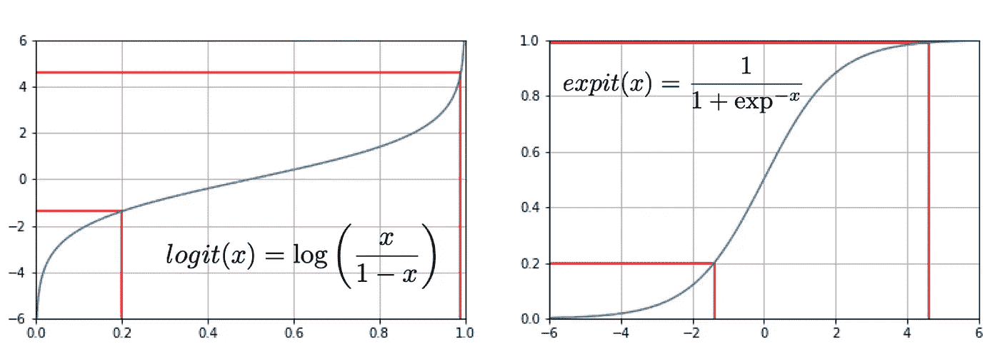
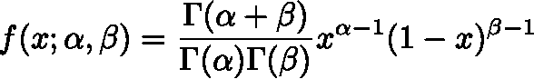
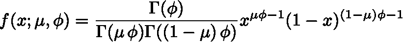
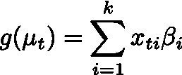
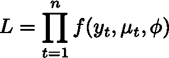
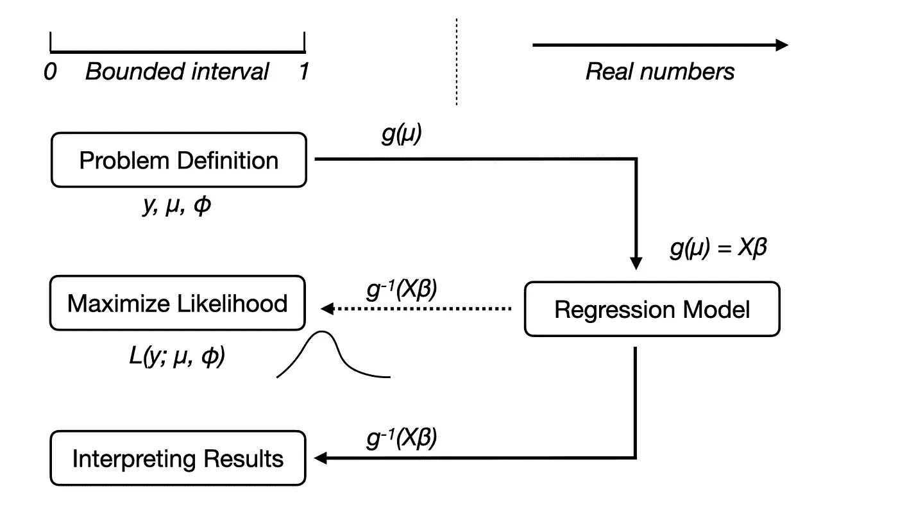
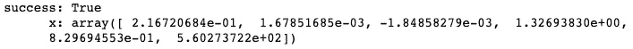
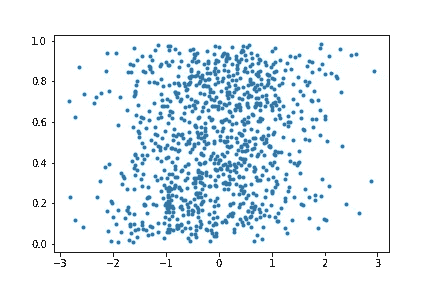

# 比率和比例回归指南

> 原文：<https://towardsdatascience.com/a-guide-to-the-regression-of-rates-and-proportions-bcfe1c35344f?source=collection_archive---------4----------------------->

## 统计数字

## 在 Python 中使用 beta 回归建模概率

托马斯·凯利在 [Unsplash](https://unsplash.com?utm_source=medium&utm_medium=referral) 上的照片

通常在现实世界的回归问题中，目标变量可能是一个概率或一个比例。你可以考虑对你的文章的阅读率、你最喜欢的足球队的胜率或者你的企业的客户流失率进行建模。所有这些问题的共同点是目标变量被限制在 0 和 1 之间。

在这篇文章中，我们将探讨在这种情况下会出现什么样的困难，为什么标准的线性回归可能不适用，以及如何解决这个问题。

# 问题是

让我们考虑一下，你想根据几个变量，比如大小和位置，对你网站上的广告点击率进行建模。这里，我们生成一些模拟数据:

在产生回归问题之后，目标变量 *y* 被 expit 函数转换，使得它位于 0 和 1 之间的区间中(这将在下面解释)。请注意，我们生成的回归数据不在有界区间内，而是基于实数，为了方便起见，存在高斯误差。这不是最佳的，只是为了说明的目的。

这是绘制一个可观测量对 *y.* 的数据

由作者策划。

我们可以看到，所有的*y*-值都在区间[0，1]内，并且与可观测值的一些相关性是可见的。

太好了，让我们使用普通最小二乘法建立一个线性回归模型来模拟数据！

一切看起来都很好。所以我们来看看预测。这里我们绘制了 *X4* 可观察值与预测值 *y* 的对比图:

线性回归模型的预测。数据位于[0，1]区间之外。由作者策划。

如您所见，该模型预测负值以及大于 1 的值。因为我们想把我们的目标变量解释为点击率，这是没有意义的。

此外，代表概率或比率的随机变量通常是贝塔分布的。然而，普通的最小二乘回归假设数据遵循高斯分布。

有没有一种方法可以建立一个回归模型，既能保证预测值位于区间[0，1]内，同时又能说明 beta 分布的数据？确实有。在下文中，我们将研究由**法拉利和克里巴里-内托【1】**描述的贝塔回归模型。

注意，我们将只讨论区间[0，1]上的数据，因为这是最常见的。然而，该模型也适用于任意区间[a，b]上的有界数据。为此，只需转换目标变量 y → (y-a)/(a-b)。

# 先决条件

在我们开始解决问题之前，我们将讨论几个我们需要用到的函数。

在有界数据上执行回归的一个关键角色是所谓的链接函数 *g* ，它从有界区间[0，1]映射到实数:
g: [0，1] → R

完成这项工作的一个突出功能是 **logit 功能**。我们可以使用 logit 的逆函数来做相反的事情，称为 **expit 或 sigmoid 函数**:

这是两个函数的样子:

Logit 和 Expit 函数。红线表示一些示例点。作者的情节。

logit 函数在[0，1]区间的边缘是陡峭的，因此将值从接近 1 映射到大实数(例如，logit(0.99) = 4.60)。然而，对于非常高或非常低的值，expit 函数是平坦的，缓慢地接近 0 和 1(例如，expit(5) = 0.993)。

这两个函数是我们的工具箱，用于从[0，1]区间到实数的映射，以及从实数到区间的映射。

除了 logit 和 expit 函数，我们还将使用 **beta 发行版**。贝塔分布在概率建模中特别有用，因为它在区间[0，1]上工作。贝塔分布采用两个形状参数 *α* 和 *β。*不同的参数看起来会有很大的不同:

由 Pabloparsil —自己的作品，CC BY-SA 4.0，[https://commons.wikimedia.org/w/index.php?curid=89335966](https://commons.wikimedia.org/w/index.php?curid=89335966)

这是贝塔分布的定义:

但是，我们将使用稍有不同的参数化，替换为 *=α/(α+β)* 和 *ϕ=α+β.*在这种情况下可以解释为分布的平均值，而 *ϕ* 可以解释为它的精度。通过这种参数化，贝塔分布看起来如下:

# 贝塔回归

现在我们有了解决问题的必要工具。

贝塔回归的一般思想是，我们使用一个链接函数 *g* (例如，logit)来从我们的有界空间[0，1]映射到实数。在那里，我们将通过最大化相应的可能性来执行回归，假设我们的数据是贝塔分布的。为了解释有界空间[0，1]中的系数，我们需要使用 expit 函数将数据映射回来。因为我们在实数空间中执行回归，并且稍后才映射回我们的有界空间，所以我们可以保证来自我们的模型的任何预测也有界到区间[0，1]。

下面我们将介绍不同的步骤，包括相应的 python 实现。

首先我们建立回归模型。为此，我们假设对于每个数据点，我们的目标变量 *y* (例如，我们广告的点击率)由贝塔分布*T3 的平均值表示。进一步我们假设我们可以将建模为:*

其中 *β* ᵢ是回归参数，指数 *t* 表示我们的数据点。g 是我们的链接函数，如上所述。这意味着我们通过 logit 函数将(描述 *y* 的贝塔分布的均值)从有界区间转换为实数。在这里，我们通过一个标准的线性回归模型对 *g( )* 建模。

但是我们如何获得参数 *β* ᵢ呢？我们在这个模型下最大化我们数据的可能性。可能性定义为:

这意味着对于每个数据点，我们都要乘以给定模型的数据的概率。在这种情况下， *f* 是上面定义的贝塔分布。我们想要找到参数*β*ᵢ*使得可能性最大。通常，在实践中更容易最小化似然性对数的负值(对数似然性)。但这只是技术细节。您可以在[1]中查找对数似然的分析形式。*

我们可以认为我们的分析包含两个不同的世界。我们有一个*概率*界于区间[0，1]和实数界的世界。logit 和 expit 函数是这两个世界之间的联系纽带。这里是一个概览，其中*世界*的不同参数*生活*中。

贝塔回归模型概述。作者图。

我们的问题定义在[0，1]之间的有界区间上。这就是目标变量 *y* 的来源。我们假设 *y* 可以用均值*和精度 *ϕ* 的贝塔分布来建模。此外，我们在实数空间中定义我们的回归模型，因为我们假设 *g( )* 可以由 *Xβ* ᵢ *建模。*然后，我们用平均值和 *ϕ、*找到最佳参数 *β* ᵢ *来最大化数据 y 相对于贝塔分布的可能性。*记住取决于 *β* ᵢ经由
*= g* ⁻ *(Xβ)* 。为了解释我们的模型做出的预测，我们需要用 *g* ⁻ *(Xβ)将它们映射回有界区间[0，1]。**

下面是实现对数似然的 python 代码:

现在，我们可以运行一个优化器来最小化对数可能性。我们希望找到最佳参数 *= g* 、⁻ *(Xβ)* 和*、ϕ* ，使得数据 *y* 相对于我们的模型的可能性最大。请注意， *ϕ* 也是一个回归参数，包含在优化中。这样做是为了找到贝塔分布的最佳拟合形状。

为了约束 *ϕ > 0* ，最小化器的边界是必要的，这很重要，因为没有为 *ϕ < 0 定义贝塔函数。*最小化器的输出表明收敛成功，并返回回归参数*β*ᵢ*t17】以及 *ϕ:**

我们可以检查回归是否可以恢复生成数据时使用的回归参数。为此，我们需要将它们乘以 50，因为我们使用该因子将目标变量映射到[0，1]区间(参见第一段代码)。如果我们这样做，我们得到(括号中的真值):

X0 = 10.8 (10.7)，
X1 = 0.1 (0.0)，
【X2 =-0.1(0.0)，
X3 = 66.3 (66.5)，
X4 = 41.5 (41.2)。

如您所见，我们能够以高精度重现回归参数。

最后，让我们看看我们的模型所做的预测。记住，我们需要使用 expit 函数将数据从实数空间映射回我们的有界区间:

预测数据介于 0 和 1 之间。由作者策划。

我们可以看到，所有的值都在区间[0，1]内，正如它们应该的那样。

# 结论

我们看到，对比率、概率或比例等有界数据进行回归有几个陷阱。首先，回归模型可能会预测不在区间内的值，从而做出不切实际的预测。第二，像比率或概率这样的数据通常不是高斯分布的，这使得普通的最小二乘法不适合。贝塔回归兼顾了这两点。在变换的空间上执行回归模型，然后将结果变换回有界区间。此外，该模型假设数据是贝塔分布的。这篇文章包括在 python 中执行 beta 回归所必需的代码。

如果你想深入概率和贝叶斯分析的世界，看看这篇文章:

 [## 如何成为贝氏

### 频率主义者和贝叶斯统计的根本区别

towardsdatascience.com](/how-to-become-a-bayesian-fcaaf6302d68) 

# 资源

[1]法拉利公司和克里巴里-内托公司(2004 年)。模拟比率和比例的贝塔回归。*应用统计学杂志*， *31* (7)，799–815。