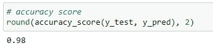
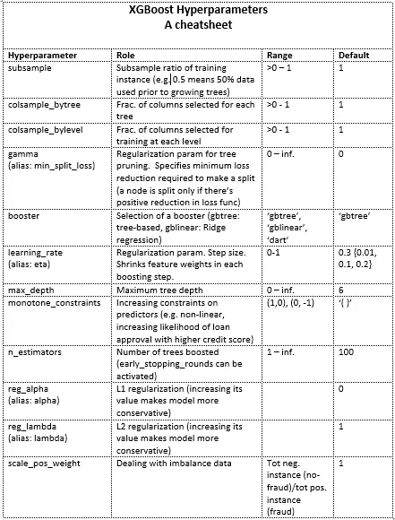

# XGBoost 超参数指南

> 原文：<https://towardsdatascience.com/a-guide-to-xgboost-hyperparameters-87980c7f44a9?source=collection_archive---------6----------------------->


Jeremy Allouche 在 [Unsplash](https://unsplash.com?utm_source=medium&utm_medium=referral) 上拍摄的照片

## 常用超参数清单

如果你问，有哪一种机器学习算法能够在回归和分类中持续提供卓越的性能？

XGBoost 就是了。它可以说是最强大的算法，越来越多地用于所有行业和所有问题领域，从客户分析和销售预测到欺诈检测和信用审批等等。

也是很多机器学习比赛中的获奖算法。事实上，XGBoost 在 Kaggle 平台上的 29 场数据科学竞赛中有 17 场[使用了。](https://dl.acm.org/doi/pdf/10.1145/2939672.2939785)

不仅仅是在商业和比赛中，XGBoost 已经被用于大型强子对撞机([希格斯玻色子机器学习挑战](https://home.cern/news/news/computing/higgs-boson-machine-learning-challenge))等科学实验中。

其性能的关键是其超参数。虽然 XGBoost 非常容易实现，但是困难的部分是调整超参数。在本文中，我将讨论一些关键的超参数，它们的作用以及如何选择它们的值。

但是在我去之前，我们先来谈谈 XGBoost 是如何工作的。

# XGBoost 一览

XGBoost(或 e**X**treme**G**radient**Boost**)不是传统意义上的独立算法。它更像是一个“提升”其他算法性能的开源库。它优化了算法的性能，主要是在梯度推进框架中的决策树，同时通过正则化最小化过拟合/偏差。

XGBoost 的主要[优势是:](https://xgboost.ai/)

**灵活性:**可以执行回归、分类、排名等用户自定义目标的机器学习任务。

可移植性:它可以在 Windows、Linux 和 OS X 以及云平台上运行。

**语言支持:**支持多种语言包括 C++、Python、R、Java、Scala、Julia。

**云系统上的分布式培训:** XGBoost **s** 支持多台机器上的分布式培训，包括 AWS、GCE、Azure 和 Yarn clusters。

XGBoost 的其他重要特性包括:

*   大型数据集的并行处理能力
*   可以处理缺失值
*   允许调整以防止过度拟合
*   具有内置的交叉验证

下面我将首先介绍 XGBoost 的一个简单的 5 步实现，然后我们可以讨论超参数以及如何使用它们来优化性能。

# 履行

## **1)导入库**

对于这个演示，我们不需要太多。从`sklearn`库中，我们可以导入用于分割训练和测试数据以及准确性度量的模块。注意，首先您需要安装(pip install)这个`XGBoost` 库，然后才能导入它。

```
# loading data
from sklearn.datasets import load_iris# to split data into training and testing set
from sklearn.model_selection import train_test_split# XGBoost library
import xgboost as xgb# evaluation metrics
from sklearn.metrics import accuracy_score
```

## **2。导入数据**

我们使用的是 Scikit Learn library 内置的`iris` 数据集，所以不需要做数据预处理。加载数据后，我们只需分别存储输入要素和目标变量。

```
df = load_iris()
X = df.data
y = df.target
```

数据集有 4 个特征(预测值):

```
df.feature_names>> 
['sepal length (cm)',
 'sepal width (cm)',
 'petal length (cm)',
 'petal width (cm)']
```

目标有 3 个类。

```
df.target_names>> array(['setosa', 'versicolor', 'virginica'], dtype='<U10')
```

## **3。准备输入数据**

首先，我们将数据分为训练集(70%)和测试集(30%)。作为一个额外的步骤，我们需要将数据存储到一个兼容的 DMatrix 对象中，以实现 XGBoost 兼容性。

```
X_train, X_test, y_train, y_test = train_test_split(X, y, test_size=0.3, random_state = 1)train = xgb.DMatrix(X_train, label = y_train)
test = xgb.DMatrix(X_test, label = y_test)
```

## **4。超参数**

由于这是一个简单的演示，让我们只选择 3 个超参数。

```
# specify hyperparameters
params = {
    'max_depth': 4,
    'eta': 0.3,
    'num_class': 3
}epochs = 10
```

**5。建模**

现在您已经指定了超参数，绘制模型并进行预测只需要几行代码。

```
# train model
model = xgb.train(params, train, epochs)# prediction
y_pred = model.predict(test)
```



因此，即使使用这个简单的实现，该模型也能够获得 98%的准确性。

# **超参数**

现在让我们进入这篇文章的核心——超参数。

XGBoost 中有许多不同的参数，它们大致分为 [3 种类型](https://xgboost.readthedocs.io/en/latest/parameter.html):

*   一般参数
*   助推器参数
*   任务参数

XGBoost [文档](https://xgboost.readthedocs.io/en/latest/)中列出了大约 35 个不同的超参数。然而，并不是所有的都同样重要，有些比其他的更有影响力。



XGBoost 超参数的部分列表(合成者:作者)

下面是在网格搜索中经常调整的一些参数，以找到最佳平衡。

**频繁调整的超参数**

*   `***n_estimators***` ***:*** 指定要提升的决策树数量。如果 n_estimator = 1，这意味着只生成一棵树，因此没有提升在起作用。默认值是 100，但是您可以使用这个数字来获得最佳性能。
*   `***subsample***` ***:*** 表示训练样本的子样本比率。子样本= 0.5 意味着在生长树之前使用了 50%的训练数据。该值可以是任何分数，但默认值是 1。
*   `***max_depth***`:限制每棵树能长多深。默认值为 6，但是如果模型中存在过度拟合问题，您可以尝试其他值。
*   `***learning_rate***` ***(*** *别名****:***`***eta***`***)***:是一个正则化参数，在每个 boosting 步骤中收缩特征权重。默认值为 0.3，但人们通常使用 0.01、0.1、0.2 等值进行调整。
*   `***gamma***` ***(*** *别名****:***`***min_split_loss***`***)***:是树修剪的另一个正则化参数。它规定了种植一棵树所需的最小损失减少量。默认值设置为 0。
*   `***reg_alpha***` ***(*** *别名****:******)***:它是 L1 正则化参数，增加它的值使模型更加保守。默认值为 0。
*   `r***eg_lambda***` ***(*** *别名****:***`***lambda***`***)***:L2 正则化参数，增加其值也会使模型保守。默认值为 1。

**特殊用途超参数**

上述参数集是“通用”参数，您可以随时调整这些参数以优化模型性能。有一些特殊用途的超参数在特定情况下使用:

`***scale_pos_weight***` **:** 该参数在数据集不平衡的情况下非常有用，尤其是在分类问题中，一个类别的比例只占总观察值的一小部分(例如信用卡欺诈)。默认值为 1，但可以使用以下比率:*总负面实例(如无欺诈)/总正面实例(如欺诈)*。

`***monotone_constraints***`:如果您想要增加对预测因子的约束，例如，一个非线性的、增加的、具有较高信用评分的信用贷款批准的可能性，您可以激活该参数。

`***booster***`:你可以选择使用哪种升压方式。您有三个选项:“dart”、“gbtree”(基于树)和“gblinear”(岭回归)。

`***missing***`:不完全是缺失值处理，而是用来指定在什么情况下算法应该将一个值视为缺失值(例如，客户年龄的负值肯定是不可能的，因此算法将其视为缺失值)。

`***eval_metric***`:指定使用什么损失函数，如回归使用 MAE、MSE、RMSE，分类使用对数损失。

# 摘要

就在 5 年前，还没有多少人知道 XGBoost(它最初于 2014 年发布[，现在它正在彻底改变数据科学和机器学习领域，并应用于各种行业。训练 XGBoost 非常简单，但最难的部分是参数调整。在本文中，我展示了一个简单的演示实现，并讨论了最常用的超参数。](https://en.wikipedia.org/wiki/XGBoost)

感谢阅读。请随意[订阅](https://mab-datasc.medium.com/subscribe)以获得我的媒体文章通知，或者通过 [Twitter、](https://twitter.com/DataEnthus)或 [LinkedIn](https://www.linkedin.com/in/mab-alam/) 与我联系。