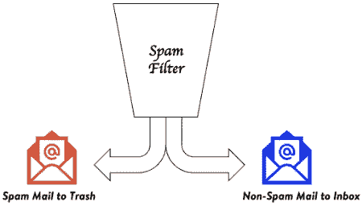
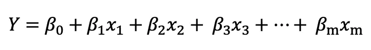
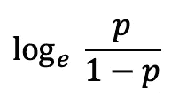
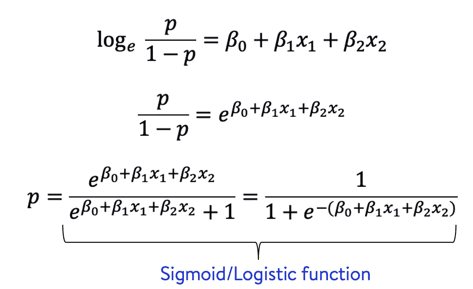
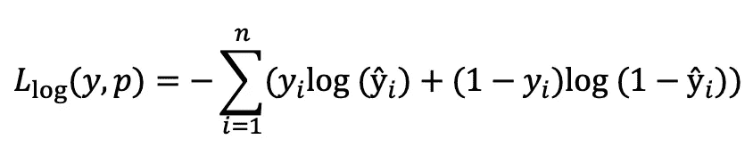
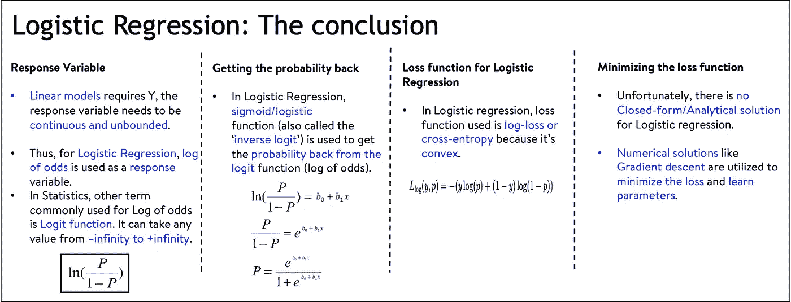
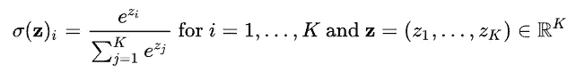

# 逻辑回归手册

> 原文：<https://towardsdatascience.com/a-handbook-for-logistic-regression-bb2d0dc6d8a8?source=collection_archive---------17----------------------->

## 关于逻辑回归的所有细节的备忘单

由[故事](https://www.freepik.com/stories)在 [Freepik](https://www.freepik.com/free-vector/instruction-manual-concept-illustration_10840255.htm) 上的图片

[逻辑回归](https://en.wikipedia.org/wiki/Logistic_regression)是一种线性分类算法。[分类](https://en.wikipedia.org/wiki/Statistical_classification)是一个问题，其中的任务是将一个类别/类分配给一个新的实例，从现有的标记数据(称为训练集)中学习每个类的属性。分类问题的例子可以是将电子邮件分类为垃圾邮件和非垃圾邮件，查看身高、体重和其他属性来将一个人分类为健康或不健康，等等。

使用邮件主题和内容将电子邮件分类为垃圾邮件/非垃圾邮件。图片来源:自创

线性模型只能捕捉形式为 ***Y = mx + b*** 的直线关系，其中 m 是斜率，b 是截距。

逻辑回归方程看起来像…

逻辑回归方程

…其中β是需要学习的系数，x 是特征/解释变量。y 是响应变量，我们将更详细地研究它。

你也可以在 [DataTrek 频道](https://www.youtube.com/channel/UCg0PxC9ThQrbD9nM_FU1vWA)浏览这个话题的视频内容。DataTrek Youtube 频道上的逻辑回归系列的完整播放列表可在[此处](https://www.youtube.com/watch?v=0zlDF9A4UiY&list=PL89V0TQq5GLrK1_bXqci8lkaikCliD4I6)获得。

[DataTrek](https://www.youtube.com/channel/UCg0PxC9ThQrbD9nM_FU1vWA) :逻辑回归简介

# 为什么要学习逻辑回归？

我想到的一个问题是，当强大的非线性算法如[支持向量机](https://en.wikipedia.org/wiki/Support-vector_machine)、[深度学习](https://en.wikipedia.org/wiki/Deep_learning)、[基于树的](https://en.wikipedia.org/wiki/Decision_tree)等可用时，为什么还要学习逻辑回归？这样做的理由如下。

1.  这是数据科学从业者想到的第一个监督学习算法，用于创建一个强大的基线模型来检查提升。
2.  这是一个基本的，强大的，易于实现的算法。这也是一个非常直观和可解释的模型，因为最终输出是描述响应变量和特征之间关系的系数。
3.  更重要的是，它引入了理论概念，如[最大似然估计](https://en.wikipedia.org/wiki/Maximum_likelihood_estimation)、[交叉熵](https://en.wikipedia.org/wiki/Cross_entropy)、使用 [sigmoid](https://en.wikipedia.org/wiki/Sigmoid_function) 和 [softMax 函数](https://en.wikipedia.org/wiki/Softmax_function)，这些都是理解深度学习或其他复杂算法所不可或缺的。

# 逻辑回归的正确响应变量“Y”应该是什么？

线性模型的一个需求就是要有‘Y’，要连续无界的变量。因为，我们正在解决一个分类问题，我们希望为一个实例分配类，这个实例是一个离散值，既不是连续的，也不是无界的，这是一个问题。

备选方案可以是改为预测属于正类的实例的概率‘p’。实例属于负类的概率将自动变为(1-p)。概率是一个连续值，但仍在[0，1]之间有界，因此对无界变量的需求仍未得到满足。

## 营救几率日志

概率被定义为事件发生的概率与事件不发生的概率之比。赔率的对数取赔率的对数，从而得到在-无穷大到+无穷大范围内的连续且无界的值。

比值对数公式

## 找回概率

在分类任务中，最终目标是将类标签分配给实例。我们需要一种方法来从响应变量中获得概率，在逻辑回归的情况下，响应变量是比值对数。我们通过一个 [sigmoid](https://en.wikipedia.org/wiki/Sigmoid_function) /logistic 函数来传递概率对数，从而得到概率。逻辑回归因使用了逻辑/Sigmoid 函数而得名逻辑。

Sigmoid 函数来恢复概率。图像来源:自创

## Sigmoid 是非线性函数，为什么 Logistic 回归还是线性模型？

是的，sigmoid 是一个非线性函数，但逻辑回归仍然是一个线性模型，因为估计概率响应的 logit(比值比对数)是预测值的线性函数。Sigmoid 仅用于取回概率，但实际建模作为线性模型发生，以估计响应变量(概率对数)和特征之间的关系。

# 逻辑回归的损失函数

为了学习逻辑回归模型的最佳参数/系数/β集，我们需要一个可以最小化的损失函数。

## 可以用均方差吗？

损失函数的一个候选可以是预测概率(来自 sigmoid 函数)和实际类别标签(已知为训练集)之间的均方误差(MSE ),但结果表明，逻辑回归的 MSE 是非凸的，因为预测概率来自应用于 logit 的非线性，损失函数结果是非凸的。因为 MSE 是非凸的，并且全局最小值不存在，我们忽略它。

## 对数损失或交叉熵损失进行救援

我们发现，逻辑回归的对数损失或交叉熵损失是一个凸函数，可以用来寻找最佳的参数/系数/β集。

设ŷ为预测概率，y 为真实标签。给定 n 个数据点，对数损失/交叉熵如下所示。

逻辑回归的对数损失或交叉熵损失

最小化逻辑回归的交叉熵损失类似于最大化[对数似然](https://en.wikipedia.org/wiki/Likelihood_function)。

## 最小化损失函数，学习贝塔系数

与线性回归不同，逻辑回归不存在封闭形式/解析解。但是，由于损失函数(对数损失/交叉熵损失)是可微分的，因此可以利用像[梯度下降](https://en.wikipedia.org/wiki/Gradient_descent)这样的数值解来最小化损失并学习正确的参数。

我们所学内容的总结。图片来源:自创

# 逻辑回归在多类分类中的扩展

在多类分类任务中，存在多个类/类别。例如，通过观察萼片长度、萼片宽度、花瓣长度和花瓣宽度来预测花的不同品种。给定一个实例，我们需要将它分配到一个类/类别中。

图片来源:维基百科

## 处理多类分类的逻辑回归调整

*   softMax 函数用于从响应变量 y 中获取概率。给定 *k* 类，类 *i* 的概率如下所示。这就是为什么多类分类的逻辑回归也称为 Softmax 回归，或者也称为多项式逻辑回归。

图片来源:维基百科

*   在多类分类的逻辑回归中，每个类都有自己的超平面、自己的一组参数/系数/β，softmax 充当归一化层。因此，在二元分类中，每个特征学习一个β，而对于多类分类，每个类的每个特征学习一个β。

## 解决多类分类任务的另一种方法

解决多类分类任务的另一种方法是将问题转化为二元分类任务。这是通过两种方式实现的。

1.  一对一分类
2.  一对其余分类。

你可以在这里阅读更多相关信息[。](https://en.wikipedia.org/wiki/Multiclass_classification#Transformation_to_binary)

作为最后一步，为了测试我们对逻辑回归的学习，我们可以从执行探索性数据分析、拟合模型和分析学习到的系数开始，解决一个多类分类问题。在[这本笔记本中，](https://www.kaggle.com/abhishekmungoli/logistic-regression-iris-dataset/notebook)我总结了[鸢尾花数据集](https://en.wikipedia.org/wiki/Iris_flower_data_set)上逻辑回归的所有重要方面，以及额外的 EDA 和可解释的 AI 部分。请随意叉笔记本，延伸分析&学习。

 [## 逻辑回归 Iris 数据集

### 使用 Kaggle 笔记本探索和运行机器学习代码|使用来自[私有数据源]的数据

www.kaggle.com](https://www.kaggle.com/abhishekmungoli/logistic-regression-iris-dataset/notebook) 

# 结论

通过这篇博文，我们观察了逻辑回归的不同方面，如响应变量、恢复概率、损失函数以及求解。希望你喜欢它，如果你有进一步的疑问，请随时联系我们。

如果你有任何疑问，请联系我。我将有兴趣知道你是否有一些有趣的问题要解决，需要一些指导。

***我的 Youtube 频道获取更多内容:***

[DataTrek Youtube 频道](https://www.youtube.com/channel/UCg0PxC9ThQrbD9nM_FU1vWA)

> ***关于作者-:***
> 
> Abhishek Mungoli 是一位经验丰富的数据科学家，拥有 ML 领域的经验和计算机科学背景，跨越多个领域并具有解决问题的思维方式。擅长各种机器学习和零售业特有的优化问题。热衷于大规模实现机器学习模型，并通过博客、讲座、聚会和论文等方式分享知识。
> 
> 我的动机总是把最困难的事情简化成最简单的版本。我喜欢解决问题、数据科学、产品开发和扩展解决方案。我喜欢在闲暇时间探索新的地方和健身。关注我的 [**中**](https://medium.com/@mungoliabhishek81) 、**[**Linkedin**](https://www.linkedin.com/in/abhishek-mungoli-39048355/)**或**[**insta gram**](https://www.instagram.com/simplyspartanx/)**并查看我的[往期帖子](https://medium.com/@mungoliabhishek81)。我欢迎反馈和建设性的批评。我的一些博客-********

******另外，查看我关于线性回归的博文[或视频版本](https://medium.com/geekculture/a-complete-guide-to-linear-regression-cfa984055671)[这里](https://www.youtube.com/watch?v=-OVHiTZofN0&list=PL89V0TQq5GLpnZlZMeUa8EAmM-v9QqXqQ)。******

****** [## 线性回归完全指南

### 涵盖线性回归的所有基础知识

medium.com](https://medium.com/geekculture/a-complete-guide-to-linear-regression-cfa984055671) 

[DataTrek](https://www.youtube.com/channel/UCg0PxC9ThQrbD9nM_FU1vWA) :线性回归系列

*   [确定您的数据分布](/identify-your-datas-distribution-d76062fc0802)
*   [降维:PCA 与自动编码器](/dimensionality-reduction-pca-versus-autoencoders-338fcaf3297d)
*   [体验遗传算法的威力](/experience-the-power-of-the-genetic-algorithm-4030adf0383f)
*   [每个数据科学家都应该避免的 5 个错误](/5-mistakes-every-data-scientist-should-avoid-bcc8142d7693)
*   [以简单&直观的方式分解时间序列](/decomposing-a-time-series-in-a-simple-and-intuitive-way-19d3213c420b?source=---------7------------------)
*   [GPU 计算如何在工作中拯救了我？](https://medium.com/walmartlabs/how-gpu-computing-literally-saved-me-at-work-fc1dc70f48b6)
*   信息论& KL 分歧[第一部分](/part-i-a-new-tool-to-your-toolkit-kl-divergence-5b887b5b420e)和[第二部分](/part-2-a-new-tool-to-your-toolkit-kl-divergence-736c134baa3d)
*   [使用 Apache Spark 处理维基百科，创建热点数据集](/process-wikipedia-using-apache-spark-to-create-spicy-hot-datasets-1a59720e6e25)
*   [一种基于半监督嵌入的模糊聚类](/a-semi-supervised-embedding-based-fuzzy-clustering-b2023c0fde7c)
*   [比较哪个机器学习模型表现更好](/compare-which-machine-learning-model-performs-better-4912b2ed597d)
*   [分析 Fitbit 数据，揭开疫情封锁期间身体模式变化的神秘面纱](/analyzing-fitbit-data-to-demystify-bodily-pattern-changes-amid-pandemic-lockdown-5b0188fec0f0)
*   [神话与现实围绕关联](/myths-and-reality-around-correlation-9b359456d8e1)
*   [成为面向业务的数据科学家指南](/a-guide-to-becoming-business-oriented-data-scientist-51da5c829ffa)******