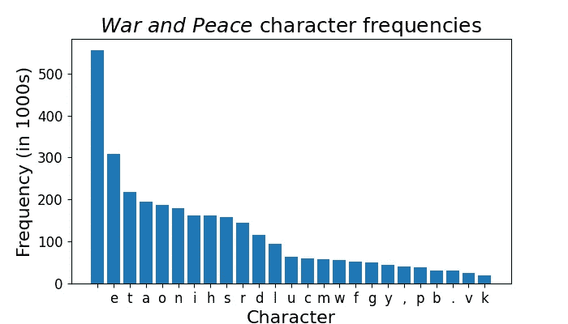
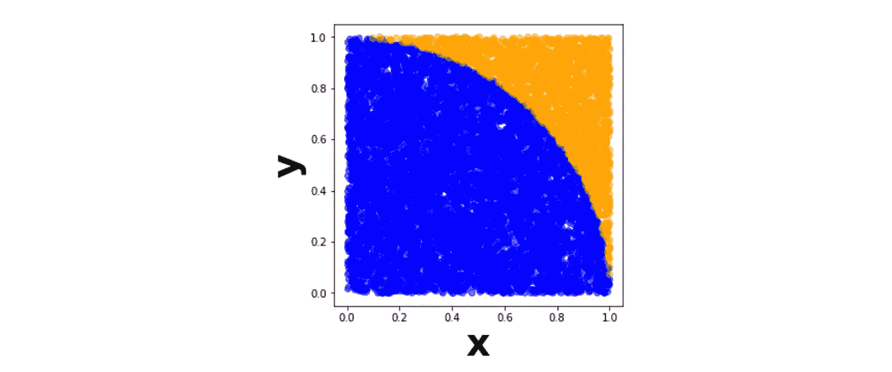

# 使用 Spark 分析大数据的实践演示

> 原文：<https://towardsdatascience.com/a-hands-on-demo-of-analyzing-big-data-with-spark-68cb6600a295?source=collection_archive---------6----------------------->

## [理解大数据](https://towardsdatascience.com/tagged/making-sense-of-big-data)

## 扫描一部小说，计算圆周率，对五千万行进行回归

由[伯特·布瑞尔](https://unsplash.com/@bertsz?utm_source=medium&utm_medium=referral)在 [Unsplash](https://unsplash.com?utm_source=medium&utm_medium=referral) 拍摄的照片

云服务公司 Domo 估计，2020 年，WhatsApp 用户每分钟发送 4170 万条信息，网飞播放 40.4 万小时的视频，24 万美元在 Venmo 上易手，6.9 万人在 LinkedIn 上申请工作。在这些数据中，是那些公司用来理解现在、预测未来，并最终在高度竞争的市场中生存下来的模式。

但是，如何从如此庞大的数据集中提取洞察力，以至于当你试图将它们加载到`pandas`时，你的笔记本电脑会死机？当一个数据集的行数超过美国家庭在 50 年内的收入中值[1]美元时，我们*可以*前往 BestBuy.com，将他们的电脑按“最贵”排序，并支付一些现金购买一台昂贵的机器。

**或者我们可以试试** [**阿帕奇 Spark**](https://spark.apache.org/) **。**

在这篇文章结束时，你会明白为什么你不需要昂贵的硬件来分析大规模数据集——因为你已经做到了。在统计一部小说中每个字母的出现频率、手工计算 *π* 以及处理一个有 5000 万行的数据帧之前，我们会先讲一下什么是 Spark。

# 目录

1.  大数据的分析框架
2.  统计小说中的字母频率
3.  计算 *π*
4.  火花数据帧和机器学习

照片由[法比奥](https://unsplash.com/@fabioha?utm_source=medium&utm_medium=referral)在 [Unsplash](https://unsplash.com?utm_source=medium&utm_medium=referral) 上拍摄

# 大数据的分析框架

**Spark 是一个处理海量数据的框架。**它的工作方式是 ***将你的数据*** 划分成子集， ***将子集*** 分发到工作节点(无论它们是笔记本电脑上的[逻辑 CPU 核心](https://unix.stackexchange.com/questions/88283/so-what-are-logical-cpu-cores-as-opposed-to-physical-cpu-cores)还是集群中的整个机器)，然后 ***协调*** 工作节点来分析数据。本质上，Spark 是一种“分而治之”的策略。

一个简单的类比有助于形象化这种方法的价值。假设我们想统计图书馆的藏书数量。“昂贵的计算机”方法将是教一些人尽可能快地数书，训练他们多年来在冲刺时准确计数。虽然看起来很有趣，但这种方法并没有多大用处——即使是奥林匹克短跑运动员也只能跑这么快，如果你的点书员受伤或决定转行，你就没那么幸运了！

与此同时，Spark 方法是随机找 100 个人，给每个人分配图书馆的一个区域，让他们清点所在区域的书籍，然后把他们的答案加在一起。这种方法更具可扩展性，容错性更强，成本更低……而且看起来可能还很有趣。

Spark 的主要数据类型是 [**弹性分布式数据集(RDD)**](https://sparkbyexamples.com/spark-rdd-tutorial/) 。RDD 是分布在许多地方的数据的抽象，就像实体“沃尔玛”是世界上数百万人的抽象一样。使用 rdd 感觉就像在内存中操作一个简单的数组，即使底层数据可能分布在多台机器上。

## 入门指南

Spark 主要是用 Scala 编写的，但是也可以在 Java、Python、R 和 SQL 中使用。我们将使用 [PySpark](https://spark.apache.org/docs/latest/api/python/) ，Spark 的 Python 接口。要安装 PySpark，请在终端中键入`pip install pyspark`。你可能还需要安装或更新 Java。当您可以在终端中键入`pyspark`并看到类似这样的内容时，您就知道一切都已经设置好了。

本文中的其余代码可以在 Spark 终端中运行，或者在单独的 Python 或 Jupyter 实例中运行。我将在 Jupyter 中运行剩余的代码，这样我们就可以使用非常方便的`%%timeit` [IPython 神奇命令](https://ipython.readthedocs.io/en/stable/interactive/magics.html)来测量代码块的速度。

下面是一个小小的 PySpark 演示。我们首先手动定义`SparkSession`来启动到 Spark 的连接。(如果您在 PySpark 终端中，这已经为您完成了。)然后我们创建一个数组的 RDD，可视化前两个数字，并打印出最大值。通过`.getNumPartitions`，我们看到 Spark 将我们的数组分配给了我机器上的八个逻辑核心。

有了这些基础知识，我们就可以开始利用 Spark 处理大型数据集了。由于您可能没有任何 TB 或 Pb 大小的数据集可供分析，因此我们需要有点创造性。先说一本小说。

Arif Riyanto 在 [Unsplash](https://unsplash.com?utm_source=medium&utm_medium=referral) 上拍摄的照片

# 统计小说中的字母频率

[古腾堡计划](https://www.gutenberg.org/)是一个公共领域[书籍的在线知识库](https://fairuse.stanford.edu/overview/public-domain/welcome/)，所以我们可以从那里提取一本书进行分析。让我们读一读列夫·托尔斯泰的《战争与和平》——我一直想读一读，或者至少知道字母表中每个字母出现的频率！[3]

下面我们用[美汤](https://www.crummy.com/software/BeautifulSoup/bs4/doc/) Python 库从小说的网页中获取 HTML，整理段落，然后追加到一个列表中。然后我们删除第一个 *383* 段落，它们只是目录！我们剩下 11，186 个段落，从 4 个字符到 4381 个字符不等。(那串一类的人物，不过用*战争与和平*，也许小说人物也是如此。)

尽管*战争与和平*是一部大型小说，但我们看到`pandas`仍然可以毫无问题地处理高级指标——line 38 在我的笔记本电脑上几乎可以立即运行。

但是当我们开始问更难的问题时，比如整本书中每个字母的出现频率，我们会开始注意到 Spark 的性能有了实质性的提高。这是因为**这些段落可以彼此独立地处理**；Spark 会一次处理几个段落，而 Python 和`pandas`会逐个处理。

像以前一样，我们开始我们的 Spark 会话，并为我们的段落创建一个 RDD。我们还加载了`Counter`，一个为计数而优化的内置 Python 类，以及`reduce`，稍后我们将使用它来演示基本的 Python 方法。

然后[用`rdd.map(Counter)`把`Counter`命令](https://en.wikipedia.org/wiki/Map_(higher-order_function))映射到每一段。请注意，除非我们添加`.take(2)`来输出前两个结果，否则什么都不会发生——Spark 执行[惰性评估](https://en.wikipedia.org/wiki/Lazy_evaluation)，这是一种优化查询链的方法，直到实际需要返回一个结果。

`rdd.map(Counter)`为我们提供了一个新的 RDD，其中包含每一段的字母频率，但我们实际上想要整本书的字母频率。幸运的是，我们可以通过简单地将`Counter`对象加在一起来做到这一点。

我们使用`.reduce`方法执行从多元素 RDD 到单个输出的[缩减](https://en.wikipedia.org/wiki/Fold_(higher-order_function))，传递一个匿名加法函数来指定如何折叠 RDD。[4]结果是一个`Counter`对象。然后，我们通过使用它的`.most_common`方法打印出十个最常见的字符来完成我们的分析。

获胜者是…太空！这是相同的频率，但在一个很好的柱状图中。

作者图片

使用 Spark 值得吗？让我们通过计时我们的任务在 Spark 和基本 Python 中运行的时间来结束这一部分。我们可以使用`%%timeit` [IPython magic 命令](https://ipython.readthedocs.io/en/stable/interactive/magics.html)在*分离* Jupyter 笔记本单元格，看看我们的方法如何比较。

在 Spark 中:

在基本 Python 中:

使用 Spark，我们比使用基本 Python 快 67.7%。太棒了。现在我需要决定如何利用这多出来的半秒钟空闲时间。

照片由[普里西拉·杜·普里兹](https://unsplash.com/@priscilladupreez?utm_source=medium&utm_medium=referral)在 [Unsplash](https://unsplash.com?utm_source=medium&utm_medium=referral) 拍摄

# 计算 pi

关于如何使用随机数计算圆周率，有很多很棒的教程。简单的总结就是我们在(0，0)和(1，1)之间生成随机的 x-y 坐标，然后计算那些落在半径为 1 的圆内的点的比例。然后，我们可以通过将这个比例乘以 4 来求解 *π* 。在下面 10，000 个点的可视化中，我们将蓝色点的数量除以总点数，得到 *π* /4。

作者图片

我们生成的点越多，我们对 *π* 的估计就越准确。这是 Spark 的理想用例，因为生成的点都是独立的。与其分析预先存在的数据，不如使用我们的 worker 节点*分别生成数千个点*和*来计算落在圆内的那些点的比例。*然后我们可以取我们的比例的平均值，作为我们对 *π* 的最终估计。

这是我们让每个工人运行的函数。我试图在 1)每次生成一个点(内存低，但速度慢)和 2)一次生成所有样本，然后计算比例(有效，但可能达到内存限制)之间取得平衡。我发现的一个体面的解决方案是将`n_points`分成几个*块*，计算每个块在圆内的点数比例，然后在最后得到比例的平均值。

现在让我们创建一个 RDD 并将`calculate_pi`映射到每个元素，然后取每个元素的估计值 *π* 的平均值。

我们对圆周率的估计还不算太差！再次使用`%%timeit`,我们看到在我的机器上，基本 Python 需要大约 3.67 秒，而 Spark 需要 0.95 秒，提高了 74%。不错！

维克多·加西亚在 [Unsplash](https://unsplash.com?utm_source=medium&utm_medium=referral) 上拍摄的照片

# 火花数据帧和机器学习

让我们再做一个例子，这次使用 Spark 在 rdd 之上提供的一个很好的抽象。在类似于`pandas`的语法中，我们可以使用 [Spark 数据帧](https://spark.apache.org/docs/latest/sql-programming-guide.html)对太大而不适合`pandas` df 的数据执行操作。然后我们可以用我们的数据框架训练机器学习模型。

## 火花数据帧

您可能没有一个有几百万行的数据帧，所以我们需要生成一个。因为根据定义，我们试图创建一个太大而不适合`pandas`的数据集，所以我们需要分段生成数据帧，反复保存 CSV 以便稍后用 PySpark 接收。

我们做 5000 万行吧，只是为了好玩。我们将生成 50 个 CSV，每个 CSV 有 1，000，000 行。我们的数据将包括四名学生的考试成绩，以及他们前一天花在学习和跳舞上的时间。这些是致力于大数据的学生，他们每人将参加大约 1250 万次考试！

我们现在将从 CSV 创建一个 Spark 数据帧，可视化模式，并打印出行数。但是在定义 Spark 会话时，我们首先需要添加一个配置选项——为了运行下面的代码块，我需要将[驱动程序内存](https://researchcomputing.princeton.edu/computational-hardware/hadoop/spark-memory)加倍，以避免 Spark 崩溃！我们将使用`.config('spark.driver.memory', '2g')`线路来实现这一点。

现在让我们分析我们的数据。我们将从计算每个人的行数开始。

各 1250 万次考试……不可思议。现在让我们找出每个人学习时间、跳舞时间和考试成绩的平均值。

不出所料，人与人之间没有差异，因为我们在生成数据时没有指定任何差异。平均值也正好在数据指定范围的中间:0-8 代表小时，0-100 代表分数。

为了使这些值更好更全面，我们实际上需要创建一个[用户定义函数(UDF)](https://docs.databricks.com/spark/latest/spark-sql/udf-python.html) 。对于我们可以应用于 groupby 操作的函数，我们将加载`pandas_udf`和`PandasUDFType`。我们还导入了`DoubleType`，它引用了函数返回值的数据类型。在定义了我们的函数之后，我们使用`spark.udf.register`使它对我们的 Spark 环境可用。

现在我们可以将它应用到我们的数据框架中。注意，由于我们使用了`.agg`，我们需要传入一个字典，其中包含我们想要应用 UDF 的列。我没有打出`{'study': 'round_mean', 'dance': 'round_mean', 'score': 'round_mean'}`，而是用了字典理解来装腔作势。虽然这可能是相同的击键次数…

干净多了！UDF 是一个强大的工具，可以对 PySpark 中没有的数据进行计算。

## 机器学习

最后，让我们对数据进行线性回归。在训练模型时，您可能习惯于将特征向量分布在数据帧的各个列中，每个特征一个。例如，在`sklearn`，我们可以直接在`score`列和`['study', 'dance']`列上安装模型。

**然而，Spark 期望一行的整个特征向量驻留在一列中。**因此，我们将使用`VectorAssembler`将我们的`study`和`dance`值转换成一个新的 2 元素向量的`features`列。

现在我们实际上符合我们的模型。我们将数据分成训练集和测试集，然后使用`LinearRegression`类找到`features`和`score`之间的关系。最后，在计算测试集上的 [RMSE](https://en.wikipedia.org/wiki/Root-mean-square_deviation) 之前，我们可视化我们的系数及其 p 值。

在我们完全伪造的数据中，看起来学习对考试成绩有相当大的影响，而舞蹈……没有那么大。有了这么多数据，我们的 p 值都是“零”也就不足为奇了——有了 5000 万行，所有这一切表明系数并不完全为零。看看 RMSE:我们模型的预测平均比实际分数低 6.12 分！自动生成的数据总是那么干净漂亮。

照片由 [Ameen Fahmy](https://unsplash.com/@ameenfahmy_?utm_source=medium&utm_medium=referral) 在 [Unsplash](https://unsplash.com?utm_source=medium&utm_medium=referral) 上拍摄

# 结论

这篇文章深入探讨了如何使用 Spark 处理大数据。我们从分布式计算的概述开始，然后计算托尔斯泰的*战争与和平*中每个字母的频率，用随机生成的数字估计 *π* ，最后分析一个 5000 万行的 Spark 数据帧。这篇文章有望为你成为谷歌下一个炙手可热的数据工程师打下基础。

如果你有兴趣了解更多，兔子洞会更深！在分析方面，有针对网络应用的[图形处理](https://www.knowledgehut.com/tutorials/apache-spark-tutorial/graph-processing-with-graphframes)和针对连续数据流的[结构化流](https://www.knowledgehut.com/tutorials/apache-spark-tutorial/continous-apps-structured-streaming)。在工程方面，通过更好地[配置驱动程序和工人的数量和大小](https://stackoverflow.com/questions/24622108/apache-spark-the-number-of-cores-vs-the-number-of-executors)，有大量的优化可以挤出来——我们只是在一台机器上使用默认数量的工人节点，但是当[在多台机器上运行 Spark](https://spark.apache.org/docs/latest/cluster-overview.html)时，情况会变得复杂得多。类似地，分配合适的内存量对于避免 Spark 崩溃或[让其他应用程序挨饿](http://site.clairvoyantsoft.com/understanding-resource-allocation-configurations-spark-application/)至关重要。

但是，一旦你掌握了 Spark 的细微差别，建立模型来发现 Venmo 上的欺诈行为，或者为网飞用户确定完美的下一场演出，或者帮助 LinkedIn 上的人找到下一份工作，都将是一小步。当你有工具去理解永无止境的数据时，这个世界就是你的了。

最好，
马特

# 脚注

## 1.介绍

根据[Census.gov](https://www.census.gov/library/publications/2020/demo/p60-270.html)的数据，2019 年的家庭收入中值为 68703 美元。将这个乘以 50 得到 343 万，比我们在这篇文章中分析的一些数据要小。

## 2.大数据的分析框架

我不得不深入兔子洞去了解 Spark 具体将任务分配给什么硬件。您的计算机有几个具有独立处理能力的物理 [CPU 内核](https://www.computerhope.com/jargon/c/core.htm)。举例来说，这就是你如何在 YouTube 播放时输入 Word doc 并翻阅照片。

我们可以更进一步，尽管一个物理 CPU 内核可以通过两个或更多个[“逻辑”内核](https://unix.stackexchange.com/questions/88283/so-what-are-logical-cpu-cores-as-opposed-to-physical-cpu-cores)之间的[超线程](https://en.wikipedia.org/wiki/Hyper-threading)同时处理多个任务。逻辑内核充当独立的内核，每个内核处理自己的任务，但它们实际上只是同一个物理内核。诀窍在于，物理内核可以以令人难以置信的速度在逻辑内核之间切换，利用任务停机时间(例如，在你输入搜索词后等待 YouTube 发回数据)来挤进更多计算。

当在本地机器上运行时，Spark 将任务分配给计算机上的所有逻辑核心，除非您另外指定。默认情况下，Spark 为每个内核留出 [512 MB，并将数据平均分配给每个内核。可以用`sc.defaultParallelism`查看逻辑核的数量。](https://stackoverflow.com/questions/26562033/how-to-set-apache-spark-executor-memory)

## 3.统计小说中的字母频率

在这篇文章的早期草稿中，我自己动手为一部“小说”生成了文本。我看了一些[*lorem ipsum*](https://loremipsum.io/)Python 包，但是有点不一致；我发现了非常有趣的 [Bacon Ipsum API](https://baconipsum.com/json-api/) 但是不想用几千段的请求淹没它。下面的代码使用随机字符串生成一部 10 万段的“小说”，或者说 8.9 倍的《战争与和平》只有区区 11186 段。原来写小说比我想象的要容易得多！

## 4.统计小说中的字母频率

您可以很容易地用更复杂的函数或者您已经提前定义的函数来减少 rdd。但是对于很多大数据处理来说，操作通常非常简单——将元素加在一起，通过某个阈值进行过滤——所以在使用这些函数的一两次之外显式定义这些函数有点大材小用。